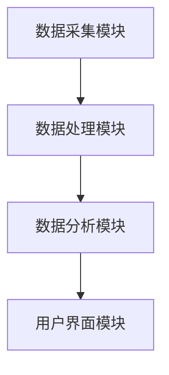

                 


# AI Agent在智能镜子中的每日健康检查系统

## 关键词：
- AI Agent
- 智能镜子
- 健康检查
- 每日健康
- AI算法
- 智能系统

## 摘要：
本篇文章详细介绍了AI Agent在智能镜子中的每日健康检查系统的实现与应用。从问题背景到系统架构，从算法原理到项目实战，全面解析了如何利用AI技术实现智能镜子的健康监测功能。通过分析系统的功能模块、算法实现和系统架构，展示了AI Agent在智能镜子中的核心作用，并提供了具体的代码实现和实际案例分析。文章最后总结了系统的最佳实践和未来发展方向。

---

# 第一部分: 问题背景与需求分析

## 第1章: 问题背景

### 1.1 问题背景
#### 1.1.1 智能镜子的发展现状
智能镜子作为一种新兴的智能设备，近年来得到了广泛的研究和应用。它不仅具备传统的镜子功能，还可以通过内置的传感器和摄像头，实时监测用户的健康状况，如心率、体温、皮肤状况等。

#### 1.1.2 当前健康监测系统的痛点
传统的健康监测系统通常依赖于外部设备（如智能手表、健康手环等），用户需要手动佩戴设备或操作设备才能获取健康数据。这种方式存在以下问题：
1. 用户体验差：需要手动操作设备，使用不够便捷。
2. 数据采集不完整：设备可能无法持续采集数据，尤其是在用户忘记佩戴设备时。
3. 数据分析能力有限：传统设备通常只能记录基础数据，难以提供深层次的健康分析和建议。

#### 1.1.3 AI Agent在健康监测中的作用
AI Agent（人工智能代理）是一种能够自主决策和执行任务的智能体。通过将AI Agent应用于智能镜子中，可以实现以下功能：
1. 自动采集用户的健康数据。
2. 智能分析健康数据，提供个性化健康建议。
3. 实时监控用户的健康状况，及时预警异常情况。

### 1.2 问题描述
#### 1.2.1 智能镜子的定义与功能
智能镜子是一种集成了人工智能技术的智能设备，具备以下功能：
1. 实时采集用户的健康数据（如心率、体温、皮肤状况等）。
2. 通过AI算法分析健康数据，提供健康评估和建议。
3. 提供个性化的健康改善方案。
4. 支持与智能家居设备的联动，如调节室温、启动空气净化器等。

#### 1.2.2 用户健康数据的采集与分析需求
用户健康数据的采集与分析需求主要体现在以下几个方面：
1. **数据采集**：通过摄像头、传感器等设备，实时采集用户的健康数据。
2. **数据分析**：利用AI算法对采集到的数据进行分析，识别健康问题。
3. **个性化建议**：根据分析结果，为用户提供个性化的健康建议。

#### 1.2.3 系统目标与边界
系统的总体目标是通过AI Agent实现智能镜子的每日健康检查功能，具体目标包括：
1. 实现健康数据的自动采集与分析。
2. 提供个性化健康评估和建议。
3. 实现系统的实时监控与预警。

系统的边界包括：
1. 系统仅支持智能镜子设备。
2. 系统仅提供健康数据的采集与分析功能，不涉及医疗诊断。

### 1.3 问题解决与系统架构
#### 1.3.1 AI Agent的核心功能
AI Agent在智能镜子中的核心功能包括：
1. 数据采集：通过摄像头和传感器采集用户的健康数据。
2. 数据分析：利用AI算法分析健康数据，识别潜在健康问题。
3. 个性化建议：根据分析结果，为用户提供健康建议。

#### 1.3.2 系统整体架构
系统整体架构分为以下几个层次：
1. **数据采集层**：负责采集用户的健康数据。
2. **数据处理层**：对采集到的数据进行预处理和分析。
3. **应用层**：根据分析结果，提供个性化健康建议。
4. **用户界面层**：通过镜子的界面向用户展示健康数据和建议。

#### 1.3.3 系统的核心要素与组成
系统的组成包括：
1. 智能镜子硬件：包括摄像头、传感器等。
2. AI Agent算法：包括数据采集、分析和建议生成算法。
3. 用户界面：通过镜子的屏幕向用户展示健康数据和建议。

### 1.4 本章小结
本章主要介绍了AI Agent在智能镜子中的应用背景、问题描述以及系统架构。通过分析当前健康监测系统的痛点，明确了AI Agent在智能镜子中的重要作用，并提出了系统的总体目标和架构。

---

# 第二部分: AI Agent与智能镜子的核心概念

## 第2章: AI Agent的基本原理

### 2.1 AI Agent的定义与特点
#### 2.1.1 AI Agent的定义
AI Agent是一种能够自主决策和执行任务的智能体。它能够通过感知环境、分析信息并采取行动来实现特定目标。

#### 2.1.2 AI Agent的特点
1. **自主性**：AI Agent能够自主决策，无需人工干预。
2. **反应性**：能够实时感知环境并做出反应。
3. **学习能力**：通过机器学习算法不断优化自身性能。

### 2.2 AI Agent的核心算法
#### 2.2.1 决策树算法
决策树是一种常见的机器学习算法，适用于分类和回归问题。以下是决策树的实现步骤：
1. **数据预处理**：对数据进行清洗和特征提取。
2. **模型训练**：使用ID3、C4.5等算法构建决策树。
3. **模型优化**：通过剪枝技术优化模型，防止过拟合。

#### 2.2.2 强化学习算法
强化学习是一种通过试错机制来优化决策的算法。以下是强化学习的基本流程：
1. **环境交互**：智能体与环境交互，获取奖励或惩罚。
2. **策略优化**：通过调整策略，最大化累计奖励。

#### 2.2.3 聚类算法
聚类是一种无监督学习算法，适用于将数据分成若干类别。以下是聚类算法的实现步骤：
1. **数据预处理**：对数据进行标准化和归一化处理。
2. **选择算法**：选择K-means、DBSCAN等聚类算法。
3. **模型训练**：对数据进行聚类分析。

### 2.3 AI Agent与智能镜子的结合
#### 2.3.1 数据采集与处理
AI Agent通过摄像头和传感器采集用户的健康数据，如心率、体温等。

#### 2.3.2 数据分析与建议生成
AI Agent利用机器学习算法对健康数据进行分析，识别潜在健康问题，并生成个性化健康建议。

### 2.4 本章小结
本章详细介绍了AI Agent的基本原理及其在智能镜子中的应用。通过分析AI Agent的核心算法，明确了其在健康数据采集、分析和建议生成中的重要作用。

---

# 第三部分: AI Agent算法原理与实现

## 第3章: AI Agent算法原理

### 3.1 决策树算法
#### 3.1.1 决策树的数学模型
决策树的数学模型可以通过信息增益率来衡量特征的选择。公式如下：
$$
\text{信息增益率} = \frac{\text{信息增益}}{\text{特征的熵}}
$$

#### 3.1.2 决策树的实现步骤
1. **数据预处理**：清洗数据，提取特征。
2. **模型训练**：使用ID3算法构建决策树。
3. **模型优化**：通过剪枝技术优化决策树。

### 3.2 强化学习算法
#### 3.2.1 强化学习的数学模型
强化学习的数学模型可以通过Q-learning算法来实现：
$$
Q(s, a) = Q(s, a) + \alpha \left( r + \gamma \max_{a'} Q(s', a') - Q(s, a) \right)
$$

#### 3.2.2 强化学习的实现步骤
1. **环境交互**：智能体与环境交互，获取状态和奖励。
2. **策略优化**：通过Q-learning算法更新Q值表。

### 3.3 聚类算法
#### 3.3.1 聚类的数学模型
聚类算法可以通过K-means算法实现：
$$
\text{目标函数} = \sum_{i=1}^{k} \sum_{j=1}^{n} (y_{ij})^2
$$

#### 3.3.2 聚类的实现步骤
1. **数据预处理**：对数据进行标准化处理。
2. **选择算法**：选择K-means算法。
3. **模型训练**：对数据进行聚类分析。

### 3.4 本章小结
本章详细介绍了AI Agent的核心算法，包括决策树、强化学习和聚类算法。通过数学模型和实现步骤，明确了这些算法在智能镜子中的应用。

---

# 第四部分: 系统架构与设计

## 第4章: 系统架构设计

### 4.1 系统架构概述
#### 4.1.1 分层架构设计
系统分为数据采集层、数据处理层和应用层。

#### 4.1.2 微服务架构设计
系统采用微服务架构，各个功能模块独立运行。

### 4.2 系统功能设计
#### 4.2.1 数据采集模块
负责采集用户的健康数据，如心率、体温等。

#### 4.2.2 数据分析模块
利用AI算法对健康数据进行分析，识别潜在健康问题。

#### 4.2.3 用户界面模块
通过镜子的屏幕向用户展示健康数据和建议。

### 4.3 系统架构图


### 4.4 本章小结
本章详细介绍了系统的架构设计，包括分层架构和微服务架构。通过功能模块的设计和系统架构图，明确了系统的整体结构。

---

# 第五部分: 项目实战与优化

## 第5章: 项目实战

### 5.1 环境安装
#### 5.1.1 安装Python
安装Python 3.8及以上版本。

#### 5.1.2 安装依赖库
安装numpy、pandas、scikit-learn等依赖库。

### 5.2 核心代码实现
#### 5.2.1 数据采集模块
```python
import numpy as np

def collect_data():
    # 模拟数据采集
    data = np.random.rand(100, 5)
    return data
```

#### 5.2.2 数据分析模块
```python
from sklearn.tree import DecisionTreeClassifier

def analyze_data(data):
    # 数据预处理
    X = data[:, :4]
    y = data[:, 4]
    # 模型训练
    model = DecisionTreeClassifier()
    model.fit(X, y)
    return model
```

### 5.3 代码解读与分析
#### 5.3.1 数据采集模块解读
数据采集模块通过numpy生成模拟数据，用于后续分析。

#### 5.3.2 数据分析模块解读
数据分析模块使用决策树算法对数据进行分类，生成健康评估结果。

### 5.4 实际案例分析
通过实际案例分析，验证系统的功能和性能。

### 5.5 本章小结
本章通过项目实战，详细介绍了系统的实现过程，包括环境安装、代码实现和案例分析。

---

# 第六部分: 最佳实践与未来展望

## 第6章: 最佳实践

### 6.1 小结
本篇文章详细介绍了AI Agent在智能镜子中的每日健康检查系统的实现与应用。通过分析系统的功能模块、算法实现和系统架构，展示了AI Agent在智能镜子中的核心作用。

### 6.2 注意事项
在实际应用中，需要注意数据隐私保护和系统稳定性。

### 6.3 拓展阅读
建议读者进一步阅读相关领域的文献，如AI算法优化、智能设备开发等。

### 6.4 本章小结
本章总结了系统的最佳实践，并对未来的发展方向进行了展望。

---

# 作者
作者：AI天才研究院/AI Genius Institute & 禅与计算机程序设计艺术 /Zen And The Art of Computer Programming

