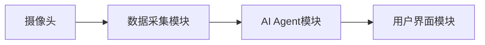

                 

# AI Agent在智能镜子中的皮肤状况分析

> 关键词：AI Agent, 智能镜子, 皮肤状况分析, 计算机视觉, 机器学习, 数学模型, 传感器技术

> 摘要：本文深入探讨AI Agent在智能镜子中的应用，特别是皮肤状况分析的技术细节。从背景介绍到算法实现，再到系统设计和项目实战，系统性地剖析了AI Agent在智能镜子中的核心作用和技术实现。

---

# 第一部分：AI Agent与智能镜子概述

## 第1章：AI Agent与智能镜子的背景介绍

### 1.1 什么是AI Agent
#### 1.1.1 AI Agent的定义
AI Agent（人工智能代理）是指能够感知环境、自主决策并执行任务的智能实体。它通过传感器获取信息，利用算法进行分析，并通过执行器与环境互动。AI Agent的核心在于其自主性和智能性，能够适应复杂多变的环境。

#### 1.1.2 AI Agent的核心特点
- **自主性**：能够在没有外部干预的情况下自主运行。
- **反应性**：能够实时感知环境变化并做出反应。
- **学习能力**：通过数据和经验不断优化自身的算法和决策能力。
- **协作性**：能够与其他AI Agent或人类进行协作。

#### 1.1.3 AI Agent与传统算法的区别
AI Agent不仅仅是算法的实现，它具有更强的自主性和适应性。传统算法通常需要明确的规则和输入，而AI Agent能够根据环境动态调整行为。AI Agent的核心是实现智能体的行为，而不仅仅是数据处理。

### 1.2 智能镜子的基本概念
#### 1.2.1 智能镜子的功能介绍
智能镜子是一种集成AI技术的镜子，能够通过摄像头和传感器捕捉用户的面部信息，分析皮肤状况、表情、健康状态等，并提供相应的建议和反馈。

#### 1.2.2 智能镜子的技术基础
智能镜子的核心技术包括计算机视觉、图像处理、机器学习、传感器技术等。这些技术的结合使得智能镜子能够实现高精度的面部识别和分析。

#### 1.2.3 智能镜子的应用场景
智能镜子广泛应用于健康管理、美容护理、医疗诊断等领域。例如，用户可以通过智能镜子了解自己的皮肤状况，获得个性化的护肤建议，或者在医疗诊断中辅助医生进行初步的皮肤疾病分析。

### 1.3 AI Agent在智能镜子中的作用
#### 1.3.1 AI Agent在智能镜子中的功能
AI Agent在智能镜子中扮演着关键角色，负责数据的采集、分析、决策和反馈。它能够实时处理用户的面部图像，分析皮肤状况，并提供相应的建议。

#### 1.3.2 AI Agent如何提升智能镜子的性能
通过AI Agent，智能镜子能够实现更精准的面部识别和分析。AI Agent能够不断学习和优化，提升识别的准确性和响应速度，从而提供更好的用户体验。

#### 1.3.3 AI Agent在智能镜子中的发展趋势
随着AI技术的不断进步，AI Agent在智能镜子中的应用将更加智能化和个性化。未来的智能镜子将能够识别更多的面部特征，提供更精准的健康建议，并实现更自然的用户交互。

### 1.4 本章小结
本章介绍了AI Agent的基本概念和特点，以及智能镜子的基本功能和技术基础。重点阐述了AI Agent在智能镜子中的作用和未来发展趋势，为后续章节的深入分析奠定了基础。

---

## 第2章：皮肤状况分析的核心概念

### 2.1 皮肤的生理结构与特征
#### 2.1.1 皮肤的分层结构
皮肤由表皮、真皮和皮下组织组成。表皮是皮肤的最外层，主要由角质细胞构成；真皮含有丰富的血管和胶原蛋白，起到支撑和营养的作用；皮下组织则起到缓冲和保护的作用。

#### 2.1.2 皮肤的光学特性
皮肤的光学特性包括颜色、纹理、光泽等。这些特性可以通过图像处理和计算机视觉技术进行分析，从而提取皮肤的健康信息。

#### 2.1.3 皮肤的健康指标
皮肤健康指标包括水分含量、弹性、色素沉着、炎症程度等。这些指标可以通过AI Agent进行量化分析，为用户提供个性化的健康建议。

### 2.2 常见皮肤问题分析
#### 2.2.1 皮肤问题的分类
常见的皮肤问题包括 acne（粉刺）、wrinkles（皱纹）、pigmentation（色素沉着）、dryness（干燥）和 inflammation（炎症）等。

#### 2.2.2 皮肤问题的成因
皮肤问题的成因复杂，包括遗传因素、环境因素、生活习惯等。例如，遗传因素可能导致某些人更容易出现特定的皮肤问题，而环境污染和不良生活习惯则可能加重皮肤问题。

#### 2.2.3 皮肤问题的检测方法
皮肤问题的检测方法包括自我观察、医疗诊断和智能镜子分析。智能镜子通过AI Agent和传感器技术，能够快速、准确地检测皮肤问题，并提供相应的建议。

### 2.3 皮肤状况分析的数学模型
#### 2.3.1 皮肤状况分析的数学模型概述
皮肤状况分析的数学模型主要用于量化皮肤的各项健康指标。这些模型通常基于图像处理和机器学习技术，能够从面部图像中提取特征，并进行分类和回归分析。

#### 2.3.2 皮肤状况分析的数学公式
以下是皮肤状况分析中常用的数学公式：

1. **颜色空间转换**：将RGB颜色空间转换为HSI颜色空间，便于分析皮肤的色调和饱和度。
   $$ I = \frac{R + G + B}{3} $$

2. **纹理分析**：使用Gabor滤波器进行纹理提取，计算纹理特征。
   $$ Gabor_{\theta}(x, y) = \cos(\theta) \cdot x + \sin(\theta) \cdot y $$

3. **皮肤健康指数计算**：基于多项式回归模型，综合考虑水分含量、弹性、色素沉着等因素。
   $$ Health Index = a \cdot H + b \cdot E + c \cdot P $$

#### 2.3.3 皮肤状况分析的算法实现
皮肤状况分析的算法实现通常包括以下几个步骤：
1. **数据采集**：获取面部图像。
2. **预处理**：调整图像亮度、对比度等。
3. **特征提取**：使用Gabor滤波器提取纹理特征。
4. **分类与回归**：基于机器学习模型，对皮肤健康指标进行分类和回归分析。
5. **结果输出**：生成皮肤健康报告。

### 2.4 本章小结
本章详细介绍了皮肤的生理结构、常见问题及其检测方法，并提出了皮肤状况分析的数学模型和算法实现步骤。这些内容为后续章节的AI Agent实现奠定了理论基础。

---

## 第3章：AI Agent在皮肤状况分析中的算法原理

### 3.1 数据采集与预处理
#### 3.1.1 数据采集方法
AI Agent通过摄像头采集用户的面部图像，获取高分辨率的RGB图像。

#### 3.1.2 数据预处理技术
数据预处理包括图像灰度化、直方图均衡化、去噪处理等。例如，使用高斯滤波器进行去噪处理：
$$ G(x, y) = \frac{1}{(2\pi\sigma^2)} e^{-(x^2 + y^2)/(2\sigma^2)} $$

#### 3.1.3 数据增强方法
数据增强包括旋转、翻转、颜色变换等，以增加训练数据的多样性。

### 3.2 特征提取与模型训练
#### 3.2.1 特征提取方法
使用Gabor滤波器和颜色空间转换（如HSI）进行特征提取。

#### 3.2.2 模型训练流程
基于卷积神经网络（CNN）进行特征学习和分类。训练流程如下：
1. **输入层**：接收RGB图像。
2. **卷积层**：提取图像的局部特征。
3. **池化层**：降低特征维度。
4. **全连接层**：进行分类或回归。

#### 3.2.3 模型优化策略
使用交叉验证和早停法防止过拟合，选择合适的优化器（如Adam）进行模型训练。

### 3.3 算法实现与优化
#### 3.3.1 算法实现步骤
1. **数据预处理**：将RGB图像转换为HSI颜色空间。
2. **特征提取**：使用Gabor滤波器提取纹理特征。
3. **模型训练**：基于CNN进行特征学习和分类。
4. **结果输出**：生成皮肤健康报告。

#### 3.3.2 算法优化方法
使用数据增强、模型深度优化和超参数调整等方法提升模型性能。

#### 3.3.3 算法性能评估
通过准确率、召回率和F1分数评估模型性能：
$$ F1 = 2 \cdot \frac{Precision \cdot Recall}{Precision + Recall} $$

### 3.4 本章小结
本章详细介绍了AI Agent在皮肤状况分析中的算法原理，包括数据预处理、特征提取和模型训练的实现步骤，以及模型优化和性能评估的方法。

---

## 第4章：AI Agent在智能镜子中的系统架构设计

### 4.1 系统组成与功能模块
#### 4.1.1 系统组成概述
智能镜子系统主要包括摄像头、传感器、AI Agent模块和用户界面模块。

#### 4.1.2 功能模块划分
1. **数据采集模块**：负责采集用户的面部图像。
2. **AI Agent模块**：负责图像处理和皮肤状况分析。
3. **用户界面模块**：显示分析结果并提供交互界面。

#### 4.1.3 模块之间的关系
数据采集模块将图像传递给AI Agent模块进行处理，AI Agent模块将结果传递给用户界面模块进行展示。

### 4.2 系统架构设计
#### 4.2.1 系统架构图
使用Mermaid图展示系统架构：

#### 4.2.2 模块之间的交互流程
1. 用户面对镜子，摄像头采集图像。
2. 数据采集模块将图像传递给AI Agent模块。
3. AI Agent模块进行图像处理和皮肤状况分析。
4. 用户界面模块显示分析结果。

#### 4.2.3 系统的扩展性设计
系统设计时预留了扩展接口，未来可以增加更多功能模块，如语音交互模块等。

### 4.3 接口设计与实现
#### 4.3.1 系统接口定义
AI Agent模块与数据采集模块之间的接口采用RESTful API设计。

#### 4.3.2 接口实现方法
使用Python编写接口服务，基于Flask框架实现RESTful API。

#### 4.3.3 接口测试与验证
通过Postman工具进行接口测试，验证各模块之间的交互是否正常。

### 4.4 本章小结
本章详细描述了智能镜子系统的组成与功能模块，并通过Mermaid图展示了系统架构设计和交互流程。同时，讨论了系统的扩展性设计和接口实现方法。

---

## 第5章：项目实战与案例分析

### 5.1 项目环境搭建
#### 5.1.1 开发环境的选择
推荐使用Python 3.8及以上版本，安装必要的库如OpenCV、Keras、TensorFlow等。

#### 5.1.2 开发工具的安装
使用Anaconda安装虚拟环境，并安装必要的依赖库。

#### 5.1.3 数据集的准备
收集和标注面部图像数据集，确保数据的多样性和代表性。

### 5.2 系统核心实现
#### 5.2.1 数据采集模块的实现
使用OpenCV库进行图像采集和预处理。

#### 5.2.2 特征提取模块的实现
编写Gabor滤波器代码，提取图像的纹理特征。

#### 5.2.3 AI Agent算法的实现
基于Keras框架搭建卷积神经网络模型，进行图像分类和回归分析。

### 5.3 实际案例分析
#### 5.3.1 案例背景
选取一名用户的面部图像，分析其皮肤状况。

#### 5.3.2 数据处理与分析
展示数据预处理、特征提取和模型训练的具体步骤。

#### 5.3.3 结果展示与解读
生成皮肤健康报告，包括水分含量、弹性、色素沉着等指标的分析结果。

### 5.4 本章小结
本章通过实际案例展示了AI Agent在智能镜子中的应用，详细讲解了系统核心实现和项目实战的具体步骤。

---

## 第6章：最佳实践与总结

### 6.1 最佳实践
#### 6.1.1 数据预处理的技巧
使用高斯滤波器进行去噪处理，确保图像质量。

#### 6.1.2 模型优化的建议
选择合适的超参数，使用早停法防止过拟合。

#### 6.1.3 系统设计的注意事项
模块化设计，确保各模块之间的接口清晰，便于维护和扩展。

### 6.2 小结
通过本文的详细讲解，读者可以全面了解AI Agent在智能镜子中的皮肤状况分析技术，从理论到实践，掌握系统的实现方法。

### 6.3 注意事项
在实际应用中，需要注意数据隐私保护，确保用户数据的安全性。

### 6.4 拓展阅读
推荐阅读相关领域的书籍和论文，如《Deep Learning》和《Computer Vision: Algorithms and Applications》。

---

# 作者：AI天才研究院/AI Genius Institute & 禅与计算机程序设计艺术 /Zen And The Art of Computer Programming

---

以上是《AI Agent在智能镜子中的皮肤状况分析》的技术博客文章目录大纲。文章内容将按照上述结构进行详细展开，确保每一部分都涵盖必要的知识点，逻辑清晰，结构紧凑，语言专业且易于理解。

