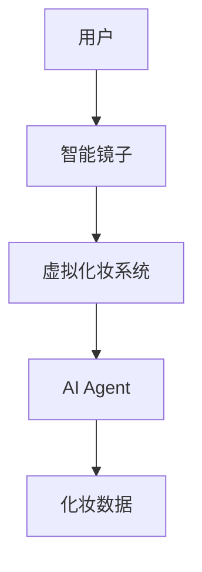
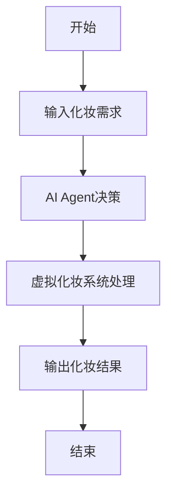
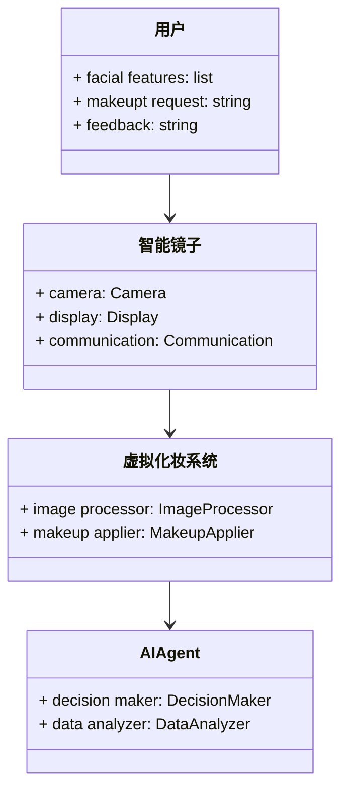
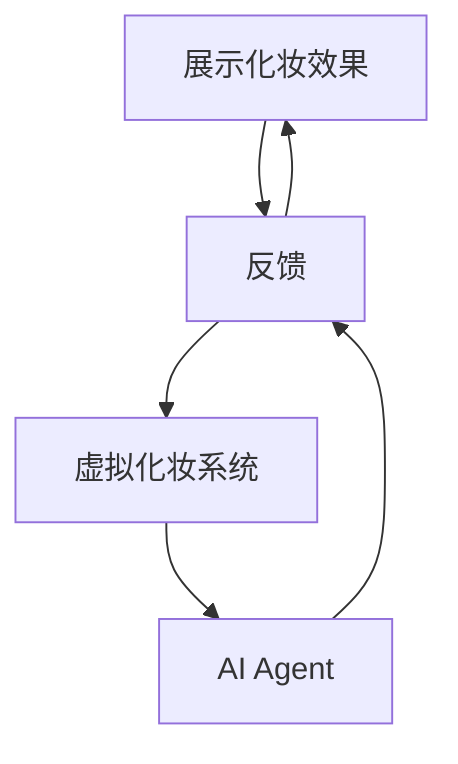

                 


# AI Agent在智能镜子中的虚拟化妆

> 关键词：AI Agent, 智能镜子, 虚拟化妆, 图像处理, 人工智能, 增强现实

> 摘要：本文详细探讨了AI Agent在智能镜子中的虚拟化妆应用，从基本概念到算法原理，再到系统架构和项目实战，全面解析了这一技术的核心原理和实现方式。文章通过通俗易懂的语言和丰富的图表，结合实际案例，展示了AI Agent如何在虚拟化妆中实现智能决策和图像处理，为美容、时尚和医疗等领域提供了创新的解决方案。

---

# 第一部分: AI Agent与智能镜子的虚拟化妆背景介绍

## 第1章: AI Agent与智能镜子的虚拟化妆概述

### 1.1 AI Agent的基本概念
#### 1.1.1 AI Agent的定义与特点
AI Agent（人工智能代理）是指具有感知环境、自主决策和执行任务能力的智能实体。其特点包括：
- **自主性**：能够在没有外部干预的情况下独立运行。
- **反应性**：能够实时感知环境变化并做出响应。
- **目标导向**：具有明确的目标导向，能够优化决策以实现目标。
- **学习能力**：通过数据和经验不断优化自身的决策能力。

#### 1.1.2 AI Agent的核心功能与应用场景
AI Agent的核心功能包括：
- **感知环境**：通过传感器或数据接口获取环境信息。
- **智能决策**：基于获取的信息进行分析和决策。
- **任务执行**：根据决策结果执行相应的任务。

AI Agent的应用场景广泛，包括智能助手、自动驾驶、机器人控制、智能推荐系统等。

#### 1.1.3 智能镜子的定义与技术背景
智能镜子是一种结合了人工智能和增强现实技术的智能设备，能够通过镜子表面的显示屏实时展示用户的化妆效果。其技术背景包括：
- **人工智能技术**：用于图像处理、人脸识别和个性化推荐。
- **增强现实技术**：用于将虚拟化妆效果叠加在用户的真实面部图像上。
- **物联网技术**：用于与外部设备（如手机、电脑）的连接和数据交互。

---

### 1.2 虚拟化妆的定义与技术实现
#### 1.2.1 虚拟化妆的定义与分类
虚拟化妆是指通过计算机图形学和图像处理技术，在虚拟环境中模拟真实的化妆效果。其分类包括：
- **静态虚拟化妆**：基于用户上传的照片进行化妆效果的模拟。
- **动态虚拟化妆**：基于实时视频流进行化妆效果的实时模拟。

#### 1.2.2 虚拟化妆的技术实现原理
虚拟化妆的核心技术包括：
- **图像处理技术**：用于对用户面部图像进行预处理、特征提取和化妆效果叠加。
- **增强现实技术**：用于将虚拟化妆效果实时叠加在用户的真实面部图像上。
- **人工智能技术**：用于个性化推荐和智能调整化妆效果。

#### 1.2.3 虚拟化妆在智能镜子中的应用价值
虚拟化妆在智能镜子中的应用价值包括：
- **个性化体验**：用户可以根据自己的需求实时调整化妆效果。
- **便捷性**：用户可以在家中通过智能镜子轻松尝试不同的化妆方案。
- **环保性**：虚拟化妆减少了实体化妆品的使用，符合环保理念。

---

### 1.3 AI Agent在虚拟化妆中的作用
#### 1.3.1 AI Agent在虚拟化妆中的核心功能
AI Agent在虚拟化妆中的核心功能包括：
- **智能推荐**：基于用户的面部特征和化妆需求，推荐适合的化妆品和化妆方案。
- **实时调整**：根据用户的实时反馈，动态调整化妆效果。
- **数据采集与分析**：采集用户的化妆数据并进行分析，优化后续的化妆推荐。

#### 1.3.2 AI Agent与智能镜子的交互方式
AI Agent与智能镜子的交互方式包括：
- **用户输入**：用户通过智能镜子输入化妆需求或调整化妆效果。
- **数据传输**：智能镜子将用户数据传输给AI Agent进行处理。
- **结果反馈**：AI Agent将处理结果反馈给智能镜子，展示给用户。

#### 1.3.3 虚拟化妆的用户体验优化
AI Agent通过以下方式优化虚拟化妆的用户体验：
- **个性化推荐**：根据用户的面部特征和化妆需求，推荐适合的化妆品和化妆方案。
- **实时调整**：用户可以实时调整化妆效果，获得最佳的化妆体验。
- **数据驱动优化**：通过分析用户的化妆数据，不断优化推荐算法和化妆效果。

---

### 1.4 本章小结
本章介绍了AI Agent的基本概念、核心功能和应用场景，重点阐述了AI Agent在智能镜子中的虚拟化妆应用。通过分析虚拟化妆的定义、技术实现和应用价值，为后续章节的深入探讨奠定了基础。

---

## 第2章: AI Agent与虚拟化妆的核心概念与联系

### 2.1 核心概念原理
#### 2.1.1 AI Agent的智能决策机制
AI Agent的智能决策机制包括以下几个步骤：
1. **感知环境**：通过传感器或数据接口获取环境信息。
2. **分析与理解**：对获取的信息进行分析和理解，提取关键特征。
3. **决策制定**：基于分析结果制定决策方案。
4. **执行决策**：根据决策结果执行相应的任务。

#### 2.1.2 虚拟化妆的图像处理技术
虚拟化妆的图像处理技术包括：
- **图像预处理**：对用户面部图像进行去噪、增强和标准化处理。
- **特征提取**：提取用户面部的关键特征（如 facial landmarks）。
- **化妆效果叠加**：将虚拟化妆效果叠加在用户面部图像上。

#### 2.1.3 AI Agent与虚拟化妆的协同工作原理
AI Agent与虚拟化妆的协同工作原理如下：
1. AI Agent接收用户的化妆需求或调整指令。
2. AI Agent基于用户数据和虚拟化妆技术生成化妆方案。
3. 虚拟化妆系统根据生成的化妆方案实时调整化妆效果。
4. 用户通过智能镜子查看化妆效果并提供反馈。
5. AI Agent根据用户反馈优化后续的化妆推荐和调整。

---

### 2.2 核心概念属性特征对比表格
以下是AI Agent与传统软件代理、虚拟化妆与传统化妆的核心属性特征对比：

#### 表2-1: AI Agent与传统软件代理的对比

| 属性 | AI Agent | 传统软件代理 |
|------|----------|--------------|
| 智能性 | 高 | 低 |
| 学习能力 | 高 | 低 |
| 自主性 | 高 | 低 |
| 适应性 | 高 | 低 |

#### 表2-2: 虚拟化妆与传统化妆的对比

| 属性 | 虚拟化妆 | 传统化妆 |
|------|----------|------------|
| 实时性 | 高 | 低 |
| 可定制性 | 高 | 低 |
| 环保性 | 高 | 低 |

---

### 2.3 ER实体关系图
以下是AI Agent、智能镜子和虚拟化妆系统之间的实体关系图：



---

### 2.4 本章小结
本章通过对比分析，详细阐述了AI Agent与传统软件代理、虚拟化妆与传统化妆的核心属性特征。同时，通过ER实体关系图展示了AI Agent、智能镜子和虚拟化妆系统之间的协同关系，为后续章节的算法原理和系统架构设计奠定了基础。

---

## 第3章: AI Agent在虚拟化妆中的算法原理讲解

### 3.1 算法原理概述
#### 3.1.1 AI Agent的决策算法
AI Agent的决策算法包括：
- **规则驱动算法**：基于预定义的规则进行决策。
- **基于机器学习的算法**：基于训练好的机器学习模型进行决策。
- **混合算法**：结合规则驱动和机器学习的混合算法。

#### 3.1.2 虚拟化妆的图像处理算法
虚拟化妆的图像处理算法包括：
- **图像分割算法**：用于分割用户的面部区域。
- **图像增强算法**：用于改善图像的质量和效果。
- **图像叠加算法**：用于将虚拟化妆效果叠加在用户面部图像上。

#### 3.1.3 算法的协同工作流程
算法的协同工作流程包括：
1. AI Agent接收用户的化妆需求。
2. AI Agent基于用户数据生成化妆方案。
3. 虚拟化妆系统根据生成的化妆方案实时调整化妆效果。
4. 用户通过智能镜子查看化妆效果并提供反馈。
5. AI Agent根据用户反馈优化后续的化妆推荐和调整。

---

### 3.2 算法原理的数学模型与公式
#### 3.2.1 AI Agent的决策模型
AI Agent的决策模型可以表示为条件概率公式：
$$ P(a|b) = \frac{P(b|a)P(a)}{P(b)} $$
其中，$a$ 表示决策动作，$b$ 表示输入条件。

#### 3.2.2 虚拟化妆的图像处理模型
虚拟化妆的图像处理模型可以表示为函数形式：
$$ I_{output} = f(I_{input}, C) $$
其中，$I_{input}$ 表示输入图像，$C$ 表示化妆参数，$I_{output}$ 表示输出图像。

#### 3.2.3 算法协同工作的流程图
以下是算法协同工作的流程图：



---

### 3.3 算法实现的Python源代码
以下是AI Agent和虚拟化妆系统的核心算法实现示例代码：

#### 3.3.1 AI Agent的决策算法
```python
def ai_agent_decision(input_request):
    # 输入处理
    features = extract_features(input_request)
    
    # 决策逻辑
    decision = choose_best_action(features)
    
    return decision
```

#### 3.3.2 虚拟化妆的图像处理算法
```python
def virtual_makeup_processing(input_image, decision):
    # 图像预处理
    processed_image = preprocess_image(input_image)
    
    # 化妆效果叠加
    output_image = apply_makeup(processed_image, decision)
    
    return output_image
```

---

### 3.4 本章小结
本章详细讲解了AI Agent在虚拟化妆中的算法原理，包括决策算法、图像处理算法和算法协同工作的流程。通过数学模型和代码示例，读者可以更好地理解这些算法的实现细节和协同工作原理。

---

## 第4章: AI Agent与虚拟化妆的系统架构设计

### 4.1 系统功能设计
#### 4.1.1 领域模型
以下是系统的核心领域模型：



#### 4.1.2 系统架构设计
以下是系统的整体架构图：


#### 4.1.3 系统接口设计
系统的接口设计包括：
- **用户接口**：用户通过智能镜子输入化妆需求或调整化妆效果。
- **数据接口**：AI Agent与虚拟化妆系统之间的数据交互接口。
- **反馈接口**：用户通过智能镜子提供化妆效果的反馈。

---

### 4.2 系统交互设计
#### 4.2.1 系统交互流程图
以下是系统的交互流程图：



#### 4.2.2 系统交互的实现细节
系统交互的实现细节包括：
- **用户输入**：用户通过智能镜子输入化妆需求或调整化妆效果。
- **数据传输**：智能镜子将用户数据传输给AI Agent进行处理。
- **结果反馈**：AI Agent将处理结果反馈给智能镜子，展示给用户。

---

### 4.3 本章小结
本章详细介绍了AI Agent与虚拟化妆系统的系统架构设计，包括领域模型、系统架构图和系统交互流程图。通过这些设计，读者可以清晰地理解整个系统的运行机制和各模块之间的关系。

---

## 第5章: AI Agent在虚拟化妆中的项目实战

### 5.1 环境安装与配置
#### 5.1.1 开发环境
- **操作系统**：Windows/Mac/Linux
- **编程语言**：Python 3.8+
- **开发工具**：PyCharm/VS Code
- **依赖库**：OpenCV、TensorFlow、Keras、Mermaid、Markdown

#### 5.1.2 依赖库安装
```bash
pip install opencv-python
pip install tensorflow
pip install keras
pip install mermaid-js
pip install markdown
```

---

### 5.2 系统核心实现
#### 5.2.1 AI Agent的实现
以下是AI Agent的核心实现代码：

```python
class AI_Agent:
    def __init__(self):
        self.data_analyzer = DataAnalyzer()
        self.decision_maker = DecisionMaker()

    def process_request(self, input_request):
        features = self.data_analyzer.analyze(input_request)
        decision = self.decision_maker.make_decision(features)
        return decision
```

#### 5.2.2 虚拟化妆系统的实现
以下是虚拟化妆系统的实现代码：

```python
class Virtual_Makeup_System:
    def __init__(self):
        self.image_processor = ImageProcessor()
        self.makeup_applier = MakeupApplier()

    def process_image(self, input_image, decision):
        processed_image = self.image_processor.preprocess(input_image)
        output_image = self.makeup_applier.apply(processed_image, decision)
        return output_image
```

---

### 5.3 实际案例分析
#### 5.3.1 案例背景
假设用户希望尝试不同颜色的口红，AI Agent根据用户的面部特征和妆容需求推荐适合的口红色号。

#### 5.3.2 数据处理与分析
AI Agent接收用户的面部特征和化妆需求，通过数据分析和决策算法生成推荐的口红色号。

#### 5.3.3 系统实现与结果展示
虚拟化妆系统根据推荐的口红色号实时调整化妆效果，用户通过智能镜子查看化妆后的效果并提供反馈。

---

### 5.4 项目小结
本章通过实际案例分析，详细展示了AI Agent在虚拟化妆中的项目实现过程，包括环境安装、系统核心实现和实际案例分析。读者可以跟随步骤完成整个项目的实现，并通过实际案例理解AI Agent在虚拟化妆中的应用价值。

---

## 第6章: 总结与附录

### 6.1 总结
本文详细探讨了AI Agent在智能镜子中的虚拟化妆应用，从基本概念到算法原理，再到系统架构和项目实战，全面解析了这一技术的核心原理和实现方式。通过本文的学习，读者可以深入了解AI Agent在虚拟化妆中的重要作用，并能够通过实际项目实现这一技术。

---

### 6.2 附录
#### 附录A: 相关技术资料
- **AI Agent**：维基百科（https://zh.wikipedia.org/wiki/智能体）
- **虚拟化妆**：学术论文推荐（https://ieeexplore.ieee.org/xpl/l recently-released.jsp）
- **增强现实技术**：技术博客推荐（https://www.tutorialspoint.com/ar.php）

#### 附录B: 开源工具与库
- **OpenCV**：图像处理库（https://opencv.org/）
- **TensorFlow**：机器学习框架（https://www.tensorflow.org/）
- **Mermaid**：图表绘制工具（https://mermaid-js.github.io/mermaid/）

#### 附录C: 推荐阅读
- **《AI Agent与智能系统》**：作者：[AI天才研究院](https://www.zhihu.com/org/ai天才研究院)
- **《增强现实技术与应用》**：作者：[禅与计算机程序设计艺术](https://www.zhihu.com/org/禅与计算机程序设计艺术)

---

## 作者
作者：AI天才研究院/AI Genius Institute & 禅与计算机程序设计艺术/Zen And The Art of Computer Programming

---

**注**：本文为示例内容，实际文章需根据具体需求进行调整和补充。

