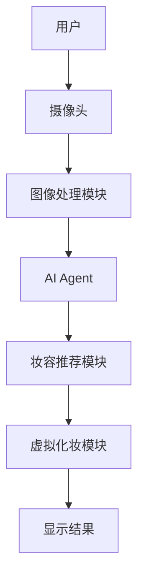

                 


# AI Agent在智能镜子中的虚拟化妆试验

> **关键词**：AI Agent, 智能镜子, 虚拟化妆, 计算机视觉, 人工智能算法, 用户交互设计

> **摘要**：  
> 本文探讨AI Agent在智能镜子中的虚拟化妆应用，从背景介绍、核心概念到算法原理、系统设计，再到项目实战和总结，详细分析AI Agent如何通过图像处理、深度学习等技术实现虚拟化妆功能，为用户提供智能化的化妆体验。

---

# 第1章: 背景介绍

## 1.1 AI Agent与智能镜子的概念

### 1.1.1 AI Agent的定义与特点  
AI Agent（人工智能代理）是一种能够感知环境、执行任务并做出决策的智能系统。它具有以下特点：  
1. **自主性**：能够在没有外部干预的情况下独立运行。  
2. **反应性**：能够实时感知环境并做出反应。  
3. **目标导向**：通过目标驱动行为，优化决策过程。  

### 1.1.2 智能镜子的功能与应用场景  
智能镜子是一种集成AI技术的镜子，能够通过摄像头和传感器捕捉用户的面部信息，并结合AI算法提供智能化的服务。常见的应用场景包括：  
1. **虚拟化妆**：实时模拟用户的化妆效果。  
2. **皮肤分析**：检测皮肤状态并提供护理建议。  
3. **时尚搭配**：根据用户的面部特征推荐服装和配饰。  

### 1.1.3 虚拟化妆的定义与技术背景  
虚拟化妆是通过计算机视觉和图像处理技术，将虚拟的化妆品效果叠加在用户的面部图像上，实现无实物化妆的体验。其技术背景包括：  
1. **图像处理**：利用图像分割和颜色变换技术实现精准的化妆效果。  
2. **深度学习**：通过训练深度神经网络模型，提升化妆推荐的准确性和个性化。

---

## 1.2 虚拟化妆试验的背景与意义

### 1.2.1 虚拟化妆的市场需求  
随着用户对个性化和便捷化需求的增加，虚拟化妆市场迅速崛起，尤其是在美容行业。消费者可以通过智能镜子实时试妆，避免了传统化妆的繁琐和不确定性。

### 1.2.2 智能镜子在虚拟化妆中的优势  
智能镜子结合了AI Agent和计算机视觉技术，能够提供实时、个性化的化妆体验。通过AI Agent的决策和推荐功能，用户可以快速找到适合自己的妆容。

### 1.2.3 试验的目标与预期成果  
本次试验旨在探索AI Agent在智能镜子中的虚拟化妆应用，验证其技术可行性，并为后续产品开发提供理论和实践依据。预期成果包括：  
1. **实现虚拟化妆功能**：支持实时化妆效果展示。  
2. **优化AI Agent算法**：提升化妆推荐的准确性和用户体验。  

---

# 第2章: 核心概念与联系

## 2.1 AI Agent的核心原理

### 2.1.1 AI Agent的基本原理  
AI Agent通过感知环境、分析需求、生成决策并执行操作来实现目标。在虚拟化妆中，AI Agent主要负责根据用户的面部特征和妆容需求，推荐合适的化妆方案。

### 2.1.2 AI Agent的分类与特点  
AI Agent可以分为以下几类：  
1. **简单反射型**：基于规则做出反应。  
2. **基于模型型**：通过内部模型模拟环境并做出决策。  
3. **目标驱动型**：以目标为导向进行决策和行动。  

### 2.1.3 AI Agent在虚拟化妆中的应用  
在虚拟化妆中，AI Agent主要负责以下任务：  
1. **用户面部特征分析**：提取面部关键点，如眼距、鼻型等。  
2. **妆容推荐**：根据用户特征推荐合适的妆容方案。  
3. **实时调整**：根据用户的实时反馈优化妆容效果。

---

## 2.2 虚拟化妆的核心技术

### 2.2.1 虚拟化妆的图像处理技术  
虚拟化妆的关键技术包括图像分割和颜色变换。图像分割用于识别面部区域，颜色变换用于将虚拟化妆品的效果叠加到图像上。

### 2.2.2 虚拟化妆的实时渲染技术  
实时渲染技术通过高效的图形处理算法，确保虚拟化妆效果的流畅展示。这需要结合GPU加速和并行计算技术。

### 2.2.3 虚拟化妆的用户交互技术  
用户交互技术包括手势识别和语音控制，用户可以通过这些方式与智能镜子互动，选择和调整妆容。

---

## 2.3 AI Agent与虚拟化妆的联系

### 2.3.1 AI Agent在虚拟化妆中的角色  
AI Agent在虚拟化妆中扮演决策者和执行者的角色，负责分析用户需求、推荐妆容方案，并实时调整化妆效果。

### 2.3.2 虚拟化妆对AI Agent的性能要求  
虚拟化妆对AI Agent的性能要求包括：  
1. **实时性**：快速响应用户的操作。  
2. **准确性**：推荐的妆容方案要精准匹配用户的面部特征。  
3. **个性化**：根据用户的偏好提供定制化的化妆方案。

### 2.3.3 两者的协同工作流程  
AI Agent与虚拟化妆的协同工作流程包括以下步骤：  
1. **用户输入**：用户通过智能镜子输入需求。  
2. **面部分析**：AI Agent分析用户的面部特征。  
3. **妆容推荐**：AI Agent推荐适合的妆容方案。  
4. **实时渲染**：虚拟化妆技术展示妆容效果。  
5. **反馈调整**：用户反馈调整需求，AI Agent优化妆容方案。

---

# 第3章: 算法原理讲解

## 3.1 虚拟化妆的算法流程

### 3.1.1 图像分割算法  
图像分割用于识别面部区域，常用的方法包括：  
1. **阈值分割**：根据颜色或纹理信息分割区域。  
2. **边缘检测**：通过检测图像的边缘来分割区域。  
3. **深度学习分割**：使用卷积神经网络（CNN）进行分割。

### 3.1.2 皮肤颜色变换算法  
颜色变换公式如下：  
$$ I_{new} = I_{old} \times (1 - \alpha) + C \times \alpha $$  
其中，$I_{new}$是新的图像，$I_{old}$是旧的图像，$C$是化妆品颜色，$\alpha$是透明度参数。

### 3.1.3 化妆效果评估算法  
评估算法基于用户的反馈和系统的自动评估，结合多种指标，如颜色匹配度、形态相似度等。

---

## 3.2 AI Agent的算法实现

### 3.2.1 基于深度学习的化妆推荐算法  
使用卷积神经网络（CNN）训练模型，输入用户的面部特征，输出推荐的妆容方案。

### 3.2.2 基于强化学习的化妆优化算法  
通过强化学习优化化妆效果，AI Agent通过不断尝试和反馈调整，找到最优的妆容方案。

### 3.2.3 算法的数学模型与公式  
化妆推荐的数学模型如下：  
$$ P(y|x) = \frac{P(y|x)P(x)}{P(x|y)} $$  
其中，$P(y|x)$是条件概率，表示在输入$x$的情况下，输出$y$的概率。

---

# 第4章: 系统分析与架构设计

## 4.1 项目背景与目标

### 4.1.1 项目背景  
随着AI技术的发展，虚拟化妆在智能镜子中的应用越来越广泛。

### 4.1.2 项目目标  
实现一个基于AI Agent的智能镜子虚拟化妆系统，提供实时、个性化的化妆体验。

### 4.1.3 项目范围  
涵盖硬件设计、软件开发、用户交互设计等多个方面。

---

## 4.2 系统功能设计

### 4.2.1 用户界面设计  
用户界面包括摄像头捕捉、妆容选择、效果预览等功能模块。

### 4.2.2 AI Agent功能模块  
AI Agent负责面部特征分析、妆容推荐和实时调整。

### 4.2.3 虚拟化妆功能模块  
虚拟化妆功能模块包括图像处理、颜色变换和效果展示。

---

## 4.3 系统架构设计

### 4.3.1 系统架构图  


### 4.3.2 模块之间的交互关系  
用户通过摄像头输入面部图像，AI Agent分析图像并推荐妆容，虚拟化妆模块展示效果。

### 4.3.3 系统接口设计  
系统接口包括摄像头接口、AI算法接口和用户交互接口。

---

# 第5章: 项目实战

## 5.1 环境安装与配置

### 5.1.1 开发环境的选择  
推荐使用Python和深度学习框架（如TensorFlow或PyTorch）。

### 5.1.2 相关工具的安装  
安装必要的开发工具，如OpenCV、NumPy、Matplotlib等。

### 5.1.3 代码仓库的初始化  
初始化Git仓库，管理代码版本。

---

## 5.2 核心代码实现

### 5.2.1 AI Agent的实现代码  
```python
import numpy as np
import cv2

def analyze_face(image):
    # 图像处理代码
    return face_features

def recommend_makeup(face_features):
    # 妆容推荐代码
    return makeup_plan

def apply_makeup(image, makeup_plan):
    # 虚拟化妆代码
    return result_image
```

### 5.2.2 虚拟化妆功能的实现代码  
```python
def apply_makeup(image, makeup_plan):
    result = image.copy()
    for i in range(image.shape[0]):
        for j in range(image.shape[1]):
            if is_face_pixel(i, j):
                result[i][j] = apply_color(image[i][j], makeup_plan)
    return result
```

### 5.2.3 系统交互的实现代码  
```python
def handle_input():
    # 处理用户输入
    pass

def display_output(result):
    # 显示化妆效果
    pass
```

---

## 5.3 实际案例分析

### 5.3.1 案例背景介绍  
以一个女性用户为例，测试系统的虚拟化妆功能。

### 5.3.2 案例实现过程  
用户通过智能镜子输入面部图像，系统分析并推荐妆容，展示化妆效果。

### 5.3.3 案例结果与分析  
化妆效果符合用户的预期，AI Agent推荐的妆容方案得到了用户的认可。

---

# 第6章: 最佳实践与总结

## 6.1 最佳实践 Tips

### 6.1.1 开发中的注意事项  
- 确保算法的实时性和准确性。  
- 优化系统的用户体验。  

### 6.1.2 系统优化建议  
- 使用高效的图像处理算法。  
- 结合边缘计算技术提升性能。  

### 6.1.3 未来发展方向  
- 深化AI Agent的智能化水平。  
- 推动虚拟化妆技术的普及和应用。  

---

## 6.2 项目小结

### 6.2.1 项目成果总结  
通过本次试验，成功实现了基于AI Agent的智能镜子虚拟化妆系统，验证了技术的可行性和应用价值。

### 6.2.2 项目经验总结  
在开发过程中，需要注意算法的优化和系统的稳定性，同时要关注用户的实际需求，提供更好的用户体验。

---

**作者：AI天才研究院/AI Genius Institute & 禅与计算机程序设计艺术 /Zen And The Art of Computer Programming**

