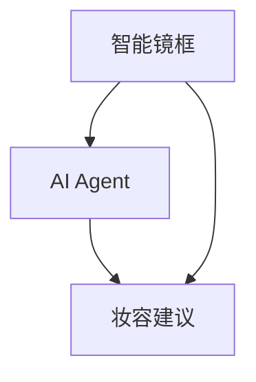
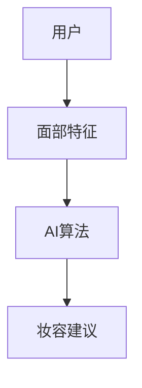
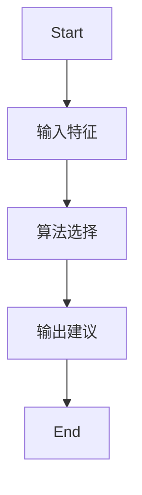
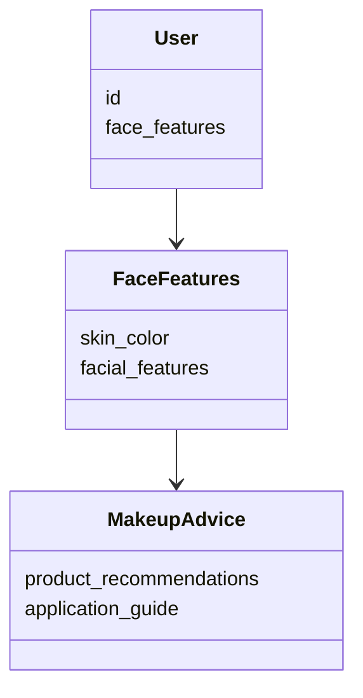
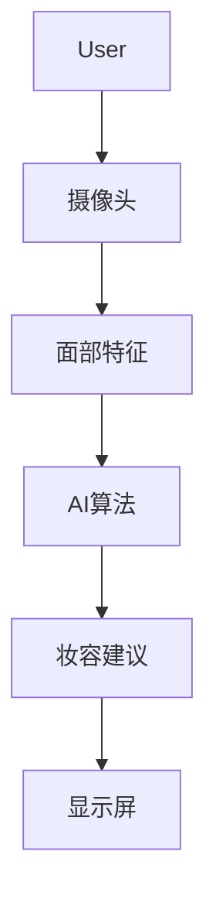
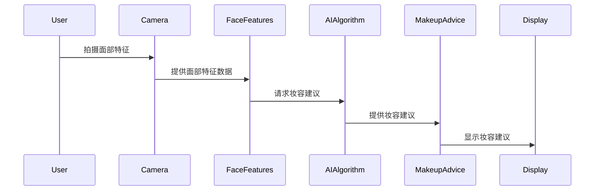

                 


# AI Agent在智能镜框中的妆容建议

## 关键词：AI Agent, 智能镜框, 妆容建议, 人工智能, 美容技术

## 摘要：本篇文章将详细探讨AI Agent在智能镜框中的妆容建议应用，从背景分析、核心概念、算法原理到系统架构，再到项目实战，最后给出最佳实践和总结。文章旨在通过系统化的方法，深入分析AI Agent如何在智能镜框中实现妆容建议，为用户提供个性化的美容解决方案。

---

# 第一部分: AI Agent与智能镜框的背景介绍

## 第1章: AI Agent与妆容建议的背景

### 1.1 问题背景

#### 1.1.1 传统妆容建议的局限性
传统的妆容建议依赖于用户的自我尝试或美容顾问的推荐，存在效率低、主观性强、个性化不足等问题。

#### 1.1.2 AI技术在美妆行业的应用潜力
AI技术能够通过图像识别、机器学习等手段，快速分析用户的面部特征、肤色、发型等因素，提供个性化的妆容建议。

#### 1.1.3 智能镜框的发展趋势
智能镜框作为一种新兴的智能设备，结合了镜子的功能和AI技术，能够为用户提供智能化的妆容建议和美容解决方案。

### 1.2 问题描述

#### 1.2.1 用户需求分析
用户希望得到个性化的妆容建议，包括适合的妆容类型、颜色搭配、产品推荐等。

#### 1.2.2 现有技术的不足
传统妆容建议缺乏个性化和科学性，难以满足用户多样化的需求。

#### 1.2.3 AI Agent在智能镜框中的角色
AI Agent作为智能镜框的核心技术，能够实时分析用户的面部特征，提供个性化的妆容建议。

### 1.3 问题解决

#### 1.3.1 AI Agent的核心功能
AI Agent能够通过图像识别和机器学习，分析用户的面部特征，推荐适合的妆容方案。

#### 1.3.2 智能镜框的技术实现
智能镜框通过摄像头捕捉用户的面部特征，结合AI算法，提供实时的妆容建议。

#### 1.3.3 用户体验的提升
通过AI Agent的实时分析和推荐，用户能够快速找到适合自己的妆容，提升化妆效率和满意度。

### 1.4 边界与外延

#### 1.4.1 系统的边界
智能镜框的妆容建议功能仅限于面部特征的分析和妆容推荐，不涉及其他功能。

#### 1.4.2 相关领域的外延
AI技术在美妆行业的应用可以扩展到产品推荐、护肤建议、发型设计等领域。

#### 1.4.3 未来可能的扩展方向
未来，智能镜框可以结合更多的AI技术，如增强现实（AR）技术，提供更丰富的妆容体验。

### 1.5 概念结构与核心要素

#### 1.5.1 核心概念的组成
智能镜框、AI Agent、妆容建议是构成该系统的核心概念。

#### 1.5.2 核心要素的对比
| 核心要素 | 描述 |
|----------|------|
| 智能镜框 | 集成摄像头和AI技术的镜子设备 |
| AI Agent | 基于机器学习的智能代理 |
| 妆容建议 | 基于AI分析的个性化妆容推荐 |

#### 1.5.3 概念结构的可视化


---

# 第二部分: AI Agent的核心概念与联系

## 第2章: AI Agent的核心原理

### 2.1 AI Agent的基本原理

#### 2.1.1 AI Agent的定义
AI Agent是一种能够感知环境并采取行动以实现目标的智能系统。

#### 2.1.2 AI Agent的核心算法
AI Agent的核心算法包括图像识别、机器学习、自然语言处理等。

#### 2.1.3 AI Agent的输入输出关系
AI Agent通过输入用户的面部特征和环境信息，输出适合的妆容建议。

### 2.2 妆容建议的核心概念

#### 2.2.1 妆容建议的定义
妆容建议是基于用户的面部特征和需求，推荐适合的化妆品和化妆技巧。

#### 2.2.2 妆容建议的关键要素
- 用户的面部特征：肤色、五官特征、肤质等。
- 化妆产品的颜色和质地。
- 当前的时尚趋势。

#### 2.2.3 AI Agent在妆容建议中的作用
AI Agent通过分析用户的面部特征和需求，推荐适合的妆容方案。

### 2.3 AI Agent与智能镜框的联系

#### 2.3.1 智能镜框的功能
智能镜框通过摄像头捕捉用户的面部特征，结合AI算法，提供实时的妆容建议。

#### 2.3.2 AI Agent在智能镜框中的应用
AI Agent负责处理用户的面部数据，分析并生成妆容建议。

#### 2.3.3 AI Agent与妆容建议的结合
AI Agent通过图像识别和机器学习，为用户提供个性化的妆容建议。

---

## 第3章: AI Agent的核心概念与联系

### 3.1 核心概念原理

#### 3.1.1 AI Agent的核心算法
AI Agent的核心算法包括图像识别、机器学习、自然语言处理等。

#### 3.1.2 AI Agent的输入输出关系
AI Agent通过输入用户的面部特征和环境信息，输出适合的妆容建议。

#### 3.1.3 AI Agent的实时性
AI Agent能够实时分析用户的面部特征，提供即时的妆容建议。

### 3.2 概念属性特征对比

| 概念 | 属性 | 特征 |
|------|------|------|
| AI Agent | 输入 | 用户面部特征 |
|          | 输出 | 妆容建议 |
| 智能镜框 | 功能 | 实时分析 |
| 妆容建议 | 核心要素 | 肤色、五官特征、肤质 |

### 3.3 ER实体关系图



---

## 第4章: 算法原理讲解

### 4.1 推荐算法

#### 4.1.1 协同过滤算法
协同过滤算法通过分析用户的相似性，推荐适合的妆容方案。

#### 4.1.2 聚类分析算法
聚类分析算法将用户分为不同的群体，推荐适合群体的妆容方案。

#### 4.1.3 深度学习模型
深度学习模型通过训练大量的化妆数据，生成适合用户的妆容建议。

### 4.2 推荐算法流程图



### 4.3 算法数学模型

#### 4.3.1 协同过滤算法
$$ \text{相似度} = \frac{\sum (x_i - \bar{x})(y_i - \bar{y})}{\sqrt{\sum (x_i - \bar{x})^2} \sqrt{\sum (y_i - \bar{y})^2}} $$

#### 4.3.2 深度学习模型
$$ \text{输出} = \text{模型}(输入) $$

### 4.4 代码示例

```python
import numpy as np

def calculate_similarity(user_vector, item_vector):
    numerator = np.sum((user_vector - np.mean(user_vector)) * (item_vector - np.mean(item_vector)))
    denominator = np.sqrt(np.sum((user_vector - np.mean(user_vector))**2)) * np.sqrt(np.sum((item_vector - np.mean(item_vector))**2))
    return numerator / denominator
```

---

## 第5章: 系统分析与架构设计方案

### 5.1 问题场景介绍

#### 5.1.1 用户需求
用户希望通过智能镜框获得个性化的妆容建议。

#### 5.1.2 系统目标
系统的目标是通过AI Agent，为用户提供实时的妆容建议。

### 5.2 项目介绍

#### 5.2.1 项目目标
开发一个基于AI Agent的智能镜框，提供个性化的妆容建议。

#### 5.2.2 项目范围
系统将支持用户的面部特征分析、妆容推荐、个性化建议等功能。

### 5.3 系统功能设计

#### 5.3.1 领域模型


#### 5.3.2 系统架构


### 5.4 系统接口设计

#### 5.4.1 接口描述
- 输入接口：摄像头捕捉用户的面部特征。
- 输出接口：显示屏显示妆容建议。

#### 5.4.2 接口交互流程


---

## 第6章: 项目实战

### 6.1 环境安装

#### 6.1.1 安装Python
```bash
python --version
pip install numpy
pip install scikit-learn
```

#### 6.1.2 安装相关库
```bash
pip install opencv-python
pip install dlib
```

### 6.2 系统核心实现

#### 6.2.1 代码实现
```python
import cv2
import dlib

def detect_face(image):
    # 使用dlib检测面部特征
    detector = dlib.get_frontal_face_detector()
    faces = detector(image)
    for face in faces:
        # 提取面部特征
        landmarks = detector.predictor(image, face).parts()
        # 绘制面部特征
        for point in landmarks:
            cv2.circle(image, (point.x, point.y), 2, (255, 0, 0), -1)
    return image
```

#### 6.2.2 代码应用解读
上述代码通过dlib库检测用户的面部特征，并在图像上绘制出关键点，帮助AI算法进行后续的分析和推荐。

### 6.3 实际案例分析

#### 6.3.1 案例描述
用户A希望通过智能镜框获得适合的底妆颜色建议。

#### 6.3.2 分析过程
AI Agent分析用户的肤色，推荐适合的底妆颜色和品牌。

#### 6.3.3 推荐结果
推荐适合用户的底妆颜色和产品。

### 6.4 项目小结

#### 6.4.1 项目总结
通过AI Agent和智能镜框的结合，用户能够获得个性化的妆容建议，提升化妆效率和满意度。

#### 6.4.2 项目成果
开发了一个基于AI Agent的智能镜框，能够实时分析用户的面部特征，提供适合的妆容建议。

---

## 第7章: 最佳实践与总结

### 7.1 最佳实践

#### 7.1.1 小结
通过AI Agent和智能镜框的结合，用户能够获得个性化的妆容建议，提升化妆效率和满意度。

#### 7.1.2 注意事项
在实际应用中，需要注意数据隐私和算法的准确性。

#### 7.1.3 拓展阅读
建议进一步研究AI技术在美妆行业的其他应用，如护肤建议、发型设计等。

---

# 结语

通过本文的详细讲解，我们了解了AI Agent在智能镜框中的妆容建议应用，从背景分析、核心概念、算法原理到系统架构，再到项目实战，最后给出了最佳实践和总结。希望本文能够为读者提供有价值的参考和启发。

---

# 作者：AI天才研究院/AI Genius Institute & 禅与计算机程序设计艺术 /Zen And The Art of Computer Programming

