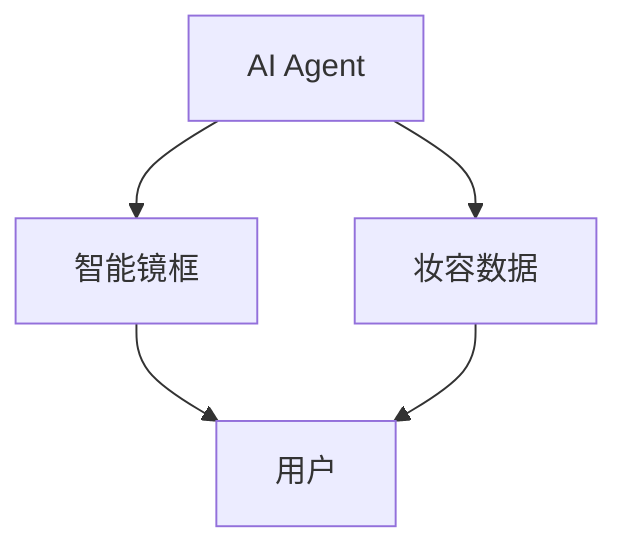
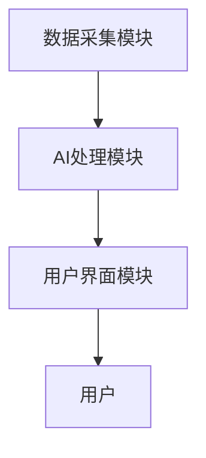

                 


# AI Agent在智能镜框中的妆容建议系统

**关键词**：AI Agent、智能镜框、妆容建议系统、算法原理、系统架构、项目实战

**摘要**：本文探讨了AI Agent在智能镜框中的妆容建议系统的实现与应用。通过分析AI Agent的核心算法、智能镜框的系统架构、以及妆容建议系统的功能设计，本文详细讲解了如何利用AI技术为用户提供个性化的妆容建议。文章从背景介绍、核心概念、算法原理、系统架构、项目实战到最佳实践，全面阐述了该系统的实现过程和实际应用。

---

# 第一部分: AI Agent在智能镜框中的妆容建议系统背景介绍

## 第1章: 问题背景与描述

### 1.1 问题背景

#### 1.1.1 现代美妆科技的发展趋势
随着科技的不断进步，美妆行业正在经历一场数字化转型。从智能镜子到AR试妆，科技正在改变人们尝试和购买化妆品的方式。AI技术的引入，使得美妆工具能够提供更精准、个性化的建议，满足用户的多样化需求。

#### 1.1.2 智能镜框的市场需求
智能镜框作为一种新兴的科技产品，结合了硬件和软件技术，能够实时捕捉用户的面部特征，并通过AI算法提供个性化的美妆建议。这种产品不仅满足了用户对便捷性和智能化的需求，还为美妆行业带来了新的增长点。

#### 1.1.3 妆容建议系统的用户痛点
传统化妆过程中，用户往往需要依赖自己的经验或朋友的建议，这种试错过程耗时且效率低下。AI妆容建议系统通过实时分析用户的面部特征，提供科学的化妆建议，解决了用户的痛点。

### 1.2 问题描述

#### 1.2.1 用户需求分析
用户希望得到个性化的妆容建议，包括底妆、眼妆、唇妆等的推荐。此外，用户还希望系统能够实时反馈化妆效果，帮助其快速找到适合自己的妆容方案。

#### 1.2.2 系统功能目标
- 实时捕捉用户的面部特征（如肤色、五官特征）。
- 根据面部特征推荐适合的妆容方案。
- 提供实时化妆效果的可视化反馈。
- 学习用户的偏好，优化建议的准确性。

#### 1.2.3 系统的边界与外延
系统的边界在于仅提供妆容建议，不涉及服装搭配或发型设计。系统的外延包括与其他智能设备（如手机、电脑）的联动，以及与电商平台的打通。

---

## 第2章: AI Agent与智能镜框的核心概念

### 2.1 AI Agent的基本原理

#### 2.1.1 AI Agent的定义与特点
AI Agent是一种能够感知环境、自主决策并执行任务的智能实体。与传统的AI算法不同，AI Agent具有更强的适应性和实时性，能够根据环境的变化动态调整行为。

#### 2.1.2 AI Agent的核心算法
AI Agent的核心算法包括感知、决策和执行三个部分。感知部分通过传感器获取数据，决策部分基于数据进行分析和判断，执行部分则根据决策结果采取行动。

#### 2.1.3 AI Agent的输入与输出
- 输入：用户的面部特征数据（如肤色、五官特征）。
- 输出：推荐的妆容方案。

### 2.2 智能镜框的功能与技术实现

#### 2.2.1 智能镜框的硬件组成
智能镜框的主要硬件包括：
- 高分辨率摄像头：用于捕捉用户的面部特征。
- 光学传感器：用于感知光线条件。
- 显示屏：用于显示化妆效果。

#### 2.2.2 智能镜框的软件架构
智能镜框的软件架构包括：
- 数据采集模块：负责采集用户的面部特征数据。
- AI处理模块：负责分析数据并生成妆容建议。
- 用户界面模块：负责与用户的交互。

#### 2.2.3 智能镜框的交互方式
用户通过触摸屏或语音指令与智能镜框交互，系统根据用户的输入提供实时反馈。

### 2.3 AI Agent与智能镜框的实体关系图



---

## 第3章: AI Agent的核心算法

### 3.1 算法概述

#### 3.1.1 算法的输入与输出
- 输入：用户的面部特征数据。
- 输出：推荐的妆容方案。

#### 3.1.2 算法的流程与步骤
1. 数据预处理：将面部特征数据标准化。
2. 模型训练：基于预处理后的数据训练妆容推荐模型。
3. 模型推理：根据实时输入的数据生成妆容建议。

#### 3.1.3 算法的数学模型
$$y = f(x)$$
其中，$x$ 是输入数据，$y$ 是输出结果，$f$ 是模型函数。

### 3.2 算法实现

#### 3.2.1 数据预处理
```python
def preprocess_data(data):
    # 标准化数据
    normalized_data = (data - np.mean(data)) / np.std(data)
    return normalized_data
```

#### 3.2.2 模型训练
```python
def train_model(train_data, train_labels):
    # 初始化模型
    model = SomeModel()
    # 训练模型
    model.fit(train_data, train_labels)
    return model
```

#### 3.2.3 模型推理
```python
def predict_makeup(model, input_data):
    # 预处理输入数据
    processed_data = preprocess_data(input_data)
    # 生成预测结果
    prediction = model.predict(processed_data)
    return prediction
```

### 3.3 算法的数学模型

$$
L(y, \hat{y}) = \sum_{i=1}^{n} (y_i - \hat{y}_i)^2
$$

其中，$L$ 是损失函数，$y$ 是真实标签，$\hat{y}$ 是预测标签，$n$ 是样本数量。

---

## 第4章: 系统分析与架构设计

### 4.1 系统功能设计

#### 4.1.1 系统功能模块
- 数据采集模块：负责采集用户的面部特征数据。
- AI处理模块：负责分析数据并生成妆容建议。
- 用户界面模块：负责与用户的交互。

#### 4.1.2 系统功能流程
1. 用户通过智能镜框输入面部特征数据。
2. 数据采集模块将数据传递给AI处理模块。
3. AI处理模块分析数据并生成妆容建议。
4. 用户界面模块将建议结果显示给用户。

### 4.2 系统架构设计



---

## 第5章: 项目实战

### 5.1 环境安装

#### 5.1.1 安装Python
```bash
python --version
pip install --upgrade pip
```

#### 5.1.2 安装依赖库
```bash
pip install numpy
pip install scikit-learn
pip install matplotlib
```

### 5.2 系统核心实现

#### 5.2.1 数据预处理代码
```python
import numpy as np

def preprocess_data(data):
    normalized_data = (data - np.mean(data)) / np.std(data)
    return normalized_data
```

#### 5.2.2 模型训练代码
```python
from sklearn.model import SomeModel

def train_model(train_data, train_labels):
    model = SomeModel()
    model.fit(train_data, train_labels)
    return model
```

### 5.3 实际案例分析

#### 5.3.1 案例描述
用户A希望通过智能镜框找到适合自己的底妆颜色。系统采集了用户的肤色数据，并通过AI算法推荐了适合的底妆色号。

#### 5.3.2 分析与解读
1. 数据采集模块采集了用户的肤色数据。
2. 数据预处理模块对数据进行了标准化处理。
3. AI处理模块根据标准化数据训练了妆容推荐模型。
4. 用户界面模块将推荐结果展示给用户。

### 5.4 项目小结

---

## 第6章: 最佳实践与注意事项

### 6.1 最佳实践

#### 6.1.1 数据质量的重要性
确保数据的多样性和代表性，以提高模型的泛化能力。

#### 6.1.2 模型的可解释性
在保证模型性能的同时，注重模型的可解释性，以便用户理解推荐结果。

#### 6.1.3 系统的可扩展性
设计系统的扩展性，以便未来添加更多功能，如护肤建议或发型推荐。

### 6.2 注意事项

#### 6.2.1 数据隐私
保护用户的面部特征数据，确保数据的安全性。

#### 6.2.2 系统兼容性
确保系统能够在不同硬件和软件环境下稳定运行。

#### 6.2.3 用户体验
注重用户体验设计，确保系统的易用性和交互性。

---

## 附录

### 附录A: 参考文献
1. [1] 《人工智能导论》
2. [2] 《计算机视觉技术》
3. [3] 《机器学习实战》

### 附录B: 术语表
- AI Agent：人工智能代理。
- 智能镜框：结合了AI技术的智能镜子。
- 妆容建议系统：基于AI算法的妆容推荐系统。

---

# 作者：AI天才研究院/AI Genius Institute & 禅与计算机程序设计艺术 /Zen And The Art of Computer Programming

---

通过以上思考步骤，我们可以系统地构建一个完整的AI Agent在智能镜框中的妆容建议系统的实现方案。

