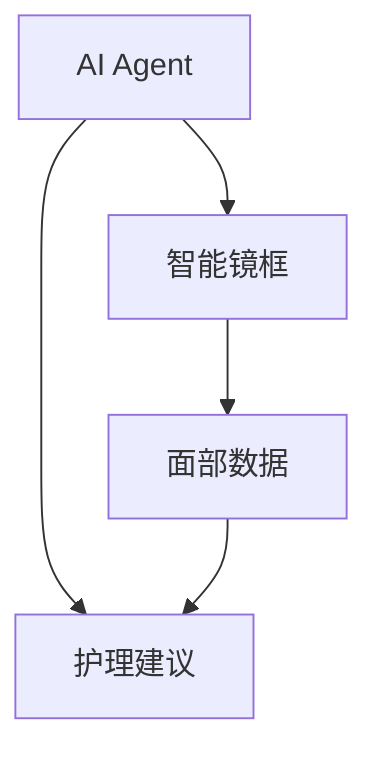
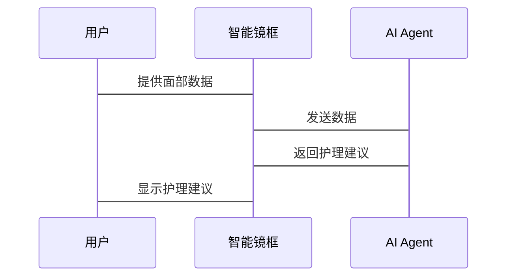

                 


# AI Agent在智能镜框中的面部护理建议

## 关键词：
AI Agent，智能镜框，面部护理，算法原理，系统架构设计，项目实战

## 摘要：
本文深入探讨AI Agent在智能镜框中的应用，特别是如何通过AI技术提供面部护理建议。文章首先介绍AI Agent的基本概念和面部护理的需求，然后详细分析AI Agent的核心概念、算法原理和数学模型。接着，文章从系统架构设计和项目实战的角度，展示如何将AI技术应用于智能镜框中，实现个性化的面部护理建议。最后，本文总结了AI Agent在智能镜框中的应用前景，并提出了未来的研究方向。

---

# 第1章: AI Agent与面部护理的背景介绍

## 1.1 AI Agent的基本概念
### 1.1.1 AI Agent的定义与特点
AI Agent（人工智能代理）是一种能够感知环境、自主决策并执行任务的智能实体。它通过传感器获取信息，利用算法进行分析，并通过执行器与环境交互。AI Agent的特点包括自主性、反应性、目标导向和学习能力。

### 1.1.2 面部护理的基本需求与挑战
面部护理是个人健康管理的重要组成部分，涉及皮肤清洁、保湿、防晒等多个方面。传统面部护理依赖于个人经验或美容专家的建议，存在效率低下、个性化不足的问题。AI技术的引入可以解决这些问题，提供更精准和个性化的护理建议。

### 1.1.3 AI技术在医疗健康领域的应用现状
AI技术在医疗健康领域的应用日益广泛，包括疾病诊断、药物研发、健康管理等。在面部护理方面，AI技术可以通过图像识别、数据分析等手段，帮助用户更好地了解自己的皮肤状况，并提供科学的护理建议。

## 1.2 AI Agent在智能镜框中的应用背景
### 1.2.1 智能镜框的发展历程
智能镜框是一种结合了传统镜框和智能技术的创新产品，能够通过内置的传感器和摄像头采集用户的面部数据，并通过AI技术进行分析和处理。

### 1.2.2 AI Agent在面部护理中的独特优势
AI Agent可以通过实时采集面部数据，结合用户的个人习惯和环境因素，提供个性化的护理建议。相比传统方法，AI Agent能够更精准地识别皮肤问题，并提供科学的解决方案。

### 1.2.3 当前市场与技术的结合点
随着AI技术的快速发展和智能硬件的普及，AI Agent在智能镜框中的应用正逐渐成为现实。市场对个性化、智能化的健康管理工具的需求也在不断增加。

## 1.3 本章小结
本章介绍了AI Agent的基本概念，分析了面部护理的基本需求与挑战，并探讨了AI技术在医疗健康领域的应用现状。最后，本文指出了AI Agent在智能镜框中的应用背景及其独特优势。

---

# 第2章: AI Agent的核心概念与原理

## 2.1 AI Agent的感知能力
### 2.1.1 面部数据的采集与处理
AI Agent通过摄像头和传感器采集用户的面部数据，包括图像、表情、皮肤颜色等。这些数据需要经过预处理和特征提取，以便后续分析。

### 2.1.2 多模态数据的融合与分析
AI Agent可以同时处理多种数据类型，如图像、文本和环境数据，通过多模态数据融合，提高分析的准确性和全面性。

### 2.1.3 面部特征的提取与识别
通过深度学习模型，AI Agent可以从面部数据中提取关键特征，如皮肤纹理、毛孔大小、色斑分布等。

## 2.2 AI Agent的决策机制
### 2.2.1 基于规则的决策系统
基于规则的决策系统通过预定义的规则和条件，生成护理建议。这种方法适用于简单的决策场景。

### 2.2.2 基于机器学习的决策模型
基于机器学习的决策模型通过训练数据，学习用户的面部特征与护理建议之间的关系，生成个性化的护理方案。

### 2.2.3 基于深度学习的决策网络
深度学习模型（如卷积神经网络）可以自动提取面部数据的特征，并通过训练生成更精准的决策结果。

## 2.3 AI Agent的执行能力
### 2.3.1 智能镜框的反馈机制
AI Agent通过智能镜框向用户反馈护理建议，用户可以根据建议调整自己的护理习惯。

### 2.3.2 面部护理建议的生成与优化
AI Agent根据分析结果，生成个性化的护理建议，并通过反馈机制不断优化建议的准确性。

### 2.3.3 用户行为的实时调整与反馈
AI Agent可以根据用户的实时反馈，动态调整护理建议，确保用户的面部护理效果。

## 2.4 核心概念对比表
| 概念 | 属性 | 描述 |
|------|------|------|
| AI Agent | 感知 | 数据采集与处理能力 |
|        | 决策 | 基于数据的分析与推理能力 |
|        | 执行 | 输出护理建议与调整能力 |

## 2.5 实体关系图


---

# 第3章: AI Agent的算法原理

## 3.1 面部数据的采集与处理
### 3.1.1 图像采集与预处理
AI Agent通过摄像头采集用户的面部图像，并进行预处理，如去噪、调整亮度等。

### 3.1.2 基于深度学习的特征提取
通过卷积神经网络（CNN），AI Agent可以从面部图像中提取深层次的特征，如皮肤纹理、色斑分布等。

### 3.1.3 数据增强与标准化
为了提高模型的泛化能力，AI Agent会对训练数据进行数据增强，如旋转、缩放、翻转等，并对数据进行标准化处理。

## 3.2 面部特征的识别与分类
### 3.2.1 基于CNN的图像分类
通过训练CNN模型，AI Agent可以对不同的面部特征进行分类，如皮肤状态、表情识别等。

### 3.2.2 基于RNN的序列建模
对于时间序列数据（如用户的面部护理记录），AI Agent可以使用循环神经网络（RNN）进行建模，捕捉数据中的时序关系。

### 3.2.3 基于SVM的分类器
支持向量机（SVM）是一种常用的分类算法，AI Agent可以通过SVM对不同的面部特征进行分类。

## 3.3 AI Agent的决策模型
### 3.3.1 基于决策树的分类
决策树是一种直观的分类算法，AI Agent可以通过构建决策树模型，对用户的面部特征进行分类。

### 3.3.2 基于随机森林的集成学习
随机森林是一种基于决策树的集成学习方法，通过组合多个决策树的结果，提高分类的准确性和稳定性。

### 3.3.3 基于神经网络的深度学习
深度学习模型（如LSTM、Transformer）可以处理复杂的面部特征，并生成更精准的护理建议。

---

# 第4章: AI Agent的数学模型与公式

## 4.1 基于CNN的面部特征提取
卷积神经网络（CNN）是一种常用的图像处理模型，其基本结构包括卷积层、池化层和全连接层。CNN的数学模型如下：

$$
\text{输入: } x \in \mathbb{R}^{H \times W \times C}
$$

$$
\text{卷积层: } y = \sigma(W \ast x + b)
$$

$$
\text{池化层: } y = \maxpool(y)
$$

$$
\text{全连接层: } y = W_{\text{fc}} y + b_{\text{fc}}
$$

其中，$\sigma$ 是激活函数，$W$ 和 $b$ 是卷积核和偏置，$\maxpool$ 是最大池化操作。

## 4.2 基于SVM的分类
支持向量机（SVM）是一种常用的分类算法，其数学模型如下：

$$
\text{目标函数: } \min_{w, b, \xi} \frac{1}{2} w^T w + C \sum_{i=1}^n \xi_i
$$

$$
\text{约束条件: } y_i (w \cdot x_i + b) \geq 1 - \xi_i, \xi_i \geq 0
$$

其中，$w$ 是权重向量，$b$ 是偏置，$\xi_i$ 是松弛变量，$C$ 是惩罚系数。

---

# 第5章: AI Agent的系统架构设计

## 5.1 问题场景介绍
AI Agent在智能镜框中的应用场景包括面部数据采集、分析和护理建议生成。用户通过智能镜框输入面部数据，AI Agent通过算法处理数据并生成护理建议。

## 5.2 系统功能设计
### 5.2.1 面部数据采集模块
通过摄像头和传感器采集用户的面部图像和生理数据。

### 5.2.2 数据分析模块
利用深度学习模型对采集的数据进行特征提取和分类。

### 5.2.3 护理建议生成模块
根据分析结果生成个性化的护理建议，并通过智能镜框反馈给用户。

## 5.3 系统架构图


## 5.4 系统接口设计
AI Agent与智能镜框之间的接口需要支持数据传输和指令执行。常见的接口包括HTTP API和MQTT协议。

## 5.5 系统交互序列图


---

# 第6章: 项目实战

## 6.1 环境搭建
### 6.1.1 硬件环境
需要一台支持摄像头的设备（如笔记本电脑）和智能镜框。

### 6.1.2 软件环境
安装Python、TensorFlow、OpenCV等开发工具。

## 6.2 核心代码实现
### 6.2.1 面部数据采集
```python
import cv2

def capture_face():
    cap = cv2.VideoCapture(0)
    ret, frame = cap.read()
    if ret:
        cv2.imwrite("face.jpg", frame)
    cap.release()

capture_face()
```

### 6.2.2 面部特征提取
```python
import tensorflow as tf
import cv2

model = tf.keras.models.load_model("face_model.h5")
image = cv2.imread("face.jpg")
image = cv2.resize(image, (224, 224))
image = image / 255.0
prediction = model.predict(tf.expand_dims(image, axis=0))
print("Prediction:", prediction)
```

## 6.3 案例分析
通过实际案例分析，展示AI Agent如何根据面部数据生成护理建议，并验证建议的准确性。

---

# 第7章: 最佳实践与注意事项

## 7.1 最佳实践
### 7.1.1 数据隐私保护
确保用户数据的安全性和隐私性，遵守相关法律法规。

### 7.1.2 系统性能优化
通过优化算法和硬件配置，提高系统的运行效率和响应速度。

## 7.2 小结
AI Agent在智能镜框中的应用前景广阔，通过不断优化算法和系统设计，可以为用户提供更精准和个性化的面部护理建议。

## 7.3 注意事项
### 7.3.1 数据质量
确保采集的面部数据准确性和完整性，避免因数据问题影响分析结果。

### 7.3.2 系统稳定性
定期更新和维护系统，确保AI Agent的稳定性和可靠性。

## 7.4 拓展阅读
推荐相关领域的书籍和论文，帮助读者深入学习AI Agent和面部护理的相关知识。

---

# 作者：AI天才研究院 & 禅与计算机程序设计艺术

---

以上是文章的详细目录和内容概要，希望对您有所帮助！

