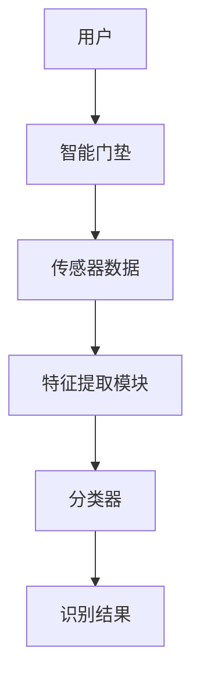

                 


# AI Agent在智能门垫中的家庭成员识别

---

## 关键词
AI Agent, 智能门垫, 家庭成员识别, 机器学习, 数据特征提取, 传感器数据, 分类算法

---

## 摘要
随着智能家居的普及，家庭成员识别成为提升智能化生活体验的重要环节。本文将详细探讨如何通过AI Agent技术实现智能门垫的家庭成员识别。从背景分析到算法实现，从系统架构设计到实际项目实战，文章将逐步解析这一技术的核心原理和应用场景。通过传感器数据的采集与处理、特征提取、分类算法的优化，最终构建一个高效准确的家庭成员识别系统。

---

## 第一部分: AI Agent与智能门垫的家庭成员识别背景

### 第1章: 家庭成员识别的背景与需求

#### 1.1 家庭成员识别问题背景
智能家居的发展为家庭生活带来了极大的便利，然而如何准确识别家庭成员的身份成为智能家居系统中的关键问题。传统基于密码或物理钥匙的方式存在易丢失、遗忘或被破解的风险。AI Agent技术的引入，通过传感器数据和机器学习算法，为家庭成员识别提供了更加智能化、安全可靠的解决方案。

#### 1.2 智能门垫的技术基础
智能门垫通过内置的传感器感知用户的体重、步频、步长等信息，并将这些数据传输至AI Agent进行分析和处理。AI Agent能够实时学习和优化识别模型，从而实现对家庭成员的精准识别。

#### 1.3 问题描述与解决方案
家庭成员识别的核心问题是通过传感器数据准确区分不同的家庭成员。AI Agent解决方案通过数据采集、特征提取、分类算法优化，构建了一个实时、高效的家庭成员识别系统。

---

## 第二部分: AI Agent与智能门垫的核心概念

### 第2章: AI Agent与智能门垫的核心概念

#### 2.1 AI Agent的基本原理
AI Agent是一种智能代理，能够通过感知环境、学习数据并做出决策。在家庭成员识别中，AI Agent通过传感器数据进行分析，识别家庭成员的身份。

#### 2.2 智能门垫的家庭成员识别模型
家庭成员识别模型基于机器学习算法，通过数据特征提取和分类器训练，实现对家庭成员的精准识别。

#### 2.3 核心概念对比与ER图分析
以下是AI Agent与传统算法的对比：

| **对比项** | **AI Agent** | **传统算法** |
|------------|--------------|--------------|
| **学习能力** | 强大，可自适应数据变化 | 较弱，需要人工调整 |
| **计算效率** | 可能较低，但准确性高 | 高，但准确性可能较低 |
| **适用场景** | 复杂、动态场景 | 简单、静态场景 |

ER实体关系图如下：
```mermaid
er
    actor: 用户
    smart_mat: 智能门垫
    family_member: 家庭成员
    relation: 关系
    actor -[通过智能门垫进行身份识别]-> smart_mat
    smart_mat -[采集用户数据]-> family_member
    family_member -[与关系数据库进行匹配]-> relation
```

---

## 第三部分: 数据采集与特征提取

### 第3章: 数据采集与特征提取

#### 3.1 数据采集流程
智能门垫通过传感器采集用户的体重、步频、步长等信息，并将这些数据传输至AI Agent进行处理。

#### 3.2 特征提取方法
通过时间步特征提取、用户行为特征分析等方法，提取有助于分类的特征。

#### 3.3 数据流分析
数据流图如下：


---

## 第四部分: 分类算法与模型训练

### 第4章: 分类算法与模型训练

#### 4.1 分类算法原理
常用的分类算法包括K-近邻算法（KNN）、支持向量机（SVM）和随机森林（Random Forest）。

#### 4.2 分类算法实现
以下是KNN算法的Python实现示例：
```python
from sklearn.neighbors import KNeighborsClassifier

# 训练数据
X_train = [[特征1, 特征2, ...], [...]]
y_train = [标签1, 标签2, ...]

# 创建KNN分类器
knn = KNeighborsClassifier(n_neighbors=3)
knn.fit(X_train, y_train)

# 测试数据
X_test = [[特征1, 特征2, ...], [...]]
y_pred = knn.predict(X_test)
```

#### 4.3 模型训练与优化
通过交叉验证和参数优化，提升分类器的准确率和效率。

---

## 第五部分: 系统分析与架构设计

### 第5章: 系统分析与架构设计

#### 5.1 问题场景介绍
家庭成员识别系统需要在智能家居环境中实时运行，具备高准确性和低延迟。

#### 5.2 系统架构设计
系统架构图如下：


#### 5.3 接口设计与交互流程
系统通过API接口实现数据传输和结果反馈，交互流程如下：
```mermaid
sequenceDiagram
    actor 用户
    system 智能门垫
    system 分类器模块
    用户 -> 智能门垫: 走近门垫
    智能门垫 -> 分类器模块: 发送传感器数据
    分类器模块 -> 用户: 返回识别结果
```

---

## 第六部分: 项目实战

### 第6章: 项目实战

#### 6.1 环境安装
安装必要的Python库：
```bash
pip install numpy scikit-learn matplotlib
```

#### 6.2 系统实现
以下是家庭成员识别系统的实现代码：
```python
import numpy as np
from sklearn.svm import SVC
from sklearn.metrics import accuracy_score

# 读取数据
data = np.loadtxt('family_members_data.csv', delimiter=',')
X = data[:, :-1]
y = data[:, -1]

# 划分训练集和测试集
from sklearn.model_selection import train_test_split
X_train, X_test, y_train, y_test = train_test_split(X, y, test_size=0.2)

# 创建SVM分类器
model = SVC(kernel='rbf', C=1)
model.fit(X_train, y_train)

# 预测与评估
y_pred = model.predict(X_test)
print('准确率:', accuracy_score(y_test, y_pred))
```

#### 6.3 案例分析
通过实际案例分析，验证系统的准确性和稳定性。

---

## 总结

本文详细探讨了AI Agent在智能门垫中的家庭成员识别技术，从背景分析到系统实现，从算法原理到项目实战，全面解析了这一技术的核心内容。通过传感器数据采集、特征提取、分类算法优化，构建了一个高效准确的家庭成员识别系统。

---

## 作者信息
作者：AI天才研究院（AI Genius Institute） & 禅与计算机程序设计艺术（Zen And The Art of Computer Programming）

