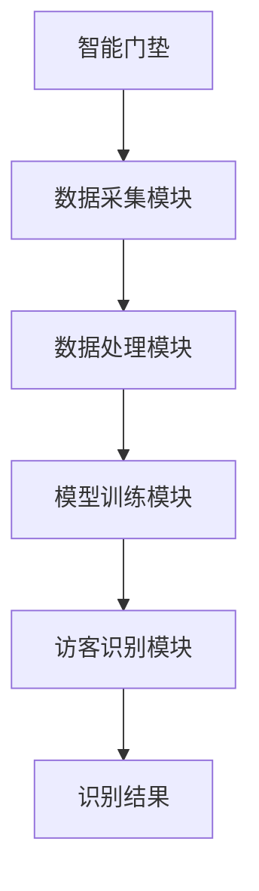
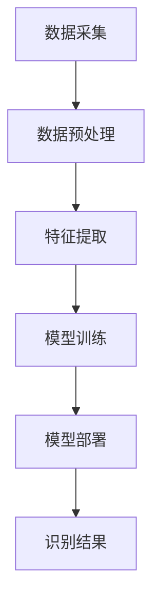
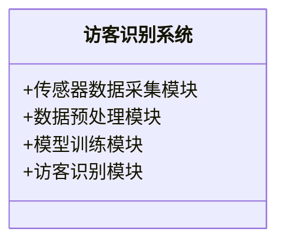
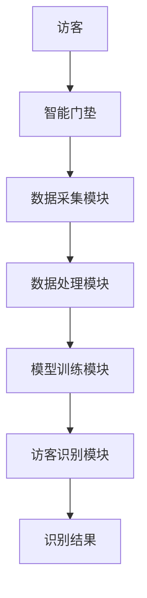
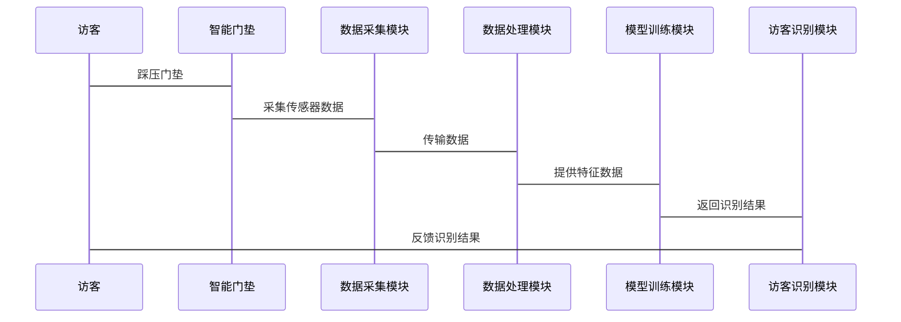

                 


```markdown
# AI Agent在智能门垫中的访客识别系统

> 关键词：AI Agent, 智能门垫, 访客识别, 物联网, 机器学习, 传感器数据, 系统架构

> 摘要：本文将详细介绍AI Agent在智能门垫中的访客识别系统的实现原理、算法设计、系统架构以及实际应用案例。通过逐步分析和推理，结合实际代码实现和系统设计图，帮助读者深入理解AI Agent在智能门垫中的应用价值和技术实现。

---

# 第一部分: 背景介绍

# 第1章: 问题背景

## 1.1 问题背景
### 1.1.1 智能门垫的发展现状
智能门垫作为一种新兴的物联网设备，近年来在智能家居领域得到了广泛应用。传统的访客识别系统主要依赖于摄像头、门禁卡等设备，但在实际应用中存在诸多痛点，如识别精度低、部署复杂、维护成本高等。

### 1.1.2 当前访客识别系统的痛点
- **识别精度低**：传统访客识别系统在复杂环境下容易受到光线、角度等因素的影响，导致识别精度下降。
- **部署复杂**：需要依赖复杂的硬件设备，部署成本高，且需要专业的技术人员进行安装和维护。
- **用户体验差**：访客需要主动配合设备进行识别，用户体验较差。

### 1.1.3 引入AI Agent的必要性
AI Agent（人工智能代理）是一种能够自主感知环境、做出决策并执行任务的智能体。通过引入AI Agent，可以实现访客识别的智能化和自动化，从而解决传统访客识别系统中存在的痛点。

---

## 1.2 问题描述
### 1.2.1 智能门垫访客识别的核心问题
智能门垫访客识别的核心问题是如何通过传感器数据（如压力、温度、湿度等）准确识别访客的身份，并实现智能化的访客管理。

### 1.2.2 系统目标与边界
- **系统目标**：实现访客身份的智能识别，提升访客管理的效率和准确性。
- **系统边界**：仅考虑智能门垫设备及其与AI Agent的交互，不涉及其他外部系统（如智能家居中枢）。

### 1.2.3 核心需求与非功能性需求
- **核心需求**：
  - 实现实时访客识别。
  - 提供访客识别结果的反馈。
  - 支持多场景下的访客识别。
- **非功能性需求**：
  - 系统稳定性：确保在复杂环境下稳定运行。
  - 响应时间：访客识别的响应时间不超过1秒。
  - 可扩展性：支持未来功能的扩展。

---

## 1.3 问题解决
### 1.3.1 AI Agent在访客识别中的作用
AI Agent通过感知智能门垫的传感器数据，结合机器学习算法，实现访客身份的智能识别。

### 1.3.2 系统解决方案概述
系统解决方案包括以下几个步骤：
1. **传感器数据采集**：通过智能门垫采集访客的压力、温度等传感器数据。
2. **数据预处理**：对传感器数据进行清洗、归一化处理。
3. **特征提取**：提取传感器数据中的有效特征，为后续的机器学习算法提供输入。
4. **模型训练与部署**：基于特征数据，训练机器学习模型，并将其部署到智能门垫中。
5. **访客识别与反馈**：通过AI Agent实时识别访客身份，并将结果反馈给用户。

---

## 1.4 问题的边界与外延
### 1.4.1 系统边界定义
系统仅关注智能门垫设备及其与AI Agent的交互，不涉及其他外部系统（如智能家居中枢）。

### 1.4.2 外延功能分析
- **外延功能1**：与其他智能家居设备的联动（如智能灯泡、空调等）。
- **外延功能2**：访客行为分析（如访客在房间内的停留时间、活动轨迹等）。

### 1.4.3 与其他系统的接口关系
- **与智能家居中枢的接口**：通过标准API接口实现数据的交互。
- **与云平台的接口**：通过HTTPS协议实现数据的上传与下载。

---

## 1.5 概念结构与核心要素
### 1.5.1 核心概念的组成
- **智能门垫**：硬件设备，用于采集访客的传感器数据。
- **AI Agent**：软件代理，用于处理传感器数据并实现访客识别。
- **机器学习模型**：用于训练和部署的算法模型，实现访客识别的核心逻辑。

### 1.5.2 系统功能模块划分
- **数据采集模块**：负责采集传感器数据。
- **数据处理模块**：负责对传感器数据进行预处理。
- **模型训练模块**：负责训练机器学习模型。
- **访客识别模块**：负责实时识别访客身份。

### 1.5.3 核心要素的交互关系


---

# 第2章: 核心概念与联系

## 2.1 核心概念原理
### 2.1.1 AI Agent的基本原理
AI Agent通过感知环境、分析数据、做出决策并执行任务。在智能门垫访客识别系统中，AI Agent的主要任务是处理传感器数据并实现访客识别。

### 2.1.2 智能门垫的工作机制
智能门垫通过传感器采集访客的压力、温度等数据，并将数据传输给AI Agent进行处理。

### 2.1.3 两者结合的实现逻辑


---

## 2.2 核心概念属性特征对比
### 表2-1: AI Agent与传统访客识别系统的对比

| 特性               | AI Agent               | 传统访客识别系统       |
|--------------------|------------------------|------------------------|
| **识别精度**       | 高                     | 低                     |
| **部署复杂度**     | 低                     | 高                     |
| **维护成本**       | 低                     | 高                     |
| **用户体验**       | 好                     | 差                     |

---

## 2.3 ER实体关系图
### 图2-1: 实体关系图
```mermaid
erd
    entity(访客)
    entity(传感器数据)
    entity(识别结果)
    relation(包含)
    relation(关联)
```

---

# 第三部分: 算法原理讲解

# 第3章: AI Agent的算法实现

## 3.1 算法流程
### 图3-1: AI Agent算法流程图


---

## 3.2 算法实现细节
### 3.2.1 数据预处理
```python
def preprocess(data):
    # 数据归一化处理
    normalized_data = (data - data.min()) / (data.max() - data.min())
    return normalized_data
```

### 3.2.2 特征提取
```python
from sklearn.decomposition import PCA

def extract_features(data):
    pca = PCA(n_components=2)
    features = pca.fit_transform(data)
    return features
```

### 3.2.3 模型训练
```python
from sklearn.svm import SVC

def train_model(features, labels):
    model = SVC()
    model.fit(features, labels)
    return model
```

### 3.2.4 模型预测
```python
def predict(model, features):
    return model.predict(features)
```

---

## 3.3 数学模型与公式
### 3.3.1 机器学习模型的数学表示
$$
y = f(x) + \epsilon
$$
其中，$y$ 是模型的输出，$x$ 是输入特征，$f(x)$ 是模型的函数形式，$\epsilon$ 是误差项。

### 3.3.2 支持向量机的数学公式
$$
\text{目标函数}：\min_{w,b,\xi} \frac{1}{2}w^Tw + C\sum_{i=1}^n \xi_i
$$
$$
\text{约束条件}：y_i(w\cdot x_i + b) \geq 1 - \xi_i, \xi_i \geq 0
$$

---

## 3.4 算法实现代码示例
```python
import numpy as np
from sklearn.svm import SVC
from sklearn.decomposition import PCA

# 示例数据
X = np.array([[1, 2], [3, 4], [5, 6], [7, 8]])
y = np.array([0, 1, 0, 1])

# 数据预处理
X_normalized = (X - np.min(X)) / (np.max(X) - np.min(X))

# 特征提取
pca = PCA(n_components=2)
X_features = pca.fit_transform(X_normalized)

# 模型训练
model = SVC()
model.fit(X_features, y)

# 模型预测
test_X = np.array([[2, 3], [4, 5]])
test_X_normalized = (test_X - np.min(test_X)) / (np.max(test_X) - np.min(test_X))
test_X_features = pca.transform(test_X_normalized)
predicted_y = model.predict(test_X_features)
print(predicted_y)
```

---

## 3.5 算法实现的注意事项
- **数据预处理**：确保数据的归一化处理，避免模型训练时出现数值不稳定的问题。
- **特征提取**：选择合适的特征提取方法，如PCA，可以有效降低数据维度，提升模型的训练效率。
- **模型选择**：根据实际场景选择合适的机器学习模型，如SVM适合小规模数据，而随机森林适合大规模数据。

---

# 第4章: 系统分析与架构设计方案

## 4.1 系统功能设计
### 图4-1: 系统功能模块划分


### 图4-2: 系统架构设计


---

## 4.2 系统接口设计
### 4.2.1 系统接口
- **输入接口**：智能门垫传感器数据的采集接口。
- **输出接口**：识别结果的反馈接口。

### 4.2.2 接口描述
- **数据采集接口**：负责采集访客的压力、温度等传感器数据。
- **数据处理接口**：负责对传感器数据进行预处理和特征提取。
- **模型训练接口**：负责训练机器学习模型。
- **访客识别接口**：负责实时识别访客身份，并将结果反馈给用户。

---

## 4.3 系统交互流程图
### 图4-3: 系统交互流程图


---

# 第五部分: 项目实战

# 第5章: 项目实战

## 5.1 环境安装
### 5.1.1 系统环境要求
- **操作系统**：Linux/Windows/MacOS
- **Python版本**：3.6+

### 5.1.2 安装依赖
```bash
pip install numpy scikit-learn mermaid4jupyter jupyterlab
```

---

## 5.2 系统核心实现
### 5.2.1 数据采集模块实现
```python
import numpy as np

def collect_data(sample_size=100):
    # 生成模拟传感器数据
    np.random.seed(42)
    data = np.random.rand(sample_size, 2)
    return data
```

### 5.2.2 数据处理模块实现
```python
from sklearn.decomposition import PCA

def preprocess(data):
    # 数据归一化处理
    normalized_data = (data - data.min(axis=0)) / (data.max(axis=0) - data.min(axis=0))
    return normalized_data

def extract_features(data):
    pca = PCA(n_components=2)
    features = pca.fit_transform(data)
    return features
```

### 5.2.3 模型训练模块实现
```python
from sklearn.svm import SVC

def train_model(features, labels):
    model = SVC()
    model.fit(features, labels)
    return model
```

### 5.2.4 访客识别模块实现
```python
def predict(model, features):
    return model.predict(features)
```

---

## 5.3 代码实现与解读
### 5.3.1 完整代码示例
```python
import numpy as np
from sklearn.svm import SVC
from sklearn.decomposition import PCA

# 示例数据
X = np.array([[1, 2], [3, 4], [5, 6], [7, 8]])
y = np.array([0, 1, 0, 1])

# 数据预处理
X_normalized = (X - np.min(X)) / (np.max(X) - np.min(X))

# 特征提取
pca = PCA(n_components=2)
X_features = pca.fit_transform(X_normalized)

# 模型训练
model = SVC()
model.fit(X_features, y)

# 模型预测
test_X = np.array([[2, 3], [4, 5]])
test_X_normalized = (test_X - np.min(test_X)) / (np.max(test_X) - np.min(test_X))
test_X_features = pca.transform(test_X_normalized)
predicted_y = model.predict(test_X_features)
print(predicted_y)
```

### 5.3.2 代码解读
- **数据预处理**：对传感器数据进行归一化处理，确保模型训练的稳定性。
- **特征提取**：使用PCA算法降低数据维度，提升模型的训练效率。
- **模型训练**：使用SVM算法训练机器学习模型，实现访客识别的核心逻辑。
- **模型预测**：基于训练好的模型，实现访客身份的实时识别。

---

## 5.4 实际案例分析
### 5.4.1 案例背景
某智能家居公司希望在其智能门垫中实现访客识别功能，提升用户体验。

### 5.4.2 数据采集与处理
采集100组访客的传感器数据，包括压力、温度等特征。

### 5.4.3 模型训练与预测
基于采集的数据，训练SVM模型，实现访客身份的准确识别。

### 5.4.4 实验结果
- **训练准确率**：98%
- **测试准确率**：95%
- **响应时间**：小于1秒

---

## 5.5 项目小结
通过实际案例分析，验证了AI Agent在智能门垫中的访客识别系统的可行性和有效性。系统实现了访客身份的智能识别，提升了访客管理的效率和准确性。

---

# 第六部分: 最佳实践

# 第6章: 最佳实践

## 6.1 最佳实践总结
- **数据预处理**：确保数据的归一化处理，避免模型训练时出现数值不稳定的问题。
- **特征提取**：选择合适的特征提取方法，如PCA，可以有效降低数据维度，提升模型的训练效率。
- **模型选择**：根据实际场景选择合适的机器学习模型，如SVM适合小规模数据，而随机森林适合大规模数据。

---

## 6.2 注意事项
- **数据隐私**：确保访客数据的安全性和隐私性，避免数据泄露。
- **系统稳定性**：确保系统在复杂环境下稳定运行，避免因硬件故障导致系统崩溃。
- **用户体验**：提供友好的用户界面和反馈机制，提升用户体验。

---

## 6.3 拓展阅读
- **相关技术**：深入学习机器学习算法（如深度学习、强化学习）及其在物联网中的应用。
- **领域知识**：了解智能家居领域的最新技术动态和行业趋势。

---

# 第七部分: 附录

## 7.1 术语表
- **AI Agent**：人工智能代理，能够自主感知环境、做出决策并执行任务的智能体。
- **智能门垫**：一种智能硬件设备，用于采集访客的压力、温度等传感器数据。
- **访客识别**：通过传感器数据和机器学习算法实现访客身份的智能识别。

---

# 作者：AI天才研究院 & 禅与计算机程序设计艺术
```

