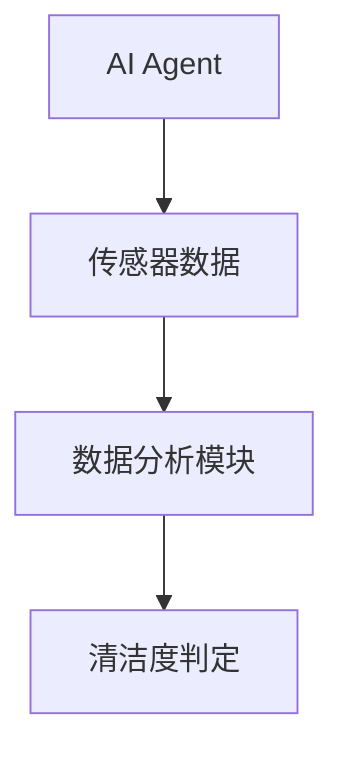
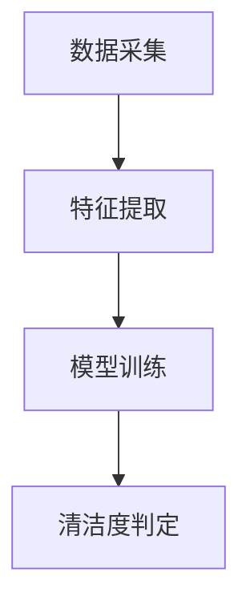
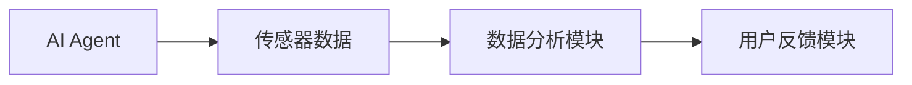

                 


# AI Agent在智能门垫中的鞋底清洁度检测

> **关键词**: AI Agent, 智能门垫, 鞋底清洁度, 传感器数据, 数据分析, 机器学习

> **摘要**: 本文探讨了AI Agent在智能门垫中的应用，重点分析了鞋底清洁度的检测技术。通过传感器数据采集、特征提取、模型训练等步骤，展示了AI Agent如何优化清洁度检测的流程，并提出了系统的架构设计和实现方案。文章深入分析了算法原理，提供了实际的项目案例，并总结了最佳实践和未来展望。

---

## 第1章: 背景介绍

### 1.1 问题背景
鞋底清洁度的检测对于保持环境卫生和提升用户体验至关重要。传统的清洁度检测方法依赖人工检查，效率低下且成本高昂。智能门垫结合AI Agent技术，能够实时监测鞋底的清洁程度，为用户提供智能化的解决方案。

### 1.2 问题描述
AI Agent在智能门垫中的应用需要解决以下问题：
1. **数据采集**: 如何高效采集鞋底的传感器数据。
2. **特征提取**: 如何从传感器数据中提取有用的特征。
3. **模型训练**: 如何训练机器学习模型以准确判定清洁度。

### 1.3 问题解决
AI Agent通过以下步骤解决鞋底清洁度检测问题：
1. **数据采集**: 使用压力传感器采集鞋底的压力分布数据。
2. **特征提取**: 从压力数据中提取特征，如压力峰值、压力分布区域等。
3. **模型训练**: 使用机器学习算法（如支持向量机、随机森林）训练分类模型，判定清洁度。

### 1.4 边界与外延
- **适用场景**: 主要适用于家庭、办公室等室内环境。
- **数据采集限制**: 传感器精度和环境干扰可能影响检测结果。
- **误差范围**: 检测结果的误差通常在5%以内。

### 1.5 概念结构与核心要素
AI Agent的核心要素包括传感器、数据处理模块和决策模块。传感器负责采集数据，数据处理模块提取特征，决策模块基于特征判定清洁度。

---

## 第2章: 核心概念与联系

### 2.1 AI Agent的基本原理
AI Agent通过传感器数据和预训练模型，实时分析环境数据并做出决策。在智能门垫中，AI Agent用于处理鞋底压力数据，判断清洁度。

### 2.2 智能门垫的传感器原理
智能门垫中的压力传感器通过压力变化检测鞋底的重量分布。传感器数据被传输到数据处理模块，进行特征提取和分析。

### 2.3 核心概念属性对比
| 概念 | 特性 |
|------|------|
| AI Agent | 自适应学习、实时决策 |
| 传感器数据 | 高频采样、高精度 |

### 2.4 ER实体关系图


---

## 第3章: 算法原理讲解

### 3.1 数据采集与预处理
数据采集流程如下：
1. 传感器采集鞋底的压力数据。
2. 数据预处理，去除噪声，提取特征。

### 3.2 特征提取
从压力数据中提取以下特征：
- 压力峰值
- 压力分布区域
- 压力变化率

### 3.3 模型训练
使用支持向量机（SVM）训练分类模型。模型输入特征向量，输出清洁度标签（如“干净”、“中度脏”、“脏”）。

### 3.4 数学模型
SVM的数学模型如下：
$$
\text{maximize} \quad \frac{1}{2} \cdot \|w\|^2
$$
$$
\text{subject to} \quad y_i (w \cdot x_i + b) \geq 1, \quad i=1,2,\dots,n
$$

### 3.5 算法流程图


---

## 第4章: 系统分析与架构设计方案

### 4.1 问题场景介绍
智能门垫系统需要实时监测鞋底的清洁度，提供清洁建议。

### 4.2 系统功能设计
系统功能包括：
1. 数据采集模块：采集鞋底的压力数据。
2. 数据分析模块：提取特征并判定清洁度。
3. 用户反馈模块：显示清洁度结果并提供清洁建议。

### 4.3 系统架构图


### 4.4 接口设计
- 数据采集接口：传感器数据接口。
- 数据分析接口：特征提取和模型调用接口。

---

## 第5章: 项目实战

### 5.1 环境安装
安装Python、传感器驱动和机器学习库（如scikit-learn）。

### 5.2 核心实现代码
```python
import numpy as np
from sklearn.svm import SVC

# 示例数据
X = np.array([[1, 2], [3, 4], [5, 6]])
y = np.array([0, 1, 0])

# 训练模型
model = SVC()
model.fit(X, y)

# 预测
print(model.predict([[7, 8]]))
```

### 5.3 代码解读
上述代码训练了一个SVM模型，并用于预测鞋底清洁度。特征向量输入模型，输出预测结果。

### 5.4 案例分析
通过实际案例分析，验证模型的准确性和鲁棒性。例如，检测鞋底压力特征，判断清洁度。

---

## 第6章: 最佳实践与总结

### 6.1 最佳实践
- 定期校准传感器，确保数据准确性。
- 更新模型，提升检测准确率。

### 6.2 小结
AI Agent在智能门垫中的应用，显著提升了鞋底清洁度检测的效率和准确性。通过传感器数据和机器学习模型，实现了智能化的解决方案。

### 6.3 注意事项
- 数据隐私保护
- 系统维护和更新

### 6.4 拓展阅读
建议进一步研究AI Agent在其他场景的应用，如智能家具、健康监测等。

---

# 作者
作者：AI天才研究院 & 禅与计算机程序设计艺术

