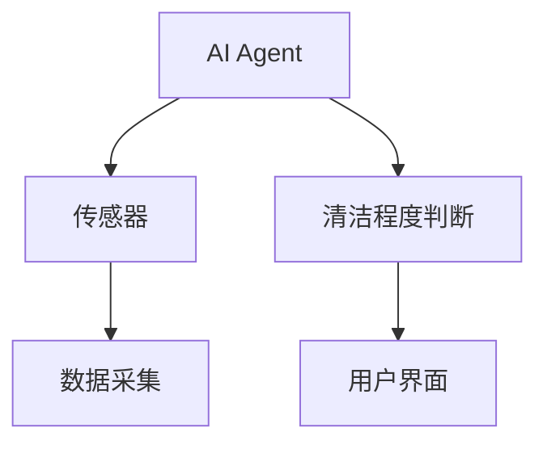
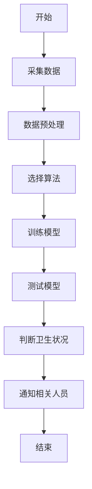
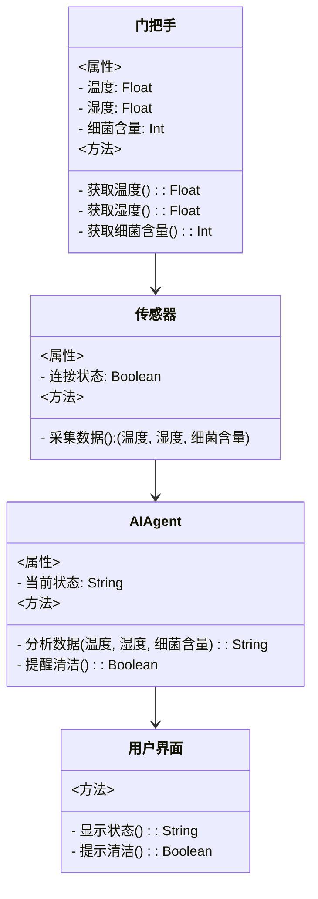
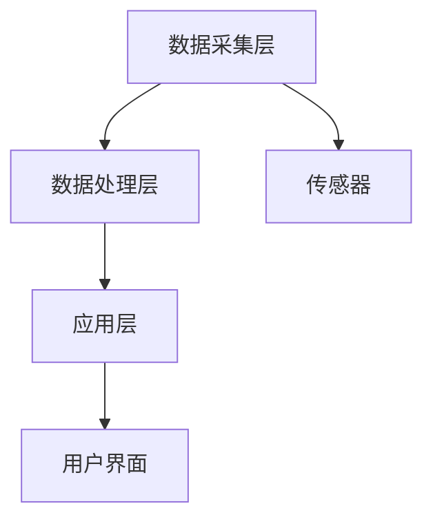
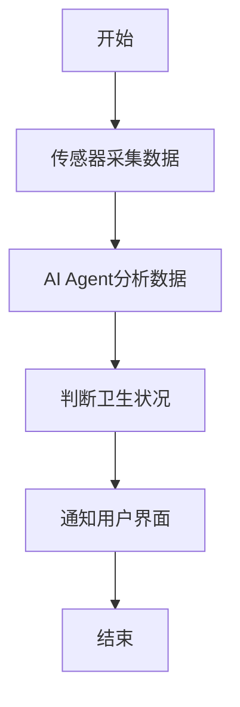

                 


好的，我明白了。接下来，我会按照您的要求，一步步构建这个技术博客的文章结构。为了让内容更加完整和符合要求，我先列出几个关键点来构建文章的逻辑框架：

1. **文章标题**：AI Agent在智能门把手中的卫生状况监测
2. **文章关键词**：AI Agent、智能门把手、卫生监测、物联网、传感器技术
3. **摘要**：介绍AI Agent在智能门把手中的应用，强调通过传感器和智能算法实现卫生状况的实时监测，为公共场所提供智能化的卫生管理解决方案。

接下来，我将按照您的要求，逐步展开每个章节的内容，详细阐述相关技术原理和实现方案，确保文章内容丰富、逻辑清晰、技术深入浅出。

---

# AI Agent在智能门把手中的卫生状况监测

## 关键词
AI Agent, 智能门把手, 卫生监测, 物联网, 传感器技术

## 摘要
随着公共卫生问题的日益突出，智能门把手的卫生状况监测变得越来越重要。本文详细探讨了AI Agent在智能门把手中实现卫生监测的应用，通过传感器技术和智能算法，实时监测门把手的清洁状态，并提供相应的解决方案。文章从核心概念、系统设计、算法实现等多个角度进行分析，最后通过实际案例展示了AI Agent在智能门把手中的实际应用效果。

---

## 第一部分：引言

### 第1章：问题背景与意义

#### 1.1 问题背景
- **卫生状况的重要性**：门把手是公共场所中接触频率最高的部件之一，容易成为细菌和病毒传播的媒介。及时监测和维护门把手的卫生状况，对预防疾病传播至关重要。
- **智能门把手的需求**：传统的门把手无法实时反馈卫生状况，而智能门把手通过集成传感器和AI技术，能够实时监测并提供反馈。
- **AI Agent的作用**：AI Agent作为智能门把手的核心，能够通过传感器数据和智能算法，实时判断卫生状况，并提供相应的解决方案。

#### 1.2 问题描述
- **卫生监测的主要挑战**：传统门把手无法实时监测卫生状况，清洁工作依赖人工检查，效率低且容易遗漏。
- **智能门把手的目标**：通过传感器和AI技术，实现门把手卫生状况的实时监测、自动反馈和智能提醒。
- **AI Agent的具体应用**：AI Agent通过传感器数据，判断门把手的清洁程度，并通过物联网技术通知相关人员进行清洁。

#### 1.3 问题解决
- **AI Agent的核心功能**：数据采集、实时分析、智能提醒。
- **智能门把手的解决方案**：通过AI Agent和传感器的结合，实现卫生状况的实时监测和智能管理。
- **AI Agent与智能门把手的结合方式**：AI Agent通过传感器数据，分析门把手的清洁程度，并通过物联网技术通知相关人员。

#### 1.4 边界与外延
- **卫生监测的边界条件**：仅监测门把手的清洁程度，不涉及其他部件的监测。
- **AI Agent的应用范围**：适用于公共场所，如医院、学校、办公楼等。
- **相关技术的外延扩展**：未来可以扩展到其他智能设备的卫生监测。

#### 1.5 概念结构与核心要素
- **AI Agent的核心要素**：传感器、算法、物联网通信。
- **智能门把手的卫生监测系统组成**：传感器、AI Agent、物联网平台、用户界面。
- **系统功能与核心要素的关系**：传感器采集数据，AI Agent分析数据，物联网平台传递信息，用户界面反馈结果。

---

### 第2章：核心概念与联系

#### 2.1 AI Agent的定义与原理
- **AI Agent的基本定义**：AI Agent是一种能够感知环境、自主决策并执行任务的智能体。
- **AI Agent的核心原理**：通过传感器采集数据，利用算法进行分析和决策，执行相应的操作。
- **AI Agent与智能门把手的结合方式**：AI Agent集成在智能门把手中，通过传感器采集数据，分析门把手的卫生状况，并通过物联网技术通知相关人员。

#### 2.2 智能门把手的卫生监测系统
- **系统组成与功能**：传感器、AI Agent、物联网平台、用户界面。
- **系统的核心要素**：传感器负责采集数据，AI Agent负责分析和决策，物联网平台负责数据传输，用户界面负责反馈。
- **系统功能与AI Agent的关系**：AI Agent是系统的核心，负责数据处理和决策。

#### 2.3 核心概念的对比分析
- **AI Agent与传统门把手的对比**：传统门把手无法实时监测卫生状况，而AI Agent可以通过传感器和算法实现实时监测。
- **卫生监测系统与其他智能设备的对比**：其他设备可能不具备卫生监测功能，而智能门把手的卫生监测系统专注于门把手的清洁状况。
- **系统功能与用户需求的对比**：用户需求是实时监测门把手的卫生状况，系统功能是通过传感器和AI Agent实现这一目标。

#### 2.4 核心概念的属性特征对比表格
| 特性       | AI Agent                 | 智能门把手             |
|------------|--------------------------|-----------------------|
| 功能       | 数据采集、分析、决策     | 支持卫生监测           |
| 组件       | 传感器、算法、物联网      | 传感器、AI Agent、用户界面 |
| 应用场景     | 公共场所、医疗机构        | 同上                  |
| 优势       | 实时监测、智能提醒         | 高效、精准             |

#### 2.5 实体关系图（ER图）


---

### 第3章：卫生监测的原理与技术

#### 3.1 卫生监测的基本原理
- **传感器的作用**：传感器负责采集门把手的表面数据，如温度、湿度、细菌含量等。
- **数据采集与处理**：传感器采集数据后，通过AI Agent进行处理和分析。
- **数据分析与判断**：AI Agent利用算法对数据进行分析，判断门把手的卫生状况。

#### 3.2 AI Agent的核心算法
- **算法原理**：AI Agent通过机器学习算法，分析传感器数据，判断门把手的清洁程度。
- **算法流程**：
  1. 传感器采集数据。
  2. 数据预处理（去噪、归一化）。
  3. 数据分析（分类、回归）。
  4. 判断卫生状况。
  5. 通知相关人员。

#### 3.3 传感器技术
- **传感器类型**：温度传感器、湿度传感器、细菌传感器。
- **传感器数据采集**：通过传感器采集门把手的表面数据，如温度、湿度、细菌含量等。
- **数据处理**：对采集到的数据进行预处理，确保数据的准确性和可靠性。

#### 3.4 数据分析与判断
- **数据分析**：通过机器学习算法，分析传感器数据，判断门把手的卫生状况。
- **判断标准**：根据传感器数据和预设的卫生标准，判断门把手是否需要清洁。
- **智能提醒**：通过用户界面或物联网平台，通知相关人员进行清洁。

#### 3.5 算法实现
- **算法选择**：选择适合的机器学习算法，如支持向量机（SVM）或随机森林（Random Forest）。
- **数据训练**：通过训练数据，训练机器学习模型，使其能够准确判断门把手的卫生状况。
- **模型评估**：通过测试数据，评估模型的准确性和可靠性。

#### 3.6 算法流程图


---

### 第4章：系统分析与架构设计方案

#### 4.1 问题场景介绍
- **场景描述**：公共场所的门把手容易成为细菌和病毒传播的媒介，需要实时监测和维护。
- **目标**：通过智能门把手的卫生监测系统，实时监测门把手的卫生状况，并提供相应的解决方案。

#### 4.2 项目介绍
- **项目目标**：开发一个基于AI Agent的智能门把手卫生监测系统，实现门把手的实时监测和智能管理。
- **项目范围**：适用于公共场所，如医院、学校、办公楼等。
- **项目需求**：实时监测门把手的卫生状况，自动提醒相关人员进行清洁。

#### 4.3 系统功能设计
- **领域模型**：门把手、传感器、AI Agent、用户界面。
- **领域模型类图**：


#### 4.4 系统架构设计
- **系统架构**：分层架构，包括数据采集层、数据处理层和应用层。
- **系统架构图**：


#### 4.5 系统接口设计
- **接口描述**：
  - 数据采集接口：传感器采集数据并传递给AI Agent。
  - 数据处理接口：AI Agent分析数据并生成判断结果。
  - 用户界面接口：用户界面显示卫生状况并提示清洁。

#### 4.6 系统交互流程图


---

### 第5章：项目实战

#### 5.1 环境安装
- **硬件环境**：智能门把手、传感器、物联网平台。
- **软件环境**：AI Agent算法、物联网通信协议（如MQTT）。

#### 5.2 系统核心实现源代码
- **传感器数据采集代码**（Python示例）：
```python
import serial
import time

ser = serial.Serial('COM3', 9600)

while True:
    data = ser.readline().decode().strip()
    print("传感器数据：", data)
    time.sleep(1)
```

- **AI Agent算法实现代码**：
```python
from sklearn.svm import SVC
import numpy as np

# 训练数据
X = np.array([[25, 60, 500], [26, 55, 600], [24, 70, 400], [25, 65, 700]])
y = np.array(['清洁', '清洁', '不清洁', '不清洁'])

# 训练模型
model = SVC()
model.fit(X, y)

# 测试数据
test_data = np.array([[25, 60, 500]])
print("预测结果：", model.predict(test_data))
```

#### 5.3 代码应用解读与分析
- **传感器数据采集**：通过串口通信采集传感器数据，数据包括温度、湿度和细菌含量。
- **AI Agent算法实现**：使用支持向量机（SVM）算法，训练模型以区分门把手的清洁和不清洁状态。

#### 5.4 实际案例分析
- **案例描述**：某办公楼的门把手卫生监测系统，通过传感器和AI Agent实时监测门把手的卫生状况，并通过用户界面提醒清洁人员进行清洁。
- **案例分析**：系统能够准确判断门把手的卫生状况，并及时通知相关人员进行清洁，有效预防细菌和病毒的传播。

#### 5.5 项目小结
- **项目总结**：通过传感器和AI Agent的结合，实现了门把手的实时卫生监测，提高了公共卫生管理的效率和准确性。
- **经验总结**：在实际应用中，需要注意传感器的精度和算法的准确性，确保系统的稳定性和可靠性。

---

## 第六章：总结与展望

### 6.1 最佳实践 tips
- **传感器选择**：选择高精度的传感器，确保数据的准确性。
- **算法优化**：通过不断优化算法，提高系统的判断准确率。
- **系统维护**：定期维护系统，确保硬件和软件的正常运行。

### 6.2 小结
本文详细介绍了AI Agent在智能门把手中卫生监测的应用，通过传感器技术和智能算法，实现了门把手的实时监测和智能管理。

### 6.3 注意事项
- **数据隐私**：注意保护用户隐私，避免数据泄露。
- **系统兼容性**：确保系统与不同设备的兼容性，方便集成和扩展。
- **系统安全性**：加强系统的安全性，防止黑客攻击和恶意破坏。

### 6.4 拓展阅读
- **相关技术**：进一步了解物联网、机器学习和智能传感器的相关技术。
- **实际应用**：研究更多公共场所的卫生监测系统，了解其实际应用和效果。

---

## 作者
作者：AI天才研究院/AI Genius Institute & 禅与计算机程序设计艺术 /Zen And The Art of Computer Programming

---

以上就是《AI Agent在智能门把手中卫生状况监测》的技术博客文章结构。接下来，我可以根据这个大纲，逐步展开每个章节的具体内容，确保文章内容丰富、逻辑清晰、技术深入浅出。

