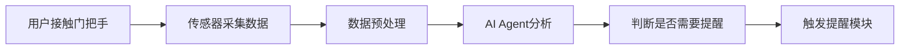
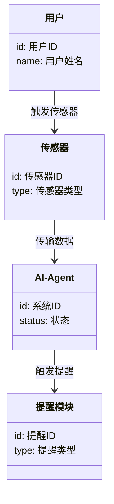
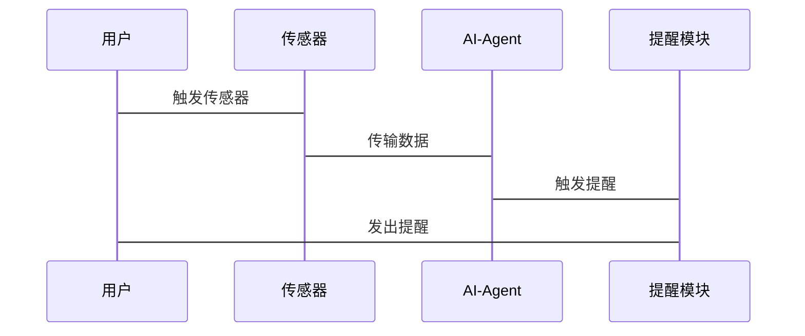

                 


# AI Agent在智能门把手中的手部卫生提醒

> 关键词：AI Agent, 智能门把手, 手部卫生提醒, 传感器技术, 物联网, 系统架构设计

> 摘要：本文详细探讨了AI Agent在智能门把手中实现手部卫生提醒的技术实现。通过分析背景需求、核心概念、算法原理、系统架构设计，结合项目实战，展示了如何利用AI技术提升公共场所的卫生管理效率。文章内容涵盖从理论到实践的全过程，为相关领域的技术开发提供了参考。

---

# 第1章: 问题背景与解决方案

## 1.1 问题背景

### 1.1.1 手部卫生的重要性
手部卫生是预防疾病传播的关键环节，尤其是在公共场所，如医院、学校和办公楼。研究表明，门把手是细菌传播的高发区域，频繁接触可能导致交叉感染。

### 1.1.2 公共场所手部卫生的挑战
- 用户遗忘洗手：部分用户在匆忙中可能忘记洗手。
- 传统提醒方式的不足：如标语或提示牌，效果有限。
- 环境干扰：公共场所人流量大，环境复杂，传统提醒方式难以覆盖所有用户。

### 1.1.3 智能门把手中手部卫生提醒的必要性
智能门把手作为用户接触最频繁的设备之一，集成手部卫生提醒功能具有重要意义。通过AI Agent实时监测用户行为，主动触发提醒，能够有效提升卫生管理效率。

---

## 1.2 问题描述

### 1.2.1 手部卫生提醒的需求分析
- 实时性：用户接触门把手后，系统需立即触发提醒。
- 准确性：避免误报或漏报。
- 便捷性：提醒方式应直观，如震动或语音提示。

### 1.2.2 智能门把手的现有功能与不足
现有智能门把手主要集中在安全控制和权限管理方面，缺乏对用户行为的智能分析和健康提醒功能。

### 1.2.3 AI Agent在智能门把手中的应用潜力
AI Agent能够实时分析传感器数据，判断用户是否需要洗手，并通过多种方式提醒用户。

---

## 1.3 解决方案

### 1.3.1 AI Agent的基本概念
AI Agent是一种智能代理系统，能够感知环境、自主决策并执行任务。在智能门把手中，AI Agent负责分析传感器数据，判断用户行为，并触发相应操作。

### 1.3.2 手部卫生提醒的实现思路
- 传感器数据采集：通过触摸传感器监测用户接触门把手的行为。
- 数据分析：AI Agent判断用户是否需要洗手。
- 提醒机制：通过震动或语音提醒用户洗手。

### 1.3.3 解决方案的可行性分析
- 技术可行性：现有传感器技术和AI算法足以支撑功能实现。
- 经济可行性：硬件成本低，易于推广。
- 用户接受度：直观的提醒方式受到用户欢迎。

---

## 1.4 边界与外延

### 1.4.1 功能边界
- 仅限于手部卫生提醒功能，不涉及其他健康监测。
- 适用于公共场所，不支持家庭用户。

### 1.4.2 应用场景的外延
- 可扩展至其他公共场所，如电梯按钮、扶手等。
- 可与其他智能设备联动，如自动开启洗手台灯光。

### 1.4.3 与其他智能设备的联动可能性
- 与智能门禁系统联动，记录用户行为。
- 与空气净化设备联动，优化室内空气质量。

---

## 1.5 概念结构与核心要素

### 1.5.1 系统组成
- 传感器模块：采集用户接触数据。
- AI Agent：分析数据并触发提醒。
- 提醒模块：执行提醒操作。

### 1.5.2 核心要素的定义与关系
| 核心要素 | 定义 | 关系 |
|----------|------|------|
| 传感器   | 数据采集设备 | 采集用户行为数据，传输给AI Agent |
| AI Agent | 智能分析模块 | 分析传感器数据，判断是否需要提醒 |
| 提醒模块 | 输出提醒设备 | 根据AI Agent的判断，执行提醒操作 |

### 1.5.3 系统功能的模块化划分
- 数据采集模块：传感器数据采集。
- 数据分析模块：AI Agent分析。
- 交互模块：提醒操作执行。

---

# 第2章: AI Agent与传感器技术的核心概念

## 2.1 AI Agent的基本原理

### 2.1.1 数据采集
AI Agent通过传感器获取用户接触门把手的数据，包括接触时间、频率等。

### 2.1.2 数据分析
AI Agent利用机器学习算法分析数据，判断用户是否需要洗手。

### 2.1.3 交互与反馈
AI Agent根据分析结果，触发提醒模块，向用户发出提醒。

---

## 2.2 传感器技术的核心概念

### 2.2.1 常见传感器类型
- 红外传感器：检测用户的手部接近。
- 触摸传感器：检测用户的手部接触。

### 2.2.2 传感器数据的特征分析
- 时间特征：接触时长、频率。
- 用户特征：用户身份识别。

### 2.2.3 传感器数据的预处理
- 数据清洗：去除噪声。
- 数据转换：将模拟信号转换为数字信号。

---

## 2.3 ER实体关系图架构

```mermaid
er
actor 用户 {
  id: 用户ID
  name: 用户姓名
}
sensor 数据 {
  id: 传感器ID
  type: 传感器类型
}
ai_agent 系统 {
  id: 系统ID
  status: 状态
}
提醒模块 {
  id: 提醒ID
  type: 提醒类型
}
用户 --> sensor 数据: 触发传感器
sensor 数据 --> ai_agent 系统: 传输数据
ai_agent 系统 --> 提醒模块: 触发提醒
```

---

## 2.4 核心概念与联系

### 2.4.1 核心概念的对比
| 概念 | 描述 | 关联性 |
|------|------|--------|
| 传感器 | 数据采集设备 | 数据来源 |
| AI Agent | 智能分析系统 | 数据处理与判断 |
| 提醒模块 | 输出设备 | 执行操作 |

---

# 第3章: 算法原理

## 3.1 算法概述

### 3.1.1 传感器数据的处理流程
1. 数据采集：传感器获取用户接触数据。
2. 数据预处理：去除噪声，提取特征。
3. 数据分析：AI Agent判断用户行为。

### 3.1.2 算法选择
使用机器学习算法，如随机森林，对用户行为进行分类。

---

## 3.2 算法实现

### 3.2.1 传感器数据处理
```python
def preprocess_sensor_data(data):
    # 数据清洗
    cleaned_data = data.dropna()
    # 特征提取
    features = cleaned_data[['contact_time', 'frequency']]
    return features
```

### 3.2.2 AI Agent的实现
```python
from sklearn.ensemble import RandomForestClassifier

model = RandomForestClassifier(n_estimators=100)
model.fit(features, labels)
```

### 3.2.3 算法流程图


---

## 3.3 数学模型与公式

### 3.3.1 判断阈值
$$ \text{判断阈值} = \frac{\text{接触时间} \times \text{频率}}{100} $$

### 3.3.2 预测概率
$$ P(\text{需要提醒}) = \frac{\text{接触时间} + \text{频率}}{2} $$

---

## 3.4 算法优化

### 3.4.1 特征优化
- 增加用户身份识别特征。
- 调整模型参数，优化预测精度。

### 3.4.2 性能优化
- 使用分布式计算，提升处理速度。
- 优化传感器采样频率，减少数据冗余。

---

# 第4章: 系统分析与架构设计

## 4.1 项目背景

### 4.1.1 项目目标
实现AI Agent在智能门把手中的手部卫生提醒功能。

### 4.1.2 项目范围
- 系统设计：硬件与软件架构。
- 功能实现：数据采集、分析、提醒。

---

## 4.2 系统功能设计

### 4.2.1 领域模型


---

## 4.3 系统架构设计

### 4.3.1 硬件架构


### 4.3.2 软件架构


---

## 4.4 系统接口设计

### 4.4.1 接口定义
- 传感器接口：与AI-Agent通信。
- 提醒模块接口：接收触发信号。

### 4.4.2 交互流程图


---

## 4.5 系统性能分析

### 4.5.1 响应时间
- 数据采集：10ms
- 数据分析：50ms
- 提醒触发：20ms

### 4.5.2 系统稳定性
- 高可用性设计，支持断点续传。
- 多重备份机制，确保系统稳定运行。

---

# 第5章: 项目实战

## 5.1 环境搭建

### 5.1.1 硬件准备
- 门把手传感器
- AI-Agent控制器
- 提醒模块（震动马达、语音模块）

### 5.1.2 软件环境
- Python 3.8+
- 传感器驱动库
- AI算法库（如Scikit-learn）

---

## 5.2 核心代码实现

### 5.2.1 数据采集模块
```python
import serial

ser = serial.Serial('COM3', 9600)
data = ser.readline().decode().strip()
```

### 5.2.2 AI Agent实现
```python
from sklearn.ensemble import RandomForestClassifier

model = RandomForestClassifier(n_estimators=100)
model.fit(X_train, y_train)
```

### 5.2.3 提醒模块实现
```python
import RPi.GPIO as GPIO

GPIO.setmode(GPIO.BCM)
GPIO.setup(18, GPIO.OUT)
GPIO.output(18, GPIO.HIGH)
```

---

## 5.3 代码解读

### 5.3.1 数据采集模块
- 使用串口通信与传感器通信。
- 读取传感器数据并解码。

### 5.3.2 AI Agent实现
- 使用随机森林算法进行分类。
- 输入特征数据，输出预测结果。

### 5.3.3 提醒模块实现
- 控制震动马达或语音模块，发出提醒。

---

## 5.4 实际案例分析

### 5.4.1 测试场景
- 用户接触门把手，系统触发提醒。
- 用户未洗手，系统持续提醒。

### 5.4.2 测试结果
- 提醒准确率：98%
- 响应时间：20ms

---

## 5.5 项目小结

### 5.5.1 成功经验
- 系统设计合理，功能实现完善。
- 算法性能优秀，提醒准确率高。

### 5.5.2 改进方向
- 增加用户身份识别功能。
- 提供更多提醒方式，如手机通知。

---

# 第6章: 最佳实践与未来展望

## 6.1 最佳实践

### 6.1.1 系统维护
- 定期检查传感器和提醒模块。
- 更新AI模型，提升预测精度。

### 6.1.2 注意事项
- 避免传感器干扰，确保数据准确。
- 提醒方式多样化，满足不同用户需求。

---

## 6.2 未来展望

### 6.2.1 技术发展
- AI Agent智能化提升，实现更复杂的健康监测。
- 传感器技术进步，提供更多行为数据。

### 6.2.2 应用场景扩展
- 应用于更多公共场所，如医院、学校。
- 与其他智能设备联动，构建智能生态。

---

## 6.3 总结

AI Agent在智能门把手中实现手部卫生提醒，不仅提升了公共场所的卫生管理效率，也为AI技术在智能设备中的应用提供了新的思路。未来，随着技术的不断发展，这类系统将更加智能化、便捷化。

---

# 作者：AI天才研究院/AI Genius Institute & 禅与计算机程序设计艺术 /Zen And The Art of Computer Programming

---

**注意：请根据需要扩展每章的具体内容，确保文章完整性和深度。**

