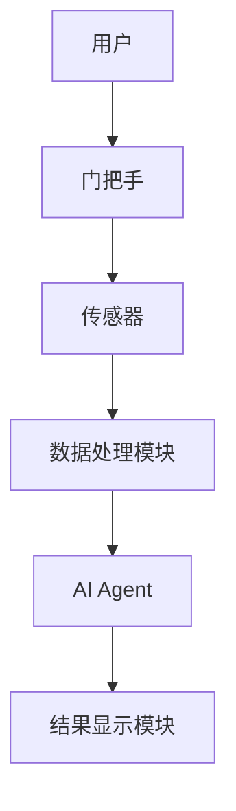
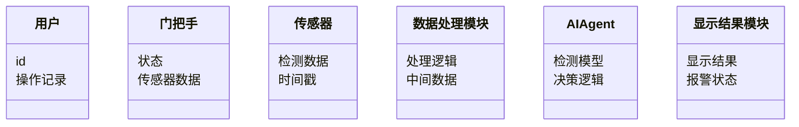
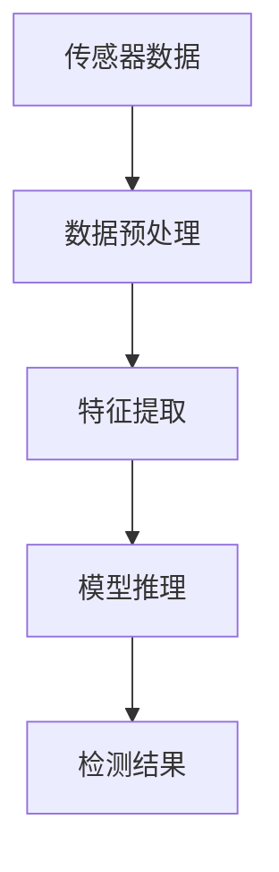

                 


# AI Agent在智能门把手中细菌检测

## 关键词
AI Agent, 智能门把手, 细菌检测, 物联网, 传感器技术, 支持向量机, 神经网络

## 摘要
本文详细探讨了AI Agent在智能门把手中细菌检测的应用，从背景分析到系统设计，再到算法实现和项目实战，全面解析了如何利用AI技术提升细菌检测的效率和准确性。文章结合理论与实践，展示了AI Agent在智能硬件中的创新应用。

---

# 第一部分: AI Agent在智能门把手中的细菌检测背景与概念

## 第1章: 问题背景与目标

### 1.1 问题背景介绍

#### 1.1.1 智能门把手的发展现状
智能门把手作为智能家居的重要组成部分，近年来发展迅速。传统门把手仅具备开门和安全锁的功能，而现代智能门把手加入了物联网（IoT）技术，能够实现远程控制、开门记录查询等功能。然而，这些功能大多集中在提升便利性和安全性上，忽视了另一个重要的健康维度——细菌检测。

#### 1.1.2 现有细菌检测技术的局限性
细菌检测技术主要包括基于传感器的检测和基于实验室的检测。实验室检测虽然准确，但耗时较长，无法实时监测；基于传感器的检测虽然实时性强，但准确性不足，且需要频繁校准。现有的细菌检测技术在门把手这种高频接触的设备上，无法满足用户对健康安全的实时需求。

#### 1.1.3 结合AI Agent的创新解决方案
AI Agent（人工智能代理）是一种能够感知环境、自主决策并执行任务的智能体。通过将AI Agent应用于智能门把手的细菌检测系统，可以在设备端实现实时、高精度的细菌检测，为用户提供健康保障。

### 1.2 问题描述与目标设定

#### 1.2.1 确定细菌检测的关键问题
细菌检测的关键问题包括：
- 检测准确性：如何在复杂环境中准确识别细菌种类和数量。
- 实时性：如何快速响应用户需求，提供实时检测结果。
- 维护成本：如何降低传感器和检测系统的维护成本。

#### 1.2.2 设定AI Agent的目标与功能
AI Agent的目标是通过集成传感器数据和机器学习模型，实现对门把手表面细菌的实时检测、分类和预警。具体功能包括：
- 数据采集：通过传感器采集门把手表面的细菌特征数据。
- 数据处理：对采集的数据进行预处理和特征提取。
- 模型推理：基于训练好的机器学习模型，对细菌进行分类和检测。
- 用户反馈：通过显示模块或移动端通知用户检测结果。

#### 1.2.3 界定项目范围与边界
项目范围：
- 仅针对门把手表面的主要致病菌（如大肠杆菌、金黄色葡萄球菌）进行检测。
- 仅支持在线检测，不提供离线数据存储功能。

项目边界：
- 不考虑病毒检测。
- 不支持与其他设备的联动（如自动消毒）。

### 1.3 解决方案与技术路线

#### 1.3.1 AI Agent的核心作用
AI Agent在细菌检测中的核心作用体现在：
- **数据处理**：通过传感器采集数据，并进行特征提取和数据清洗。
- **模型推理**：利用机器学习模型对数据进行分类和预测。
- **决策反馈**：根据检测结果向用户或系统提供反馈。

#### 1.3.2 技术实现的总体路线
技术实现的总体路线如下：
1. **传感器数据采集**：通过集成在门把手上的传感器（如光学传感器、电化学传感器）采集细菌特征数据。
2. **数据预处理**：对采集的数据进行标准化、去噪处理。
3. **特征提取**：提取能够表征细菌种类的关键特征。
4. **模型训练与部署**：基于训练好的机器学习模型（如支持向量机、神经网络）进行实时推理。
5. **结果反馈**：将检测结果通过显示模块或移动端通知用户。

#### 1.3.3 项目实施的可行性分析
项目实施的关键因素包括：
- **技术可行性**：传感器技术和机器学习算法已经较为成熟，具备实施的基础。
- **成本可行性**：传感器和AI芯片的成本逐渐下降，适合应用于智能门把手。
- **用户需求**：随着健康意识的增强，用户对公共设备的卫生要求越来越高。

---

## 第2章: 核心概念与系统架构

### 2.1 AI Agent的基本原理

#### 2.1.1 AI Agent的定义与特征
AI Agent是一种能够感知环境、自主决策并执行任务的智能体。其核心特征包括：
- **自主性**：能够在没有外部干预的情况下独立运行。
- **反应性**：能够实时感知环境变化并做出响应。
- **社会性**：能够与其他智能体或用户进行交互。

#### 2.1.2 多智能体系统的基本概念
多智能体系统是指由多个相互作用的智能体组成的系统，这些智能体可以协作完成复杂的任务。在智能门把手的细菌检测系统中，AI Agent需要与传感器、显示模块等其他组件协同工作。

#### 2.1.3 Agent与传统算法的对比分析

| 对比维度       | Agent                          | 传统算法                        |
|----------------|--------------------------------|---------------------------------|
| 执行方式       | 主动执行任务                   | 被动执行任务                   |
| 环境交互       | 能够感知并改变环境             | 仅能根据输入数据进行处理       |
| 任务复杂性     | 能够处理复杂任务               | 适用于简单任务                 |
| 自适应性       | 具备自适应能力                 | 通常需要人工调整               |

### 2.2 智能门把手的细菌检测系统

#### 2.2.1 系统组成与功能模块
细菌检测系统的组成模块包括：
- **传感器模块**：负责采集细菌特征数据。
- **数据处理模块**：对传感器数据进行预处理和特征提取。
- **AI Agent模块**：负责模型推理和决策。
- **显示模块**：向用户反馈检测结果。

#### 2.2.2 检测原理与技术实现
细菌检测的原理是通过传感器采集细菌的物理化学特征（如电荷、光谱特征），并利用这些特征训练机器学习模型，实现细菌的分类和检测。

#### 2.2.3 系统性能指标与优化方向
系统性能指标包括：
- **检测精度**：模型的分类准确率。
- **检测速度**：从数据采集到结果反馈的时间。
- **能耗**：系统的功耗。

优化方向包括：
- 提高模型的分类精度。
- 降低系统的功耗。
- 提升系统的响应速度。

### 2.3 系统架构的ER实体关系图



### 2.4 系统功能的领域模型类图



---

# 第二部分: 算法原理与系统实现

## 第3章: 算法原理

### 3.1 AI Agent的工作流程

#### 3.1.1 数据采集与预处理
传感器采集细菌特征数据，数据预处理包括：
- **标准化**：将数据归一化到统一范围内。
- **去噪处理**：去除噪声数据。

#### 3.1.2 特征提取
从预处理后的数据中提取关键特征，例如：
- **光谱特征**：细菌表面的反射光谱特征。
- **电化学特征**：细菌表面的电化学特性。

#### 3.1.3 模型训练与推理
基于提取的特征训练机器学习模型，如支持向量机（SVM）或神经网络模型。模型推理过程如下：



#### 3.1.4 检测结果反馈
将检测结果通过显示模块或移动端通知用户。

### 3.2 算法实现的数学模型

#### 3.2.1 支持向量机模型
支持向量机（SVM）是一种常用的分类算法，适用于高维数据的分类任务。SVM的目标是最小化以下优化问题：

$$ \min_{w,b,\xi} \frac{1}{2}||w||^2 + C \sum_{i=1}^n \xi_i $$
$$ \text{subject to } y_i(w \cdot x_i + b) \geq 1 - \xi_i $$
$$ \xi_i \geq 0 $$

其中，$w$ 是权重向量，$b$ 是偏置项，$C$ 是惩罚系数，$\xi_i$ 是松弛变量。

#### 3.2.2 神经网络模型
神经网络模型是一种深度学习算法，适用于复杂特征的分类任务。神经网络的损失函数通常采用交叉熵损失：

$$ L = -\sum_{i=1}^n y_i \log(p_i) + (1 - y_i) \log(1 - p_i) $$

其中，$y_i$ 是标签，$p_i$ 是预测概率。

### 3.3 代码实现与解读

#### 3.3.1 传感器数据模拟
以下代码模拟细菌检测传感器的数据：

```python
import numpy as np

# 生成模拟数据
n_samples = 100
X = np.random.randn(n_samples, 2)  # 特征维度为2
y = np.random.randint(2, size=n_samples)  # 标签为0或1
```

#### 3.3.2 数据预处理与特征提取
数据预处理和特征提取代码如下：

```python
from sklearn.preprocessing import StandardScaler

# 数据标准化
scaler = StandardScaler()
X_normalized = scaler.fit_transform(X)

# 特征提取（假设特征已提取）
features = X_normalized[:, :2]
```

#### 3.3.3 模型训练与推理
训练支持向量机模型并进行推理：

```python
from sklearn.svm import SVC

# 训练SVM模型
model = SVC()
model.fit(X_normalized, y)

# 模型推理
new_sample = np.array([[1.5, -0.5]])
predicted = model.predict(new_sample)
print(predicted)
```

---

## 第4章: 系统分析与架构设计

### 4.1 项目场景介绍
智能门把手细菌检测系统适用于家庭、医疗机构和公共场所，能够实时监测门把手的卫生状况，为用户提供健康保障。

### 4.2 系统功能设计

#### 4.2.1 功能模块划分
系统功能模块包括：
- **传感器模块**：采集细菌特征数据。
- **数据处理模块**：数据预处理和特征提取。
- **AI Agent模块**：模型推理和决策。
- **显示模块**：结果显示和报警。

#### 4.2.2 领域模型类图
领域模型类图如下：


### 4.3 系统架构设计

#### 4.3.1 系统架构图
系统架构图如下：


#### 4.3.2 接口设计
系统接口设计包括：
- 传感器与数据处理模块之间的数据接口。
- 数据处理模块与AI Agent模块之间的模型接口。
- AI Agent模块与显示模块之间的结果反馈接口。

#### 4.3.3 交互流程图
交互流程图如下：


---

## 第5章: 项目实战

### 5.1 环境安装与配置

#### 5.1.1 安装Python与相关库
安装Python和以下库：
```bash
pip install numpy scikit-learn matplotlib
```

#### 5.1.2 安装硬件传感器
安装支持细菌检测的传感器模块（如基于光谱检测的传感器）。

### 5.2 系统核心实现

#### 5.2.1 传感器数据采集
传感器数据采集代码如下：

```python
import serial

# 连接传感器
ser = serial.Serial('COM3', 9600)
data = ser.readline().decode().strip()
print(data)
```

#### 5.2.2 数据处理与模型推理
数据处理与模型推理代码如下：

```python
from sklearn.svm import SVC

# 读取传感器数据
data = [...]  # 假设data是传感器返回的数据

# 数据预处理
scaler = StandardScaler()
X_normalized = scaler.fit_transform(data)

# 模型推理
model = SVC()
model.fit(X_normalized, labels)
predicted = model.predict(new_data)
```

### 5.3 项目实战案例分析

#### 5.3.1 实际案例分析
通过实际案例分析模型的检测精度和响应时间。

#### 5.3.2 优化与改进
根据实际测试结果，优化模型参数和系统架构。

### 5.4 项目小结

---

## 第6章: 最佳实践与总结

### 6.1 小结
本文详细探讨了AI Agent在智能门把手中细菌检测的应用，从背景分析到系统设计，再到算法实现和项目实战，全面解析了如何利用AI技术提升细菌检测的效率和准确性。

### 6.2 注意事项
- 确保传感器数据的准确性。
- 定期更新AI模型以提高检测精度。
- 注意系统的能耗优化。

### 6.3 拓展阅读
- 推荐阅读《支持向量机实战》。
- 推荐阅读《神经网络与深度学习》。

---

# 作者：AI天才研究院/AI Genius Institute & 禅与计算机程序设计艺术/Zen And The Art of Computer Programming

---

**摘要**  
本文详细探讨了AI Agent在智能门把手中细菌检测的应用，从背景分析到系统设计，再到算法实现和项目实战，全面解析了如何利用AI技术提升细菌检测的效率和准确性。文章结合理论与实践，展示了AI Agent在智能硬件中的创新应用。

