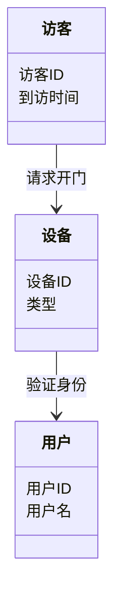

                 


# AI Agent在智能门把手中的访客识别

> 关键词：AI Agent，智能门锁，访客识别，深度学习，人脸识别，安全系统

> 摘要：本文探讨AI Agent在智能门锁中的访客识别技术，涵盖背景、原理、系统设计、项目实现和最佳实践，旨在提供全面的技术指导。

---

## 第一部分：背景介绍

### 第1章：问题背景与描述

#### 1.1 问题背景
传统门禁系统依赖密码或钥匙，存在易丢失和被复制的风险，难以应对访客管理的复杂性。

#### 1.2 问题描述
访客管理需要高效、安全的解决方案，传统方式在便捷性和安全性上均有不足。

#### 1.3 解决方案
引入AI Agent技术，通过人脸识别和行为分析实现智能访客识别，提升门禁系统的安全性和便利性。

#### 1.4 边界与外延
限定于住宅和办公室场景，支持远程开门请求，暂不考虑企业级系统集成。

### 第2章：AI Agent与智能门锁的结合

#### 2.1 AI Agent基本概念
AI Agent具备感知、决策和执行能力，能够独立完成任务。

#### 2.2 智能门锁定义
集成AI技术的门锁，支持多种身份验证方式，实现智能化管理。

#### 2.3 访客识别目标
准确识别合法访客，拒绝未经授权的访问，确保用户安全。

---

## 第二部分：核心概念与联系

### 第3章：AI Agent的基本原理

#### 3.1 感知层
通过摄像头和传感器采集访客特征，如人脸、指纹和声音。

#### 3.2 决策层
利用机器学习模型判断访客身份，生成访问权限。

#### 3.3 执行层
根据决策结果，执行开门或拒绝操作。

### 第4章：核心概念对比

#### 4.1 表格对比
| 技术 | 优缺点 | 适用场景 |
|------|--------|----------|
| 人脸识别 | 准确率高，非接触 | 室内、光线充足环境 |
| 行为分析 | 实时监控，异常检测 | 公共区域 |

#### 4.2 ER图
```mermaid
er
  entity 访客 {
    id 访客ID
    name 姓名
    time 到访时间
  }
  entity 用户 {
    id 用户ID
    name 用户名
  }
  entity 设备 {
    id 设备ID
    type 设备类型
  }
  relation 访问记录 {
    访客.访客ID --> 设备.设备ID
    访客.访客ID --> 用户.用户ID
  }
```

---

## 第三部分：算法原理与数学模型

### 第5章：算法原理

#### 5.1 深度学习模型
使用ResNet提取人脸特征，构建分类器进行身份识别。

#### 5.2 分类器设计
采用支持向量机（SVM）进行分类，优化识别准确率。

### 第6章：数学模型

#### 6.1 特征提取
$$ \text{特征向量} = \text{ReLU}(Wx + b) $$

#### 6.2 分类器损失函数
$$ L = -\sum_{i} y_i \log p_i + (1 - y_i) \log (1 - p_i) $$

---

## 第四部分：系统分析与架构设计

### 第7章：系统功能设计

#### 7.1 功能模块
- 用户认证模块：验证用户身份。
- 访客识别模块：处理访客请求。
- 系统管理：日志记录和监控。

### 第8章：架构设计

#### 8.1 分层架构


---

## 第五部分：项目实战

### 第9章：环境搭建

#### 9.1 安装依赖
安装TensorFlow、OpenCV和Flask框架。

### 第10章：核心代码实现

#### 10.1 人脸识别代码
```python
import cv2
import face_recognition

# 加载预训练模型
model = face_recognition.load_model()

# 读取图像
image = cv2.imread('visitor.jpg')
face_locations = face_recognition.face_locations(image)

# 提取特征
face_encodings = face_recognition.face_encodings(image, face_locations)
```

### 第11章：案例分析
分析实际案例，展示系统在不同场景下的表现和优化。

---

## 第六部分：总结与展望

### 第12章：最佳实践

#### 12.1 注意事项
确保数据安全，定期更新模型。

### 第13章：未来展望
探索更先进的AI技术，提升识别准确率和响应速度。

---

作者：AI天才研究院 & 禅与计算机程序设计艺术

