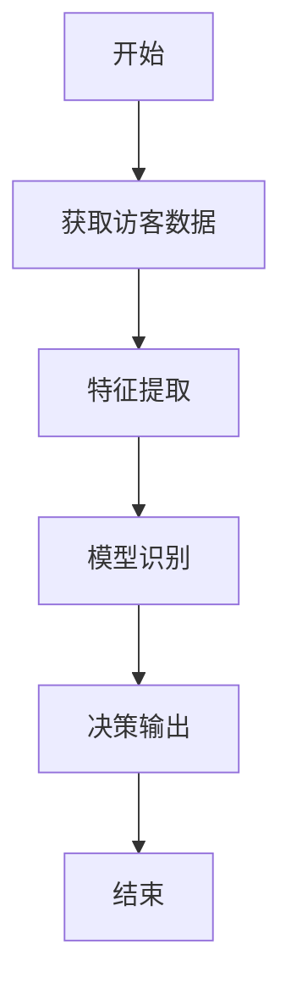
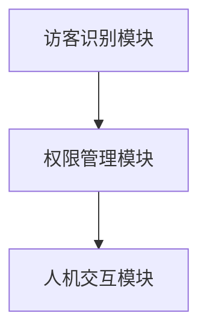
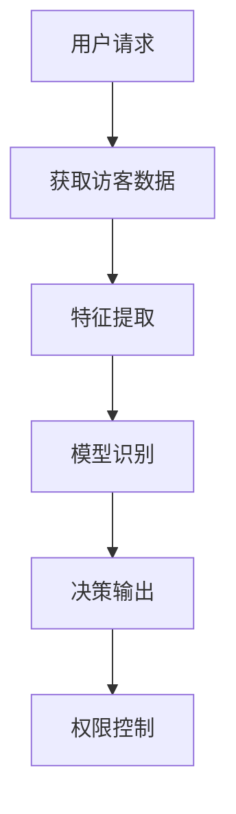
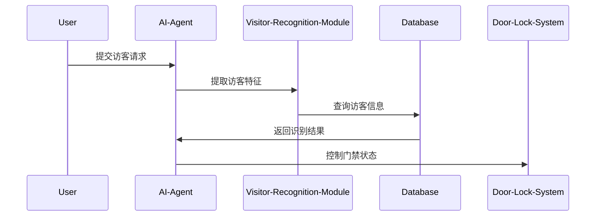

                 


# AI Agent在智能门把手中访客身份识别

## 关键词
智能门把、AI Agent、访客识别、身份验证、人工智能、安全系统

## 摘要
本文详细探讨了AI Agent在智能门把手中进行访客身份识别的技术原理和实现方案。从问题背景到系统架构，从算法原理到项目实战，系统地分析了AI Agent在智能门禁系统中的应用，提出了基于AI的访客识别解决方案，并通过实际案例展示了该方案的可行性和优势。

---

# 第1章: AI Agent在智能门把手中访客身份识别的背景与概念

## 1.1 问题背景
### 1.1.1 智能门禁系统的发展历程
传统门禁系统依赖于机械锁和钥匙，存在管理复杂、安全性低的问题。随着技术进步，电子门禁系统逐渐普及，但仍面临访客管理不便、身份识别单一等痛点。

### 1.1.2 当前访客身份识别的痛点
- 传统门禁系统依赖固定权限，无法灵活处理临时访客。
- 人工登记访客信息效率低，且存在安全隐患。
- 多种身份验证方式（如人脸识别、指纹识别）难以统一管理。

### 1.1.3 AI Agent在智能门禁中的应用潜力
AI Agent（人工智能代理）具备自主决策、多任务处理的能力，可以有效解决访客识别中的复杂问题。

## 1.2 问题描述
### 1.2.1 访客身份识别的核心问题
如何快速、准确地识别访客身份，并确保系统安全性。

### 1.2.2 智能门把手中身份识别的关键挑战
- 多种身份验证方式的集成与协调。
- 实时性要求高，需快速响应访客请求。
- 系统安全性要求高，需防止恶意攻击。

### 1.2.3 AI Agent在访客识别中的具体应用场景
- 通过人脸识别技术快速验证访客身份。
- 结合指纹识别、身份证扫描等多种方式提高识别准确性。
- 实时监控访客行为，识别异常情况。

## 1.3 问题解决与边界
### 1.3.1 AI Agent如何解决访客识别问题
AI Agent可以协调多种身份验证技术，优化识别流程，提升系统安全性。

### 1.3.2 问题的边界与适用范围
- 适用于企业、家庭等多种场景。
- 适用于需要高安全性的门禁系统。
- 适用于需要快速响应的访客管理场景。

### 1.3.3 相关概念的外延与限制
- 外延：AI Agent可以与其他智能设备（如摄像头、传感器）联动。
- 限制：受硬件性能和网络条件的限制。

## 1.4 核心概念结构
### 1.4.1 概念属性对比表
| 概念 | 属性 | 描述 |
|------|------|------|
| AI Agent | 智能性 | 自主决策能力 |
| 访客身份识别 | 数据源 | 人脸、指纹等 |
| 智能门把 | 交互界面 | 用户操作界面 |

### 1.4.2 ER实体关系图
```mermaid
entity User {
  id: string
  name: string
  role: string
}
entity VisitRecord {
  id: string
  user_id: string
  timestamp: datetime
}
```

## 1.5 本章小结
本章介绍了AI Agent在智能门把手中访客身份识别的背景，分析了当前存在的问题和挑战，并提出了AI Agent的应用潜力和解决方案。

---

# 第2章: AI Agent的核心原理与算法

## 2.1 AI Agent的基本原理
### 2.1.1 AI Agent的定义与分类
AI Agent是一种能够感知环境并采取行动以实现目标的智能体。根据功能可分为简单反射型、基于模型的反应型、目标驱动型和效用驱动型。

### 2.1.2 基于AI的访客识别算法概述
访客识别算法通常包括特征提取、模型训练、识别推理三个阶段。

### 2.1.3 AI Agent的决策机制
AI Agent通过多源数据融合，结合上下文信息，做出最优决策。

## 2.2 算法原理与流程
### 2.2.1 访客识别算法流程图


## 2.3 算法实现代码示例
```python
def visitor_recognition(data):
    # 特征提取
    features = extract_features(data)
    # 模型预测
    prediction = model.predict(features)
    return prediction
```

## 2.4 数学模型与公式
### 2.4.1 识别概率公式
$$ P(\text{识别正确}) = \frac{\text{正确识别数}}{\text{总样本数}} $$

### 2.4.2 识别算法的优化
$$ \text{损失函数} = \sum_{i=1}^{n} (y_i - \hat{y}_i)^2 $$

## 2.5 本章小结
本章详细介绍了AI Agent的核心原理，包括定义、分类、决策机制，并通过流程图和代码示例展示了访客识别算法的实现过程。

---

# 第3章: 智能门把系统架构与设计

## 3.1 系统功能设计
### 3.1.1 系统功能模块划分
- 访客识别模块：负责采集和识别访客信息。
- 权限管理模块：管理访客权限和访问记录。
- 人机交互模块：提供用户操作界面。

### 3.1.2 模块之间的关系


### 3.1.3 系统功能流程图


## 3.2 系统架构设计
### 3.2.1 系统架构图


## 3.3 接口与交互设计
### 3.3.1 接口设计
- 访客识别接口：接收访客数据，返回识别结果。
- 权限控制接口：根据识别结果控制门禁状态。

### 3.3.2 交互设计


## 3.4 本章小结
本章从系统架构的角度，详细设计了智能门把的访客识别系统，包括功能模块划分、架构设计和接口交互设计。

---

# 第4章: 项目实战

## 4.1 环境安装
### 4.1.1 系统要求
- 操作系统：Windows 10或更高版本，或Linux系统。
- 硬件要求：支持AI计算的硬件，如GPU。
- 软件要求：Python 3.8以上，TensorFlow或PyTorch框架。

## 4.2 核心实现
### 4.2.1 访客识别模块实现
```python
import cv2
import numpy as np

def extract_features(image):
    # 图像预处理
    gray = cv2.cvtColor(image, cv2.COLOR_BGR2GRAY)
    faces = face_cascade.detectMultiScale(gray, 1.1, 4)
    features = []
    for (x, y, w, h) in faces:
        features.append(gray[y:y+h, x:x+w])
    return features
```

### 4.2.2 AI Agent决策模块实现
```python
class AI-Agent:
    def __init__(self):
        self.model = load_model('face_recognition.h5')
    
    def decide(self, features):
        prediction = self.model.predict(features)
        return prediction
```

## 4.3 案例分析
### 4.3.1 案例背景
某企业部署智能门禁系统，使用AI Agent进行访客识别。

### 4.3.2 案例实现
```python
# 示例代码
agent = AI-Agent()
visitor_data = capture_image()
features = extract_features(visitor_data)
result = agent.decide(features)
print(result)
```

## 4.4 项目小结
本章通过实际案例展示了AI Agent在智能门把中的应用，详细实现了访客识别模块和决策模块。

---

# 第5章: 最佳实践与总结

## 5.1 小结
AI Agent在智能门把中的应用显著提升了访客识别的效率和安全性。

## 5.2 注意事项
- 确保数据安全，防止用户信息泄露。
- 定期更新模型，提升识别准确率。
- 优化系统性能，确保快速响应。

## 5.3 拓展阅读
推荐阅读《深度学习入门》和《人工智能系统设计》等书籍，深入理解AI Agent的技术细节。

---

# 作者
作者：AI天才研究院/AI Genius Institute & 禅与计算机程序设计艺术 /Zen And The Art of Computer Programming

