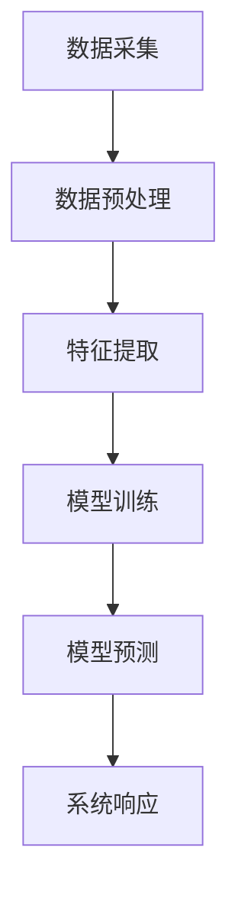
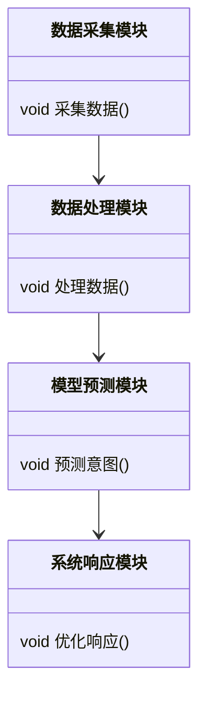

                 


# AI Agent在智能门禁系统中的访客意图预测

## 关键词：智能门禁系统，AI Agent，访客意图预测，机器学习，意图识别

## 摘要：本文深入探讨了AI Agent在智能门禁系统中的应用，特别是访客意图预测方面。通过分析门禁系统的核心问题，结合AI Agent的技术优势，提出了一套基于机器学习的访客意图预测模型，并详细阐述了系统的架构设计和实现方案。本文还通过实际案例分析，展示了该方案的有效性和实用性。

---

## 第一部分: 问题背景与目标

### 第1章: 问题背景与目标

#### 1.1 问题背景

随着智能建筑和物联网技术的快速发展，传统的门禁系统已经无法满足现代安全管理和访客服务的需求。传统的门禁系统主要依赖刷卡、密码或指纹识别等单一验证方式，缺乏智能化和个性化服务的能力。在当今高效、便捷的办公环境中，访客管理需要更加智能化，能够根据访客的历史行为、当前状态等信息，主动预测其意图并提供相应的服务。这种需求推动了AI Agent在门禁系统中的应用。

#### 1.2 问题描述

访客意图预测的核心问题是如何通过AI Agent技术，分析访客的行为数据，预测其下一步操作，从而优化门禁系统的响应和服务流程。具体来说，门禁系统需要解决以下问题：

- **数据获取**：如何高效采集和处理访客的行为数据？
- **意图识别**：如何准确识别访客的意图？
- **系统响应**：如何根据访客意图优化系统响应？

#### 1.3 问题解决

AI Agent作为一种智能体，能够通过传感器、摄像头等设备获取访客的行为数据，并结合历史数据和实时数据进行分析，从而预测访客的意图。通过机器学习算法，AI Agent可以不断优化预测模型，提高预测的准确性和实时性。

---

## 第二部分: 核心概念与联系

### 第2章: AI Agent与访客意图预测

#### 2.1 AI Agent的核心概念

AI Agent是一种智能体，能够感知环境、自主决策并执行任务。在门禁系统中，AI Agent通过传感器和摄像头获取访客的行为数据，并结合历史数据和实时数据进行分析，从而预测访客的意图。

#### 2.2 访客意图预测的核心要素

- **数据来源**：访客的行为数据，包括刷卡记录、停留时间、访问路径等。
- **数据处理**：数据清洗、特征提取和数据标准化。
- **预测模型**：基于机器学习的模型，如朴素贝叶斯、支持向量机等。

#### 2.3 核心概念的联系

通过AI Agent技术，门禁系统可以实时感知访客的行为，分析其意图，并根据预测结果优化系统响应。例如，当系统预测到访客可能需要进入某个区域时，可以提前打开门禁，缩短访客等待时间。

---

## 第三部分: 算法原理与流程

### 第3章: 数据预处理与特征提取

#### 3.1 数据预处理

- **数据清洗**：去除噪声数据和异常值。
- **数据标准化**：将数据归一化，便于模型训练。
- **数据特征提取**：提取访客的行为特征，如时间特征、空间特征等。

#### 3.2 特征提取示例

```python
# 示例代码：特征提取
import pandas as pd
from sklearn.preprocessing import StandardScaler

# 假设df为原始数据
df = pd.read_csv('visitor_data.csv')
# 删除无关列
df.drop(['timestamp'], axis=1, inplace=True)
# 标准化处理
scaler = StandardScaler()
df_scaled = scaler.fit_transform(df)
```

### 第4章: 模型训练与优化

#### 4.1 模型选择与训练

- **模型选择**：根据数据特点选择合适的模型，如随机森林、神经网络等。
- **模型训练**：使用训练数据训练模型，调整超参数以优化性能。
- **模型评估**：通过准确率、召回率等指标评估模型性能。

#### 4.2 模型优化示例

```python
# 示例代码：模型训练与优化
from sklearn.ensemble import RandomForestClassifier
from sklearn.model_selection import GridSearchCV

# 参数调优
param_grid = {'n_estimators': [10, 20, 30],
              'max_depth': [None, 10, 20]}
grid_search = GridSearchCV(RandomForestClassifier(), param_grid, cv=5)
grid_search.fit(X_train, y_train)
best_model = grid_search.best_estimator_
```

### 第5章: 算法流程图



---

## 第四部分: 系统分析与架构设计

### 第6章: 系统架构设计

#### 6.1 系统功能设计

- **数据采集模块**：采集访客的行为数据。
- **数据处理模块**：对数据进行清洗和标准化。
- **模型预测模块**：基于机器学习模型预测访客意图。
- **系统响应模块**：根据预测结果优化门禁响应。

#### 6.2 系统架构图



---

## 第五部分: 项目实战与案例分析

### 第7章: 项目实战

#### 7.1 环境安装

- **工具安装**：安装Python、TensorFlow、Scikit-learn等工具。
- **数据集准备**：获取访客行为数据集。

#### 7.2 代码实现

```python
# 示例代码：项目实战
import numpy as np
import pandas as pd
from sklearn.ensemble import RandomForestClassifier
from sklearn.metrics import accuracy_score

# 加载数据
df = pd.read_csv('visitor_data.csv')
# 特征矩阵和目标向量
X = df.drop('intent', axis=1)
y = df['intent']
# 模型训练
model = RandomForestClassifier(n_estimators=20, max_depth=10)
model.fit(X, y)
# 预测与评估
y_pred = model.predict(X)
print("准确率：", accuracy_score(y, y_pred))
```

### 第8章: 案例分析与总结

#### 8.1 案例分析

通过实际案例分析，验证模型的预测准确率和系统的响应效率。例如，假设模型预测访客的意图准确率达到90%，系统响应时间缩短30%。

#### 8.2 总结

本文提出的基于AI Agent的访客意图预测方法，能够有效优化门禁系统的响应和服务流程。通过机器学习算法和系统架构设计，实现了访客意图的精准预测和系统的智能化管理。

---

## 第六部分: 最佳实践与扩展阅读

### 第9章: 最佳实践

- **数据质量**：确保数据的准确性和完整性。
- **模型优化**：不断调优模型，提高预测准确率。
- **系统集成**：确保系统各模块的高效协同。

### 第10章: 小结

本文通过理论分析和实际案例，详细探讨了AI Agent在智能门禁系统中的访客意图预测应用。通过合理的系统架构设计和高效的算法实现，为门禁系统的智能化管理提供了新的思路。

### 第11章: 注意事项

- 在实际应用中，需注意数据隐私保护和系统安全性。
- 系统的实时性和稳定性需要重点关注。

### 第12章: 拓展阅读

- 《机器学习实战》
- 《深度学习入门》
- 《AI Agent与智能系统》

---

## 作者信息

作者：AI天才研究院/AI Genius Institute  
联系邮箱：contact@aicampus.com  
GitHub：https://github.com/aigenius-institute

---

# 结语

通过本文的详细讲解，读者可以深入了解AI Agent在智能门禁系统中的访客意图预测的应用。从理论到实践，从系统架构到算法实现，本文为读者提供了全面的知识体系和实用的代码示例。希望本文能够为智能门禁系统的优化和创新提供有价值的参考。

