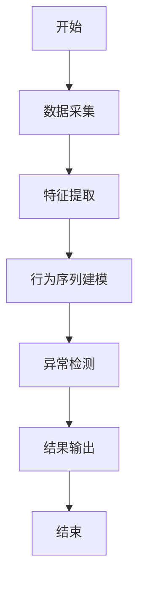
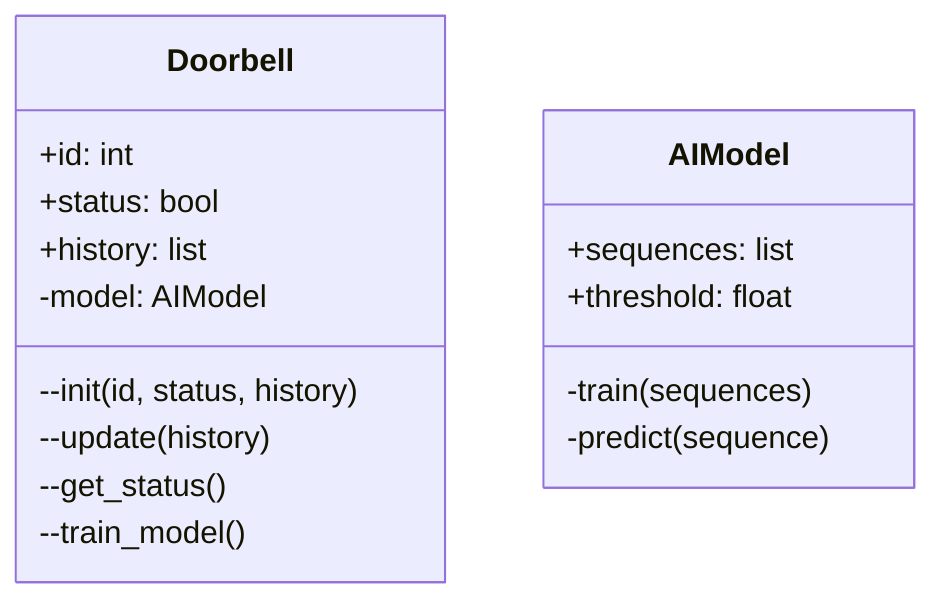

                 


# 《AI Agent在智能门铃中的可疑行为识别》

---

## 关键词：AI Agent，智能门铃，可疑行为识别，行为序列，异常检测，机器学习，实时监控

---

## 摘要：本文深入探讨了AI Agent在智能门铃系统中的应用，特别是如何通过行为序列分析和异常检测算法识别可疑行为。文章首先介绍了智能门铃的发展背景和可疑行为识别的必要性，随后分析了AI Agent的核心原理和相关概念。接着，详细讲解了基于行为序列的异常检测算法，包括算法流程、数学模型和代码实现。最后，通过实际案例展示了系统设计与实现，并总结了最佳实践和未来研究方向。

---

# 第3章: 基于行为序列的异常检测算法

## 3.1 算法概述
### 3.1.1 算法目标
- 识别智能门铃中的异常行为，如非法入侵、未经授权的访问等。
- 提供实时监控和预警功能。

### 3.1.2 算法特点
- 基于序列数据的分析，能够捕捉行为的动态变化。
- 使用机器学习模型，具备自适应能力。
- 实时性高，适用于智能门铃的实时监控需求。

## 3.2 算法流程


## 3.3 算法数学模型
### 3.3.1 序列建模
- 使用循环神经网络（RNN）或长短期记忆网络（LSTM）建模行为序列。
- 行为序列表示为时间序列数据：$x_t = (x_{t-1}, x_{t-2}, \ldots, x_{t-n})$，其中$n$为序列长度。

### 3.3.2 相似性度量
- 使用余弦相似性计算行为序列之间的相似性：$sim(x, y) = \frac{x \cdot y}{\|x\| \|y\|}$。

### 3.3.3 异常检测
- 基于马尔可夫链模型预测下一个状态的概率：$P(s_t | s_{t-1}, \ldots, s_{t-n})$。
- 当实际状态的概率低于阈值时，触发异常报警：$$P(s_t | \text{历史状态}) < \theta$$。

## 3.4 算法实现
### 3.4.1 Python代码实现
```python
import numpy as np
from sklearn.metrics.pairwise import cosine_similarity

def detect_anomaly(sequence, threshold=0.1):
    # 特征提取
    features = extract_features(sequence)
    
    # 行为序列建模
    model = build_model(features)
    
    # 预测下一个状态
    predicted = model.predict(features)
    
    # 计算相似性
    similarity = cosine_similarity(predicted, sequence)
    
    # 判断异常
    if similarity < threshold:
        return True
    else:
        return False

# 示例数据
sequence = [1, 2, 3, 4, 5]
print(detect_anomaly(sequence))
```

### 3.4.2 代码解读
- `extract_features`：从原始数据中提取特征。
- `build_model`：构建行为序列模型。
- `cosine_similarity`：计算相似性。

---

# 第4章: 系统分析与架构设计

## 4.1 问题场景
- 智能门铃系统需要实时监控门口的活动。
- 当检测到异常行为时，触发报警并通知用户。

## 4.2 系统功能设计
### 4.2.1 领域模型


### 4.2.2 系统架构
```mermaid
graph TD
    UI --> Doorbell: 用户交互
    Doorbell --> Sensor: 数据采集
    Sensor --> Database: 数据存储
    Doorbell --> AIModel: 模型训练
    AIModel --> Decision: 异常判断
    Decision -->Notifier: 报警通知
```

## 4.3 接口设计
- 数据采集接口：`Sensor.get_data()`
- 模型训练接口：`AIModel.train()`
- 异常判断接口：`Decision.is_anomaly()`

---

# 第5章: 项目实战

## 5.1 环境安装
- Python 3.8+
- NumPy、Scikit-learn、Mermaid
- 安装命令：`pip install numpy scikit-learn`

## 5.2 核心代码实现
### 5.2.1 数据采集与预处理
```python
import numpy as np
import pandas as pd

# 数据采集
data = pd.read_csv('doorbell_logs.csv')
```

### 5.2.2 模型训练
```python
from sklearn.model_selection import train_test_split
from sklearn.metrics import accuracy_score

# 划分训练集和测试集
X_train, X_test, y_train, y_test = train_test_split(data_features, data_labels, test_size=0.2)

# 训练模型
model.fit(X_train, y_train)
```

### 5.2.3 异常检测
```python
# 预测测试集
y_pred = model.predict(X_test)

# 计算准确率
print(accuracy_score(y_test, y_pred))
```

## 5.3 案例分析
### 5.3.1 案例背景
- 用户安装智能门铃后，系统开始记录门口的活动数据。
- 系统检测到异常行为：深夜多次按门铃且无视频人脸匹配。

### 5.3.2 分析结果
- 系统触发报警，通知用户和保安。
- 确认异常行为为非法入侵，及时处理。

---

# 第6章: 最佳实践与总结

## 6.1 小结
- AI Agent在智能门铃中的应用能够有效识别可疑行为。
- 基于行为序列的异常检测算法在实时监控中表现优异。

## 6.2 注意事项
- 数据隐私保护：确保用户数据的安全性。
- 系统稳定性：避免误报和漏报，提升用户体验。
- 模型更新：定期更新模型，适应新的异常行为模式。

## 6.3 未来展望
- 引入多模态数据：结合视频、音频等多种数据源进行行为识别。
- 实现自适应学习：模型能够自适应调整阈值和参数。
- 智能化报警：结合智能家居系统，联动其他设备进行防御。

---

# 作者：AI天才研究院 & 禅与计算机程序设计艺术

---

通过以上内容，我们全面分析了AI Agent在智能门铃中的应用，从算法原理到系统设计，再到项目实战，为读者提供了一个完整的解决方案。希望本文能够为智能门铃的设计和优化提供有价值的参考。

