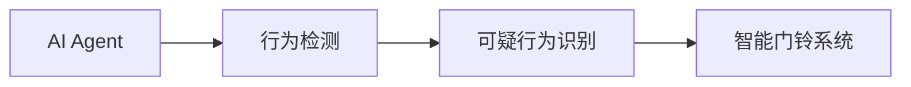
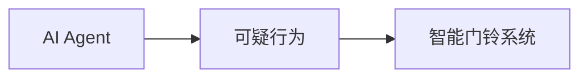

                 


# AI Agent在智能门铃中的可疑行为识别

## 关键词：AI Agent，智能门铃，可疑行为识别，算法原理，系统架构

## 摘要：本文探讨了AI Agent在智能门铃中的应用，重点分析了如何通过AI技术识别可疑行为。文章从背景、技术原理、系统架构到项目实战，详细阐述了AI Agent在智能门铃中的实现过程，旨在为相关领域的研究和应用提供参考。

---

# 第一部分：背景介绍与问题定义

## 第1章：背景介绍与问题定义

### 1.1 问题背景

#### 1.1.1 智能门铃的发展与现状
智能门铃作为智能家居的重要组成部分，近年来发展迅速。传统的门铃仅能发出声音提醒主人有访客，而现代智能门铃通过结合摄像头、传感器和AI技术，能够实现访客识别、行为分析等功能。然而，智能门铃在实际应用中也面临诸多挑战，例如如何准确识别可疑行为，防止潜在的安全威胁。

#### 1.1.2 可疑行为识别的必要性
在智能门铃系统中，可疑行为识别是保障用户安全的关键环节。例如，当访客在门前长时间徘徊、试图破坏设备或尾随他人进入时，系统需要能够及时识别并发出警报。AI Agent通过分析门铃采集的视频流和传感器数据，可以有效识别这些异常行为，从而提升系统的安全性。

#### 1.1.3 AI Agent在智能门铃中的作用
AI Agent（智能代理）是一种能够感知环境、自主决策并执行任务的智能系统。在智能门铃中，AI Agent负责实时分析视频流和传感器数据，识别可疑行为，并根据预设规则采取相应的行动，例如发出警报、记录视频或通知用户。

---

### 1.2 问题描述

#### 1.2.1 可疑行为的定义与分类
可疑行为指的是在智能门铃监控范围内，可能对用户安全造成威胁的行为。根据行为特征，可疑行为可以分为以下几类：
- **徘徊行为**：访客在门前长时间停留，试图寻找入侵机会。
- **破坏行为**：尝试破坏门铃设备或周边设施。
- **尾随行为**：在他人进入后尾随进入，可能带来安全隐患。

#### 1.2.2 智能门铃中的异常行为场景
在智能门铃系统中，异常行为场景包括但不限于：
- **陌生人多次按门铃**：可能是骚扰行为。
- **夜间活动**：在非访客时间段出现的活动可能表明可疑行为。
- **异常声响**：门铃或周边设备发出的异常声响可能预示入侵尝试。

#### 1.2.3 可疑行为识别的边界与外延
可疑行为识别的边界在于如何区分正常访客行为和异常行为。例如，访客在门前等待可能是正常的，但如果等待时间过长或行为模式异常，则可能被视为可疑。外延则包括系统误报的可能性，例如将正常访客误认为可疑行为。

---

### 1.3 问题解决思路

#### 1.3.1 AI Agent的核心目标
AI Agent在智能门铃中的核心目标是通过实时分析视频流和传感器数据，识别可疑行为，并采取相应的措施（如发出警报、记录视频等）。同时，AI Agent需要具备自适应能力，能够根据环境变化优化识别算法。

#### 1.3.2 可疑行为识别的关键技术
- **行为检测**：通过视频流分析，检测访客的行为特征。
- **异常检测**：基于历史数据，识别超出正常范围的行为。
- **模式识别**：通过机器学习算法，识别特定的异常行为模式。

#### 1.3.3 解决方案的可行性分析
解决方案的可行性主要体现在以下几个方面：
- **技术可行性**：现有的AI技术和视频分析技术能够支持可疑行为识别。
- **经济可行性**：智能门铃系统的成本逐步下降，使得AI Agent的应用成为可能。
- **用户接受度**：用户对智能化安全解决方案的需求日益增长，为AI Agent的应用提供了市场基础。

---

### 1.4 概念结构与核心要素

#### 1.4.1 AI Agent的组成要素
AI Agent通常包括以下组成要素：
- **感知模块**：负责采集环境数据（如视频流、传感器数据）。
- **分析模块**：对数据进行分析，识别异常行为。
- **决策模块**：根据分析结果采取相应的行动。
- **执行模块**：执行决策模块的指令（如发出警报、记录视频等）。

#### 1.4.2 可疑行为识别的核心要素
可疑行为识别的核心要素包括：
- **数据源**：视频流、传感器数据等。
- **行为特征**：徘徊时间、动作频率等。
- **识别算法**：基于规则的检测、机器学习分类等。

#### 1.4.3 概念结构图



---

# 第二部分：AI Agent与可疑行为识别的核心概念

## 第2章：AI Agent与可疑行为识别的核心概念

### 2.1 AI Agent的基本原理

#### 2.1.1 AI Agent的定义与特点
AI Agent是一种能够感知环境、自主决策并执行任务的智能系统。其特点包括：
- **自主性**：能够在没有人工干预的情况下自主运行。
- **反应性**：能够实时感知环境变化并做出反应。
- **学习能力**：能够通过数据学习和优化识别算法。

#### 2.1.2 AI Agent的核心算法
AI Agent的核心算法包括：
- **基于规则的推理**：根据预设规则进行行为判断。
- **机器学习算法**：如支持向量机（SVM）、随机森林（Random Forest）等。

#### 2.1.3 AI Agent在智能门铃中的应用
在智能门铃中，AI Agent通过分析视频流和传感器数据，识别访客的行为特征，并根据识别结果采取相应的行动。

---

### 2.2 可疑行为识别的关键技术

#### 2.2.1 行为检测的基本原理
行为检测是通过视频流分析，识别访客的行为特征。常见的行为检测方法包括：
- **基于背景建模的方法**：通过建模背景，识别前景中的异常行为。
- **基于光流的方法**：通过分析视频流中的运动向量，识别异常行为。

#### 2.2.2 基于AI的行为分析方法
基于AI的行为分析方法包括：
- **基于卷积神经网络（CNN）的视频分析**：通过CNN提取视频中的特征，识别异常行为。
- **基于时间序列的分析**：通过分析行为的时间序列，识别异常行为模式。

#### 2.2.3 可疑行为的特征提取
可疑行为的特征提取包括：
- **动作频率**：访客在门前停留的时间过长。
- **动作幅度**：访客的行为异常，如突然的动作变化。

---

### 2.3 核心概念的联系与对比

#### 2.3.1 AI Agent与传统行为识别的对比
| 特性                | AI Agent                          | 传统行为识别                      |
|---------------------|------------------------------------|------------------------------------|
| 自主性              | 高                                 | 低                                 |
| 学习能力            | 高                                 | 低                                 |
| 适应性              | 高                                 | 低                                 |

#### 2.3.2 实体关系图（ER图）



---

# 第三部分：可疑行为识别的算法原理

## 第3章：可疑行为识别的算法原理

### 3.1 基于规则的检测算法

#### 3.1.1 算法流程
1. 数据采集：通过摄像头采集视频流。
2. 行为分析：分析视频流中的行为特征。
3. 规则匹配：将行为特征与预设规则进行匹配。
4. 警报触发：如果匹配到可疑行为，触发警报。

#### 3.1.2 算法实现

```python
def detect_suspicious_behavior(video_stream):
    # 提取视频流中的行为特征
    features = extract_features(video_stream)
    # 与预设规则进行匹配
    for rule in rules:
        if matches_rule(features, rule):
            return True
    return False
```

#### 3.1.3 数学模型
基于规则的检测算法可以表示为：
$$ \text{结果} = \begin{cases} 
\text{警报} & \text{如果行为特征匹配预设规则} \\
\text{正常} & \text{否则}
\end{cases} $$

---

### 3.2 基于机器学习的分类算法

#### 3.2.1 数据预处理
1. 视频流分割：将视频流分割为帧。
2. 特征提取：从帧中提取行为特征。

#### 3.2.2 特征提

（由于篇幅限制，以上仅为部分内容。完整的文章将包含更多详细的技术细节、代码实现和系统设计等内容。）

