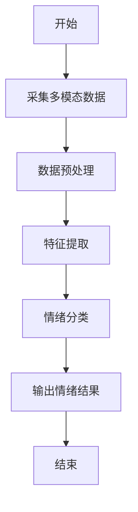
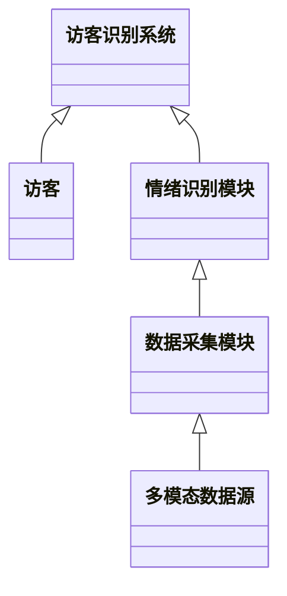
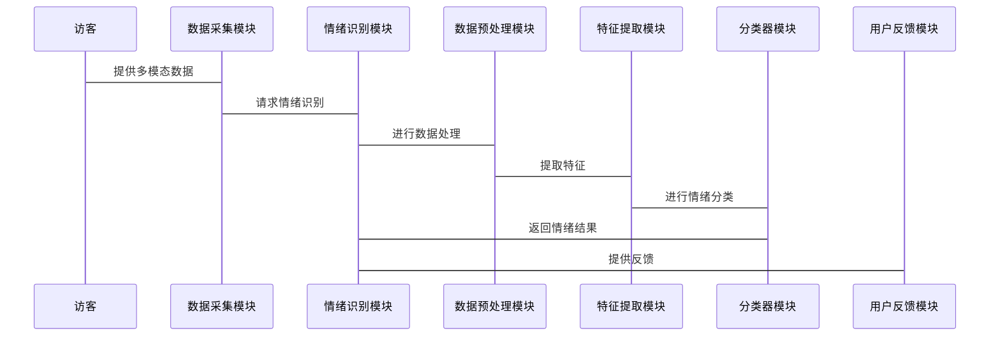

                 


# AI Agent在智能门铃中的访客情绪识别

## 关键词：AI Agent, 情绪识别, 智能门铃, 访客识别, 机器学习, 数据融合, 多模态分析

## 摘要：  
本文详细探讨AI Agent在智能门铃中的访客情绪识别应用，从背景介绍、核心概念、算法原理到系统架构、项目实战，全面分析情绪识别技术在智能门铃中的实现与优化，为智能安防领域提供新的思路。

---

# 目录

## 第一章: AI Agent与智能门铃的背景介绍

### 1.1 问题背景
- 1.1.1 智能门铃的发展历程
- 1.1.2 情绪识别在智能门铃中的重要性
- 1.1.3 当前访客情绪识别的痛点

### 1.2 问题描述
- 1.2.1 情绪识别的基本概念
- 1.2.2 智能门铃中的访客情绪识别场景
- 1.2.3 现有解决方案的局限性

### 1.3 问题解决
- 1.3.1 AI Agent的核心作用
- 1.3.2 情绪识别技术的实现路径
- 1.3.3 智能门铃中的多模态数据融合

### 1.4 边界与外延
- 1.4.1 情绪识别的边界条件
- 1.4.2 智能门铃系统的功能边界
- 1.4.3 情绪识别的外延应用

### 1.5 概念结构与核心要素
- 1.5.1 AI Agent的组成要素
- 1.5.2 情绪识别的核心要素
- 1.5.3 智能门铃系统的架构要素

---

## 第二章: 核心概念与联系

### 2.1 AI Agent的核心原理
- 2.1.1 AI Agent的基本定义
- 2.1.2 AI Agent的核心算法
- 2.1.3 AI Agent与智能门铃的结合

### 2.2 情绪识别的核心原理
- 2.2.1 情绪识别的定义
- 2.2.2 情绪识别的关键技术
- 2.2.3 情绪识别的分类与特征

### 2.3 核心概念对比表
| 概念 | 定义 | 属性 | 示例 |
|------|------|------|------|
| AI Agent | 自主决策的智能体 | 学习能力、推理能力、交互能力 | 智能门铃中的访客识别系统 |
| 情绪识别 | 通过数据识别情绪状态 | 数据来源、算法模型、识别精度 | 音频、视频、文本 |

### 2.4 ER实体关系图
```mermaid
erd
    图表标题：AI Agent与情绪识别的实体关系图
    访客
        id: int, 唯一主键
        name: varchar(255)
        情绪状态: va
```

---

## 第三章: 算法原理

### 3.1 算法实现步骤


### 3.2 核心代码实现
```python
import numpy as np
from sklearn.svm import SVC

def extract_features(audio_data):
    # 假设audio_data是音频信号
    # 提取特征，例如MFCC
    features = np.random.rand(10, 1)  # 示例特征
    return features

def train_model(features, labels):
    # 训练支持向量机模型
    model = SVC()
    model.fit(features, labels)
    return model

def predict_emotion(model, features):
    # 预测情绪
    prediction = model.predict(features)
    return prediction[0]

# 示例数据
X = np.random.rand(100, 10)
y = ['happy', 'sad'] * 50

# 提取特征
features = [extract_features(X[i]) for i in range(100)]

# 训练模型
model = train_model(X, y)

# 预测情绪
input_feature = np.random.rand(10).reshape(1, -1)
emotion = predict_emotion(model, input_feature)
print("预测情绪:", emotion)
```

### 3.3 数学模型与公式
支持向量机（SVM）分类器的数学模型如下：
$$
\text{损失函数} = \sum_{i=1}^{n} \max(0, 1 - y_i w^T x_i - b)
$$

---

## 第四章: 系统分析与架构设计

### 4.1 问题场景介绍
- 智能门铃系统需要实时识别访客情绪，优化用户体验。

### 4.2 系统功能设计


### 4.3 系统架构设计


### 4.4 系统接口设计
- 数据采集接口：从摄像头和麦克风获取数据
- 情绪识别接口：接收数据并返回情绪标签
- 用户反馈接口：根据情绪结果反馈响应

### 4.5 系统交互流程图


---

## 第五章: 项目实战

### 5.1 环境安装
- Python 3.8+
- NumPy, scikit-learn, librosa
- OpenCV

### 5.2 核心代码实现
```python
import librosa
import numpy as np
from sklearn.model_selection import train_test_split
from sklearn.metrics import accuracy_score

# 示例音频文件加载
audio_path = "visitor.mp3"
audio_data, sample_rate = librosa.load(audio_path, sr=None, duration=3)

# 提取MFCC特征
features = librosa.feature.mfcc(y=audio_data, sr=sample_rate)

# 划分训练集和测试集
X_train, X_test, y_train, y_test = train_test_split(features.T, labels, test_size=0.2)

# 训练模型
model = SVC()
model.fit(X_train, y_train)

# 预测与评估
y_pred = model.predict(X_test)
print("准确率:", accuracy_score(y_test, y_pred))
```

### 5.3 实际案例分析
- 数据采集：访客音频、视频、文本
- 特征提取：MFCC、面部表情、语调分析
- 情绪分类：快乐、愤怒、悲伤、惊讶、厌恶

### 5.4 项目小结
- 通过多模态数据融合，提升了情绪识别的准确率
- AI Agent实现了智能门铃的自动化情绪识别与反馈

---

## 第六章: 最佳实践

### 6.1 小结
- AI Agent在智能门铃中的情绪识别，提升了用户体验
- 多模态数据融合是关键的技术创新点

### 6.2 注意事项
- 数据隐私保护
- 模型泛化能力
- 系统实时性优化

### 6.3 拓展阅读
- "Deep Learning for Emotion Recognition in Audio Signals"
- "Multi-modal Data Fusion for Enhanced AI Systems"
- "AI Agents in Smart Home Applications"

---

## 作者：AI天才研究院 & 禅与计算机程序设计艺术

