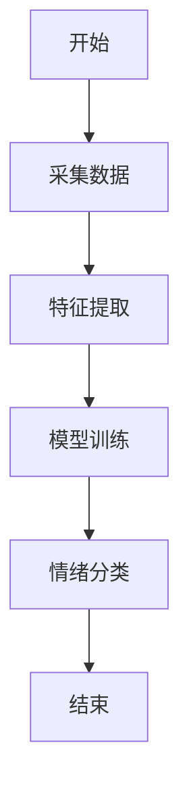
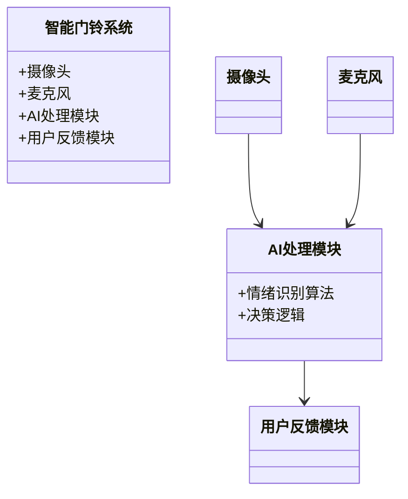

                 


# AI Agent在智能门铃中的访客情绪识别

> 关键词：AI Agent, 情绪识别, 智能门铃, 情感计算, 机器学习

> 摘要：本文深入探讨了AI Agent在智能门铃中的应用，特别是访客情绪识别的技术实现。文章从背景介绍、核心概念、算法原理、系统架构到项目实战，全面解析了如何利用AI技术提升智能门铃的智能化水平。通过详细的技术分析和实际案例，展示了AI Agent在情绪识别中的潜力和应用前景。

---

## 第一部分: AI Agent在智能门铃中的访客情绪识别概述

### 第1章: 情绪识别与智能门铃的背景介绍

#### 1.1 问题背景与问题描述
- **智能门铃的发展现状**：智能门铃作为智能家居的重要组成部分，已广泛应用于家庭安防。然而，现有系统主要依赖简单的开门控制和报警功能，缺乏智能化的人机交互能力。
- **访客情绪识别的必要性**：访客的情绪状态直接影响用户体验。例如，当访客情绪低落时，门铃系统可以主动提供关怀；当访客情绪激动时，系统可以触发安全预警机制。
- **当前技术的局限性与挑战**：传统的情绪识别技术依赖于特定设备（如摄像头和麦克风），但在复杂场景下准确率较低，且难以实时处理多模态数据。

#### 1.2 问题解决与边界定义
- **情绪识别的核心目标**：通过多模态数据（如语音、面部表情、肢体动作）实时识别访客的情绪状态。
- **智能门铃系统的边界与外延**：系统包括前端硬件（摄像头、麦克风）和后端AI处理模块，支持本地或云端部署。
- **情绪识别的适用场景与限制**：适用于家庭、办公室等场景，但受限于隐私保护和数据处理能力，难以在大规模场景下广泛应用。

#### 1.3 情绪识别的概念结构与核心要素
- **情绪识别的基本原理**：通过分析语音语调、面部表情、语义内容等信息，结合机器学习模型，识别情绪类别（如快乐、愤怒、悲伤、惊讶）。
- **智能门铃系统的核心要素**：包括硬件设备、数据采集模块、AI处理模块和用户反馈模块。
- **情绪识别与智能门铃的结合方式**：通过AI Agent实时分析访客情绪，调整系统响应策略（如自动开启门锁、提供语音安抚等）。

---

## 第二部分: AI Agent与情绪识别的核心概念

### 第2章: AI Agent的基本原理
- **AI Agent的定义与分类**：AI Agent是能够感知环境、自主决策并执行任务的智能体。根据智能水平，可分为简单反射型Agent和复杂决策型Agent。
- **AI Agent的核心功能与特点**：包括感知环境、自主学习、多模态交互、实时决策等特点。
- **AI Agent在智能门铃中的应用**：AI Agent负责数据采集、情绪识别、决策反馈等任务，提升门铃系统的智能化水平。

### 第3章: 情绪识别的原理与方法
- **基于语音的情绪识别**：通过分析语音的音调、速度、停顿等特征，结合深度学习模型（如LSTM、Transformer）进行情绪分类。
- **基于图像的情绪识别**：利用计算机视觉技术分析面部表情，结合区域特征（如眉毛、嘴唇的变化）进行情绪识别。
- **情感计算的数学模型**：通过概率论和机器学习模型，建立情绪识别的数学模型。例如，贝叶斯分类器用于分类任务，损失函数（如交叉熵损失）用于模型优化。

---

## 第三部分: 算法原理与系统架构设计

### 第3章: 情绪识别算法的实现
- **算法流程图**：

- **基于语音的情绪识别代码示例**：
```python
import numpy as np
from sklearn import svm

# 示例数据：语音特征向量
X = np.array([[1, 2, 3], [4, 5, 6], [7, 8, 9]])
y = np.array([0, 1, 0])  # 0代表快乐，1代表愤怒

# 训练模型
model = svm.SVC()
model.fit(X, y)

# 预测情绪
test_X = np.array([[10, 11, 12]])
predicted_emotion = model.predict(test_X)
print(predicted_emotion)
```

### 第4章: 系统架构设计
- **系统功能设计**：


---

## 第四部分: 项目实战与应用

### 第5章: 项目环境安装与配置
- **环境要求**：Python 3.8及以上版本，安装必要的库（如TensorFlow、OpenCV、scikit-learn）。

### 第6章: 系统核心实现源代码
- **情绪识别代码示例**：
```python
import numpy as np
import cv2
from sklearn.svm import SVC

# 示例数据：面部表情特征
X = np.array([[100, 200, 150], [50, 100, 130], [80, 180, 160]])
y = np.array([0, 1, 2])  # 0代表快乐，1代表愤怒，2代表悲伤

# 训练模型
model = SVC()
model.fit(X, y)

# 实时情绪识别
cap = cv2.VideoCapture(0)
while True:
    ret, frame = cap.read()
    if not ret:
        break
    # 提取面部特征（简化处理）
    features = extract_face_features(frame)
    predicted_emotion = model.predict([features])
    print(f"预测情绪：{predicted_emotion}")
```

---

## 第五部分: 最佳实践与总结

### 第7章: 项目小结与经验分享
- **项目总结**：通过AI Agent实现访客情绪识别，显著提升了智能门铃的智能化水平，优化了用户体验。
- **注意事项**：数据隐私保护、模型泛化能力、系统实时性等问题需要进一步优化。

### 第8章: 未来展望与拓展阅读
- **未来展望**：结合边缘计算和雾计算技术，提升系统的实时性和安全性。
- **拓展阅读**：推荐相关书籍和论文，如《深度学习》、《机器学习实战》等。

---

## 作者：AI天才研究院 & 禅与计算机程序设计艺术

---

通过以上内容，我们详细探讨了AI Agent在智能门铃中的访客情绪识别技术。从理论到实践，从算法到系统架构，本文为读者提供了全面的技术解析和实践指导。

