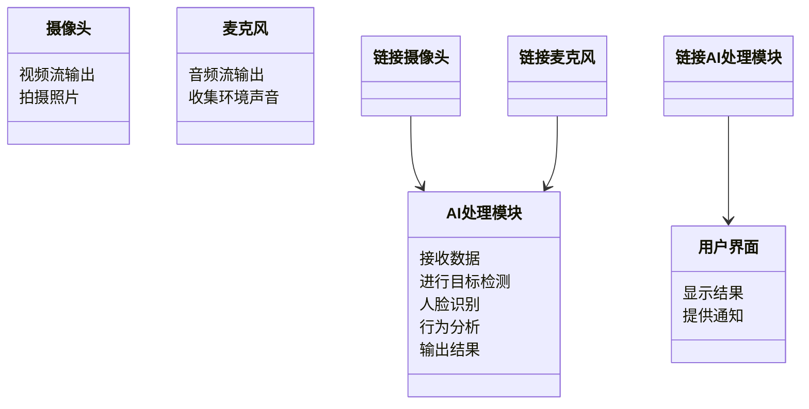
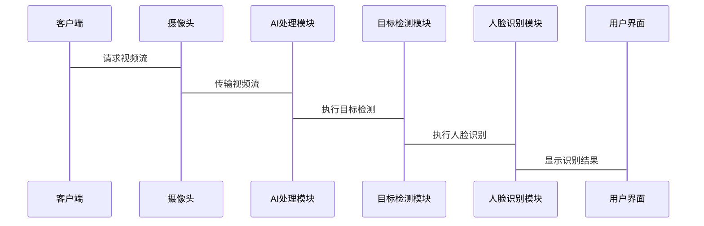

                 


# AI Agent在智能门铃中的访客识别

> 关键词：AI Agent, 智能门铃, 访客识别, 目标检测, 人脸识别, 机器学习

> 摘要：本文深入探讨了AI Agent在智能门铃中的访客识别技术，从背景介绍、核心概念、算法原理、系统架构设计到项目实战，全面分析了AI Agent如何通过计算机视觉和机器学习技术实现高效的访客识别。文章结合实际案例，详细讲解了系统设计、代码实现和应用场景，为读者提供了从理论到实践的全面指导。

---

# 第1章: 问题背景与描述

## 1.1 问题背景

### 1.1.1 传统门铃的局限性
传统门铃仅能通过声音提醒用户有访客到来，无法提供访客的身份信息，也无法在用户不在场时提供访客的详细记录。

### 1.1.2 智能化门铃的需求
随着智能家居的普及，用户对门铃的功能需求逐渐升级，不仅需要提醒功能，还需要访客的身份识别、行为分析等智能化服务。

### 1.1.3 AI Agent在智能门铃中的作用
AI Agent（人工智能代理）通过计算机视觉和机器学习技术，能够自动识别访客的身份，分析其行为，为用户提供智能化的访客管理服务。

---

## 1.2 问题描述

### 1.2.1 访客识别的核心问题
访客识别的核心问题包括：如何准确识别访客的身份，如何在复杂环境下稳定工作，如何保护用户隐私等。

### 1.2.2 智能门铃的访客识别挑战
智能门铃的访客识别面临光照变化、遮挡、背景复杂等多种挑战，需要AI Agent具备强大的环境适应能力和鲁棒性。

### 1.2.3 AI Agent的解决方案
通过结合目标检测、人脸识别和行为分析等技术，AI Agent能够有效解决智能门铃的访客识别问题。

---

## 1.3 问题解决

### 1.3.1 AI Agent的访客识别流程
AI Agent通过摄像头采集视频流，利用目标检测技术定位访客，再通过人脸识别技术进行身份识别，最后结合行为分析技术判断访客意图。

### 1.3.2 智能门铃的系统架构
智能门铃系统包括摄像头、麦克风、扬声器和AI处理模块，AI Agent负责数据的采集、处理和分析。

### 1.3.3 访客识别的关键技术
关键技术包括目标检测、人脸识别、行为分析和数据融合等。

---

## 1.4 边界与外延

### 1.4.1 系统边界
智能门铃系统仅负责访客识别和通知功能，不涉及门锁控制和其他智能家居设备的联动。

### 1.4.2 功能外延
访客识别功能可以扩展到访客管理、行为监控、异常检测等领域。

### 1.4.3 应用场景的扩展
AI Agent技术可以应用于智能安防、商业场所访客管理、公共设施监控等多种场景。

---

## 1.5 核心概念

### 1.5.1 AI Agent的定义与属性
AI Agent是一种能够感知环境、自主决策并执行任务的人工智能系统，具有感知能力、学习能力、推理能力和执行能力。

### 1.5.2 智能门铃的定义与属性
智能门铃是一种集成摄像头、麦克风和AI处理模块的智能家居设备，能够实现访客识别、通知和记录功能。

### 1.5.3 访客识别的核心要素
访客识别的核心要素包括：目标检测、人脸识别、行为分析和数据存储。

---

# 第2章: 核心概念与联系

## 2.1 AI Agent的核心原理

### 2.1.1 AI Agent的基本原理
AI Agent通过感知环境数据，利用机器学习模型进行分析和推理，做出决策并执行任务。

### 2.1.2 AI Agent的感知与决策
AI Agent通过摄像头和麦克风采集环境数据，利用目标检测和人脸识别技术进行感知，结合上下文信息进行决策。

### 2.1.3 AI Agent的学习与优化
AI Agent通过监督学习、无监督学习和强化学习等方法，不断优化自身的识别和决策能力。

---

## 2.2 智能门铃的系统架构

### 2.2.1 系统整体架构
智能门铃系统包括硬件设备和AI处理模块，硬件设备负责数据采集，AI处理模块负责数据处理和分析。

### 2.2.2 系统功能模块
系统功能模块包括摄像头采集、数据预处理、目标检测、人脸识别和行为分析。

### 2.2.3 系统交互流程
系统交互流程包括数据采集、数据处理、识别分析、决策执行和反馈优化。

---

## 2.3 核心概念对比

### 2.3.1 AI Agent与传统门铃的对比
AI Agent能够实现智能化的访客识别，而传统门铃仅能提供声音提醒功能。

### 2.3.2 访客识别与传统门铃识别的对比
访客识别基于AI技术，能够实现精准的身份识别，而传统门铃识别仅能通过声音提醒。

### 2.3.3 智能门铃系统的优缺点
优点包括智能化、高效性、安全性；缺点包括较高的初始投入和维护成本。

---

# 第3章: 算法原理讲解

## 3.1 目标检测算法

### 3.1.1 目标检测算法原理
目标检测算法通过图像分割和分类，识别图像中的目标物体并定位其位置。

### 3.1.2 目标检测算法流程
目标检测算法流程包括图像输入、特征提取、边界框回归和类别预测。

### 3.1.3 目标检测算法实现
使用YOLO算法实现目标检测，代码示例如下：

```python
import cv2
import numpy as np

def detect_objects(image_path):
    # 加载预训练模型
    net = cv2.dnn.readNetFromDarknet("yolov4.cfg", "yolov4.weights")
    # 获取输出层名称
    layer_names = net.getUnconnectedOutLayersNames()
    # 读取图像
    image = cv2.imread(image_path)
    # 转换为blob格式
    blob = cv2.dnn.blobFromImage(image, 1/255.0, (416, 416), swapRB=True, crop=False)
    # 前向传播
    net.setInput(blob)
    outputs = net.forward(layer_names)
    # 解析结果
    boxes = []
    confidences = []
    classIDs = []
    for output in outputs:
        for detection in output:
            scores = detection[5:]
            classID = np.argmax(scores)
            confidence = scores[classID]
            if confidence > 0.5:
                box = detection[:4] * np.array([416, 416, 416, 416])
                boxes.append(box.astype("int"))
                confidences.append(float(confidence))
                classIDs.append(classID)
    return boxes, confidences, classIDs
```

---

## 3.2 人脸识别算法

### 3.2.1 人脸识别算法原理
人脸识别算法通过提取人脸特征，利用训练好的模型进行身份识别。

### 3.2.2 人脸识别算法流程
人脸识别算法流程包括图像预处理、特征提取、特征匹配和结果输出。

### 3.2.3 人脸识别算法实现
使用FaceNet算法实现人脸识别，代码示例如下：

```python
import face_recognition

def recognize_faces(image_path):
    # 加载图像
    image = face_recognition.load_image_file(image_path)
    # 提取特征
    face_encoding = face_recognition.face_encodings(image)
    if not face_encoding:
        return []
    # 比较特征
    known_face_encoding = face_recognition.load_image_file("known_face.jpg")
    # 计算相似度
    distances = face_recognition.face_distance(face_encoding, known_face_encoding)
    # 判断是否匹配
    results = []
    for distance in distances:
        if distance < 0.6:
            results.append("Match")
        else:
            results.append("No match")
    return results
```

---

## 3.3 算法优化与性能分析

### 3.3.1 算法优化策略
通过模型蒸馏、量化和剪枝等技术优化算法性能，提高识别速度和准确率。

### 3.3.2 性能分析指标
包括识别准确率、识别速度、资源消耗和适应性等。

### 3.3.3 算法性能对比
对比不同算法的性能，选择最优算法组合。

---

# 第4章: 系统分析与架构设计

## 4.1 问题场景介绍

### 4.1.1 场景描述
家庭用户需要通过智能门铃识别访客身份，记录访客信息，提供访客管理功能。

### 4.1.2 问题分析
访客识别需要考虑光照变化、背景复杂、访客遮挡等因素，确保识别的准确性和稳定性。

### 4.1.3 解决方案
通过AI Agent结合目标检测、人脸识别和行为分析技术，实现高效的访客识别。

---

## 4.2 项目介绍

### 4.2.1 项目目标
实现基于AI Agent的智能门铃访客识别系统，提供高效的访客识别和管理功能。

### 4.2.2 项目范围
涵盖硬件设备选型、算法实现、系统集成和功能测试。

### 4.2.3 项目计划
包括需求分析、系统设计、算法实现、系统集成和测试优化。

---

## 4.3 系统功能设计

### 4.3.1 领域模型设计
使用Mermaid类图展示领域模型，包括摄像头、麦克风、AI处理模块和用户界面。



---

## 4.4 系统架构设计

### 4.4.1 系统架构图
使用Mermaid架构图展示系统架构，包括前端设备、后端处理和用户界面。


---

## 4.5 系统接口设计

### 4.5.1 系统接口
系统接口包括摄像头接口、麦克风接口、网络接口和用户界面接口。

### 4.5.2 接口描述
摄像头接口用于视频数据的采集，麦克风接口用于音频数据的采集，网络接口用于与云端服务的数据传输，用户界面接口用于显示识别结果和通知信息。

---

## 4.6 系统交互流程

### 4.6.1 交互流程
使用Mermaid序列图展示系统交互流程，包括数据采集、处理、识别和反馈。



---

# 第5章: 项目实战

## 5.1 环境安装

### 5.1.1 安装Python和相关库
安装Python 3.8以上版本，安装OpenCV、Face Recognition和深度学习框架。

### 5.1.2 安装硬件设备
选择合适的摄像头和麦克风，确保硬件设备与系统兼容。

### 5.1.3 安装云端服务
选择阿里云、AWS或腾讯云等云服务，搭建AI处理模块的后端服务。

---

## 5.2 核心代码实现

### 5.2.1 目标检测代码
实现目标检测功能，使用YOLO算法，代码如下：

```python
import cv2
import numpy as np

def detect_objects(image):
    # 加载预训练模型
    net = cv2.dnn.readNetFromDarknet("yolov4.cfg", "yolov4.weights")
    # 获取输出层名称
    layer_names = net.getUnconnectedOutLayersNames()
    # 转换为blob格式
    blob = cv2.dnn.blobFromImage(image, 1/255.0, (416, 416), swapRB=True, crop=False)
    # 前向传播
    net.setInput(blob)
    outputs = net.forward(layer_names)
    # 解析结果
    boxes = []
    confidences = []
    classIDs = []
    for output in outputs:
        for detection in output:
            scores = detection[5:]
            classID = np.argmax(scores)
            confidence = scores[classID]
            if confidence > 0.5:
                box = detection[:4] * np.array([416, 416, 416, 416])
                boxes.append(box.astype("int"))
                confidences.append(float(confidence))
                classIDs.append(classID)
    return boxes, confidences, classIDs
```

### 5.2.2 人脸识别代码
实现人脸识别功能，使用FaceNet算法，代码如下：

```python
import face_recognition

def recognize_faces(image):
    # 提取特征
    face_encodings = face_recognition.face_encodings(image)
    if not face_encodings:
        return []
    # 比较特征
    known_encodings = face_recognition.load_image_file("known_face.jpg")
    distances = face_recognition.face_distance(face_encodings, known_encodings)
    # 判断是否匹配
    results = []
    for distance in distances:
        if distance < 0.6:
            results.append("Match")
        else:
            results.append("No match")
    return results
```

---

## 5.3 代码应用解读与分析

### 5.3.1 代码功能解读
目标检测代码实现了对视频流中目标物体的定位和分类，人脸识别代码实现了对人脸的特征提取和身份识别。

### 5.3.2 代码优化建议
通过模型量化、剪枝和并行计算等技术优化代码性能，提高识别速度和准确率。

### 5.3.3 代码测试与验证
在不同光照条件下测试目标检测和人脸识别的准确性，验证系统的稳定性和鲁棒性。

---

## 5.4 实际案例分析

### 5.4.1 案例描述
某家庭用户使用AI Agent智能门铃识别访客，记录访客信息，提供访客管理功能。

### 5.4.2 案例分析
通过实际案例分析，验证系统的性能和功能，发现潜在问题并提出改进建议。

---

## 5.5 项目小结

### 5.5.1 项目成果
实现了基于AI Agent的智能门铃访客识别系统，具备高效的识别能力和稳定的运行性能。

### 5.5.2 经验总结
在项目实施过程中，需要注意硬件设备的选型、算法的优化和系统的稳定性测试。

---

# 第6章: 最佳实践

## 6.1 小结与总结

### 6.1.1 核心内容总结
AI Agent通过目标检测、人脸识别和行为分析技术，实现智能门铃的访客识别功能。

### 6.1.2 经验总结
在实际应用中，需要综合考虑系统的硬件性能、算法优化和用户体验，确保系统的高效性和稳定性。

---

## 6.2 注意事项

### 6.2.1 系统维护
定期更新AI模型，确保系统的识别准确性和适应性。

### 6.2.2 用户隐私
严格保护用户的隐私信息，确保系统的安全性。

### 6.2.3 系统兼容性
确保系统兼容不同的硬件设备和软件平台，方便用户的安装和使用。

---

## 6.3 拓展阅读

### 6.3.1 相关技术
推荐阅读《深度学习实战》、《计算机视觉导论》和《人工智能入门》等书籍。

### 6.3.2 实际应用
推荐阅读《智能安防系统设计》、《智能家居技术》和《AI应用案例分析》等书籍。

### 6.3.3 进阶学习
参加AI相关的技术培训和研讨会，了解最新的技术动态和应用案例。

---

# 作者：AI天才研究院/AI Genius Institute & 禅与计算机程序设计艺术 /Zen And The Art of Computer Programming

---

通过本文的详细讲解，读者可以全面了解AI Agent在智能门铃中的访客识别技术，从理论到实践，掌握系统的整体架构、核心算法和项目实现方法。希望本文能够为读者提供有价值的技术指导，帮助他们在实际应用中更好地利用AI Agent技术提升智能门铃的功能和性能。

