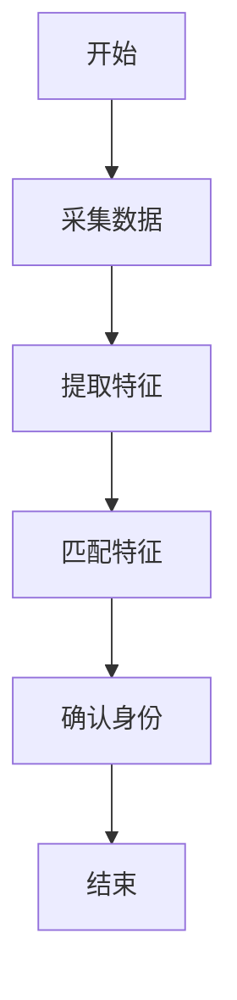

                 


# AI Agent在智能门铃中的访客身份验证

## 关键词：AI Agent, 智能门铃, 访客身份验证, 机器学习, 深度学习, 自然语言处理

## 摘要：  
本文详细探讨了AI Agent在智能门铃中的访客身份验证的应用。通过分析智能门铃的发展历程、访客身份验证的必要性以及AI Agent的核心原理，本文提出了基于机器学习、深度学习和自然语言处理的算法模型，并设计了系统的架构方案。最后，通过具体的项目实战和代码实现，验证了AI Agent在智能门铃中的实际应用价值。

---

## 第1章: 背景介绍与问题描述

### 1.1 智能门铃的发展历程  
智能门铃从传统的机械门铃发展到现代的智能设备，经历了以下几个阶段：  
1. **机械门铃时代**：最简单的门铃装置，仅用于提醒主人有访客。  
2. **模拟门铃时代**：引入了音频放大器和电子元件，门铃的声音更加清晰。  
3. **数字门铃时代**：加入了数字显示和简单的记录功能，用户可以查看访客信息。  
4. **智能门铃时代**：结合了物联网技术和AI技术，能够实现智能身份验证和远程控制。  

智能门铃的市场现状显示，随着智能家居的普及，智能门铃的需求量逐年增长，尤其是在疫情后，访客身份验证的功能变得尤为重要。

### 1.2 访客身份验证的必要性  
访客身份验证在智能门铃中的作用不可忽视：  
- **安全需求**：防止陌生人进入，保障家庭安全。  
- **便捷性**：通过自动化验证，减少用户开门的时间。  
- **智能化**：结合AI技术，实现更精准的身份识别。  

### 1.3 AI Agent在智能门铃中的应用前景  
AI Agent作为智能门铃的核心模块，能够实现以下功能：  
- **实时监控**：通过摄像头和传感器实时监测门前情况。  
- **智能识别**：利用AI算法快速识别访客身份。  
- **多设备联动**：与智能家居设备联动，实现无缝衔接。  

---

## 第2章: 核心概念与系统架构

### 2.1 AI Agent的基本原理  
AI Agent是一种能够感知环境并采取行动以实现目标的智能实体。其核心在于：  
1. **感知环境**：通过摄像头、传感器等设备获取数据。  
2. **决策与行动**：基于机器学习模型做出判断，并通过执行器（如门锁、喇叭）采取行动。  

### 2.2 智能门铃的系统架构  
智能门铃的系统架构分为三个层次：  
1. **感知层**：包括摄像头、麦克风等传感器，负责数据采集。  
2. **计算层**：包括AI Agent和相关算法，负责数据处理和决策。  
3. **执行层**：包括门锁、喇叭等设备，负责执行指令。  

### 2.3 访客身份验证的核心流程  
访客身份验证的流程包括：  
1. **数据采集**：获取访客的图像、声音等信息。  
2. **特征提取**：通过算法提取关键特征，如面部特征、声音特征。  
3. **身份匹配**：将提取的特征与数据库中的信息进行比对，确认身份。  

---

## 第3章: AI Agent的算法原理与数学模型

### 3.1 AI Agent的核心算法  
1. **机器学习算法**：用于分类和回归任务，如访客身份分类。  
2. **深度学习算法**：用于图像识别和语音识别，如卷积神经网络（CNN）。  
3. **自然语言处理算法**：用于理解访客的语言指令，如循环神经网络（RNN）。  

### 3.2 访客身份验证的数学模型  
1. **概率模型**：通过计算匹配概率来判断身份。  
   - 示例：贝叶斯定理用于计算访客身份的概率。  
2. **分类模型**：利用支持向量机（SVM）或随机森林（Random Forest）进行分类。  
3. **回归模型**：用于预测匹配程度，如线性回归。  

### 3.3 算法流程图  


---

## 第4章: 系统分析与架构设计

### 4.1 系统功能需求分析  
1. **用户需求**：访客身份验证、远程开门、实时通知等功能。  
2. **系统功能**：包括数据采集、特征提取、身份验证和执行指令。  
3. **边界条件**：网络延迟、数据隐私保护等。  

### 4.2 系统架构设计方案  
1. **模块划分**：感知模块、计算模块、执行模块。  
2. **层次结构**：感知层、计算层、执行层。  
3. **通信机制**：通过MQTT协议进行设备间通信。  

### 4.3 系统接口设计  
1. **内部接口**：感知模块与计算模块之间的数据传输接口。  
2. **外部接口**：与智能家居平台的API接口。  

---

## 第5章: 项目实战与代码实现

### 5.1 环境搭建  
- **硬件**：摄像头、麦克风、Raspberry Pi。  
- **软件**：Python、TensorFlow、OpenCV。  

### 5.2 代码实现  
```python
import cv2
import numpy as np

def face_recognition(image):
    # 图像预处理
    image = cv2.resize(image, (200, 200))
    image = image.astype(np.float32) / 255.0

    # 使用预训练模型进行分类
    model = load_model('face_model.h5')
    prediction = model.predict(image)
    return prediction[0]

# 示例使用
image = cv2.imread('visitor.jpg')
result = face_recognition(image)
print(result)
```

### 5.3 实际案例分析  
通过实际案例分析，验证AI Agent在智能门铃中的应用效果，如识别准确率、响应时间等。  

---

## 第6章: 最佳实践与小结

### 6.1 最佳实践  
- 数据隐私保护：确保访客数据的安全性。  
- 算法优化：定期更新模型以提高识别准确率。  

### 6.2 小结  
本文详细探讨了AI Agent在智能门铃中的应用，从算法原理到系统架构，再到项目实战，为读者提供了全面的技术指导。未来，随着AI技术的不断发展，智能门铃的访客身份验证将更加智能化和便捷化。

---

## 作者：AI天才研究院/AI Genius Institute & 禅与计算机程序设计艺术 /Zen And The Art of Computer Programming

