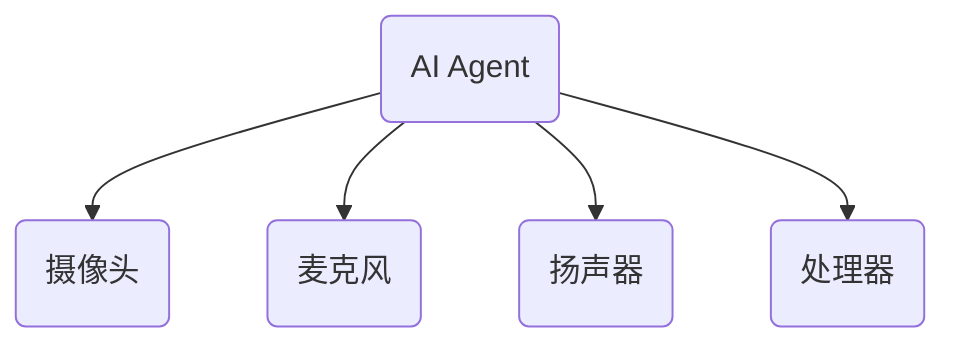

                 

# AI Agent在智能门铃中的陌生人识别警报

> 关键词：AI Agent, 智能门铃, 陌生人识别, 警报系统, 计算机视觉, 人脸识别

> 摘要：本文深入探讨了AI Agent在智能门铃中的陌生人识别警报系统。通过分析问题背景、核心概念、算法原理、系统架构、项目实战和最佳实践，详细阐述了如何利用AI技术实现高效的陌生人识别和警报机制。文章结合理论与实践，提供了丰富的技术细节和代码示例，帮助读者全面理解并实现类似的智能系统。

---

# 第1章: 问题背景与需求分析

## 1.1 问题背景

### 1.1.1 智能门铃的发展历程

智能门铃作为一种智能家居设备，经历了从简单机械装置到复杂智能系统的演变。早期的门铃仅能通过声音提示访客到来，而现代智能门铃则集成了视频监控、人脸识别、语音对讲等多种功能。随着人工智能技术的发展，智能门铃的功能逐渐向智能化、自动化方向扩展。

### 1.1.2 陌生人识别的必要性

在现代社会中，家庭安全问题日益重要。传统的门铃系统无法区分熟人和陌生人，容易引发安全隐患。通过引入AI Agent（人工智能代理），智能门铃可以实现对访客的身份识别，从而在检测到陌生人时触发警报，有效提升家庭安全性。

### 1.1.3 当前智能门铃的痛点与不足

尽管市场上已有多种智能门铃产品，但大多数系统在陌生人识别方面仍存在以下问题：
1. **误报率高**：基于简单规则的识别系统容易将熟人误识别为陌生人，或漏识真正的陌生人。
2. **性能受限**：传统基于规则的系统难以应对复杂多变的环境，如光线变化、背景干扰等。
3. **用户体验差**：复杂的设置流程和不友好的交互设计降低了用户的使用体验。

## 1.2 问题描述

### 1.2.1 陌生人识别的核心问题

陌生人识别的核心问题在于如何准确区分已知用户和未知用户。这需要结合计算机视觉和机器学习技术，通过分析人脸特征、行为模式等信息，实现对访客身份的智能识别。

### 1.2.2 警报机制的关键挑战

警报机制的设计需要考虑以下关键问题：
1. **触发条件**：如何在检测到陌生人时准确触发警报，避免误报和漏报。
2. **警报形式**：警报可以通过声音、推送通知、短信等多种形式发送，需根据用户需求进行定制。
3. **隐私保护**：在识别陌生人时，需确保用户隐私不被泄露。

### 1.2.3 用户需求与场景分析

用户在使用智能门铃时，通常有以下需求：
- **实时监控**：用户希望随时了解门前的访客情况。
- **智能识别**：用户希望系统能够自动识别熟人和陌生人。
- **便捷操作**：用户希望系统操作简单，设置方便。

## 1.3 问题解决思路

### 1.3.1 引入AI Agent的必要性

AI Agent（人工智能代理）是一种能够感知环境、自主决策并执行任务的智能体。在智能门铃中引入AI Agent，可以实现以下功能：
- 自动检测门前的访客。
- 通过人脸识别技术判断访客身份。
- 根据识别结果触发相应的警报或欢迎信息。

### 1.3.2 AI Agent在陌生人识别中的作用

AI Agent通过以下方式实现陌生人识别：
1. **数据采集**：通过摄像头采集访客的视频流数据。
2. **特征提取**：利用计算机视觉技术提取访客的人脸特征。
3. **身份识别**：将提取的特征与已知用户的数据库进行比对，判断是否为陌生人。
4. **决策与执行**：根据识别结果，触发警报或欢迎信息。

### 1.3.3 技术实现的可行性分析

实现AI Agent在智能门铃中的应用，需要以下技术基础：
- **计算机视觉**：用于人脸检测和特征提取。
- **机器学习**：用于训练人脸识别模型。
- **自然语言处理**：用于生成欢迎信息或警报提示。
- **边缘计算**：用于在本地设备上进行实时数据处理。

## 1.4 边界与外延

### 1.4.1 陌生人识别的边界条件

陌生人识别的边界条件包括：
1. **数据输入**：仅处理摄像头捕获的视频流数据。
2. **识别范围**：仅识别出现在门前的人脸。
3. **时间限制**：仅处理实时数据，不进行历史数据分析。

### 1.4.2 警报机制的适用范围

警报机制适用于以下场景：
1. **陌生人检测**：当系统识别到未录入数据库的访客时，触发警报。
2. **异常行为检测**：当检测到长时间逗留或徘徊的访客时，触发警报。

### 1.4.3 相关技术的外延扩展

相关技术的外延扩展包括：
- **智能门锁**：通过与智能门锁的联动，实现远程开门或拒绝开门。
- **视频监控**：通过视频监控系统，提供实时监控画面。
- **语音对讲**：通过语音对讲功能，实现与访客的实时沟通。

## 1.5 核心概念与系统架构

### 1.5.1 AI Agent的基本概念

AI Agent是一种能够感知环境、自主决策并执行任务的智能体。在智能门铃中，AI Agent主要负责数据采集、特征提取、身份识别和决策执行。

### 1.5.2 智能门铃的系统组成

智能门铃的系统组成包括：
1. **摄像头**：用于采集访客的视频流数据。
2. **麦克风**：用于采集访客的声音信息。
3. **扬声器**：用于播放警报声音或欢迎信息。
4. **处理器**：用于运行AI Agent算法，进行数据处理和决策。

### 1.5.3 核心概念之间的关系

以下是核心概念之间的关系：

---

## 总结

通过以上分析，我们可以看出，AI Agent在智能门铃中的应用能够有效解决陌生人识别的痛点，提升家庭安全。接下来，我们将深入探讨AI Agent的核心原理和实现方法。

