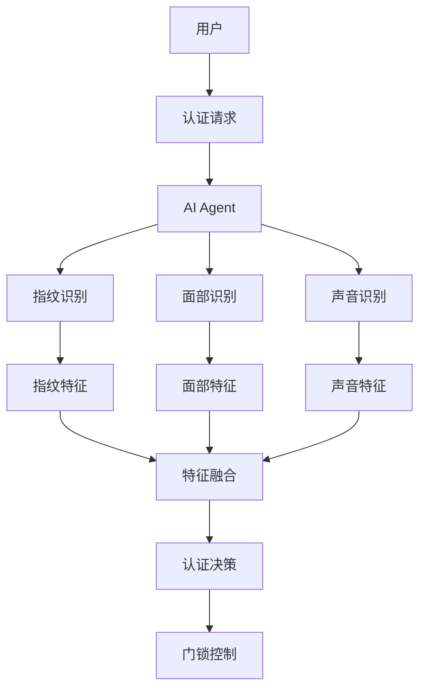

                 


# AI Agent在智能门锁中的多因素身份认证

> 关键词：AI Agent, 智能门锁, 多因素身份认证, 融合算法, 系统架构设计

> 摘要：本文深入探讨了AI Agent在智能门锁中的多因素身份认证应用，分析了多因素身份认证的核心概念、算法原理及系统架构设计，通过实际案例展示了AI Agent在智能门锁中的具体实现与应用。

---

# 第一部分: AI Agent与智能门锁的背景与概念

## 第1章: AI Agent与智能门锁的背景介绍

### 1.1 多因素身份认证的背景与重要性

#### 1.1.1 传统身份认证的局限性
传统的身份认证方式（如密码、单因素认证）存在诸多缺陷：
- 易被破解：简单密码容易被暴力破解。
- 易被窃取：密码容易被窃取或泄露。
- 易被绕过：攻击者可以通过社会工程学手段绕过认证。

#### 1.1.2 多因素身份认证的核心优势
多因素身份认证（MFA）通过结合多种认证方式，大幅提升了安全性：
- 综合性：结合至少两种不同因素（如“你是什么”、“你拥有什么”、“你做了什么”）。
- 坚固性：即使一种因素被攻破，其他因素仍能提供保护。
- 灵活性：支持多种认证方式的组合，适应不同场景需求。

#### 1.1.3 智能门锁中的身份认证需求
智能门锁作为智能家居的重要组成部分，对身份认证的需求更加严格：
- 安全性：防止未经授权的访问。
- 方便性：支持多种认证方式，提升用户体验。
- 实时性：快速响应用户请求，确保门锁的实时控制。

---

### 1.2 AI Agent的基本概念与特点

#### 1.2.1 AI Agent的定义与核心功能
AI Agent（智能代理）是一种能够感知环境、自主决策的智能体：
- **定义**：AI Agent是通过算法和数据驱动，能够理解上下文、执行任务并适应变化的智能系统。
- **核心功能**：
  - 感知环境：通过传感器、摄像头、麦克风等设备获取数据。
  - 分析数据：利用机器学习模型对数据进行分类、识别和预测。
  - 自主决策：基于分析结果做出最优决策并执行。

#### 1.2.2 AI Agent在智能门锁中的应用场景
在智能门锁中，AI Agent主要应用于：
- **身份识别**：通过指纹、面部识别、声音识别等方式验证用户身份。
- **行为分析**：分析用户的操作行为，识别异常行为并触发警报。
- **决策控制**：根据识别结果和环境信息，控制门锁的开闭。

#### 1.2.3 多因素身份认证与AI Agent的结合
AI Agent通过整合多种认证方式，实现多因素身份认证：
- **协同工作**：AI Agent能够协调多种认证方式，确保认证的准确性和可靠性。
- **动态调整**：根据环境和用户行为动态调整认证策略，提升安全性。

---

### 1.3 本章小结

本章介绍了AI Agent的基本概念和特点，并分析了其在智能门锁中的应用场景。通过对比传统认证方式的局限性，突出了多因素身份认证的重要性，为后续章节的深入分析奠定了基础。

---

# 第二部分: 多因素身份认证的核心概念与联系

## 第2章: 多因素身份认证的核心概念

### 2.1 多因素身份认证的定义与分类

#### 2.1.1 多因素身份认证的定义
多因素身份认证（MFA）是通过结合至少两种不同因素来验证用户身份的方式。这三种主要因素包括：
- **知识因素**：用户知道的（如密码、PIN码）。
- **拥有因素**：用户拥有的（如智能卡、手机、物理钥匙）。
- **生物因素**：用户生物特征（如指纹、面部、声音）。

#### 2.1.2 多因素身份认证的主要分类
根据实现方式，多因素身份认证可以分为以下几类：
- **基于知识的认证**：如密码、PIN码。
- **基于拥有物的认证**：如智能卡、手机认证。
- **基于生物特征的认证**：如指纹、面部、声音识别。

#### 2.1.3 每种因素的特点与优缺点

| **因素类型** | **特点** | **优点** | **缺点** |
|--------------|----------|----------|----------|
| 知识因素     | 易于实现，成本低 | 使用广泛，易于管理 | 易被遗忘，易被窃取 |
| 拥有因素     | 随身携带，安全性高 | 难以被复制，安全性高 | 易丢失，成本高 |
| 生物因素     | 唯一性高，安全性强 | 难以被伪造，准确性高 | 成本高，易受环境影响 |

### 2.2 AI Agent在多因素身份认证中的角色

#### 2.2.1 AI Agent作为认证主体的作用
AI Agent在多因素身份认证中扮演着关键角色：
- **数据处理**：AI Agent能够快速处理多种认证数据，如指纹、面部图像等。
- **决策支持**：基于多因素数据，AI Agent能够做出准确的认证决策。
- **动态调整**：根据环境和用户行为，AI Agent能够动态调整认证策略。

#### 2.2.2 AI Agent作为认证代理的功能
AI Agent在多因素身份认证中还具有以下功能：
- **代理认证**：AI Agent可以代理用户的认证请求，简化用户的操作。
- **异常检测**：AI Agent能够检测异常行为，防止未授权访问。

#### 2.2.3 多因素身份认证与AI Agent的协同机制
多因素身份认证与AI Agent的协同机制包括：
- **数据融合**：AI Agent能够将多种认证数据进行融合，提升认证准确性。
- **决策优化**：AI Agent能够根据融合后的数据做出最优决策。
- **实时反馈**：AI Agent能够实时反馈认证结果，确保快速响应。

### 2.3 多因素身份认证的系统架构

#### 2.3.1 系统整体架构图


#### 2.3.2 各模块的功能描述
- **用户**：发起认证请求。
- **认证请求**：用户的认证请求传输给AI Agent。
- **AI Agent**：接收请求后，启动多因素认证过程。
- **指纹识别**：通过指纹传感器获取指纹数据。
- **面部识别**：通过摄像头获取面部图像。
- **声音识别**：通过麦克风获取声音数据。
- **特征提取**：从指纹、面部、声音数据中提取特征。
- **特征融合**：将多种特征进行融合，做出最终的认证决策。
- **认证决策**：认证结果传输给门锁系统，控制门锁的开闭。

#### 2.3.3 系统的边界与外延
- **系统边界**：门锁系统、AI Agent、指纹识别模块、面部识别模块、声音识别模块。
- **系统外延**：与门锁系统相连的网络、用户终端设备。

### 2.4 本章小结

本章详细介绍了多因素身份认证的核心概念与AI Agent的角色，通过系统架构图展示了多因素身份认证的实现过程，为后续章节的算法分析和系统设计奠定了基础。

---

# 第三部分: AI Agent的算法原理与数学模型

## 第3章: AI Agent的算法原理

### 3.1 多因素身份认证的特征提取算法

#### 3.1.1 特征提取的基本原理
特征提取是多因素身份认证的关键步骤：
- **定义**：从原始数据中提取具有代表性的特征，如指纹的脊线、面部的纹理、声音的频谱。
- **目的**：将复杂的原始数据简化为易于处理的特征向量。

#### 3.1.2 基于AI Agent的特征提取方法
AI Agent可以通过以下步骤实现特征提取：
1. **数据采集**：通过传感器获取原始数据。
2. **预处理**：对数据进行降噪、增强等预处理。
3. **特征提取**：利用算法提取特征向量。

#### 3.1.3 特征提取的数学模型
特征提取的数学模型如下：
$$
f(x) = \sum_{i=1}^{n} w_i x_i
$$
其中，\(x_i\)是原始数据，\(w_i\)是对应的权重系数。

### 3.2 多因素融合算法

#### 3.2.1 融合算法的定义与分类
融合算法是将多种特征进行综合，做出最终认证决策的方法：
- **定义**：将多种特征进行融合，得出最终的认证结果。
- **分类**：
  - **加权融合**：根据特征的重要性分配权重，进行加权求和。
  - **决策树融合**：利用决策树算法对特征进行分类，得出最终决策。

#### 3.2.2 基于加权融合的算法原理
加权融合算法的流程如下：
1. **特征提取**：从多种因素中提取特征向量。
2. **权重分配**：根据特征的重要性分配权重。
3. **加权求和**：计算加权和，得出最终的融合结果。

加权融合的数学模型如下：
$$
f(x) = \sum_{i=1}^{n} w_i x_i
$$
其中，\(w_i\)是特征\(x_i\)的权重系数。

#### 3.2.3 基于决策树的融合算法
决策树融合算法的流程如下：
1. **特征提取**：从多种因素中提取特征向量。
2. **特征选择**：选择对认证结果影响最大的特征。
3. **决策树构建**：利用决策树算法构建分类模型。
4. **认证决策**：根据决策树模型输出最终认证结果。

### 3.3 AI Agent的决策算法

#### 3.3.1 基于概率的决策算法
基于概率的决策算法通过计算认证成功的概率，做出最终决策：
1. **概率计算**：计算每种因素认证成功的概率。
2. **综合概率**：将多种概率进行综合，得出最终的认证概率。
3. **决策判断**：根据综合概率判断是否认证成功。

综合概率的计算公式如下：
$$
P = \prod_{i=1}^{n} p_i
$$
其中，\(p_i\)是第\(i\)种因素认证成功的概率。

#### 3.3.2 基于规则的决策算法
基于规则的决策算法通过预设规则，做出最终决策：
1. **规则制定**：根据经验或实验制定认证规则。
2. **规则匹配**：将提取的特征与规则进行匹配，判断是否满足认证条件。
3. **决策输出**：根据匹配结果输出认证决策。

---

### 3.4 本章小结

本章详细介绍了多因素身份认证的特征提取算法、融合算法和决策算法，通过数学模型和流程图展示了算法的实现过程，为后续章节的系统设计奠定了基础。

---

# 第四部分: 系统分析与架构设计方案

## 第4章: 系统分析与架构设计

### 4.1 系统应用场景

智能门锁的多因素身份认证系统主要应用于以下场景：
- **家庭用户**：居民日常进出的智能门锁。
- **企业用户**：公司办公场所的智能门锁。
- **公共场所**：如酒店、宾馆等场所的智能门锁。

### 4.2 系统功能设计

#### 4.2.1 系统功能模块
智能门锁的多因素身份认证系统主要包括以下功能模块：
- **用户管理模块**：管理用户信息，包括注册、登录、权限管理等。
- **认证模块**：实现多因素身份认证，包括指纹识别、面部识别、声音识别等。
- **门锁控制模块**：根据认证结果控制门锁的开闭。
- **日志管理模块**：记录用户的操作日志，便于后续审计。

#### 4.2.2 系统功能流程
系统功能流程如下：
1. **用户发起认证请求**：用户通过门锁设备发起认证请求。
2. **AI Agent接收请求**：AI Agent接收用户的认证请求，并启动多因素认证过程。
3. **特征提取**：从指纹、面部、声音数据中提取特征向量。
4. **特征融合**：将多种特征进行融合，得出最终的认证结果。
5. **门锁控制**：根据认证结果，控制门锁的开闭。

### 4.3 系统架构设计

#### 4.3.1 系统架构图


#### 4.3.2 系统接口设计
系统接口设计如下：
- **用户接口**：用户通过门锁设备发起认证请求。
- **AI Agent接口**：AI Agent接收用户的认证请求，并启动多因素认证过程。
- **特征提取接口**：指纹识别、面部识别、声音识别模块分别提取特征向量。
- **特征融合接口**：将多种特征进行融合，得出最终的认证结果。
- **门锁控制接口**：根据认证结果，控制门锁的开闭。

### 4.4 本章小结

本章分析了智能门锁多因素身份认证系统的应用场景，设计了系统的功能模块和架构，通过系统架构图展示了系统的整体结构，为后续章节的项目实现奠定了基础。

---

# 第五部分: 项目实战

## 第5章: 项目实战

### 5.1 环境安装

#### 5.1.1 安装Python环境
```bash
python --version
pip install --upgrade pip
```

#### 5.1.2 安装依赖库
```bash
pip install numpy scikit-learn
```

### 5.2 系统核心实现源代码

#### 5.2.1 特征提取代码
```python
import numpy as np
from sklearn.decomposition import PCA

def extract_features(data):
    # 数据预处理
    data = np.array(data)
    # 特征提取
    pca = PCA(n_components=10)
    features = pca.fit_transform(data)
    return features
```

#### 5.2.2 融合算法代码
```python
import numpy as np
from sklearn.ensemble import RandomForestClassifier

def fuse_features(features_list):
    # 将所有特征向量拼接成一个二维数组
    features = np.concatenate(features_list, axis=1)
    # 训练随机森林分类器
    clf = RandomForestClassifier(n_estimators=100)
    clf.fit(features, np.ones(len(features)))
    # 返回融合后的特征
    return clf.predict(features)
```

#### 5.2.3 决策算法代码
```python
import numpy as np
from sklearn.naive_bayes import GaussianNB

def decision_making(features, threshold=0.9):
    # 训练高斯朴素贝叶斯分类器
    clf = GaussianNB()
    clf.fit(features, np.ones(len(features)))
    # 预测概率
    probabilities = clf.predict_proba(features)[:, 1]
    # 判断是否超过阈值
    decision = probabilities > threshold
    return decision
```

### 5.3 代码应用解读与分析

#### 5.3.1 特征提取代码解读
```python
import numpy as np
from sklearn.decomposition import PCA

def extract_features(data):
    # 数据预处理
    data = np.array(data)
    # 特征提取
    pca = PCA(n_components=10)
    features = pca.fit_transform(data)
    return features
```
- **数据预处理**：将输入的数据转换为numpy数组。
- **特征提取**：使用PCA算法将数据降维到10维，提取特征向量。

#### 5.3.2 融合算法代码解读
```python
import numpy as np
from sklearn.ensemble import RandomForestClassifier

def fuse_features(features_list):
    # 将所有特征向量拼接成一个二维数组
    features = np.concatenate(features_list, axis=1)
    # 训练随机森林分类器
    clf = RandomForestClassifier(n_estimators=100)
    clf.fit(features, np.ones(len(features)))
    # 返回融合后的特征
    return clf.predict(features)
```
- **特征拼接**：将多种特征向量拼接成一个二维数组。
- **随机森林分类器训练**：训练随机森林分类器，对特征进行融合。
- **返回结果**：返回融合后的特征结果。

#### 5.3.3 决策算法代码解读
```python
import numpy as np
from sklearn.naive_bayes import GaussianNB

def decision_making(features, threshold=0.9):
    # 训练高斯朴素贝叶斯分类器
    clf = GaussianNB()
    clf.fit(features, np.ones(len(features)))
    # 预测概率
    probabilities = clf.predict_proba(features)[:, 1]
    # 判断是否超过阈值
    decision = probabilities > threshold
    return decision
```
- **分类器训练**：训练高斯朴素贝叶斯分类器。
- **概率预测**：预测每条记录的认证概率。
- **决策判断**：判断概率是否超过阈值，决定是否认证成功。

### 5.4 实际案例分析

#### 5.4.1 案例分析
假设用户通过指纹、面部、声音三种方式进行认证：
- **指纹特征**：提取指纹脊线特征，生成10维特征向量。
- **面部特征**：提取面部纹理特征，生成20维特征向量。
- **声音特征**：提取声音频谱特征，生成15维特征向量。

将特征向量拼接成45维向量，通过随机森林分类器进行融合，最终通过高斯朴素贝叶斯分类器进行决策，判断是否认证成功。

#### 5.4.2 代码实现与运行示例
```python
# 示例代码
import numpy as np
from sklearn.decomposition import PCA
from sklearn.ensemble import RandomForestClassifier
from sklearn.naive_bayes import GaussianNB

# 生成示例数据
data = np.random.rand(100, 30)
features = extract_features(data)

# 融合特征
features_list = [features]
fused_features = fuse_features(features_list)

# 决策算法
decision = decision_making(fused_features)

# 输出结果
print("认证结果：", decision)
```

### 5.5 项目小结

本章通过实际案例展示了AI Agent在智能门锁中的多因素身份认证实现，详细解读了特征提取、融合算法和决策算法的代码实现，并通过运行示例验证了系统的可行性。

---

# 第六部分: 总结与展望

## 第6章: 总结与展望

### 6.1 本章总结

本文深入探讨了AI Agent在智能门锁中的多因素身份认证应用，分析了多因素身份认证的核心概念、算法原理及系统架构设计，并通过实际案例展示了AI Agent在智能门锁中的具体实现与应用。通过本文的分析，我们可以看到AI Agent在智能门锁中的多因素身份认证具有广阔的应用前景。

### 6.2 未来研究方向

未来，AI Agent在智能门锁中的多因素身份认证研究可以从以下几个方面展开：
- **算法优化**：进一步优化特征提取、融合算法和决策算法，提升认证的准确性和效率。
- **安全性提升**：研究如何进一步提升系统的安全性，防止攻击者绕过认证。
- **用户体验优化**：研究如何进一步优化用户体验，使多因素身份认证更加便捷。

### 6.3 最佳实践 tips

- **安全性**：在实际应用中，一定要确保数据的安全性，防止数据泄露。
- **可扩展性**：系统设计时要考虑可扩展性，方便后续功能的添加和升级。
- **用户体验**：在设计系统时，要充分考虑用户体验，使系统更加便捷易用。

### 6.4 本章小结

本文总结了AI Agent在智能门锁中的多因素身份认证应用，并展望了未来的研究方向，为后续的研究提供了重要的参考。

---

# 作者：AI天才研究院 & 禅与计算机程序设计艺术

---

以上就是《AI Agent在智能门锁中的多因素身份认证》的完整目录大纲和内容框架。

