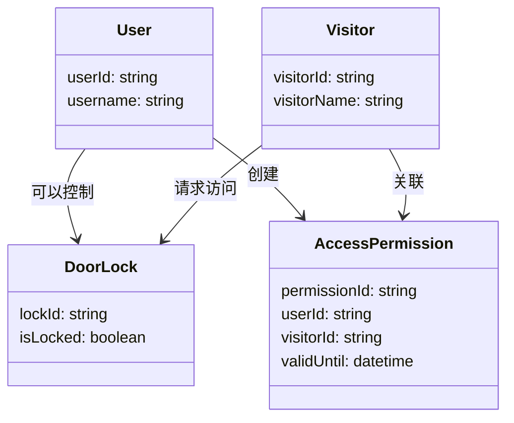
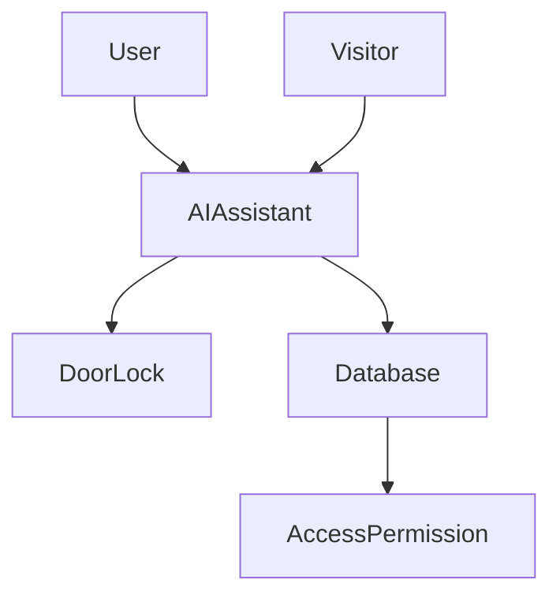
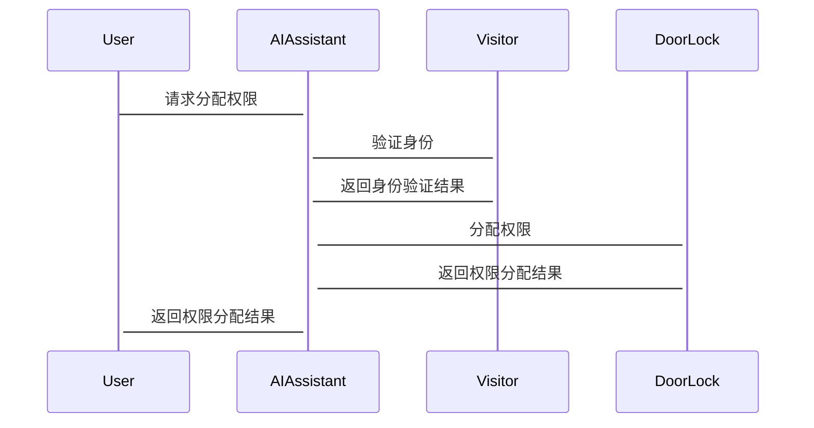

                 


# AI Agent在智能门锁中的访客权限管理

> 关键词：智能门锁，AI Agent，访客权限管理，实体关系，算法原理，系统架构，项目实战

> 摘要：本文深入探讨了AI Agent在智能门锁中的访客权限管理的应用，从背景介绍、核心概念、算法原理、系统架构到项目实战，全面分析了AI Agent如何提升智能门锁的访客权限管理能力。文章通过详细的技术分析和实际案例，展示了AI Agent在智能门锁中的优势和实际应用价值。

---

# 第1章: 智能门锁与访客权限管理背景

## 1.1 智能门锁的发展历程

### 1.1.1 传统门锁的局限性
传统的机械门锁虽然成本低廉，但存在以下问题：
- 容易被暴力破坏。
- 密钥管理复杂，一旦丢失或被盗，需要更换全部锁具。
- 无法记录开锁记录，无法追溯权限滥用行为。

### 1.1.2 智能门锁的定义与特点
智能门锁是一种结合了物联网技术、指纹识别、蓝牙/NFC、密码锁等技术的电子锁具。其特点包括：
- 远程开锁：支持手机APP远程控制。
- 多种开门方式：指纹、密码、刷卡、钥匙等多种开门方式。
- 记录功能：可以记录每次开门的时间、用户等信息。
- 网络连接：可以通过Wi-Fi或蓝牙与互联网连接，实现远程监控和管理。

### 1.1.3 智能门锁的应用场景
- 家庭住宅：提供访客临时权限。
- 商业楼宇：管理访客和员工的权限。
- 公共场所：如酒店、民宿等，提供访客临时权限。

## 1.2 访客权限管理的重要性

### 1.2.1 访客权限管理的基本概念
访客权限管理是指为访客分配临时访问权限，确保访客在授权时间内可以访问特定区域或资源。

### 1.2.2 访客权限管理的常见问题
- 权限分配不及时：访客到达时无法立即获得访问权限。
- 权限管理复杂：需要手动分配和撤销权限。
- 记录不完整：无法追溯访客的访问记录。

### 1.2.3 访客权限管理的边界与外延
- 访客权限管理的边界：仅限于访问权限的分配和撤销。
- 访客权限管理的外延：包括访客身份验证、权限记录、权限提醒等功能。

## 1.3 AI Agent在智能门锁中的应用前景

### 1.3.1 AI Agent的定义与特点
AI Agent（人工智能代理）是一种能够感知环境并自主决策的智能体。其特点包括：
- 智能性：能够理解用户需求并自主决策。
- 反应性：能够实时感知环境变化并做出反应。
- 学习能力：能够通过数据学习优化决策过程。

### 1.3.2 AI Agent在智能门锁中的优势
- 自动分配权限：AI Agent可以根据访客信息自动分配权限。
- 实时监控：AI Agent可以实时监控门锁状态并做出相应决策。
- 数据分析：AI Agent可以分析访问记录，发现异常行为并发出警报。

### 1.3.3 AI Agent访客权限管理的潜在应用领域
- 智能家居：访客权限管理。
- 商业楼宇：访客权限管理。
- 公共场所：访客权限管理。

## 1.4 本章小结
本章介绍了智能门锁的发展历程、访客权限管理的重要性以及AI Agent在智能门锁中的应用前景。通过对比传统门锁和智能门锁的特点，突出了AI Agent在智能门锁中的优势。

---

# 第2章: 核心概念与联系

## 2.1 AI Agent与智能门锁的实体关系

### 2.1.1 ER实体关系图
```mermaid
erDiagram
    actor User {
        +string userId
        +string username
    }
    actor Visitor {
        +string visitorId
        +string visitorName
    }
    entity DoorLock {
        +string lockId
        +boolean isLocked
    }
    entity AccessPermission {
        +string permissionId
        +string userId
        +string visitorId
        +datetime validUntil
    }
    User -> DoorLock: 可以控制
    Visitor -> DoorLock: 请求访问
    User -> AccessPermission: 创建
    Visitor -> AccessPermission: 关联
```

### 2.1.2 概念属性特征对比
| 实体 | 属性 |
|------|------|
| User | userId, username |
| Visitor | visitorId, visitorName |
| DoorLock | lockId, isLocked |
| AccessPermission | permissionId, userId, visitorId, validUntil |

## 2.2 访客权限管理的对比分析

### 2.2.1 传统权限管理与AI Agent
| 特性 | 传统权限管理 | AI Agent |
|------|--------------|----------|
| 权限分配 | 手动分配 | 自动分配 |
| 权限监控 | 无实时监控 | 实时监控 |
| 数据分析 | 无 | 有 |

---

# 第3章: 算法原理

## 3.1 基于AI Agent的访客权限管理算法

### 3.1.1 算法流程
```mermaid
graph TD
    A[开始] -> B[接收访客请求]
    B -> C[验证访客身份]
    C -> D[检查权限]
    D -> E[分配权限]
    E -> F[记录权限]
    F -> G[结束]
```

### 3.1.2 算法数学模型
$$
\text{权限分配} = f(\text{访客身份}, \text{时间}, \text{访问记录})
$$

其中，$f$ 是一个基于AI的决策函数，可以根据访客的身份、时间、历史访问记录等因素，动态调整权限。

### 3.1.3 算法实现
```python
class AIAssistant:
    def __init__(self):
        self.access_permissions = {}

    def allocate_permission(self, visitor_id, time):
        # 假设有一个访问策略函数
        if is_allowed(visitor_id, time):
            permission_id = generate_permission_id(visitor_id, time)
            self.access_permissions[permission_id] = {
                'visitor_id': visitor_id,
                'valid_until': time + 24*3600  # 24小时有效
            }
            return permission_id
        else:
            return None

    def is_allowed(self, visitor_id, time):
        # 示例访问策略：仅允许工作日的白天访问
        day_of_week = time.weekday()
        hour = time.hour
        return 0 <= day_of_week <= 4 and 9 <= hour <= 18

    def generate_permission_id(self, visitor_id, time):
        return f"{visitor_id}_{time.timestamp()}"
```

---

# 第4章: 系统分析与架构设计

## 4.1 系统功能设计

### 4.1.1 领域模型类图


## 4.2 系统架构设计

### 4.2.1 系统架构图


## 4.3 系统接口设计


---

# 第5章: 项目实战

## 5.1 环境安装

### 5.1.1 安装Python和依赖库
```bash
pip install mermaid.py
pip install datetime
```

## 5.2 系统核心实现

### 5.2.1 核心代码实现
```python
import datetime

class DoorLock:
    def __init__(self, lock_id):
        self.lock_id = lock_id
        self.is_locked = True

    def lock(self):
        self.is_locked = True

    def unlock(self):
        self.is_locked = False

class AccessPermission:
    def __init__(self, permission_id, user_id, visitor_id, valid_until):
        self.permission_id = permission_id
        self.user_id = user_id
        self.visitor_id = visitor_id
        self.valid_until = valid_until

class AIAssistant:
    def __init__(self):
        self.access_permissions = {}

    def allocate_permission(self, visitor_id, time):
        if self.is_allowed(visitor_id, time):
            permission_id = self.generate_permission_id(visitor_id, time)
            permission = AccessPermission(
                permission_id, None, visitor_id, time + datetime.timedelta(days=1)
            )
            self.access_permissions[permission_id] = permission
            return permission_id
        else:
            return None

    def is_allowed(self, visitor_id, time):
        # 示例策略：仅允许工作日的白天访问
        day_of_week = time.weekday()
        hour = time.hour
        return 0 <= day_of_week <= 4 and 9 <= hour <= 18

    def generate_permission_id(self, visitor_id, time):
        return f"{visitor_id}_{time.timestamp()}"
```

---

# 第6章: 最佳实践

## 6.1 小结
本文详细介绍了AI Agent在智能门锁中的访客权限管理的应用，从背景、核心概念、算法原理到系统架构和项目实战，为读者提供了全面的技术指导。

## 6.2 注意事项
- 确保AI Agent的安全性，防止恶意攻击。
- 定期维护系统，更新权限策略。

## 6.3 拓展阅读
- 《智能门锁的物联网实现》
- 《AI Agent在权限管理中的应用》

---

# 作者：AI天才研究院/AI Genius Institute & 禅与计算机程序设计艺术 /Zen And The Art of Computer Programming

