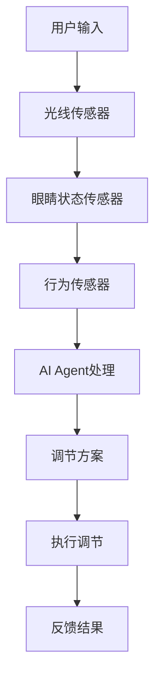
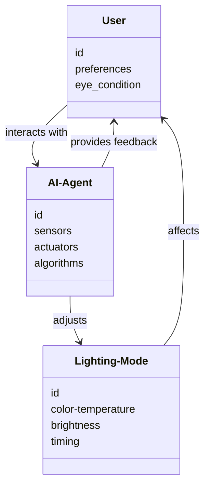
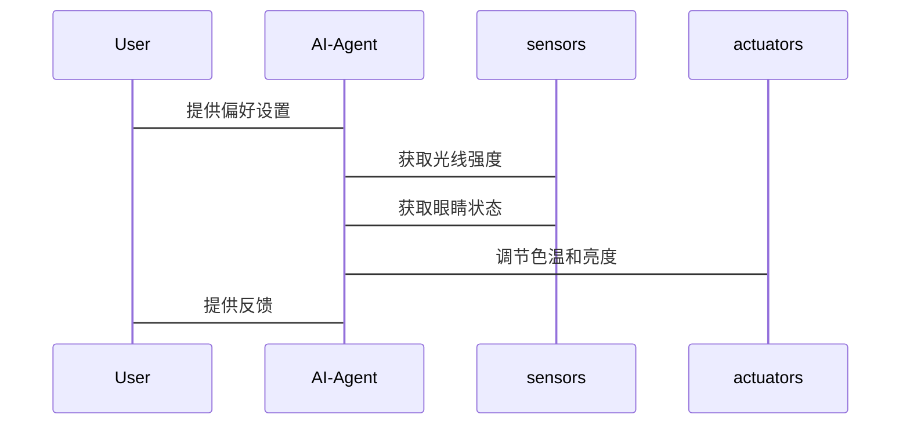

                 


# AI Agent在智能阅读灯中的护眼模式调节

**关键词**：AI Agent，智能阅读灯，护眼模式，光照调节，健康护眼

**摘要**：随着人工智能技术的快速发展，AI Agent在智能设备中的应用越来越广泛。本文将探讨AI Agent在智能阅读灯中的护眼模式调节，分析其技术原理和实现方法，展示如何通过动态调节色温和亮度，优化用户的阅读体验，保护眼睛健康。

---

# 目录

## 第1章: AI Agent与智能阅读灯的背景介绍

### 1.1 问题背景
#### 1.1.1 阅读灯的护眼需求
- 长时间阅读对眼睛的影响
- 传统阅读灯的局限性
- AI技术在护眼模式中的潜力

#### 1.1.2 问题描述
- 护眼模式调节的核心问题
- 用户需求与技术实现的矛盾
- AI Agent在护眼模式调节中的角色

#### 1.1.3 问题解决
- AI Agent的核心优势
- 护眼模式调节的解决方案
- AI Agent在智能阅读灯中的实现路径

#### 1.1.4 边界与外延
- AI Agent的功能边界
- 护眼模式调节的适用场景
- 与其他功能的交互关系

#### 1.1.5 核心要素组成
- AI Agent的组成结构
- 护眼模式调节的关键参数
- 系统整体架构的要素

## 第2章: AI Agent与护眼模式调节的核心概念

### 2.1 核心概念原理
#### 2.1.1 AI Agent的基本原理
- AI Agent的定义与功能
- AI Agent在护眼模式调节中的工作原理
- AI Agent与传统算法的对比

#### 2.1.2 护眼模式调节的实现机制
- 光照调节的核心参数（色温、亮度）
- 护眼模式调节的算法逻辑
- AI Agent与护眼模式调节的结合点

### 2.2 核心概念属性对比
#### 2.2.1 AI Agent与传统算法的对比
- 算法的灵活性与适应性
- 资源消耗与性能对比
- 维护与更新的难易程度

#### 2.2.2 护眼模式调节的参数对比
- 色温调节的范围与精度
- 亮度调节的范围与精度
- 光照调节的响应速度

#### 2.2.3 AI Agent在护眼模式调节中的优势
- 智能学习与自适应能力
- 高精度的调节能力
- 用户体验的优化

### 2.3 ER实体关系图

```mermaid
erDiagram
    class User {
        id
        preferences
        eye_condition
    }
    class AI-Agent {
        id
        sensors
        actuators
        algorithms
    }
    class Lighting-Mode {
        id
        color-temperature
        brightness
        timing
    }
    User --> AI-Agent: interacts with
    AI-Agent --> Lighting-Mode: adjusts
    AI-Agent --> User: provides feedback
    Lighting-Mode --> User: affects
```

---

## 第3章: AI Agent护眼模式调节的算法原理

### 3.1 算法原理概述
#### 3.1.1 AI Agent的工作流程
- 数据采集与分析
- 算法决策与执行
- 反馈与优化

#### 3.1.2 护眼模式调节的算法流程
- 采集用户数据（光线强度、用户行为、眼睛状态）
- 分析数据并生成调节方案
- 执行调节并反馈结果

### 3.2 算法流程图



### 3.3 数学模型与公式

#### 3.3.1 色温调节模型
$$ T = f(t, s, p) $$
- \( T \): 调节后的色温
- \( t \): 时间
- \( s \): 用户眼睛状态
- \( p \): 用户偏好

#### 3.3.2 亮度调节模型
$$ B = g(t, s, p) $$
- \( B \): 调节后的亮度
- \( t \): 时间
- \( s \): 用户眼睛状态
- \( p \): 用户偏好

### 3.4 代码实现
```python
class AI-Agent:
    def __init__(self, sensors, actuators):
        self.sensors = sensors
        self.actuators = actuators

    def adjust_lighting(self, user_preferences):
        # 采集数据
        light_intensity = self.sensors.get_light()
        eye_condition = self.sensors.get_eye_condition()
        user_preferences = user_preferences

        # 计算调节方案
        new_color_temp = self.calculate_color_temp(light_intensity, eye_condition, user_preferences)
        new_brightness = self.calculate_brightness(light_intensity, eye_condition, user_preferences)

        # 执行调节
        self.actuators.set_color_temp(new_color_temp)
        self.actuators.set_brightness(new_brightness)

    def calculate_color_temp(self, light_intensity, eye_condition, preferences):
        # 示例算法：基于眼睛状态和偏好计算色温
        base_temp = 5000  # 默认色温
        adjustment = preferences['color_temp'] + eye_condition['strain'] * 100
        return max(3000, min(6500, base_temp + adjustment))

    def calculate_brightness(self, light_intensity, eye_condition, preferences):
        # 示例算法：基于光线强度和偏好计算亮度
        base_bright = 100  # 默认亮度
        adjustment = preferences['brightness'] + eye_condition['strain'] * 10
        return max(10, min(250, base_bright + adjustment))
```

---

## 第4章: 系统分析与架构设计

### 4.1 项目背景与目标
- 项目目标：优化阅读灯的护眼模式
- 项目背景：AI技术在智能设备中的应用

### 4.2 系统功能设计
#### 4.2.1 领域模型


#### 4.2.2 系统架构


### 4.3 接口设计
- 用户接口：API调用
- 系统接口：传感器与执行器的交互

### 4.4 交互流程


---

## 第5章: 项目实战与案例分析

### 5.1 环境安装
- Python环境配置
- 传感器与执行器的安装

### 5.2 核心代码实现
```python
def adjust_lighting(user_preferences):
    # 示例代码：基于用户偏好调整灯光
    color_temp = calculate_color_temp(user_preferences)
    brightness = calculate_brightness(user_preferences)
    return (color_temp, brightness)
```

### 5.3 代码解读与分析
- 代码功能分析
- 实际案例分析

### 5.4 项目总结
- 项目成果
- 经验与教训

---

## 第6章: 总结与展望

### 6.1 全文总结
- AI Agent在护眼模式调节中的作用
- 技术实现的总结

### 6.2 未来展望
- 技术的进一步优化
- 应用场景的拓展

---

**作者：AI天才研究院/AI Genius Institute & 禅与计算机程序设计艺术 /Zen And The Art of Computer Programming**

