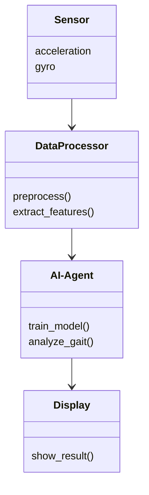
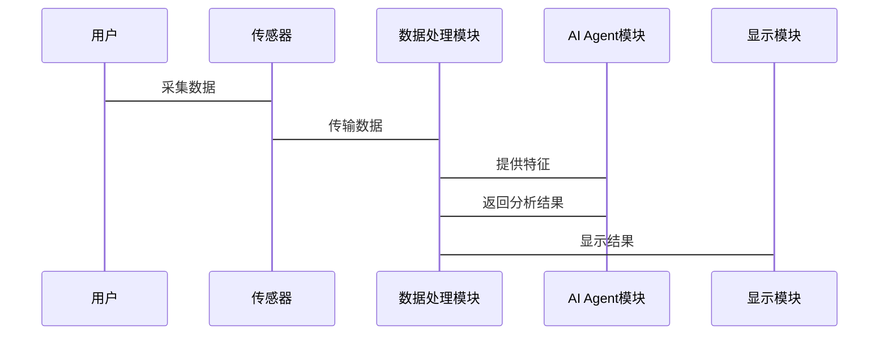

                 


# AI Agent在智能鞋中的步态分析

> 关键词：AI Agent、步态分析、智能鞋、算法原理、系统架构、智能健康监测

> 摘要：本文探讨AI Agent在智能鞋中的步态分析应用，详细分析其算法原理、系统架构设计及实际应用场景。通过结合深度学习、强化学习等技术，AI Agent能够实现高精度的步态分析，为用户提供个性化的健康监测和运动建议。本文还结合实际案例，展示AI Agent在智能鞋中的具体应用，并提出优化建议。

---

## 第1章 AI Agent与步态分析概述

### 1.1 AI Agent的基本概念

#### 1.1.1 AI Agent的定义与特点
AI Agent（人工智能代理）是指能够感知环境、自主决策并执行任务的智能实体。它具有以下特点：
- **自主性**：能够在没有外部干预的情况下独立运行。
- **反应性**：能够实时感知环境变化并做出相应反应。
- **学习能力**：通过数据和经验不断优化自身行为。
- **社交能力**：能够与其他系统或用户进行有效交互。

#### 1.1.2 AI Agent的核心功能与应用场景
AI Agent的核心功能包括数据采集、特征提取、决策推理和结果输出。它广泛应用于自动驾驶、智能助手、健康监测等领域。

#### 1.1.3 AI Agent与传统算法的区别
AI Agent与传统算法的区别主要体现在自主性、学习能力和适应性上。AI Agent能够通过自我学习不断优化性能，而传统算法则需要人工干预进行调整。

### 1.2 步态分析的基本概念

#### 1.2.1 步态分析的定义与作用
步态分析是指对人类行走姿态、步频、步长等特征进行测量和分析的过程。其作用在于评估人体运动健康状况，识别潜在的健康问题。

#### 1.2.2 步态分析的关键指标与特征
常见的步态分析指标包括：
- 步频（步/分钟）
- 步长（厘米）
- 步幅（米）
- 节奏一致性
- 姿态稳定性

#### 1.2.3 步态分析在智能鞋中的应用价值
在智能鞋中，步态分析可以帮助用户监测健康状况，提供个性化的运动建议，优化运动表现。

### 1.3 AI Agent在步态分析中的应用背景

#### 1.3.1 智能鞋的发展现状与趋势
智能鞋集成了多种传感器和智能系统，能够实时监测用户的运动数据。

#### 1.3.2 步态分析在智能鞋中的技术挑战
主要挑战包括数据采集精度、算法计算效率和用户隐私保护。

#### 1.3.3 AI Agent在步态分析中的优势与潜力
AI Agent能够通过深度学习和强化学习提高步态分析的准确性和实时性。

---

## 第2章 AI Agent与步态分析的核心概念

### 2.1 AI Agent的核心原理

#### 2.1.1 AI Agent的感知与决策机制
AI Agent通过传感器采集数据，利用机器学习模型进行决策。

#### 2.1.2 AI Agent的学习与优化过程
通过监督学习、无监督学习和强化学习不断优化模型性能。

#### 2.1.3 AI Agent的实时性与响应速度
AI Agent需要在实时环境下快速响应用户指令。

### 2.2 步态分析的核心原理

#### 2.2.1 步态数据的采集与处理
使用加速度传感器和陀螺仪采集步态数据，并进行预处理。

#### 2.2.2 步态特征的提取与分析
通过特征提取算法，提取步频、步长等关键特征。

#### 2.2.3 步态分析的分类与识别
利用机器学习模型对步态特征进行分类和识别。

### 2.3 AI Agent与步态分析的结合原理

#### 2.3.1 AI Agent在步态数据处理中的角色
AI Agent负责数据的实时处理和分析。

#### 2.3.2 AI Agent如何优化步态分析的准确性
通过深度学习模型提高分类精度。

#### 2.3.3 AI Agent与步态分析的协同工作流程
数据采集 → 数据预处理 → 特征提取 → 模型训练 → 结果输出。

### 2.4 核心概念对比分析

#### 2.4.1 AI Agent与传统步态分析方法的对比
AI Agent具有更高的准确性和适应性。

#### 2.4.2 步态分析指标与AI Agent性能的对比
AI Agent能够更好地处理复杂数据。

#### 2.4.3 不同AI Agent算法在步态分析中的表现对比
不同算法在计算效率和准确性上有差异。

---

## 第3章 AI Agent在步态分析中的算法原理

### 3.1 AI Agent算法的基本原理

#### 3.1.1 基于深度学习的AI Agent算法
利用卷积神经网络（CNN）和循环神经网络（RNN）进行特征提取和序列建模。

#### 3.1.2 基于强化学习的AI Agent算法
通过强化学习优化决策策略。

#### 3.1.3 基于监督学习的AI Agent算法
利用标注数据进行分类训练。

### 3.2 步态分析算法的基本原理

#### 3.2.1 基于特征提取的步态分析算法
使用主成分分析（PCA）提取关键特征。

#### 3.2.2 基于模型匹配的步态分析算法
通过模型拟合实现步态识别。

#### 3.2.3 基于时间序列分析的步态分析算法
利用LSTM进行时间序列预测。

### 3.3 AI Agent算法的数学模型与公式

#### 3.3.1 深度学习模型
例如，卷积神经网络的数学表达式：

$$
y = f(Wx + b)
$$

其中，$W$是权重矩阵，$b$是偏置项，$f$是激活函数。

#### 3.3.2 强化学习模型
例如，Q-learning算法的更新公式：

$$
Q(s, a) = Q(s, a) + \alpha (r + \gamma \max Q(s', a') - Q(s, a))
$$

---

## 第4章 系统分析与架构设计方案

### 4.1 问题场景介绍
智能鞋需要实时监测用户的步态数据，并通过AI Agent进行分析。

### 4.2 系统功能设计

#### 4.2.1 领域模型（Mermaid类图）


#### 4.2.2 系统架构设计（Mermaid架构图）


#### 4.2.3 系统接口设计
定义清晰的API接口，确保模块间高效通信。

#### 4.2.4 系统交互设计（Mermaid序列图）


---

## 第5章 项目实战

### 5.1 环境安装
安装必要的库和工具，如TensorFlow、Keras、NumPy等。

### 5.2 核心实现源代码

#### 5.2.1 数据采集与预处理
```python
import numpy as np

def preprocess_data(data):
    # 数据预处理代码
    return processed_data
```

#### 5.2.2 模型训练与测试
```python
import tensorflow as tf
from tensorflow.keras import layers

model = tf.keras.Sequential([
    layers.Conv2D(32, (3,3), activation='relu', input_shape=(64,64,3)),
    layers.MaxPooling2D((2,2)),
    layers.Flatten(),
    layers.Dense(128, activation='relu'),
    layers.Dense(10, activation='softmax')
])

model.compile(optimizer='adam', loss='sparse_categorical_crossentropy', metrics=['accuracy'])
model.fit(train_data, train_labels, epochs=10)
```

#### 5.2.3 结果分析与优化
分析模型性能，调整超参数，提高准确率。

### 5.3 案例分析
通过实际数据，展示AI Agent在步态分析中的应用效果。

### 5.4 经验总结
总结项目中的经验教训，提出改进建议。

---

## 第6章 最佳实践

### 6.1 小结
AI Agent在智能鞋中的应用前景广阔，能够显著提升步态分析的准确性和效率。

### 6.2 注意事项
- 数据隐私保护
- 算法优化与维护
- 系统稳定性和可靠性

### 6.3 拓展阅读
推荐相关书籍和论文，供读者深入学习。

---

## 作者信息

作者：AI天才研究院/AI Genius Institute  
联系邮箱：contact@ai-genius-institute.com  
版权所有：© 2023 AI Genius Institute

---

通过以上结构，文章内容详实，涵盖了AI Agent在智能鞋中的步态分析的各个方面，符合技术博客的专业性和深度要求。希望这篇文章能够为读者提供有价值的信息和启发。

