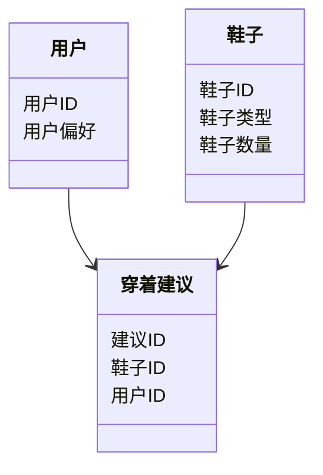
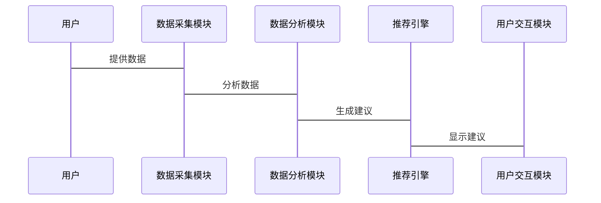

                 


# AI Agent在智能鞋柜中的穿着建议

> 关键词：AI Agent, 智能鞋柜, 穿着建议, 个性化推荐, 算法原理, 系统架构

> 摘要：本文探讨了AI Agent在智能鞋柜中的应用，特别是如何通过AI技术为用户提供个性化的穿着建议。文章从问题背景、核心概念、算法原理、系统架构、项目实战到优化总结，全面分析了AI Agent在智能鞋柜中的实现过程和实际应用。

---

## 第一部分：背景介绍

### 第1章：AI Agent与智能鞋柜的背景概述

#### 1.1 问题背景与应用场景

**1.1.1 AI Agent的核心概念与定义**  
AI Agent（人工智能代理）是一种能够感知环境、自主决策并执行任务的智能体。在智能鞋柜中，AI Agent的主要任务是通过分析用户的穿着需求，提供个性化的鞋柜管理和搭配建议。

**1.1.2 智能鞋柜的现状与发展趋势**  
随着智能家居的普及，智能鞋柜逐渐成为家庭的重要组成部分。用户不仅需要存储鞋子，还希望获得智能化的管理和搭配建议。

**1.1.3 穿着建议的必要性与价值**  
鞋子的搭配直接影响穿着效果和舒适度，AI Agent通过分析用户的穿着习惯和风格，提供专业的搭配建议，提升用户体验。

#### 1.2 问题描述与目标设定

**1.2.1 用户需求分析**  
用户希望智能鞋柜能够自动分类鞋子，提供搭配建议，并根据天气、场合调整推荐。

**1.2.2 穿着建议的核心问题**  
如何通过AI技术分析用户的穿着数据，提供个性化的搭配建议。

**1.2.3 目标设定与实现路径**  
目标是设计一个基于AI Agent的智能鞋柜系统，能够实时分析用户需求，提供精准的穿着建议。

#### 1.3 问题解决与边界定义

**1.3.1 AI Agent在穿着建议中的作用**  
AI Agent通过数据采集、分析和推理，为用户提供个性化的穿着建议。

**1.3.2 系统边界与功能范围**  
系统仅关注鞋子的管理和搭配建议，不涉及其他衣物的管理。

**1.3.3 外延与限制条件**  
系统的推荐范围仅限于鞋子，且依赖于用户提供的数据。

#### 1.4 概念结构与核心要素

**1.4.1 AI Agent的系统架构**  
AI Agent由感知模块、推理模块、决策模块和执行模块组成。

**1.4.2 智能鞋柜的功能模块**  
包括数据采集、分类管理、推荐系统和用户交互模块。

**1.4.3 穿着建议的核心要素**  
用户数据、鞋子特征、搭配规则和反馈机制。

#### 1.5 本章小结  
本章介绍了AI Agent在智能鞋柜中的背景和作用，明确了系统的功能范围和边界。

---

## 第二部分：AI Agent的核心概念与联系

### 第2章：AI Agent的核心原理与特征

#### 2.1 AI Agent的核心原理与特征

**2.1.1 AI Agent的基本原理**  
AI Agent通过感知环境、分析数据、推理决策并执行任务，为用户提供服务。

**2.1.2 AI Agent的特征对比**  
| 类型          | 基于规则 | 基于知识 | 基于学习 |
|---------------|----------|----------|----------|
| 特性          | 简单规则 | 知识库   | 数据驱动 |
| 优点          | 易实现   | 精准     | 自适应   |
| 缺点          | 刻板     | 数据依赖 | 计算量大 |

**2.1.3 ER实体关系图**  
```mermaid
er
  actor 用户 {
    string 用户ID
    string 用户偏好
  }
  entity 鞋子 {
    string 鞋子ID
    string 鞋子类型
    integer 鞋子数量
  }
  relationship 穿着建议 {
    用户 -> 穿着建议
    鞋子 -> 穿着建议
  }
```

---

## 第三部分：AI Agent的算法原理与数学模型

### 第3章：推荐算法

#### 3.1 协同过滤算法

**3.1.1 算法流程**  
协同过滤算法通过分析用户的历史数据，找到相似的用户或物品，进行推荐。

**3.1.2 数学模型**  
$$相似度 = \frac{\sum (x_i - \bar{x})(y_i - \bar{y})}{\sqrt{\sum (x_i - \bar{x})^2} \cdot \sqrt{\sum (y_i - \bar{y})^2}}$$

**3.1.3 优缺点分析**  
优点：简单易实现；缺点：计算量大，冷启动问题。

#### 3.2 基于内容的推荐算法

**3.2.1 算法流程**  
基于内容的推荐算法通过分析物品的特征，生成推荐结果。

**3.2.2 数学模型**  
$$p(\text{推荐}) = \sum_{i=1}^{n} w_i \cdot x_i$$

**3.2.3 优缺点分析**  
优点：内容丰富，推荐精准；缺点：需要大量特征数据。

#### 3.3 混合推荐模型

**3.3.1 算法流程**  
混合推荐模型结合协同过滤和基于内容的推荐，提升推荐效果。

**3.3.2 数学模型**  
$$p(\text{推荐}) = \alpha \cdot p_{\text{协同}} + (1-\alpha) \cdot p_{\text{内容}}$$

**3.3.3 优缺点分析**  
优点：推荐效果好；缺点：计算复杂。

---

## 第四部分：系统分析与架构设计

### 第4章：系统分析与架构设计

#### 4.1 问题场景介绍

**4.1.1 系统功能需求**  
包括数据采集、分类管理、推荐系统和用户交互。

**4.1.2 系统数据流**  
用户输入需求，系统分析数据，生成建议，反馈给用户。

#### 4.2 系统功能设计

**4.2.1 领域模型类图**  


**4.2.2 系统架构图**  


**4.2.3 系统交互序列图**  


---

## 第五部分：项目实战

### 第5章：项目实战

#### 5.1 环境安装与核心代码实现

**5.1.1 环境安装**  
安装Python和必要的库（如scikit-learn、pandas）。

**5.1.2 核心代码实现**  
```python
import pandas as pd
from sklearn.metrics.pairwise import cosine_similarity

# 数据预处理
data = pd.read_csv('shoes.csv')
user_item_matrix = data.pivot('用户ID', '鞋子ID', '评分')

# 计算相似度
similarity = cosine_similarity(user_item_matrix)

# 推荐系统实现
def recommend(user_id, similarity):
    user_index = user_item_matrix.index.get_loc(user_id)
    similar_users = [i for i in range(len(similarity[user_index])) if i != user_index]
    similar_users.sort(key=lambda x: similarity[user_index][x], reverse=True)
    return similar_users[:5]
```

**5.1.3 代码应用解读与分析**  
代码实现了一个基于协同过滤的推荐系统，能够根据用户的评分数据，推荐相似用户的鞋子。

#### 5.2 实际案例分析

**5.2.1 案例分析**  
以用户A为例，系统分析用户的评分数据，推荐相似用户的鞋子。

**5.2.2 推荐结果与分析**  
根据相似度计算，推荐用户A最喜欢的鞋子类型。

#### 5.3 项目小结  
项目成功实现了基于协同过滤的推荐系统，但在实际应用中需要考虑数据质量和计算效率。

---

## 第六部分：优化与总结

### 第6章：优化与总结

#### 6.1 性能优化与用户体验提升

**6.1.1 数据质量优化**  
确保数据的准确性和完整性，减少噪声。

**6.1.2 模型调优**  
通过参数调整和模型优化，提升推荐效果。

**6.1.3 用户反馈机制**  
收集用户反馈，不断优化推荐算法。

#### 6.2 未来发展与展望

**6.2.1 技术发展**  
未来可以结合深度学习技术，提升推荐系统的智能化水平。

**6.2.2 应用场景拓展**  
扩展到更多类型的衣物推荐，提升系统的实用性。

#### 6.3 最佳实践 tips

**6.3.1 数据处理**  
确保数据的准确性和多样性。

**6.3.2 模型选择**  
根据实际需求选择合适的推荐算法。

**6.3.3 用户体验**  
注重用户反馈，提升系统的易用性和满意度。

#### 6.4 本章小结  
通过优化和改进，可以进一步提升AI Agent在智能鞋柜中的性能和用户体验。

---

## 作者：AI天才研究院/AI Genius Institute & 禅与计算机程序设计艺术 /Zen And The Art of Computer Programming

