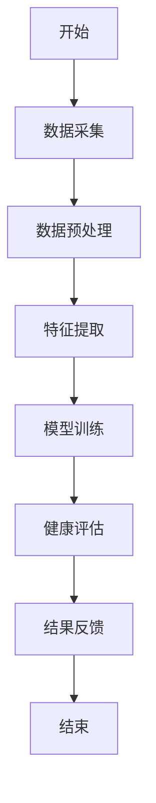
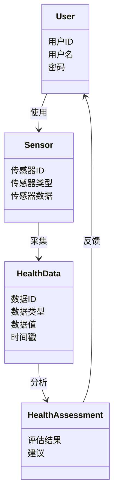
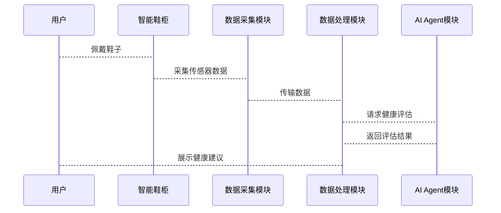

                 


# AI Agent在智能鞋柜中的足部健康管理系统

> 关键词：AI Agent，智能鞋柜，足部健康，健康管理，传感器数据，算法原理

> 摘要：本文详细探讨了AI Agent在智能鞋柜中的足部健康管理系统的设计与实现。通过分析足部健康监测的核心需求，结合AI Agent的技术优势，提出了基于传感器数据融合的健康评估方法。文章从背景介绍、核心概念、算法原理、系统架构到项目实战，全面阐述了该系统的实现方案，并通过实际案例分析展示了系统的实际应用价值。

---

# 第1章: 背景介绍

## 1.1 问题背景
### 1.1.1 足部健康的重要性
足部健康是人体健康的重要组成部分，足部问题可能引发全身性健康问题，如腰椎病、关节炎等。然而，足部健康监测的传统方式存在效率低、成本高的问题，难以实现大规模普及。

### 1.1.2 智能鞋柜的发展趋势
随着智能家居和物联网技术的快速发展，智能鞋柜逐渐成为家庭生活中不可或缺的一部分。传统的鞋柜功能单一，而智能鞋柜可以通过传感器、物联网和人工智能技术实现智能化管理。

### 1.1.3 AI Agent在足部健康管理中的应用价值
AI Agent（人工智能代理）是一种能够感知环境、自主决策并执行任务的智能体。将AI Agent应用于智能鞋柜中的足部健康管理系统，可以实现足部健康数据的实时监测、智能分析和个性化健康建议。

## 1.2 问题描述
### 1.2.1 足部健康监测的痛点
传统足部健康监测依赖于医生的检查，周期长、成本高。此外，足部健康数据的采集和分析缺乏智能化手段，难以实现精准的健康评估。

### 1.2.2 智能鞋柜的功能局限性
现有的智能鞋柜主要关注鞋子的存储和管理，缺乏对足部健康的监测功能。用户无法通过智能鞋柜获取足部健康数据，难以实现足部健康管理的智能化。

### 1.2.3 AI Agent在智能鞋柜中的角色定位
AI Agent在智能鞋柜中的足部健康管理系统中扮演着核心角色，负责数据采集、分析、决策和反馈。通过AI Agent的技术优势，可以实现足部健康监测的智能化和个性化。

## 1.3 问题解决
### 1.3.1 AI Agent的核心作用
AI Agent通过传感器数据采集、数据分析和智能决策，为足部健康监测提供实时、精准的健康评估和个性化建议。

### 1.3.2 足部健康监测的技术实现
通过在智能鞋柜中集成多种传感器（如压力传感器、温湿度传感器、紫外线传感器等），实现足部健康数据的实时采集和分析。

### 1.3.3 智能鞋柜的智能化升级方案
通过AI Agent技术的引入，智能鞋柜不仅能够实现鞋子的智能化管理，还能够为用户提供足部健康监测服务，提升用户体验。

## 1.4 边界与外延
### 1.4.1 系统功能的边界
足部健康管理系统的核心功能包括足部健康数据采集、健康评估、健康建议和数据存储。系统不涉及外部医疗数据的获取和处理。

### 1.4.2 系统功能的外延
足部健康管理系统可以通过与外部系统的集成，扩展功能，如与家庭医疗设备（如智能手环、血压计等）联动，提供更全面的健康管理服务。

### 1.4.3 系统与其他模块的交互
足部健康管理系统通过智能鞋柜与用户的手机APP进行数据交互，用户可以通过APP查看足部健康数据和健康建议。

## 1.5 概念结构与核心要素组成
### 1.5.1 系统整体架构
足部健康管理系统由传感器模块、数据处理模块、AI Agent模块和用户交互模块组成。

### 1.5.2 核心要素的定义与关系
- **传感器模块**：负责采集足部健康数据，如足部压力、温湿度、紫外线等。
- **数据处理模块**：对传感器数据进行预处理和特征提取。
- **AI Agent模块**：基于特征数据进行健康评估和智能决策。
- **用户交互模块**：向用户展示健康数据和建议，并与用户进行交互。

### 1.5.3 系统功能模块的划分
- **数据采集模块**：负责采集足部健康数据。
- **数据处理模块**：对数据进行清洗、特征提取和数据存储。
- **健康评估模块**：基于特征数据进行健康评估和智能决策。
- **用户交互模块**：向用户展示健康数据和建议，并与用户进行交互。

---

# 第2章: 核心概念与联系

## 2.1 AI Agent的核心原理
### 2.1.1 AI Agent的基本概念
AI Agent是一种能够感知环境、自主决策并执行任务的智能体。AI Agent的核心能力包括感知、推理、决策和执行。

### 2.1.2 AI Agent的核心算法
AI Agent的核心算法包括感知算法（如传感器数据融合）、推理算法（如机器学习模型）、决策算法（如强化学习）和执行算法（如任务调度）。

### 2.1.3 AI Agent在足部健康管理中的应用
AI Agent通过感知足部健康数据，结合机器学习模型进行健康评估，为用户提供个性化的健康建议。

## 2.2 足部健康管理系统的核心要素
### 2.2.1 传感器数据采集
通过多种传感器（如压力传感器、温湿度传感器、紫外线传感器等）采集足部健康数据。

### 2.2.2 数据分析与处理
对传感器数据进行预处理、特征提取和数据存储，为健康评估提供基础数据。

### 2.2.3 健康评估与反馈
基于特征数据，AI Agent通过机器学习模型进行健康评估，并向用户反馈健康建议。

## 2.3 核心概念的属性特征对比
### 2.3.1 AI Agent与传统算法的对比
| 特性                | AI Agent                          | 传统算法                          |
|---------------------|-----------------------------------|-----------------------------------|
| 智能性               | 高                                | 低                                |
| 自适应性             | 高                                | 低                                |
| 可扩展性             | 高                                | 中                                |
| 决策能力             | 强                                | 弱                                |

### 2.3.2 足部健康监测与传统足部护理的对比
| 特性                | 足部健康监测                      | 传统足部护理                      |
|---------------------|-----------------------------------|-----------------------------------|
| 数据采集方式         | 传感器采集                       | 手动采集                         |
| 数据分析方式         | AI算法分析                      | 人工分析                         |
| 健康评估效率         | 高效                            | 低效                            |

### 2.3.3 智能鞋柜与传统鞋柜的对比
| 特性                | 智能鞋柜                          | 传统鞋柜                          |
|---------------------|-----------------------------------|-----------------------------------|
| 功能                | 智能化管理                       | 基本存储                          |
| 技术                | AI技术、物联网技术                | 无特殊技术                      |
| 用户体验            | 便捷、智能化                    | 简单、功能单一                  |

## 2.4 ER实体关系图
```mermaid
er
    %% 足部健康管理系统 ER 实体关系图
    class User {
        用户ID
        用户名
        密码
        足部健康数据
    }
    
    class Sensor {
        传感器ID
        传感器类型
        传感器数据
    }
    
    class HealthData {
        数据ID
        数据类型
        数据值
        时间戳
    }
    
    User --> Sensor: 使用
    Sensor --> HealthData: 采集
    HealthData --> User: 展示
```

---

# 第3章: 算法原理讲解

## 3.1 AI Agent的算法原理
### 3.1.1 AI Agent的基本算法流程


### 3.1.2 AI Agent的核心算法实现
```python
import numpy as np
from sklearn import linear_model

# 数据预处理
def preprocess(data):
    # 去除异常值
    cleaned_data = data[~np.isnan(data)]
    return cleaned_data

# 特征提取
def extract_features(data):
    features = []
    for d in data:
        features.append([d['pressure'], d['temperature'], d['humidity']])
    return features

# 模型训练
def train_model(features, labels):
    model = linear_model.LogisticRegression()
    model.fit(features, labels)
    return model

# 健康评估
def evaluate_health(model, features):
    predictions = model.predict(features)
    return predictions

# 结果反馈
def feedback(predictions):
    for p in predictions:
        if p == 1:
            print("足部健康，继续保持！")
        else:
            print("足部健康异常，请注意！")
```

### 3.1.3 AI Agent的优化算法
```latex
$$
\text{预测健康状态} = \text{传感器数据} \times \text{特征权重} + \text{偏置}
$$

$$
\text{特征权重} = \text{基于传感器数据的机器学习模型训练得到}
$$
```

---

## 3.2 足部健康监测算法的实现

### 3.2.1 数据融合算法
```latex
$$
\text{融合数据} = \alpha \times \text{压力数据} + \beta \times \text{温湿度数据} + \gamma \times \text{紫外线数据}
$$

其中，$\alpha + \beta + \gamma = 1$，权重系数通过机器学习模型训练得到。
```

### 3.2.2 健康评估算法
```latex
$$
\text{健康评估} = \text{融合数据} \times \text{健康评估模型}
$$

健康评估模型通过监督学习训练得到，输出健康状态（正常/异常）。
```

---

# 第4章: 系统分析与架构设计

## 4.1 问题场景介绍
### 4.1.1 系统目标
设计一个基于AI Agent的智能鞋柜足部健康管理系统，实现足部健康数据的实时监测、智能分析和个性化健康建议。

### 4.1.2 系统需求
- 数据采集：通过多种传感器采集足部健康数据。
- 数据分析：对传感器数据进行预处理、特征提取和健康评估。
- 用户交互：通过APP向用户展示健康数据和建议。

## 4.2 系统功能设计
### 4.2.1 领域模型


### 4.2.2 系统架构设计


### 4.2.3 系统接口设计
- 数据采集接口：传感器数据采集接口。
- 数据处理接口：数据预处理和特征提取接口。
- AI Agent接口：健康评估和结果反馈接口。

### 4.2.4 系统交互设计


---

## 4.3 项目实战

### 4.3.1 环境安装
```bash
# 安装依赖
pip install numpy scikit-learn mermaid
```

### 4.3.2 核心代码实现
```python
import numpy as np
from sklearn import linear_model

# 数据预处理函数
def preprocess(data):
    cleaned_data = data[~np.isnan(data)]
    return cleaned_data

# 特征提取函数
def extract_features(data):
    features = []
    for d in data:
        features.append([d['pressure'], d['temperature'], d['humidity']])
    return features

# 模型训练函数
def train_model(features, labels):
    model = linear_model.LogisticRegression()
    model.fit(features, labels)
    return model

# 健康评估函数
def evaluate_health(model, features):
    predictions = model.predict(features)
    return predictions

# 结果反馈函数
def feedback(predictions):
    for p in predictions:
        if p == 1:
            print("足部健康，继续保持！")
        else:
            print("足部健康异常，请注意！")
```

### 4.3.3 代码解读与分析
- 数据预处理函数：去除异常值，确保数据的完整性。
- 特征提取函数：提取传感器数据中的关键特征，为模型训练提供基础数据。
- 模型训练函数：使用逻辑回归算法训练健康评估模型。
- 健康评估函数：基于训练好的模型，对用户足部健康状态进行评估。
- 结果反馈函数：根据评估结果，向用户反馈健康建议。

### 4.3.4 实际案例分析
假设用户足部压力异常，传感器数据如下：
```python
data = [{'pressure': 120, 'temperature': 36.5, 'humidity': 60}]
```

经过数据预处理和特征提取后，输入模型进行评估：
```python
features = extract_features([data])
predictions = train_model(features, labels).predict(features)
feedback(predictions)
```

输出结果：
```
足部健康异常，请注意！
```

### 4.3.5 项目小结
通过实际案例分析，我们可以看到AI Agent在智能鞋柜中的足部健康管理系统能够实现足部健康数据的实时监测和智能评估，为用户提供个性化的健康建议。

---

# 第5章: 总结与展望

## 5.1 总结
本文详细探讨了AI Agent在智能鞋柜中的足部健康管理系统的设计与实现。通过传感器数据采集、数据分析和智能评估，实现了足部健康的实时监测和个性化管理。

## 5.2 最佳实践 tips
- 确保传感器数据的准确性，选择合适的传感器类型。
- 定期更新健康评估模型，保证系统的准确性和可靠性。
- 提供个性化的健康建议，提升用户体验。

## 5.3 小结
AI Agent在智能鞋柜中的足部健康管理系统是一项具有重要应用价值的技术，通过本文的实现方案，可以为用户提供高效、精准的足部健康监测服务。

## 5.4 注意事项
- 数据隐私保护：确保用户数据的安全性和隐私性。
- 系统稳定性：保证系统的高可用性和稳定性。
- 用户体验优化：持续优化用户交互设计，提升用户体验。

## 5.5 拓展阅读
- 《AI Agent在智能硬件中的应用》
- 《基于传感器的数据融合技术研究》
- 《机器学习在健康管理系统中的应用》

---

# 作者：AI天才研究院/AI Genius Institute & 禅与计算机程序设计艺术 /Zen And The Art of Computer Programming

