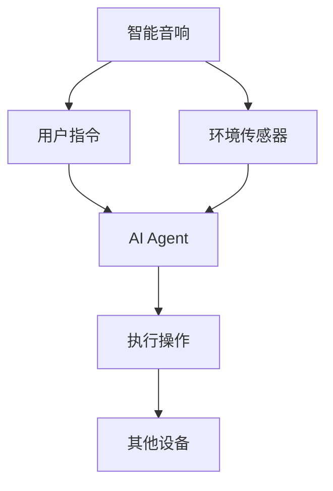

                 


# AI Agent在智能音响中的家庭氛围营造

**关键词**：AI Agent, 智能音响, 家庭氛围, 人工智能, 智能家居, 机器学习

**摘要**：  
本文深入探讨了AI Agent在智能音响中的应用，特别是在家庭氛围营造方面的潜力和实现方式。通过分析AI Agent的核心原理、算法实现、系统架构，以及实际案例的分析，本文详细阐述了如何利用AI技术优化家庭环境，提升用户体验。文章还提供了丰富的技术细节和实战指导，帮助读者全面理解并应用这些技术。

---

## 第一部分：背景与概念

### 第1章：AI Agent与智能音响概述

#### 1.1 AI Agent的基本概念
- **1.1.1 AI Agent的定义**  
  AI Agent（人工智能代理）是一种能够感知环境、自主决策并执行任务的智能实体。它能够根据用户需求和环境信息，主动调整行为以实现目标。

- **1.1.2 AI Agent的核心特征**  
  - **自主性**：能够自主决策，无需外部干预。  
  - **反应性**：能够实时感知环境并做出响应。  
  - **学习能力**：通过数据和反馈不断优化行为。  
  - **协作性**：能够与其他设备或系统协同工作。  

- **1.1.3 AI Agent与智能音响的结合**  
  AI Agent可以通过分析用户的语音指令、环境数据（如光线、温度）以及历史行为，智能调节音响的音量、音效和播放列表，从而营造理想的听觉和氛围体验。

#### 1.2 智能音响的发展历程
- **1.2.1 智能音响的起源**  
  智能音响起源于传统音响设备的升级，通过集成语音助手（如Alexa、Siri）和物联网技术，逐渐具备了智能化功能。  

- **1.2.2 智能音响的主要技术**  
  - **语音识别**：通过麦克风和算法实现精准的语音指令识别。  
  - **物联网（IoT）**：与智能家居设备联动，实现远程控制和场景切换。  
  - **AI技术**：利用机器学习和深度学习优化用户体验。  

- **1.2.3 当前智能音响的应用场景**  
  - **家庭娱乐**：播放音乐、电影，提供沉浸式音效。  
  - **智能家居控制**：通过语音指令联动其他设备，如灯光、空调。  
  - **氛围营造**：根据用户需求调整音效和环境设置，提升家庭舒适度。  

#### 1.3 家庭氛围营造的背景与需求
- **1.3.1 家庭氛围营造的重要性**  
  家庭氛围直接影响用户的舒适感和情绪状态。通过智能设备营造舒适的氛围，可以提升生活质量，尤其在现代快节奏的生活中，营造一个放松的环境尤为重要。  

- **1.3.2 用户对智能音响的需求**  
  用户不仅希望智能音响提供高质量的音效，还期望其能够与其他智能设备联动，实现自动化控制和个性化设置。  

- **1.3.3 AI Agent在家庭氛围营造中的作用**  
  AI Agent可以通过分析用户的偏好、情绪和环境数据，动态调整音响的音量、音效和播放列表，从而营造理想的氛围。例如，在用户放松时降低音量，在观影时提升低音效果。

#### 1.4 本章小结  
本章介绍了AI Agent的基本概念、智能音响的发展历程以及家庭氛围营造的背景和需求。通过这些内容，读者可以理解AI Agent在智能音响中的重要性及其在家庭环境中的潜力。

---

## 第二部分：AI Agent的核心概念与原理

### 第2章：AI Agent的工作原理

#### 2.1 AI Agent的基本工作流程
- **2.1.1 感知阶段**  
  AI Agent通过传感器、麦克风等设备感知环境数据，如光线强度、温度、用户语音指令等。  

- **2.1.2 决策阶段**  
  根据感知到的数据和用户需求，AI Agent通过算法生成决策，例如调整音量或切换播放列表。  

- **2.1.3 执行阶段**  
  AI Agent通过智能音响或其他设备执行决策，例如播放音乐或调节灯光。  

#### 2.2 AI Agent的核心算法
- **2.2.1 基于规则的AI Agent**  
  通过预设的规则和条件判断来执行任务，适用于简单场景，如“如果用户说‘播放轻松音乐’，则调低音量”。  

- **2.2.2 基于机器学习的AI Agent**  
  利用机器学习模型分析用户行为和环境数据，实现更复杂的决策，例如通过用户的历史听歌记录推荐音乐。  

- **2.2.3 基于深度学习的AI Agent**  
  深度学习模型可以处理更复杂的模式，例如通过自然语言处理理解用户的意图。  

#### 2.3 AI Agent的感知与交互机制
- **2.3.1 语音识别与自然语言处理**  
  AI Agent通过语音识别技术理解用户的指令，并通过自然语言处理技术分析用户的情感和意图。  

- **2.3.2 多模态交互**  
  结合视觉、触觉等多种交互方式，提升用户体验。例如，用户可以通过手势或灯光控制音响设备。  

#### 2.4 本章小结  
本章详细讲解了AI Agent的工作流程和核心算法，重点介绍了基于规则和机器学习的AI Agent的区别及其应用场景。

---

### 第3章：AI Agent的算法实现

#### 3.1 基于规则的AI Agent算法
- **3.1.1 算法流程图**  
  ```mermaid
  graph TD
      A[用户指令] --> B[解析指令]
      B --> C[判断条件]
      C --> D[执行操作]
      D --> E[返回结果]
  ```

- **3.1.2 Python实现示例**  
  ```python
  def rule_based_agent(instruction):
      if "播放音乐" in instruction:
          return "正在播放音乐..."
      elif "关闭音响" in instruction:
          return "音响已关闭..."
      else:
          return "指令无法识别..."
  ```

- **3.1.3 优缺点分析**  
  - **优点**：简单易实现，适用于规则明确的场景。  
  - **缺点**：难以处理复杂和动态变化的场景。  

#### 3.2 基于机器学习的AI Agent算法
- **3.2.1 算法流程图**  
  ```mermaid
  graph TD
      A[感知数据] --> B[特征提取]
      B --> C[模型训练]
      C --> D[生成决策]
      D --> E[执行操作]
  ```

- **3.2.2 Python实现示例**  
  ```python
  import machine_learning_model
  def ml_agent(data):
      prediction = machine_learning_model.predict(data)
      return prediction
  ```

- **3.2.3 数学模型与公式**  
  机器学习模型的训练过程涉及损失函数和优化算法，例如：  
  $$ L = \sum_{i=1}^{n}(y_i - \hat{y}_i)^2 $$  
  其中，\( y_i \) 是真实值，\( \hat{y}_i \) 是预测值。优化算法如梯度下降用于最小化损失函数。  

#### 3.3 本章小结  
本章通过流程图和代码示例，详细讲解了基于规则和机器学习的AI Agent算法，分析了各自的优缺点及应用场景。

---

## 第三部分：AI Agent的系统架构设计

### 第4章：系统架构与功能设计

#### 4.1 系统组成部分
- **4.1.1 智能音响设备**  
  包括麦克风、扬声器和控制模块。  
- **4.1.2 环境传感器**  
  如光线传感器、温度传感器等，用于感知环境数据。  
- **4.1.3 云端平台**  
  用于存储用户数据和训练模型。  
- **4.1.4 用户界面**  
  包括手机App和语音助手，用于用户交互。  

#### 4.2 系统功能设计
- **4.2.1 智能播放控制**  
  根据用户指令和环境数据，智能调整播放列表和音量。  
- **4.2.2 环境感知与联动**  
  通过传感器数据联动其他智能家居设备，如调节灯光亮度。  
- **4.2.3 用户偏好分析**  
  通过机器学习分析用户的听歌习惯，推荐个性化音乐。  

#### 4.3 系统架构图


#### 4.4 接口设计与交互流程
- **4.4.1 接口设计**  
  - 用户指令接口：接收语音指令，如“播放音乐”。  
  - 环境数据接口：接收传感器数据，如光线强度。  
- **4.4.2 交互流程图**  
  ```mermaid
  sequenceDiagram
      user ->> A: 发送语音指令
      A ->> D: 分析指令
      D ->> E: 执行操作
      E ->> user: 返回结果
  ```

#### 4.5 本章小结  
本章详细介绍了AI Agent系统的组成部分、功能设计和架构图，帮助读者理解系统的整体结构和各部分之间的关系。

---

## 第四部分：项目实战与案例分析

### 第5章：项目实战

#### 5.1 项目背景与目标
- **项目背景**：通过AI Agent实现智能音响的家庭氛围营造。  
- **项目目标**：根据用户需求和环境数据，智能调节音响设置，提升用户体验。  

#### 5.2 环境安装与配置
- **硬件安装**：安装智能音响、麦克风、光线传感器等设备。  
- **软件安装**：部署AI Agent算法和云端平台。  

#### 5.3 核心代码实现
- **5.3.1 AI Agent核心代码**  
  ```python
  def main():
      while True:
          instruction = receive_voice_command()
          data = receive_sensor_data()
          decision = make_decision(instruction, data)
          execute_action(decision)
  ```

- **5.3.2 代码解读**  
  - `receive_voice_command()`：接收用户语音指令。  
  - `receive_sensor_data()`：获取环境传感器数据。  
  - `make_decision()`：根据指令和数据生成决策。  
  - `execute_action()`：执行决策，如调整音量或播放音乐。  

#### 5.4 项目测试与优化
- **功能测试**：测试AI Agent的语音识别和环境感知功能。  
- **性能优化**：通过反馈数据优化算法，提升准确率和响应速度。  

#### 5.5 案例分析
- **案例1：基于温度的氛围调节**  
  当温度较高时，AI Agent会降低音响音量并开启风扇。  
- **案例2：基于光线的音乐推荐**  
  在傍晚时分，AI Agent会推荐轻音乐以营造放松的氛围。  

#### 5.6 本章小结  
本章通过实际案例分析，详细讲解了AI Agent在智能音响中的应用，展示了如何通过代码实现和优化家庭氛围营造。

---

## 第五部分：最佳实践与总结

### 第6章：最佳实践

#### 6.1 实践总结
- **算法选择**：根据场景复杂度选择合适的算法，简单场景使用基于规则的AI Agent，复杂场景使用基于机器学习的算法。  
- **数据处理**：确保数据的准确性和实时性，优化模型性能。  
- **系统设计**：合理设计系统架构，确保各部分协同工作。  

#### 6.2 小结
通过本文的分析和实践，读者可以深入了解AI Agent在智能音响中的应用，掌握其核心原理和实现方法。  

#### 6.3 注意事项
- **数据隐私**：确保用户数据的安全性和隐私性。  
- **系统稳定性**：保证系统的稳定运行，避免因故障影响用户体验。  
- **用户体验**：注重用户反馈，不断优化系统功能。  

#### 6.4 拓展阅读
- 推荐阅读《人工智能：一种现代的方法》和《机器学习实战》等书籍，深入学习AI Agent和机器学习的相关知识。  

---

## 作者信息

**作者：AI天才研究院/AI Genius Institute & 禅与计算机程序设计艺术 /Zen And The Art of Computer Programming**

---

以上是《AI Agent在智能音响中的家庭氛围营造》的技术博客文章的完整目录大纲和内容结构。

