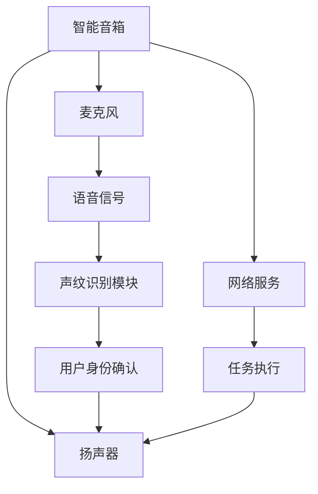

                 


# AI Agent在智能音箱中的声纹识别

> 关键词：AI Agent, 声纹识别, 智能音箱, 语音识别, 智能助手

> 摘要：本文详细探讨了AI Agent在智能音箱中的声纹识别技术。首先介绍了声纹识别的基本概念和AI Agent的核心原理，接着分析了声纹识别的主要算法及其在AI Agent中的应用，然后从系统架构的角度阐述了智能音箱的整体设计，最后通过一个具体的项目实战，展示了如何基于AI Agent实现声纹识别系统，并总结了相关的最佳实践和注意事项。

---

## 第一部分：AI Agent与声纹识别的背景介绍

### 第1章：声纹识别的基本概念与应用背景

#### 1.1 声纹识别的定义与特点

声纹识别，又称语音纹识别，是一种基于语音特征进行身份识别的技术。与传统的密码验证和指纹识别不同，声纹识别利用声音的特征（如音调、音量、语速等）来确认用户身份。

- **定义**：声纹识别通过分析语音信号中的特征，如音调、音色、语速和停顿等，来识别说话人的身份。
- **特点**：
  - **非接触式**：用户无需物理接触设备即可完成身份验证。
  - **实时性**：声纹识别可以在设备端实时处理，无需依赖云端。
  - **安全性**：相较于密码，声纹识别具有更高的安全性，难以被仿冒。

#### 1.2 AI Agent的基本概念

AI Agent（人工智能代理）是一种能够感知环境、自主决策并执行任务的智能实体。在智能音箱中，AI Agent主要负责处理用户的语音指令，执行相应的操作。

- **定义**：AI Agent是能够通过感知环境信息，自主决策并执行任务的智能实体。
- **核心功能**：
  - **感知**：通过麦克风采集用户语音信号。
  - **理解**：利用自然语言处理技术解析用户的意图。
  - **决策**：基于用户意图和系统状态做出响应。
  - **执行**：通过与智能音箱的其他模块（如网络服务）交互，执行用户的指令。

#### 1.3 声纹识别与AI Agent的结合

声纹识别为AI Agent提供了一种基于语音的身份验证方式，使得智能音箱能够更安全、更个性化的服务用户。

- **作用**：
  - **身份验证**：通过声纹识别，智能音箱可以确认用户的身份，提供个性化服务。
  - **增强安全性**：相较于密码，声纹识别更难以被破解，提高了系统安全性。
  - **提升用户体验**：通过声纹识别，智能音箱可以更快地响应用户的指令，提供更流畅的交互体验。

---

## 第二部分：声纹识别与AI Agent的核心概念与联系

### 第2章：声纹识别的核心原理

#### 2.1 声纹识别的基本原理

声纹识别的过程可以分为信号采集、特征提取和模式匹配三个阶段。

- **信号采集**：通过麦克风采集用户的语音信号。
- **特征提取**：提取语音信号中的特征，如音调、音量、语速等。
- **模式匹配**：将提取的特征与已知用户的特征模板进行匹配，确认用户身份。

#### 2.2 声纹识别的关键技术

目前，声纹识别的主要技术包括基于统计模型的GMM（高斯混合模型）和基于深度学习的DNN（深度神经网络）。

- **基于GMM的声纹识别**：
  - **原理**：将语音信号的特征表示为概率分布，利用高斯混合模型进行建模。
  - **优点**：计算简单，适合实时应用。
  - **缺点**：对噪声敏感，鲁棒性较差。

- **基于DNN的声纹识别**：
  - **原理**：利用深度神经网络提取语音的高级特征，通过端到端的方式进行分类。
  - **优点**：能够自动学习特征，鲁棒性更强。
  - **缺点**：需要大量的训练数据和计算资源。

### 第3章：AI Agent的核心原理

#### 3.1 AI Agent的基本原理

AI Agent通过感知环境信息，利用内部模型做出决策，并通过执行器完成任务。

- **感知层**：负责采集环境信息，如用户语音、设备状态等。
- **决策层**：利用机器学习模型分析感知到的信息，做出决策。
- **执行层**：通过与设备或服务的交互，执行决策结果。

#### 3.2 AI Agent在智能音箱中的实现

- **自然语言处理**：通过NLP技术理解用户的意图。
- **语音识别**：将用户的语音转换为文本，供决策层处理。
- **机器学习模型**：利用训练好的模型进行分类和预测。

---

## 第三部分：系统分析与架构设计

### 第4章：智能音箱的整体架构

#### 4.1 系统功能设计

- **用户交互**：通过麦克风采集用户语音，通过扬声器播放响应。
- **语音处理**：包括语音识别、声纹识别和语义理解。
- **云端服务**：与后端服务交互，获取所需信息或执行任务。

#### 4.2 系统架构设计



---

## 第四部分：项目实战

### 第5章：基于AI Agent的声纹识别系统实现

#### 5.1 环境搭建

- **硬件**：智能音箱设备、麦克风、扬声器。
- **软件**：Python编程语言，TensorFlow框架，Keras库。

#### 5.2 核心代码实现

```python
import tensorflow as tf
from tensorflow.keras import layers

# 声纹识别模型
def create_model():
    model = tf.keras.Sequential()
    model.add(layers.Dense(128, activation='relu', input_shape=(13,)))
    model.add(layers.Dense(1, activation='sigmoid'))
    model.compile(optimizer='adam', loss='binary_crossentropy', metrics=['accuracy'])
    return model

# 训练模型
model = create_model()
model.fit(X_train, y_train, epochs=10, batch_size=32)
```

#### 5.3 代码解读与优化

- **模型结构**：使用DNN模型，输入层为13维语音特征，输出层为1维概率。
- **训练过程**：利用训练数据训练模型，优化器选择Adam，损失函数为二进制交叉熵。
- **优化技巧**：增加数据增强，调整模型参数，提高训练准确率。

---

## 第五部分：最佳实践与小结

### 第6章：总结与展望

#### 6.1 总结

- **核心成果**：通过AI Agent实现了智能音箱中的声纹识别功能，提高了系统的安全性。
- **主要经验**：
  - 系统架构设计要合理，确保各模块高效协同。
  - 数据预处理和特征提取是影响识别准确率的关键。
  - 模型训练需要大量高质量的数据和合适的优化策略。

#### 6.2 注意事项

- **数据隐私**：处理用户语音数据时，必须遵守相关隐私保护法规。
- **系统稳定性**：确保声纹识别模块在不同环境下的稳定运行。
- **用户体验**：优化交互流程，提升用户的使用体验。

#### 6.3 未来展望

- **算法优化**：探索更高效的声纹识别算法，如基于Transformer的模型。
- **多模态融合**：结合其他生物识别技术，提升系统的安全性。
- **边缘计算**：推动声纹识别在边缘设备上的应用，减少对云端的依赖。

---

## 作者信息

作者：AI天才研究院（AI Genius Institute） & 禅与计算机程序设计艺术（Zen And The Art of Computer Programming）

---

以上是文章的主要结构和内容，按照逻辑逐步展开，确保每个部分都详尽且清晰。如果需要进一步扩展某些部分或调整结构，请随时告知。

