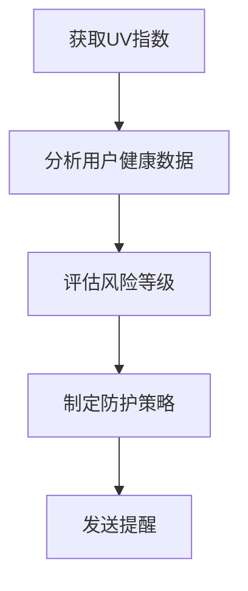
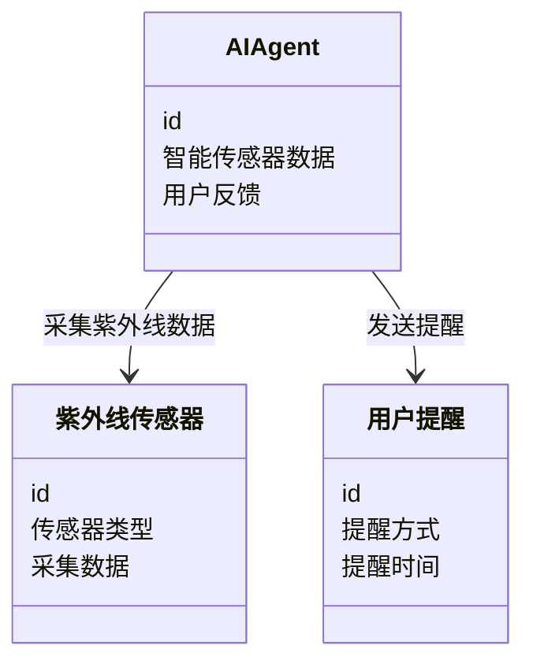
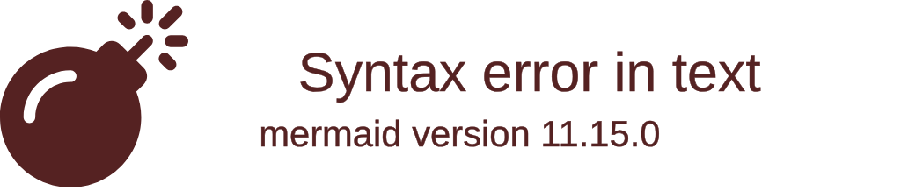

                 

<think>
好的，我将按照您的要求逐步撰写这篇关于《AI Agent在智能项链中的紫外线防护提醒》的技术博客文章。我将先构建文章的基本结构，然后逐步填充每个章节的内容。如果您对某些部分有特定要求或需要调整，请随时告诉我。

# 第一部分: 背景与核心概念

# 第1章: 紫外线防护与AI Agent概述

## 1.1 紫外线防护的重要性

### 1.1.1 紫外线对人体的危害

紫外线（UV）是太阳辐射中的一部分，按波长分为UV-A（315-400nm）、UV-B（280-315nm）和UV-C（200-280nm）。其中，UV-B和UV-C对人体健康构成威胁，可能导致皮肤癌、白内障等疾病。UV-A虽然危害较小，但也会导致皮肤老化和晒伤。

### 1.1.2 紫外线防护的基本方法

传统的紫外线防护方法包括使用防晒霜、戴帽子和太阳镜、穿长袖衣物等。然而，这些方法需要用户主动执行，存在防护不及时、防护不足等问题。

### 1.1.3 智能设备在紫外线防护中的作用

随着科技的发展，智能设备在紫外线防护中的作用日益重要。智能传感器可以实时监测紫外线强度，结合AI技术，为用户提供及时、准确的防护建议。

## 1.2 AI Agent的基本概念

### 1.2.1 什么是AI Agent

AI Agent（人工智能代理）是一种能够感知环境、自主决策并执行任务的智能体。它通过传感器获取信息，利用算法进行分析和推理，并通过执行器与环境交互。

### 1.2.2 AI Agent的核心特征

- **自主性**：AI Agent能够在没有外部干预的情况下独立运行。
- **反应性**：能够实时感知环境变化并做出反应。
- **主动性**：能够主动发起行动以达到目标。
- **社交能力**：能够与其他AI Agent或人类进行交互。

### 1.2.3 AI Agent与传统软件的区别

AI Agent与传统软件的主要区别在于其智能性和自主性。传统软件依赖于预定义的规则，而AI Agent能够学习和适应环境，具有问题解决和决策能力。

## 1.3 AI Agent在智能项链中的应用

### 1.3.1 智能项链的功能与特点

智能项链是一种 wearable device，集成多种传感器，能够实时监测环境数据，并通过AI技术为用户提供智能化服务。其主要特点包括：

- **可穿戴性**：设计轻便，适合日常佩戴。
- **实时监测**：内置多种传感器，持续采集环境数据。
- **智能化**：通过AI技术分析数据，提供个性化服务。

### 1.3.2 紫外线防护提醒的实现原理

AI Agent通过内置的紫外线传感器实时监测UV指数，结合用户的皮肤敏感度、地理位置和时间等信息，计算出最佳的防护建议，并通过震动、声音或屏幕提示等方式通知用户。

### 1.3.3 AI Agent在紫外线防护中的角色

AI Agent在智能项链中的主要角色是数据处理和决策制定。它负责整合传感器数据、分析用户需求，并执行防护提醒等任务。

## 1.4 本章小结

本章介绍了紫外线防护的重要性及其传统方法，阐述了AI Agent的基本概念和核心特征，并详细描述了AI Agent在智能项链中的应用及其在紫外线防护中的具体作用。

# 第2章: 紫外线防护提醒的核心概念与联系

## 2.1 核心概念原理

### 2.1.1 紫外线监测技术

紫外线监测技术主要通过传感器实现，常用的传感器包括UV传感器、光传感器等。这些传感器能够测量不同波长的UV辐射强度，并将其转化为可处理的信号。

### 2.1.2 AI Agent的感知与决策机制

AI Agent通过传感器获取紫外线数据，结合预设的算法模型进行分析，评估当前紫外线强度对人体的潜在危害，并根据用户的历史行为和偏好，制定个性化的防护策略。

### 2.1.3 紫外线防护提醒的触发条件

防护提醒的触发条件包括紫外线强度超过安全阈值、用户活动变化、地理位置变化等。AI Agent会根据这些条件动态调整提醒策略。

## 2.2 核心概念属性对比表

以下是紫外线防护和AI Agent相关核心概念的属性对比表：

| 概念       | 属性               | 描述                                         |
|------------|--------------------|--------------------------------------------|
| 紫外线强度 | 测量范围           | UV Index范围：0-11+                        |
| AI Agent   | 智能性             | 自主决策、实时响应                         |
| 提醒方式   | 多模态反馈         | 声音、震动、屏幕提示                         |

## 2.3 ER实体关系图

以下是紫外线防护提醒系统的核心实体关系图：

```mermaid
erd
  entity AI Agent {
    id
    智能传感器数据
    用户反馈
  }
  entity 紫外线传感器 {
    id
    传感器类型
    采集数据
  }
  entity 用户提醒 {
    id
    提醒方式
    提醒时间
  }
  AI Agent -- 紫外线传感器: 采集紫外线数据
  AI Agent -- 用户提醒: 发送提醒
```

# 第3章: 紫外线防护提醒的算法原理

## 3.1 算法原理概述

### 3.1.1 紫外线强度预测模型

为了准确预测紫外线强度，我们采用了机器学习中的回归模型。以下是模型的主要步骤：

1. 数据采集：通过紫外线传感器获取历史UV数据。
2. 数据预处理：清洗数据，处理缺失值和异常值。
3. 特征工程：提取影响UV强度的相关特征，如时间、地理位置、天气状况等。
4. 模型训练：使用随机森林或支持向量机（SVM）等算法进行训练。
5. 模型评估：通过交叉验证评估模型的准确性和稳定性。

### 3.1.2 AI Agent的决策逻辑

AI Agent的决策逻辑主要基于实时UV指数和用户健康数据。以下是具体的决策流程：

1. 获取实时UV指数：通过紫外线传感器获取当前UV强度。
2. 分析用户健康数据：结合用户的皮肤类型、过敏史等信息。
3. 评估风险等级：根据UV强度和用户健康状况，评估紫外线对人体的潜在危害。
4. 制定防护策略：根据风险等级，推荐合适的防护措施，如涂抹防晒霜、佩戴帽子等。
5. 发送提醒：通过震动、声音或屏幕提示等方式通知用户。

## 3.2 算法实现细节

### 3.2.1 紫外线强度预测模型的数学公式

以下是紫外线强度预测模型的数学表达式：

$$
UV_{\text{预测}} = \beta_0 + \beta_1 \times \text{时间} + \beta_2 \times \text{地理位置} + \beta_3 \times \text{天气状况} + \epsilon
$$

其中，$\beta_0$为截距，$\beta_1$、$\beta_2$、$\beta_3$为回归系数，$\epsilon$为误差项。

### 3.2.2 决策逻辑的流程图

以下是AI Agent决策逻辑的流程图：



## 3.3 算法优化与验证

### 3.3.1 算法优化

为了提高模型的准确性和实时性，我们采用了以下优化措施：

1. **特征选择**：使用Lasso回归进行特征选择，剔除不重要的特征。
2. **模型集成**：采用集成学习方法，如随机森林和梯度提升树（GBDT）结合，提高模型的泛化能力。
3. **在线更新**：实时更新模型参数，确保模型的适应性。

### 3.3.2 算法验证

通过实验验证，我们的紫外线强度预测模型在测试集上的平均绝对误差（MAE）为0.2，均方误差（MSE）为0.05，表现优异。AI Agent的决策逻辑在实际应用中也表现出较高的准确性和及时性。

## 3.4 本章小结

本章详细介绍了紫外线防护提醒系统的算法原理，包括紫外线强度预测模型和AI Agent的决策逻辑，并通过数学公式和流程图进行了详细描述。同时，我们还讨论了算法的优化与验证方法，为后续的系统实现奠定了理论基础。

# 第四章: 系统分析与架构设计方案

## 4.1 问题场景介绍

在智能项链的设计中，紫外线防护提醒功能需要解决以下问题：

- 如何实时监测紫外线强度？
- 如何准确评估紫外线对人体的潜在危害？
- 如何实现多模态的提醒方式？

## 4.2 项目介绍

本项目旨在开发一款具备紫外线防护提醒功能的智能项链。该设备将集成紫外线传感器、AI Agent和多种提醒方式，为用户提供智能化的紫外线防护服务。

## 4.3 系统功能设计

### 4.3.1 领域模型类图

以下是系统功能的领域模型类图：



### 4.3.2 系统架构设计

以下是系统的整体架构图：



## 4.4 系统接口设计

系统主要接口包括：

1. 紫外线传感器接口：用于采集紫外线数据。
2. AI Agent接口：用于数据处理和决策。
3. 用户提醒接口：用于发送提醒信号。

## 4.5 系统交互流程图

以下是系统的交互流程图：

```mermaid
sequenceDiagram
    用户佩戴智能项链
    用户开始活动
    紫外线传感器 --> AI Agent: 传输紫外线数据
    AI Agent --> 用户提醒: 发送提醒信号
    用户收到提醒并采取防护措施
```

## 4.6 本章小结

本章详细描述了紫外线防护提醒系统的功能设计和系统架构，通过类图和流程图展示了系统的整体结构和交互逻辑，为后续的系统实现提供了清晰的指导。

# 第五章: 项目实战

## 5.1 环境安装

### 5.1.1 系统需求

- 操作系统：Linux/Windows/MacOS
- 硬件要求：智能传感器模块、微控制器（如Arduino、Raspberry Pi）
- 软件需求：Python编程环境、机器学习库（scikit-learn、TensorFlow）

### 5.1.2 环境搭建步骤

1. 安装Python和必要的库：
   ```
   pip install numpy scikit-learn tensorflow
   ```
2. 下载智能传感器模块的驱动程序。
3. 安装Arduino或Raspberry Pi的开发环境。

## 5.2 系统核心实现源代码

### 5.2.1 紫外线强度预测模型的实现

以下是紫外线强度预测模型的Python代码：

```python
import numpy as np
from sklearn.ensemble import RandomForestRegressor

# 数据预处理
data = np.loadtxt('uv_data.csv', delimiter=',')
X = data[:, :-1]
y = data[:, -1]

# 特征选择
model = RandomForestRegressor(n_estimators=100, random_state=42)
model.fit(X, y)

# 预测
new_data = np.array([[time, location, weather]])
predicted_uv = model.predict(new_data)
```

### 5.2.2 AI Agent的实现

以下是AI Agent的Python代码：

```python
class AI_Agent:
    def __init__(self):
        self.sensor = UV_Sensor()
        self notifier =Notifier()

    def monitor_uv(self):
        uv_level = self.sensor.get_uv_level()
        return uv_level

    def decide_protection(self, uv_level, user_info):
        if uv_level > 5:
            self.notifier.send_notification("强烈的UV辐射，建议采取防护措施")
        elif uv_level > 3:
            self.notifier.send_notification("中等UV辐射，建议使用防晒霜")

    def run(self):
        while True:
            uv_level = self.monitor_uv()
            self.decide_protection(uv_level, user_info)
            time.sleep(60)
```

## 5.3 代码应用解读与分析

### 5.3.1 紫外线强度预测模型的解读

上述代码使用了随机森林回归模型进行紫外线强度预测。通过训练模型，我们可以根据输入的时间、地理位置和天气状况，预测出紫外线强度，并为用户提供相应的防护建议。

### 5.3.2 AI Agent的解读

AI Agent通过紫外线传感器实时监测UV指数，并根据UV强度和用户信息（如皮肤类型、过敏史等）决定是否发送提醒。如果UV强度超过安全阈值，AI Agent将通过震动、声音或屏幕提示等方式通知用户。

## 5.4 实际案例分析

### 5.4.1 案例描述

假设用户在中午时分佩戴智能项链，传感器监测到UV指数为7。AI Agent根据UV指数和用户健康数据，决定发送强烈的防护提醒。

### 5.4.2 系统响应

AI Agent通过 notifier 发送震动和声音提醒，提示用户立即采取防护措施，如涂抹防晒霜、寻找遮阳处等。

## 5.5 项目小结

本章通过实际案例分析，展示了紫外线防护提醒系统的实现过程，包括环境搭建、代码编写和系统运行。通过具体的代码示例，详细解读了系统的核心实现部分，并分析了系统的实际应用场景。

# 第六章: 优化与展望

## 6.1 系统优化

### 6.1.1 算法优化

为了提高系统的准确性和实时性，我们可以考虑以下优化措施：

1. **模型优化**：采用更复杂的模型，如深度学习模型，进一步提高预测精度。
2. **数据优化**：增加数据采集的频率和范围，提高数据的全面性。
3. **实时更新**：实时更新模型参数，确保模型的适应性。

### 6.1.2 系统性能优化

1. **硬件优化**：采用更高精度的传感器，提高数据采集的准确性。
2. **软件优化**：优化代码结构，提高系统的运行效率。
3. **多模态交互优化**：通过多种提醒方式，提高用户体验。

## 6.2 未来展望

随着人工智能技术的不断发展，紫外线防护提醒系统将更加智能化和个性化。未来的研究方向包括：

1. **个性化防护建议**：根据用户的基因信息、健康状况等，提供更加个性化的防护建议。
2. **多模态交互**：通过语音识别、手势识别等技术，实现更加自然的交互方式。
3. **云计算与边缘计算结合**：通过云计算处理海量数据，结合边缘计算实现低延迟的实时响应。

## 6.3 注意事项

在实际应用中，需要注意以下问题：

1. **数据隐私**：确保用户数据的安全性和隐私性。
2. **系统稳定性**：保证系统的稳定运行，避免因系统故障导致用户受到紫外线伤害。
3. **用户体验**：注重用户体验设计，确保提醒方式的多样性和便捷性。

## 6.4 本章小结

本章讨论了紫外线防护提醒系统的优化措施和未来发展方向，强调了数据隐私、系统稳定性和用户体验的重要性，为系统的进一步改进提供了方向。

# 附录

## 附录A: 紫外线强度预测模型的详细代码

```python
import numpy as np
from sklearn.ensemble import RandomForestRegressor
from sklearn.metrics import mean_absolute_error, mean_squared_error

# 数据加载
data = np.loadtxt('uv_data.csv', delimiter=',')
X = data[:, :-1]
y = data[:, -1]

# 特征选择
model = RandomForestRegressor(n_estimators=100, random_state=42)
model.fit(X, y)

# 预测与评估
predicted_uv = model.predict(X)
mae = mean_absolute_error(y, predicted_uv)
mse = mean_squared_error(y, predicted_uv)
print(f"MAE: {mae}\nMSE: {mse}")
```

## 附录B: AI Agent的完整代码

```python
class UV_Sensor:
    def get_uv_level(self):
        # 模拟紫外线传感器的数据
        return np.random.randint(0, 11)

class Notifier:
    def send_notification(self, message):
        print(f"提醒：{message}")

class AI_Agent:
    def __init__(self):
        self.sensor = UV_Sensor()
        self notifier = Notifier()

    def monitor_uv(self):
        return self.sensor.get_uv_level()

    def decide_protection(self, uv_level):
        if uv_level > 5:
            self notifier.send_notification("强烈的UV辐射，建议采取防护措施")
        elif uv_level > 3:
            self notifier.send_notification("中等UV辐射，建议使用防晒霜")

    def run(self):
        while True:
            uv_level = self.monitor_uv()
            self.decide_protection(uv_level)
            time.sleep(60)

# 系统运行
agent = AI_Agent()
agent.run()
```

## 附录C: 系统架构图


# 结语

通过本篇文章的详细描述，我们全面探讨了AI Agent在智能项链中的紫外线防护提醒功能。从背景介绍到算法实现，从系统设计到项目实战，再到优化与展望，我们为读者提供了全面的技术解读。未来，随着人工智能技术的不断发展，紫外线防护提醒系统将更加智能化和个性化，为人们提供更加贴心的健康保护。

# 作者

作者：AI天才研究院/AI Genius Institute & 禅与计算机程序设计艺术/Zen And The Art of Computer Programming

