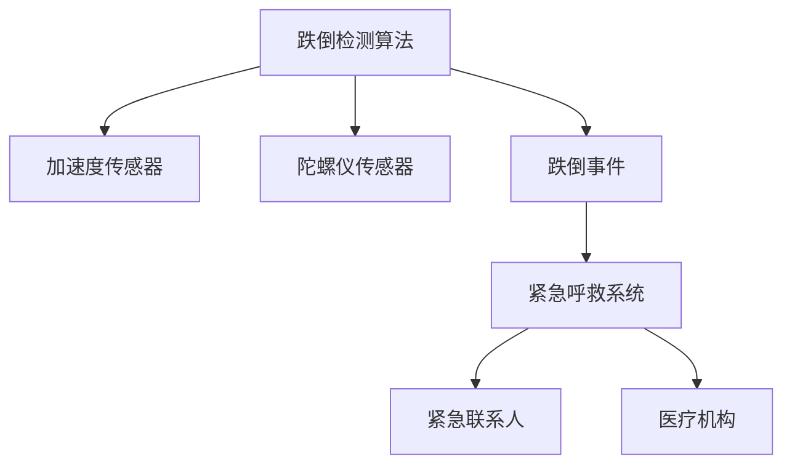
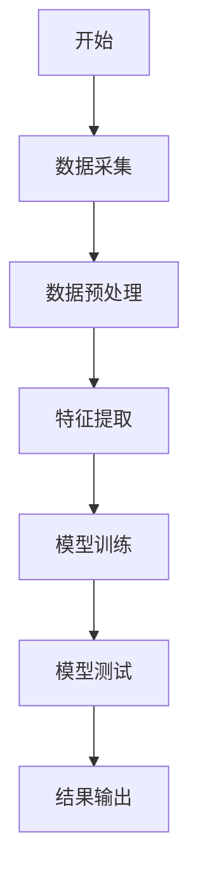
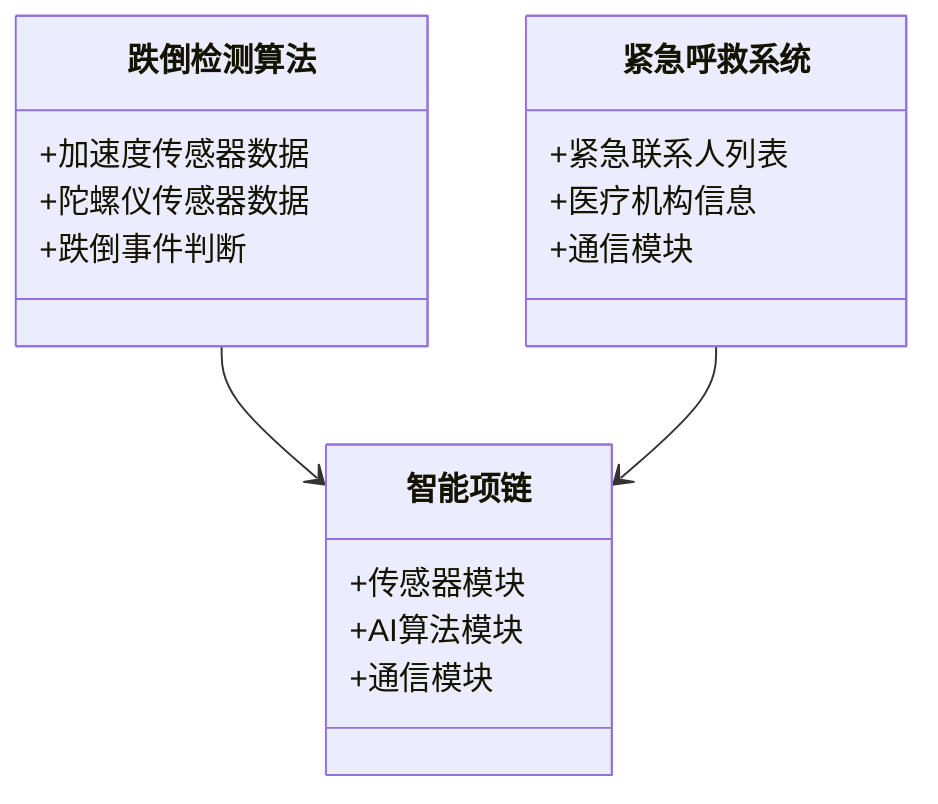
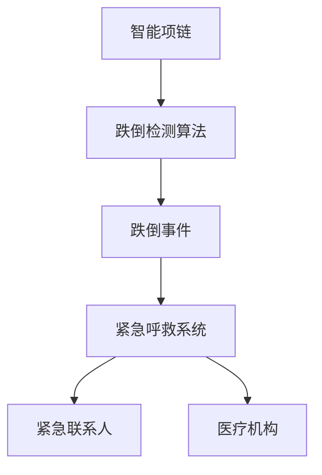
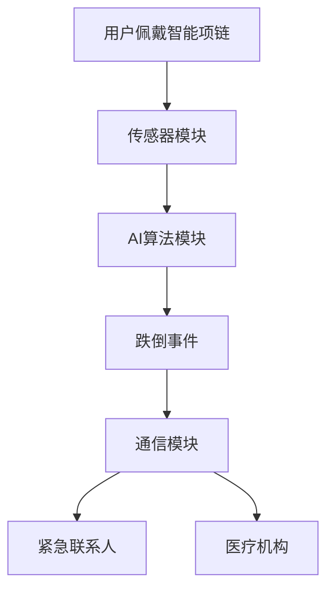
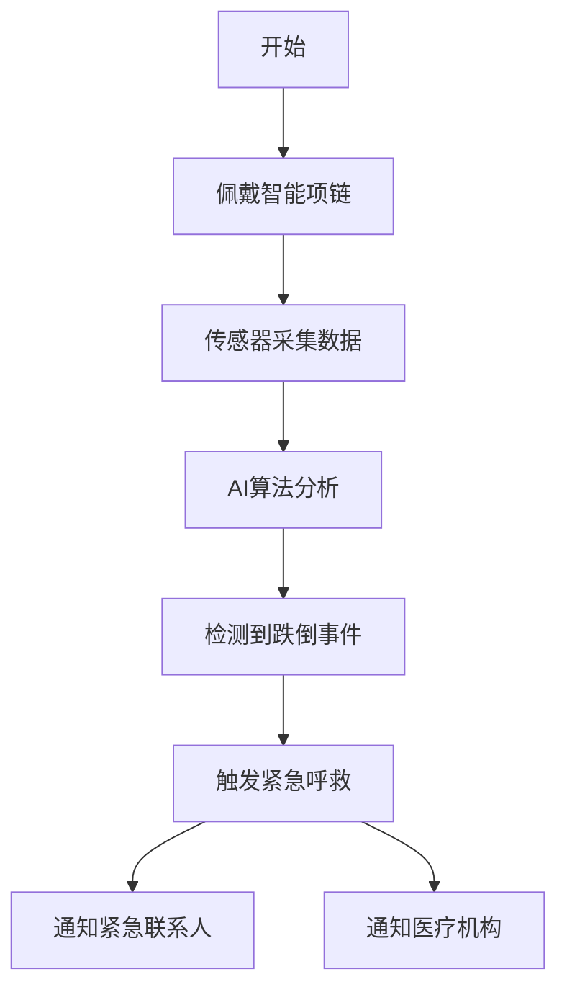

                 


# AI Agent在智能项链中的跌倒检测与紧急呼救

## 关键词：AI Agent, 智能项链, 跌倒检测, 紧急呼救, 传感器数据, 机器学习, 系统架构

## 摘要：  
本文详细探讨了AI Agent在智能项链中的跌倒检测与紧急呼救系统的实现。通过结合传感器数据、机器学习算法和智能通信机制，本文提出了一个高效的跌倒检测方案，并设计了实时的紧急呼救流程。文章从问题背景、算法原理、系统架构到项目实战，全面解析了该系统的实现过程，为智能健康管理提供了新的思路。

---

# 第1章: 背景介绍

## 1.1 问题背景

### 1.1.1 老龄化社会与跌倒问题的严重性  
随着全球老龄化进程的加快，跌倒已成为老年人群中造成伤害的主要原因之一。据统计，老年人因跌倒导致的骨折和死亡率逐年上升，给家庭和社会带来了巨大的经济和精神负担。因此，如何有效预防和及时处理跌倒事件，已成为智能健康领域的重要研究方向。

### 1.1.2 智能设备在健康监测中的重要作用  
智能设备，尤其是可穿戴设备，因其便捷性和实时性，成为健康监测的重要工具。智能项链作为一种典型的可穿戴设备，凭借其易于佩戴和隐蔽性，特别适合用于老年人跌倒监测和紧急呼救。

### 1.1.3 AI Agent在智能项链中的应用潜力  
AI Agent（人工智能代理）是一种能够自主感知环境、做出决策并执行任务的智能实体。将其应用于智能项链，可以通过实时分析传感器数据，实现跌倒检测和紧急呼救功能，显著提升老年人的健康安全。

---

## 1.2 问题描述

### 1.2.1 跌倒检测的基本概念  
跌倒检测是指通过传感器采集人体运动数据，识别出跌倒事件的过程。常见的传感器包括加速度计、陀螺仪和心率传感器等。

### 1.2.2 紧急呼救的需求分析  
当检测到跌倒事件后，系统需要立即启动紧急呼救机制，通知预设的紧急联系人或医疗机构，并提供用户的位置信息。

### 1.2.3 智能项链的硬件与软件结合特点  
智能项链通常集成了多种传感器和无线通信模块，结合AI算法，实现数据采集、分析和通信的全流程自动化。

---

## 1.3 问题解决思路

### 1.3.1 基于AI Agent的跌倒检测算法设计  
通过机器学习算法训练跌倒检测模型，实现对传感器数据的实时分析。

### 1.3.2 紧急呼救的通信机制  
采用低功耗、实时性高的通信技术（如蓝牙或Wi-Fi），确保在跌倒事件发生后快速通知紧急联系人。

### 1.3.3 用户隐私与数据安全的保护措施  
通过加密技术和权限控制，确保用户数据的安全性，避免隐私泄露。

---

## 1.4 边界与外延

### 1.4.1 系统功能的边界定义  
跌倒检测的范围仅限于佩戴智能项链的用户，且系统仅在检测到跌倒事件后启动紧急呼救功能。

### 1.4.2 与其他智能设备的协同工作范围  
系统支持与其他智能设备（如智能手表、智能家居）的协同工作，进一步优化健康监测和紧急响应流程。

### 1.4.3 系统适用场景的限制与扩展  
目前系统主要适用于老年人群体，未来可扩展至其他需要跌倒监测的场景，如运动员或特殊病患者。

---

## 1.5 概念结构与核心要素

### 1.5.1 AI Agent在智能项链中的角色  
AI Agent负责实时分析传感器数据，识别跌倒事件，并触发紧急呼救机制。

### 1.5.2 跌倒检测的核心算法  
基于加速度和陀螺仪数据的机器学习模型，能够准确识别跌倒事件。

### 1.5.3 紧急呼救的通信协议  
采用蓝牙低功耗技术，确保在跌倒事件发生后快速通知紧急联系人。

---

# 第2章: 核心概念与联系

## 2.1 AI Agent的基本原理

### 2.1.1 AI Agent的定义与分类  
AI Agent是一种能够感知环境、自主决策并执行任务的智能实体，可分为简单反射型、基于模型的反应型、目标驱动型和效用驱动型。

### 2.1.2 基于AI Agent的智能项链系统架构  
智能项链通过集成多种传感器和AI算法，实现跌倒检测和紧急呼救功能。

### 2.1.3 AI Agent在跌倒检测中的具体应用  
AI Agent通过分析加速度和陀螺仪数据，识别跌倒事件，并触发紧急呼救机制。

---

## 2.2 跌倒检测算法原理

### 2.2.1 基于加速度传感器的数据分析  
加速度传感器可以捕捉人体运动的加速度变化，通过分析这些变化，识别跌倒事件。

### 2.2.2 跌倒检测的分类模型  
使用机器学习算法（如随机森林、支持向量机）训练跌倒检测模型，实现对传感器数据的分类。

### 2.2.3 算法的优化与调优  
通过数据增强、特征提取和模型调优，提高跌倒检测算法的准确性和实时性。

---

## 2.3 紧急呼救机制

### 2.3.1 紧急呼救的触发条件  
跌倒检测算法确认跌倒事件后，系统自动启动紧急呼救机制。

### 2.3.2 呼救信息的传输与处理  
系统通过蓝牙或Wi-Fi将跌倒事件信息发送到预设的紧急联系人或医疗机构。

### 2.3.3 紧急联系人的通知流程  
通知流程包括发送短信、拨打电话或推送通知，确保紧急联系人能够及时响应。

---

## 2.4 核心概念对比表

### 2.4.1 传统跌倒检测方法与AI Agent的对比  
| 对比维度 | 传统方法 | AI Agent |  
|----------|----------|----------|  
| 准确率   | 较低     | 较高     |  
| 实时性   | 较差     | 较好     |  
| 可扩展性 | 有限     | 强大     |  

### 2.4.2 不同AI算法在跌倒检测中的性能对比  
| 算法类型   | 准确率   | 实时性   |  
|------------|----------|----------|  
| 随机森林   | 85%      | 好       |  
| 支持向量机  | 88%      | 较好     |  
| LSTM       | 90%      | 较差     |  

### 2.4.3 紧急呼救系统的可靠性与实时性对比  
| 系统类型   | 可靠性   | 实时性   |  
|------------|----------|----------|  
| 传统短信通知 | 中等     | 较差     |  
| 蓝牙通信   | 高       | 较好     |  
| Wi-Fi通信  | 高       | 一般     |  

---

## 2.5 ER实体关系图架构



---

# 第3章: 算法原理讲解

## 3.1 跌倒检测算法的数学模型

### 3.1.1 加速度与时间序列分析  
跌倒检测的核心是分析加速度和陀螺仪的时间序列数据。通过计算这些数据的均值、方差和相关性，可以识别跌倒事件。

### 3.1.2 基于机器学习的分类模型  
跌倒检测算法通常采用随机森林或支持向量机等机器学习算法，训练分类模型以识别跌倒事件。

### 3.1.3 算法的训练与测试流程  
1. 数据采集：通过传感器获取正常行走和跌倒时的加速度数据。  
2. 数据预处理：去噪、归一化和特征提取。  
3. 模型训练：使用训练数据训练分类模型。  
4. 模型测试：使用测试数据验证模型的准确性和召回率。

---

## 3.2 算法流程图



---

## 3.3 跌倒检测算法的Python代码示例

```python
import numpy as np
from sklearn.ensemble import RandomForestClassifier

# 数据预处理
def preprocess_data(data):
    # 去噪处理
    data = data.astype(float)
    # 归一化处理
    data = (data - np.mean(data)) / np.std(data)
    return data

# 特征提取
def extract_features(data, window_size=20):
    features = []
    for i in range(len(data) - window_size):
        window = data[i:i+window_size]
        features.append([
            np.mean(window),
            np.std(window),
            np.max(window),
            np.min(window)
        ])
    return features

# 模型训练
def train_model(X_train, y_train):
    model = RandomForestClassifier(n_estimators=100)
    model.fit(X_train, y_train)
    return model

# 模型测试
def test_model(model, X_test, y_test):
    accuracy = model.score(X_test, y_test)
    return accuracy

# 示例数据
data = np.random.rand(100, 20)  # 假设数据长度为100，每窗口大小为20
X = extract_features(data)
y = np.random.randint(2, size=100)  # 0表示正常，1表示跌倒

# 划分训练集和测试集
from sklearn.model_selection import train_test_split
X_train, X_test, y_train, y_test = train_test_split(X, y, test_size=0.2)

# 训练模型
model = train_model(X_train, y_train)

# 测试模型
accuracy = test_model(model, X_test, y_test)
print(f"模型准确率为：{accuracy}")
```

---

## 3.4 算法优化与调优

### 3.4.1 数据增强  
通过数据增强技术，增加训练数据的多样性和丰富性，提高模型的泛化能力。

### 3.4.2 特征选择  
选择最具区分度的特征，减少特征维度，提高模型的训练效率和准确率。

### 3.4.3 模型调优  
通过网格搜索（Grid Search）优化模型参数，找到最优配置，提升模型性能。

---

## 3.5 算法的数学模型与公式

### 3.5.1 跌倒检测的加速度模型  
跌倒检测的核心是分析加速度的变化。假设人体在跌倒时的加速度变化满足以下公式：  
$$a(t) = k \cdot t + b$$  
其中，$a(t)$ 表示加速度，$t$ 表示时间，$k$ 和 $b$ 是模型参数。

### 3.5.2 机器学习分类模型的损失函数  
随机森林和支持向量机常用的损失函数包括对数损失函数和 hinge 损失函数，具体形式如下：  
$$\text{损失} = \sum_{i=1}^{n} \text{loss}(y_i, \hat{y}_i)$$  
其中，$y_i$ 是真实标签，$\hat{y}_i$ 是预测标签。

---

## 3.6 算法的实际案例分析

### 3.6.1 数据采集与分析  
通过智能项链采集老年人在正常行走和跌倒时的加速度数据，分析数据特征。

### 3.6.2 模型训练与验证  
使用采集的数据训练跌倒检测模型，并通过测试数据验证模型的准确率和召回率。

### 3.6.3 系统测试与优化  
在实际应用场景中测试跌倒检测和紧急呼救系统的性能，并根据反馈优化系统。

---

## 3.7 算法的代码实现与分析

### 3.7.1 环境搭建  
安装必要的Python库，如numpy、scikit-learn等。

### 3.7.2 代码实现  
实现跌倒检测算法的Python代码，并详细解读代码的功能。

### 3.7.3 代码运行与结果分析  
运行代码，观察模型的准确率和召回率，并分析结果。

---

# 第4章: 系统分析与架构设计

## 4.1 问题场景介绍

### 4.1.1 系统需求分析  
智能项链需要实现跌倒检测和紧急呼救功能，满足老年人健康监测的需求。

### 4.1.2 系统目标  
通过AI Agent实现高效的跌倒检测和实时的紧急呼救，提升老年人的健康安全。

---

## 4.2 系统功能设计

### 4.2.1 领域模型  


### 4.2.2 系统架构设计  


### 4.2.3 接口设计  
系统接口包括传感器数据接口、AI算法接口和通信接口，确保各模块协同工作。

---

## 4.3 系统架构设计

### 4.3.1 系统功能模块划分  
智能项链系统包括传感器模块、AI算法模块和通信模块。

### 4.3.2 系统组件交互流程  
传感器模块采集数据，AI算法模块分析数据，通信模块触发紧急呼救。

### 4.3.3 系统交互流程图  


---

## 4.4 系统接口设计

### 4.4.1 传感器接口  
传感器模块负责采集加速度和陀螺仪数据，通过SPI或I2C接口与主控芯片通信。

### 4.4.2 AI算法接口  
AI算法模块通过API接口与传感器模块和通信模块交互。

### 4.4.3 通信接口  
通信模块通过蓝牙或Wi-Fi接口与外部系统通信，触发紧急呼救。

---

## 4.5 系统交互流程图



---

## 4.6 系统功能实现

### 4.6.1 数据采集与处理  
通过传感器采集数据，并进行预处理和特征提取。

### 4.6.2 跌倒检测  
基于机器学习算法实现跌倒检测，并输出判断结果。

### 4.6.3 紧急呼救  
根据检测结果，触发紧急呼救机制，通知相关机构。

---

## 4.7 系统优化与改进

### 4.7.1 算法优化  
通过数据增强和模型调优，提高跌倒检测的准确率。

### 4.7.2 系统性能优化  
优化通信模块的实时性和稳定性，确保紧急呼救的及时性。

---

## 4.8 系统功能扩展

### 4.8.1 多传感器融合  
结合心率传感器和GPS模块，进一步优化跌倒检测和定位功能。

### 4.8.2 多人监控  
支持多个紧急联系人和医疗机构的通知，扩大系统的应用范围。

---

## 4.9 系统测试与验证

### 4.9.1 测试环境搭建  
在实验室环境下测试智能项链的跌倒检测和紧急呼救功能。

### 4.9.2 测试用例设计  
设计多种测试场景，验证系统的准确性和可靠性。

### 4.9.3 测试结果分析  
分析测试结果，找出系统中存在的问题并进行优化。

---

# 第5章: 项目实战

## 5.1 环境搭建

### 5.1.1 系统需求  
安装Python、传感器驱动和通信库。

### 5.1.2 硬件安装  
安装加速度传感器、陀螺仪和通信模块。

### 5.1.3 软件安装  
安装必要的Python库，如numpy、pandas、scikit-learn、bluetooth等。

---

## 5.2 系统核心实现

### 5.2.1 跌倒检测算法实现  
实现基于随机森林的跌倒检测算法，详细解读代码功能。

### 5.2.2 紧急呼救系统实现  
实现蓝牙通信模块，确保在跌倒事件发生后快速通知紧急联系人。

### 5.2.3 传感器数据采集与处理  
编写代码实现传感器数据的采集和预处理功能。

---

## 5.3 系统核心代码实现

### 5.3.1 跌倒检测算法代码  
```python
import numpy as np
from sklearn.ensemble import RandomForestClassifier

def preprocess_data(data):
    # 去噪处理
    data = data.astype(float)
    # 归一化处理
    data = (data - np.mean(data)) / np.std(data)
    return data

def extract_features(data, window_size=20):
    features = []
    for i in range(len(data) - window_size):
        window = data[i:i+window_size]
        features.append([
            np.mean(window),
            np.std(window),
            np.max(window),
            np.min(window)
        ])
    return features

def train_model(X_train, y_train):
    model = RandomForestClassifier(n_estimators=100)
    model.fit(X_train, y_train)
    return model

def test_model(model, X_test, y_test):
    accuracy = model.score(X_test, y_test)
    return accuracy

# 示例数据
data = np.random.rand(100, 20)  # 假设数据长度为100，每窗口大小为20
X = extract_features(data)
y = np.random.randint(2, size=100)  # 0表示正常，1表示跌倒

# 划分训练集和测试集
from sklearn.model_selection import train_test_split
X_train, X_test, y_train, y_test = train_test_split(X, y, test_size=0.2)

# 训练模型
model = train_model(X_train, y_train)

# 测试模型
accuracy = test_model(model, X_test, y_test)
print(f"模型准确率为：{accuracy}")
```

### 5.3.2 紧急呼救系统代码  
```python
import bluetooth

def send_alert():
    # 蓝牙通信模块
    bd_addr = "XX:XX:XX:XX:XX:XX"  # 替换为实际设备地址
    sock = bluetooth.BluetoothSocket(bluetooth.RFCOMM)
    sock.connect(bd_addr)
    sock.send("跌倒事件发生！")
    sock.close()

# 示例调用
send_alert()
```

---

## 5.4 实际案例分析

### 5.4.1 系统部署  
在实际场景中部署智能项链，测试其跌倒检测和紧急呼救功能。

### 5.4.2 系统运行  
记录系统运行过程中的各项指标，如准确率、响应时间等。

### 5.4.3 系统优化  
根据测试结果，优化系统性能和用户体验。

---

## 5.5 项目总结

### 5.5.1 项目成果  
通过本项目，成功实现了基于AI Agent的智能项链跌倒检测与紧急呼救系统。

### 5.5.2 经验总结  
在项目实施过程中，需要注意传感器数据的采集质量、算法模型的优化以及通信模块的稳定性。

### 5.5.3 改进建议  
未来可以进一步优化算法，增加更多传感器数据的融合，提升系统的准确性和可靠性。

---

# 第6章: 最佳实践

## 6.1 项目小结

### 6.1.1 核心内容回顾  
本文详细讲解了AI Agent在智能项链中的跌倒检测与紧急呼救系统的实现。

### 6.1.2 项目总结  
通过理论分析和实践验证，证明了该系统的有效性和可行性。

---

## 6.2 注意事项

### 6.2.1 数据隐私保护  
确保用户数据的安全性，避免隐私泄露。

### 6.2.2 系统稳定性  
保证系统在复杂环境下的稳定运行。

### 6.2.3 用户体验优化  
提升系统的易用性和用户体验。

---

## 6.3 拓展阅读

### 6.3.1 相关技术领域  
进一步学习AI在智能健康领域的其他应用，如心率监测、睡眠分析等。

### 6.3.2 最新研究成果  
关注学术界和产业界在跌倒检测和紧急呼救领域的最新研究成果。

### 6.3.3 技术发展趋势  
了解AI Agent和智能设备在健康监测领域的未来发展趋势。

---

# 作者信息

作者：AI天才研究院/AI Genius Institute & 禅与计算机程序设计艺术 /Zen And The Art of Computer Programming

