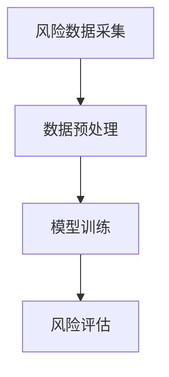
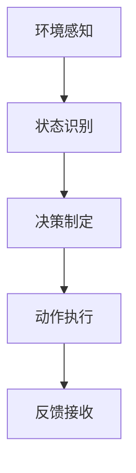
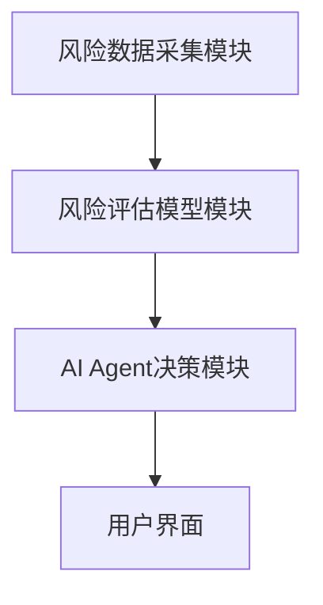
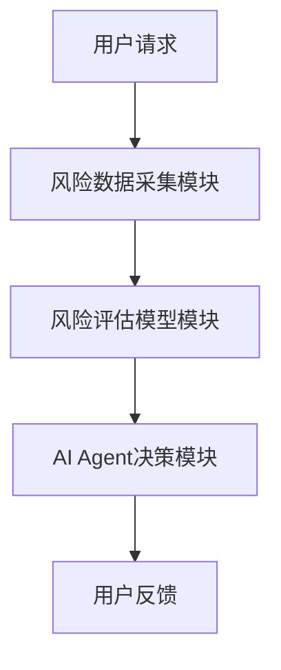

                 


# AI Agent在智能风险评估中的应用

> 关键词：AI Agent, 智能风险评估, 人工智能, 风险管理, 算法原理

> 摘要：本文深入探讨了AI Agent在智能风险评估中的应用，从基本概念、算法原理到系统架构设计，结合实际案例分析，详细阐述了AI Agent如何辅助传统风险评估方法，提升风险评估的效率和准确性。文章通过理论分析与实践结合的方式，展示了AI Agent在风险评估中的优势与挑战，并展望了未来的发展方向。

---

## 第1章: 引言

### 1.1 问题背景

#### 1.1.1 风险评估的传统方法与局限性
传统风险评估方法主要依赖人工分析和统计模型，存在以下问题：
- 数据采集效率低，人工成本高
- 模型预测精度有限，难以捕捉复杂关系
- 实时性差，无法快速响应动态变化

#### 1.1.2 AI Agent的定义与核心概念
AI Agent（智能代理）是指能够感知环境、自主决策并执行任务的智能体。其核心概念包括：
- **自主性**：无需外部干预，自主完成任务
- **反应性**：能够实时感知环境变化并做出反应
- **学习能力**：通过数据和经验不断优化决策策略

#### 1.1.3 AI Agent在风险评估中的优势
AI Agent能够显著提升风险评估的效率和准确性，主要体现在：
- **数据处理能力**：能够快速分析海量数据，提取关键信息
- **实时性**：能够实时感知环境变化，快速做出决策
- **自适应性**：能够根据新数据动态调整评估模型

### 1.2 问题描述

#### 1.2.1 风险评估的基本流程
传统风险评估的基本流程包括：
1. 数据采集
2. 数据预处理
3. 模型构建
4. 风险评估与预测

#### 1.2.2 AI Agent在风险评估中的定位
AI Agent在风险评估中扮演的角色包括：
- **数据采集与处理**：实时收集和处理风险相关数据
- **模型构建与优化**：基于数据构建和优化风险评估模型
- **实时决策与反馈**：根据模型输出实时调整策略

#### 1.2.3 风险评估中的关键挑战
风险评估面临的主要挑战包括：
- 数据的不完整性和噪声
- 模型的可解释性问题
- 实时性与准确性的平衡

### 1.3 问题解决

#### 1.3.1 AI Agent如何辅助风险评估
AI Agent通过以下方式辅助风险评估：
- **数据采集与预处理**：利用传感器和API实时采集数据，并进行清洗和特征提取
- **模型构建与优化**：基于机器学习算法构建风险评估模型，并通过反馈不断优化模型
- **实时决策与反馈**：根据模型输出实时调整策略，并向用户提供反馈

#### 1.3.2 AI Agent在风险评估中的应用场景
AI Agent在风险评估中的典型应用场景包括：
- 金融风险评估
- 供应链风险评估
- 网络安全风险评估

#### 1.3.3 AI Agent的风险评估流程
AI Agent的风险评估流程包括：
1. 数据采集与预处理
2. 模型构建与训练
3. 风险评估与预测
4. 实时监控与反馈

### 1.4 边界与外延

#### 1.4.1 风险评估的边界条件
风险评估的边界条件包括：
- 数据范围：仅限于特定领域的数据
- 时间范围：仅考虑未来一段时间内的风险
- 预测精度：模型预测结果可能存在误差

#### 1.4.2 AI Agent在风险评估中的适用范围
AI Agent适用于以下场景：
- 数据量大且动态变化的场景
- 需要实时决策的场景
- 需要自适应优化的场景

#### 1.4.3 风险评估的局限性与AI Agent的限制
风险评估的局限性包括：
- 数据不足可能导致模型精度下降
- 模型的可解释性问题可能影响用户的信任
- AI Agent的决策可能受到算法偏差的影响

#### 1.4.4 风险评估与AI Agent的核心要素组成
风险评估的核心要素包括：
- 数据：风险相关数据的采集与处理
- 模型：风险评估模型的构建与优化
- 决策：基于模型输出的实时决策

---

## 第2章: AI Agent的核心概念与原理

### 2.1 AI Agent的基本原理

#### 2.1.1 AI Agent的定义与分类
AI Agent可以根据应用场景分为以下几类：
- **反应式AI Agent**：仅根据当前感知做出反应
- **认知式AI Agent**：具备推理和规划能力
- **学习式AI Agent**：能够通过学习优化决策策略

#### 2.1.2 AI Agent的核心算法
AI Agent的核心算法包括：
- **强化学习**：通过奖励机制优化决策策略
- **监督学习**：基于标注数据训练模型
- **无监督学习**：从无标签数据中发现模式

#### 2.1.3 AI Agent的决策机制
AI Agent的决策机制包括：
- **基于规则的决策**：根据预定义规则做出决策
- **基于模型的决策**：根据风险评估模型输出结果
- **基于反馈的决策**：根据实时反馈调整决策策略

### 2.2 AI Agent在风险评估中的应用原理

#### 2.2.1 风险数据的采集与处理
风险数据的采集与处理流程包括：
1. 数据采集：通过传感器、API等采集风险相关数据
2. 数据清洗：去除噪声数据，提取有效特征
3. 数据增强：通过数据增强技术提升数据质量

#### 2.2.2 风险评估模型的构建
风险评估模型的构建流程包括：
1. 数据预处理：标准化、归一化等
2. 模型选择：选择适合的机器学习算法
3. 模型训练：基于训练数据训练模型
4. 模型评估：通过测试数据评估模型性能

#### 2.2.3 AI Agent的实时决策与反馈
AI Agent的实时决策与反馈流程包括：
1. 实时监控：持续监控风险相关数据
2. 模型预测：基于当前数据预测风险
3. 决策反馈：根据预测结果调整策略并提供反馈

### 2.3 AI Agent与传统风险评估方法的对比

#### 2.3.1 传统风险评估方法的优缺点
传统风险评估方法的优点：
- 方法成熟，易于理解和实施
缺点：
- 数据处理效率低，人工成本高
- 模型预测精度有限

#### 2.3.2 AI Agent的风险评估方法的优缺点
AI Agent的风险评估方法的优点：
- 数据处理能力强，效率高
- 模型预测精度高，能够捕捉复杂关系
缺点：
- 算法的可解释性较差
- 需要较高的技术投入

#### 2.3.3 两种方法的对比分析
从数据处理能力、预测精度、实时性等方面对比分析AI Agent与传统风险评估方法的优劣。

---

## 第3章: AI Agent在风险评估中的核心算法

### 3.1 算法原理讲解

#### 3.1.1 风险评估的基本算法
风险评估的基本算法包括：
- 线性回归
- 支持向量机
- 随机森林

#### 3.1.2 AI Agent的强化学习算法
AI Agent的强化学习算法包括：
- Q-Learning
- Deep Q-Networks (DQN)
- 策略梯度方法

#### 3.1.3 基于概率的评估算法
基于概率的评估算法包括：
- 贝叶斯网络
- 马尔可夫链

### 3.2 算法流程图

#### 3.2.1 风险评估流程图


#### 3.2.2 AI Agent决策流程图


#### 3.2.3 算法的数学模型
以下是一个简单的风险评估模型：
$$
R = \sum_{i=1}^{n} w_i x_i
$$
其中，$R$表示风险值，$w_i$表示特征$x_i$的权重。

### 3.3 算法实现代码

#### 3.3.1 环境安装与配置
```bash
pip install numpy scikit-learn
```

#### 3.3.2 核心算法实现
```python
import numpy as np
from sklearn.ensemble import RandomForestClassifier

# 示例数据
X_train = np.array([[1, 2], [3, 4], [5, 6]])
y_train = np.array([0, 1, 0])

# 模型训练
model = RandomForestClassifier()
model.fit(X_train, y_train)

# 预测
X_test = np.array([[2, 3]])
y_pred = model.predict(X_test)
print(y_pred)
```

#### 3.3.3 代码解读与分析
以上代码展示了如何使用随机森林算法进行风险分类。首先，训练数据被用来训练模型，然后模型被用来预测新的数据点。

---

## 第4章: 系统分析与架构设计

### 4.1 问题场景介绍

#### 4.1.1 风险评估的典型场景
典型场景包括：
- 金融市场的风险评估
- 供应链的风险评估
- 网络安全风险评估

#### 4.1.2 AI Agent在风险评估中的应用场景
AI Agent可以应用于以下场景：
- 实时监控金融市场波动
- 自动调整供应链策略
- 检测网络攻击并做出响应

### 4.2 系统功能设计

#### 4.2.1 风险数据采集模块
风险数据采集模块负责从各种来源采集风险相关数据，例如：
- 金融市场数据：股票价格、指数等
- 供应链数据：物流信息、库存数据
- 网络安全数据：日志、流量数据

#### 4.2.2 风险评估模型模块
风险评估模型模块负责构建和优化风险评估模型，包括：
- 数据预处理：清洗、特征提取
- 模型选择：选择适合的算法
- 模型训练：基于训练数据训练模型
- 模型优化：通过交叉验证优化模型参数

#### 4.2.3 AI Agent决策模块
AI Agent决策模块负责根据模型输出做出决策，包括：
- 实时监控：持续监控风险相关数据
- 模型预测：基于当前数据预测风险
- 决策反馈：根据预测结果调整策略并提供反馈

### 4.3 系统架构设计

#### 4.3.1 系统架构图


#### 4.3.2 系统接口设计
系统接口设计包括：
- 数据接口：与数据源对接
- 模型接口：与第三方模型服务对接
- 用户接口：与用户交互的界面

#### 4.3.3 系统交互流程图


---

## 第5章: 项目实战

### 5.1 环境安装与配置

#### 5.1.1 安装依赖
```bash
pip install numpy scikit-learn matplotlib
```

### 5.2 系统核心实现源代码

#### 5.2.1 数据采集模块
```python
import requests

def fetch_data(api_url):
    response = requests.get(api_url)
    return response.json()
```

#### 5.2.2 风险评估模型模块
```python
from sklearn.model_selection import train_test_split
from sklearn.metrics import accuracy_score

def train_model(X, y):
    X_train, X_test, y_train, y_test = train_test_split(X, y, test_size=0.2)
    model = RandomForestClassifier()
    model.fit(X_train, y_train)
    y_pred = model.predict(X_test)
    print("Accuracy:", accuracy_score(y_test, y_pred))
    return model
```

#### 5.2.3 AI Agent决策模块
```python
def make_decision(model, new_data):
    prediction = model.predict(new_data)
    return prediction[0]
```

### 5.3 案例分析与详细讲解

#### 5.3.1 案例分析
假设我们正在评估一家公司的供应链风险，数据包括供应商的交货时间、库存水平、市场需求等。

#### 5.3.2 数据预处理
```python
import pandas as pd
data = pd.read_csv('supply_chain.csv')
data = data.dropna()
```

#### 5.3.3 模型训练
```python
X = data[['供应商交货时间', '库存水平', '市场需求']]
y = data['风险等级']
model = train_model(X, y)
```

#### 5.3.4 实时决策
```python
new_data = [[5, 100, 500]]
decision = make_decision(model, new_data)
print("决策结果:", decision)
```

---

## 第6章: 总结与展望

### 6.1 总结
AI Agent在智能风险评估中的应用显著提升了风险评估的效率和准确性。通过实时数据采集、模型优化和决策反馈，AI Agent能够帮助企业在复杂多变的环境中做出更明智的决策。

### 6.2 展望
未来，AI Agent在风险评估中的应用将更加广泛和深入。随着技术的进步，AI Agent将具备更强的自主学习能力和更高的决策精度，为风险管理领域带来更大的价值。

---

## 最佳实践 tips

### 6.3.1 小结
- 理解AI Agent的核心概念和原理是成功应用的关键
- 在实际应用中，需要结合具体场景选择合适的算法和模型
- 数据的质量和实时性对风险评估结果至关重要

### 6.3.2 注意事项
- 数据隐私和安全问题需要高度重视
- 模型的可解释性问题可能影响用户的信任
- 算法的实时性和准确性需要在实际应用中进行权衡

### 6.3.3 拓展阅读
- 《机器学习实战》
- 《人工智能: 一种现代方法》
- 《风险管理与决策分析》

---

作者：AI天才研究院/AI Genius Institute & 禅与计算机程序设计艺术 /Zen And The Art of Computer Programming

