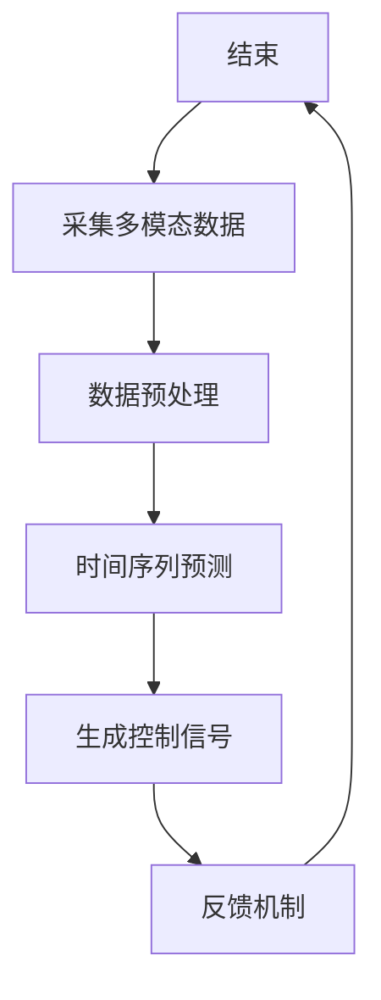
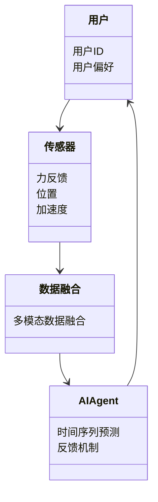
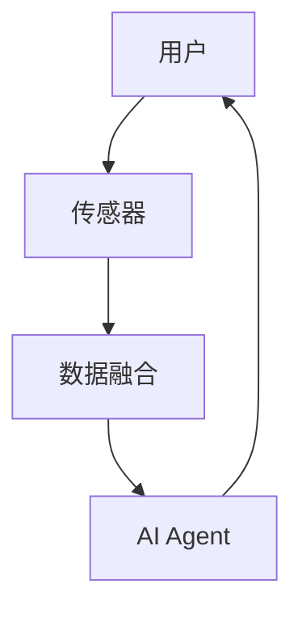

                 


# AI Agent在智能餐具中的进食速度控制

> 关键词：AI Agent，进食速度控制，智能餐具，多模态数据融合，时间序列预测，反馈机制，传感器数据

> 摘要：本文详细探讨了AI Agent在智能餐具中的进食速度控制技术，从背景介绍、核心概念、算法原理、系统架构到项目实战，全面解析了如何通过AI技术实现智能餐具的进食速度优化。文章结合理论与实践，通过详细的数学模型、算法流程图和系统架构图，为读者提供了从理论到实践的完整指南。

---

# 第一部分: 背景介绍

# 第1章: 进食速度控制的背景与问题

## 1.1 问题背景

### 1.1.1 进食速度控制的重要性
进食速度控制在智能餐具中的应用，不仅关乎用户体验，还涉及健康监测和安全控制。通过AI Agent实现智能化的进食速度管理，可以有效提升用户的用餐体验，同时保障用餐安全。

### 1.1.2 AI Agent在智能餐具中的应用场景
AI Agent（智能体）通过传感器数据采集、多模态数据融合和反馈机制，实时调整进食速度，确保用餐过程中的舒适性和安全性。

### 1.1.3 进食速度控制的边界与外延
进食速度控制的边界包括传感器数据的采集范围、AI Agent的决策范围以及用户反馈的处理范围。外延则涉及智能餐具的其他功能，如餐具定位、食物识别等。

## 1.2 问题描述

### 1.2.1 进食速度控制的核心问题
如何通过AI Agent实现基于多模态数据的进食速度优化，同时保证系统的实时性和稳定性。

### 1.2.2 智能餐具中的技术挑战
传感器数据的实时性、多模态数据的融合难度、AI Agent的决策效率以及用户反馈的处理机制。

### 1.2.3 用户需求与技术实现的结合
用户需求包括舒适性、安全性、个性化和便捷性，技术实现需要满足这些需求的同时，保证系统的高效性和稳定性。

## 1.3 问题解决

### 1.3.1 AI Agent在进食速度控制中的作用
AI Agent通过实时感知、决策和反馈，实现进食速度的动态调整，满足用户需求。

### 1.3.2 多模态数据融合技术
将来自不同传感器的数据（如力反馈、位置传感器、加速度传感器等）进行融合，提升系统的感知能力。

### 1.3.3 进食速度优化算法的设计思路
基于时间序列预测和反馈机制，设计一种动态优化算法，实现进食速度的智能控制。

## 1.4 本章小结

### 1.4.1 核心概念总结
AI Agent通过多模态数据融合和反馈机制，实现进食速度的动态优化。

### 1.4.2 下一章的预览
下一章将详细讲解AI Agent的核心原理和多模态数据融合的实现方式。

---

# 第2章: 核心概念与联系

## 2.1 AI Agent的核心原理

### 2.1.1 AI Agent的基本定义
AI Agent是一种能够感知环境、自主决策并执行任务的智能体，具备学习、推理和自适应能力。

### 2.1.2 基于反馈机制的AI Agent设计
AI Agent通过实时感知环境，根据反馈调整行为，实现目标的优化。

### 2.1.3 多模态数据融合的实现方式
将来自不同传感器的数据进行融合，提升系统的感知精度和决策能力。

## 2.2 进食速度控制的数学模型

### 2.2.1 基于时间序列的进食速度预测模型
使用LSTM（长短期记忆网络）对进食速度进行预测，模型结构如下：
$$
f(t) = \text{LSTM}(x_t)
$$
其中，$x_t$是输入的多模态数据，$f(t)$是预测的进食速度。

### 2.2.2 基于反馈机制的控制模型
控制模型通过反馈机制调整进食速度，公式如下：
$$
u(t+1) = u(t) + k \cdot (r(t) - f(t))
$$
其中，$u(t)$是当前控制信号，$r(t)$是目标进食速度，$f(t)$是当前预测速度，$k$是比例系数。

### 2.2.3 模型的优化与调优
通过强化学习优化模型参数，提升控制精度和稳定性。

## 2.3 核心概念属性对比

| 核心概念 | 属性 | 描述 |
|----------|------|------|
| AI Agent | 学习能力 | 能够通过数据学习和优化决策 |
| 多模态数据融合 | 数据源多样性 | 融合力反馈、位置、加速度等多种传感器数据 |
| 反馈机制 | 实时性 | 根据反馈实时调整控制策略 |

## 2.4 ER实体关系图

```mermaid
erDiagram
    customer[用户] 
    --> uses[使用] 
    --> smart_dining[智能餐具]
    smart_dining[智能餐具] 
    --> sensor[传感器]
    sensor[传感器] 
    --> data_fusion[数据融合]
    data_fusion[数据融合] 
    --> ai_agent[AI Agent]
    ai_agent[AI Agent] 
    --> control_signal[控制信号]
```

---

# 第3章: 算法原理讲解

## 3.1 算法概述

### 3.1.1 基于反馈机制的AI Agent算法
AI Agent通过实时感知环境，根据反馈调整控制策略，实现动态优化。

### 3.1.2 多模态数据融合算法
将来自不同传感器的数据进行融合，提升系统的感知能力。

### 3.1.3 时间序列预测算法
使用LSTM网络对进食速度进行预测，确保预测的准确性和实时性。

## 3.2 算法流程图



## 3.3 算法实现

### 3.3.1 Python源代码实现

```python
def data_fusion(sensor_data):
    # 数据预处理
    processed_data = preprocess(sensor_data)
    # 时间序列预测
    prediction = predict(processed_data)
    # 生成控制信号
    control_signal = generate_control(prediction)
    return control_signal
```

### 3.3.2 算法原理的数学模型

#### 3.3.2.1 时间序列预测模型
$$
y_t = \alpha y_{t-1} + \beta x_t + \epsilon
$$
其中，$y_t$是当前预测值，$y_{t-1}$是前一时刻的预测值，$x_t$是当前时刻的输入数据，$\alpha$和$\beta$是模型参数，$\epsilon$是误差项。

#### 3.3.2.2 反馈机制
$$
u_{t+1} = u_t + k (r_t - y_t)
$$
其中，$u_t$是当前控制信号，$r_t$是目标值，$y_t$是当前预测值，$k$是比例系数。

---

# 第4章: 系统分析与架构设计

## 4.1 问题场景介绍

### 4.1.1 进食速度控制的场景描述
智能餐具通过传感器采集数据，AI Agent基于数据进行预测和控制，实时调整进食速度。

## 4.2 系统功能设计

### 4.2.1 领域模型


## 4.3 系统架构设计

### 4.3.1 系统架构图


---

# 第5章: 项目实战

## 5.1 环境安装

### 5.1.1 Python环境配置
安装必要的库，如TensorFlow、Keras、numpy、pandas等。

### 5.1.2 传感器数据采集工具安装
安装传感器驱动和数据采集库。

## 5.2 系统核心实现源代码

### 5.2.1 数据融合代码
```python
def preprocess(sensor_data):
    # 数据预处理
    processed_data = []
    for data in sensor_data:
        processed_data.append(data / max(data))
    return processed_data
```

### 5.2.2 时间序列预测代码
```python
from tensorflow.keras import layers

model = tf.keras.Sequential([
    layers.LSTM(64, input_shape=(timesteps, features)),
    layers.Dense(1)
])
```

## 5.3 代码应用解读与分析

### 5.3.1 数据融合模块
数据融合模块将来自不同传感器的数据进行标准化处理，确保数据的一致性和准确性。

### 5.3.2 时间序列预测模块
LSTM网络用于预测进食速度，确保预测的准确性和实时性。

## 5.4 实际案例分析

### 5.4.1 案例描述
用户A在使用智能餐具时，传感器采集到力反馈、位置和加速度数据，AI Agent通过数据融合和时间序列预测，实时调整进食速度。

## 5.5 项目小结

### 5.5.1 核心代码总结
数据融合和时间序列预测是项目的核心模块，确保系统的实时性和准确性。

### 5.5.2 项目经验总结
通过项目实战，验证了AI Agent在进食速度控制中的有效性，同时积累了多模态数据融合的经验。

---

# 第6章: 最佳实践与小结

## 6.1 小结

### 6.1.1 核心概念总结
AI Agent通过多模态数据融合和反馈机制，实现进食速度的动态优化。

## 6.2 注意事项

### 6.2.1 系统实时性
确保传感器数据的实时采集和快速处理，避免数据延迟影响控制效果。

### 6.2.2 数据安全性
保护用户数据的安全，防止数据泄露和滥用。

## 6.3 拓展阅读

### 6.3.1 相关技术
推荐阅读《强化学习入门》和《时间序列分析与预测》。

---

作者：AI天才研究院 & 禅与计算机程序设计艺术

