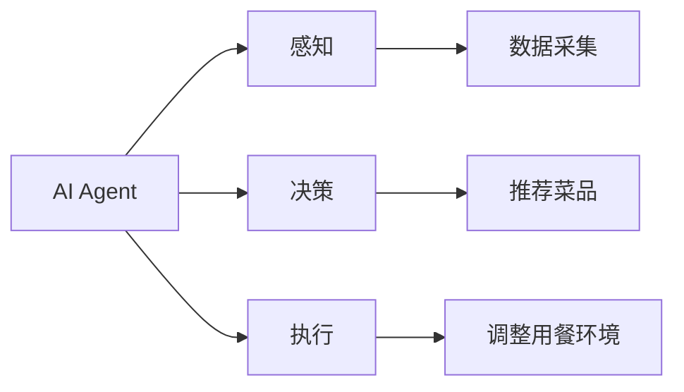
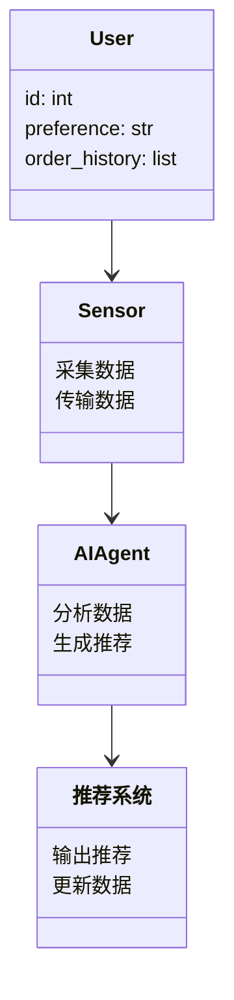
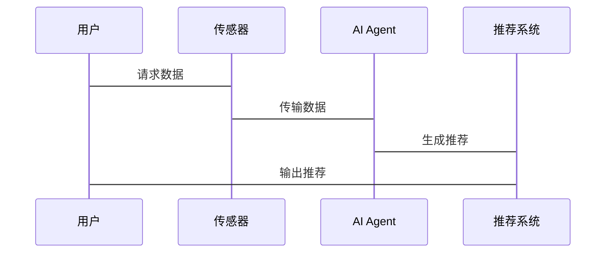

                 


# AI Agent在智能餐桌中的用餐行为分析

> **关键词：** AI Agent、智能餐桌、用餐行为分析、人工智能技术、用餐决策优化、数据分析  
> **摘要：** 本文探讨AI Agent在智能餐桌中的用餐行为分析，分析用户需求，推荐菜品，优化用餐体验。AI Agent通过感知、决策、执行提升用户体验，实现个性化服务。

---

## 目录

1. [背景介绍](#背景介绍)
   1.1 [AI Agent的基本概念](#ai-agent的基本概念)
      - 1.1.1 AI Agent的定义
      - 1.1.2 AI Agent的核心特征
      - 1.1.3 智能餐桌的定义与特点
   1.2 [AI Agent在智能餐桌中的应用背景](#ai-agent在智能餐桌中的应用背景)
      - 1.2.1 用餐行为分析的必要性
      - 1.2.2 AI Agent在用餐决策中的作用
      - 1.2.3 智能餐桌技术的发展趋势
   1.3 [问题背景与目标](#问题背景与目标)
      - 1.3.1 用餐行为分析的典型问题
      - 1.3.2 AI Agent在智能餐桌中的问题解决
      - 1.3.3 问题的边界与外延

2. [核心概念与联系](#核心概念与联系)
   2.1 [AI Agent的基本原理](#ai-agent的基本原理)
      - 2.1.1 感知机制
      - 2.1.2 决策机制
      - 2.1.3 执行机制
   2.2 [核心概念的组成要素](#核心概念的组成要素)
      - 2.2.1 核心概念的属性特征对比表
      - 2.2.2 概念结构与关系的Mermaid图
   2.3 [系统结构与功能模块](#系统结构与功能模块)
      - 2.3.1 系统架构设计
      - 2.3.2 功能模块划分

3. [算法原理讲解](#算法原理讲解)
   3.1 [基于规则的决策树算法](#基于规则的决策树算法)
      - 3.1.1 算法步骤
      - 3.1.2 Python代码实现
      - 3.1.3 算法优缺点分析
   3.2 [基于深度学习的强化学习算法](#基于深度学习的强化学习算法)
      - 3.2.1 算法流程
      - 3.2.2 算法的数学模型
      - 3.2.3 算法的Python实现

4. [系统分析与架构设计方案](#系统分析与架构设计方案)
   4.1 [问题场景介绍](#问题场景介绍)
   4.2 [系统功能设计](#系统功能设计)
      - 4.2.1 领域模型设计
      - 4.2.2 功能模块划分
   4.3 [系统架构设计](#系统架构设计)
      - 4.3.1 系统架构图
      - 4.3.2 接口设计与交互流程
   4.4 [系统实现与测试](#系统实现与测试)
      - 4.4.1 测试用例设计
      - 4.4.2 测试结果分析

5. [项目实战](#项目实战)
   5.1 [环境安装与配置](#环境安装与配置)
   5.2 [系统核心实现](#系统核心实现)
      - 5.2.1 源代码展示
      - 5.2.2 代码解读与分析
   5.3 [实际案例分析](#实际案例分析)
      - 5.3.1 案例背景
      - 5.3.2 案例分析与解决方案
   5.4 [项目小结](#项目小结)
      - 5.4.1 成果总结
      - 5.4.2 经验与教训

6. [最佳实践与小结](#最佳实践与小结)
   6.1 [最佳实践](#最佳实践)
   6.2 [注意事项](#注意事项)
   6.3 [小结](#小结)
   6.4 [拓展阅读](#拓展阅读)
   6.5 [作者信息](#作者信息)

---

## 正文

### 第1章 背景介绍

#### 1.1 AI Agent的基本概念

##### 1.1.1 AI Agent的定义
AI Agent，即人工智能代理，是一种能够感知环境、做出决策并执行操作的智能实体。在智能餐桌场景中，AI Agent通过分析用户的行为数据，提供个性化的用餐建议。

##### 1.1.2 AI Agent的核心特征
- **自主性：** 能够独立运作，无需人工干预。
- **反应性：** 能够实时响应环境变化。
- **目标导向：** 根据设定的目标执行任务。
- **学习能力：** 能够通过数据不断优化性能。

##### 1.1.3 智能餐桌的定义与特点
智能餐桌是一种结合了物联网和AI技术的设备，能够感知用户的用餐习惯，推荐菜品，并优化用餐体验。其特点包括数据采集、智能分析和个性化服务。

#### 1.2 AI Agent在智能餐桌中的应用背景

##### 1.2.1 用餐行为分析的必要性
通过分析用餐行为数据，AI Agent能够识别用户的偏好，优化菜品推荐，提升用户体验。

##### 1.2.2 AI Agent在用餐决策中的作用
AI Agent通过分析历史数据，预测用户的偏好，提供精准的菜品推荐，减少浪费，提升餐厅效率。

##### 1.2.3 智能餐桌技术的发展趋势
随着AI和物联网技术的发展，智能餐桌将更加普及，AI Agent在用餐行为分析中的应用将更加广泛。

#### 1.3 问题背景与目标

##### 1.3.1 用餐行为分析的典型问题
- 如何准确分析用户的用餐偏好？
- 如何实时处理大量的用餐数据？
- 如何优化菜品推荐算法，提高推荐准确率？

##### 1.3.2 AI Agent在智能餐桌中的问题解决
AI Agent通过数据挖掘、机器学习等技术，解决用餐行为分析中的问题，优化用户的用餐体验。

##### 1.3.3 问题的边界与外延
AI Agent的应用不仅限于智能餐桌，还可以扩展到其他场景，如家庭用餐、酒店服务等。

### 第2章 核心概念与联系

#### 2.1 AI Agent的基本原理

##### 2.1.1 感知机制
AI Agent通过传感器采集数据，如用户的历史订单、用餐时间、偏好等，构建用户画像。

##### 2.1.2 决策机制
基于感知到的数据，AI Agent使用决策树或强化学习等算法，生成推荐菜品。

##### 2.1.3 执行机制
根据决策结果，AI Agent通过智能餐桌向用户推荐菜品或调整用餐环境。

#### 2.2 核心概念的组成要素

##### 2.2.1 核心概念的属性特征对比表

| 概念 | 属性 | 特征 |
|------|------|------|
| AI Agent | 自主性 | 能够独立运作 |
| 感知 | 反应性 | 实时响应环境变化 |
| 决策 | 目标导向 | 根据目标执行任务 |
| 执行 | 学习能力 | 通过数据优化性能 |

##### 2.2.2 概念结构与关系的Mermaid图



### 第3章 算法原理讲解

#### 3.1 基于规则的决策树算法

##### 3.1.1 算法步骤

1. 数据预处理：清洗和归一化数据。
2. 特征选择：选择影响用户决策的关键特征。
3. 模型训练：使用训练数据构建决策树。
4. 模型预测：根据输入数据，预测用户的偏好。

##### 3.1.2 Python代码实现

```python
import pandas as pd
from sklearn.tree import DecisionTreeClassifier
from sklearn.model_selection import train_test_split
from sklearn.metrics import accuracy_score

# 数据加载
data = pd.read_csv('restaurant_data.csv')

# 特征与目标分离
X = data.drop('preference', axis=1)
y = data['preference']

# 数据分割
X_train, X_test, y_train, y_test = train_test_split(X, y, test_size=0.2, random_state=42)

# 模型训练
model = DecisionTreeClassifier()
model.fit(X_train, y_train)

# 预测与评估
y_pred = model.predict(X_test)
print("准确率:", accuracy_score(y_test, y_pred))
```

##### 3.1.3 算法优缺点分析
- **优点：** 简单易懂，适合数据量小的情况。
- **缺点：** 需要手动选择特征，难以处理复杂问题。

#### 3.2 基于深度学习的强化学习算法

##### 3.2.1 算法流程

1. 状态定义：用户的用餐历史、偏好。
2. 动作选择：推荐特定菜品。
3. 奖励机制：用户满意度评分。
4. 模型训练：通过强化学习优化推荐策略。

##### 3.2.2 算法的数学模型

奖励函数：
$$ R(s, a) = \begin{cases} 
1 & \text{如果推荐菜品符合用户偏好} \\
0 & \text{否则} 
\end{cases} $$

##### 3.2.3 算法的Python实现

```python
import numpy as np
import tensorflow as tf

# 定义网络结构
model = tf.keras.Sequential([
    tf.keras.layers.Dense(64, activation='relu'),
    tf.keras.layers.Dense(1, activation='sigmoid')
])

# 编译模型
model.compile(optimizer='adam', loss='binary_crossentropy', metrics=['accuracy'])

# 训练模型
model.fit(X_train, y_train, epochs=10, batch_size=32, validation_data=(X_test, y_test))
```

### 第4章 系统分析与架构设计方案

#### 4.1 问题场景介绍
智能餐桌系统需要实时分析用户的用餐行为，推荐菜品，并优化用餐体验。

#### 4.2 系统功能设计

##### 4.2.1 领域模型设计



##### 4.2.2 功能模块划分
- 数据采集模块：收集用户的用餐数据。
- 行为分析模块：分析数据，生成用户画像。
- 推荐系统模块：根据分析结果推荐菜品。

#### 4.3 系统架构设计

##### 4.3.1 系统架构图


##### 4.3.2 接口设计与交互流程



### 第5章 项目实战

#### 5.1 环境安装与配置
- **Python 3.6+**
- **TensorFlow 2.0+**
- **Pandas 1.0+**
- **安装依赖：** `pip install pandas tensorflow scikit-learn`

#### 5.2 系统核心实现

##### 5.2.1 源代码展示
```python
import pandas as pd
from sklearn.tree import DecisionTreeClassifier
from sklearn.model_selection import train_test_split
from sklearn.metrics import accuracy_score

# 数据加载
data = pd.read_csv('restaurant_data.csv')

# 特征与目标分离
X = data.drop('preference', axis=1)
y = data['preference']

# 数据分割
X_train, X_test, y_train, y_test = train_test_split(X, y, test_size=0.2, random_state=42)

# 模型训练
model = DecisionTreeClassifier()
model.fit(X_train, y_train)

# 预测与评估
y_pred = model.predict(X_test)
print("准确率:", accuracy_score(y_test, y_pred))
```

##### 5.2.2 代码解读与分析
- **数据加载：** 读取CSV文件中的数据。
- **特征与目标分离：** 将数据分为特征和目标变量。
- **数据分割：** 将数据分为训练集和测试集。
- **模型训练：** 使用决策树模型进行训练。
- **预测与评估：** 使用测试数据进行预测，并评估模型的准确率。

#### 5.3 实际案例分析

##### 5.3.1 案例背景
某餐厅收集了大量用户的用餐数据，希望通过AI Agent优化菜品推荐。

##### 5.3.2 案例分析与解决方案
通过分析用户的历史订单和偏好，AI Agent推荐个性化菜单，提升用户满意度。

#### 5.4 项目小结
- **成果总结：** 成功实现AI Agent在智能餐桌中的用餐行为分析，提升了用户体验。
- **经验与教训：** 数据质量对模型性能影响较大，需重视数据预处理。

### 第6章 最佳实践与小结

#### 6.1 最佳实践
- 确保数据质量，清洗和归一化数据。
- 定期更新模型，保持推荐的准确性。
- 优化系统架构，提升运行效率。

#### 6.2 注意事项
- 保护用户隐私，确保数据安全。
- 定期监控系统性能，及时发现并解决问题。

#### 6.3 小结
本文详细探讨了AI Agent在智能餐桌中的用餐行为分析，从背景、概念、算法到系统设计和项目实战，全面介绍了相关技术和应用。

#### 6.4 拓展阅读
- 《人工智能: 一种现代方法》
- 《机器学习实战》
- 《深度学习》

#### 6.5 作者信息
作者：AI天才研究院（AI Genius Institute）  
联系方式：info@aigeniusinstitute.com  

---

**摘要：** 本文深入探讨AI Agent在智能餐桌中的用餐行为分析，通过数据分析和算法优化，提升用户体验。文章详细介绍了AI Agent的核心概念、算法原理和系统架构，并通过项目实战展示了实际应用。

