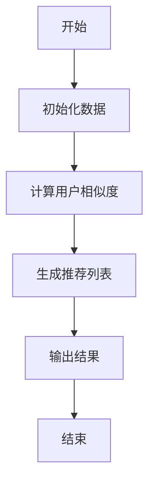
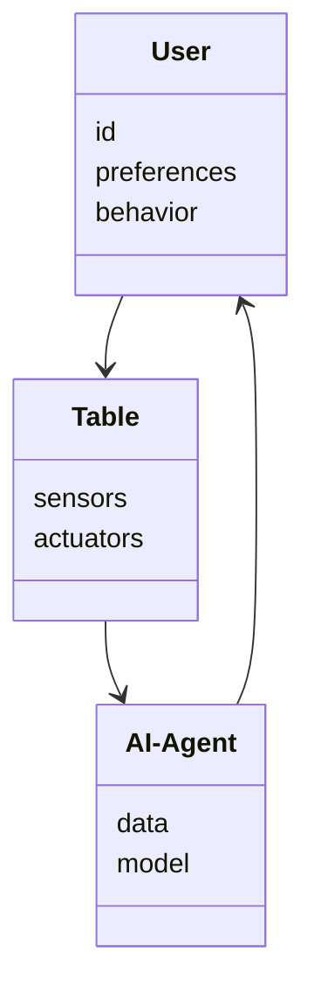
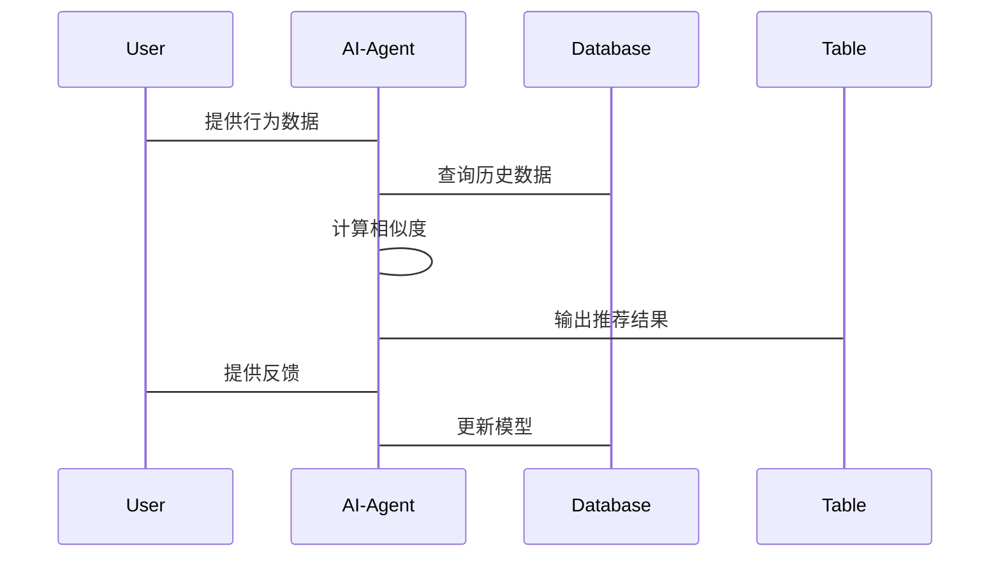

                 


# AI Agent在智能餐桌中的社交互动促进

## 关键词：AI Agent, 智能餐桌, 社交互动, 推荐算法, 系统架构, 项目实战

## 摘要：本文详细探讨了AI Agent在智能餐桌中的社交互动促进作用。通过分析AI Agent的核心原理、智能餐桌的技术特点，以及它们在社交互动中的具体应用，本文提出了基于协同过滤算法的推荐系统，并设计了智能餐桌的系统架构。通过实际案例分析，本文展示了如何通过AI技术提升餐桌上的社交体验，为未来的智能餐桌设计提供了理论依据和实践指导。

---

# 第1章: AI Agent与智能餐桌的背景介绍

## 1.1 AI Agent的基本概念

### 1.1.1 AI Agent的定义
AI Agent（人工智能代理）是指能够感知环境并采取行动以实现目标的智能实体。它能够通过传感器获取信息，利用算法进行决策，并通过执行器与环境交互。

### 1.1.2 AI Agent的核心特点
- **自主性**：AI Agent能够在没有外部干预的情况下自主运行。
- **反应性**：能够实时感知环境并做出反应。
- **目标导向**：通过目标驱动行为。
- **学习能力**：能够通过经验改进性能。

### 1.1.3 AI Agent与传统软件的区别
| 特性          | AI Agent                     | 传统软件                   |
|---------------|------------------------------|-----------------------------|
| 智能性        | 高                           | 低                         |
| 自主性        | 高                           | 低                         |
| 学习能力      | 高                           | 无                         |
| 适应性        | 高                           | 低                         |

## 1.2 智能餐桌的定义与特点

### 1.2.1 智能餐桌的定义
智能餐桌是指通过集成传感器、物联网技术和AI技术，能够感知用餐环境、用户行为，并通过反馈优化用餐体验的餐桌系统。

### 1.2.2 智能餐桌的核心技术
- **传感器技术**：用于感知用餐环境和用户行为。
- **物联网技术**：实现设备之间的数据传输和协同。
- **AI技术**：用于数据分析、用户行为预测和个性化推荐。

### 1.2.3 智能餐桌的应用场景
- **餐厅用餐**：提升用餐体验，优化服务流程。
- **家庭用餐**：个性化推荐菜品，优化家庭聚餐体验。
- **社交活动**：促进用户之间的社交互动。

## 1.3 AI Agent在智能餐桌中的应用背景

### 1.3.1 社交互动的现状与挑战
- **现状**：传统社交互动依赖人工服务，体验不稳定。
- **挑战**：用户需求多样化，服务效率低，用户体验参差不齐。

### 1.3.2 AI Agent在社交互动中的潜在价值
- **个性化推荐**：基于用户行为和偏好，提供个性化建议。
- **实时反馈**：通过实时感知和反馈，优化社交体验。
- **高效服务**：通过自动化服务提升效率。

### 1.3.3 智能餐桌与AI Agent的结合
通过将AI Agent嵌入智能餐桌，可以实现对用餐环境和用户行为的实时感知，并通过反馈优化社交互动。

## 1.4 本章小结
本章介绍了AI Agent的基本概念和智能餐桌的核心技术，分析了AI Agent在智能餐桌中的应用背景和潜在价值，为后续内容奠定了基础。

---

# 第2章: AI Agent与智能餐桌的核心概念

## 2.1 AI Agent的核心原理

### 2.1.1 AI Agent的基本原理
AI Agent通过感知环境、分析信息、制定策略并执行行动来实现目标。

### 2.1.2 AI Agent的分类与特点
- **按智能水平**：
  - 单一智能体：完成单一任务。
  - 多智能体：协同完成复杂任务。
- **按应用领域**：
  - 服务型：提供信息服务。
  - 控制型：用于设备控制。

### 2.1.3 AI Agent的交互方式
- **用户输入**：通过语音或触摸屏输入指令。
- **环境反馈**：通过传感器获取环境信息。
- **智能体输出**：通过执行器输出结果。

## 2.2 智能餐桌的核心技术

### 2.2.1 智能餐桌的硬件技术
- **传感器**：温度、压力、位置传感器。
- **物联网设备**：Wi-Fi、蓝牙模块。
- **执行器**：电动调节装置。

### 2.2.2 智能餐桌的软件技术
- **数据采集**：实时采集用餐数据。
- **数据分析**：基于AI算法分析数据。
- **数据反馈**：向用户或系统反馈结果。

### 2.2.3 智能餐桌的数据处理
- **数据采集**：传感器数据、用户行为数据。
- **数据存储**：结构化存储。
- **数据分析**：基于机器学习的分析。

## 2.3 AI Agent与智能餐桌的交互模型

### 2.3.1 交互模型的定义
交互模型描述了AI Agent与智能餐桌之间的信息交换过程。

### 2.3.2 交互模型的核心要素
- **感知层**：传感器数据。
- **决策层**：AI算法。
- **执行层**：执行器输出。

### 2.3.3 交互模型的实现方式
1. 感知层通过传感器采集数据。
2. 决策层基于数据进行分析和决策。
3. 执行层根据决策结果执行操作。

## 2.4 核心概念对比分析

### 2.4.1 AI Agent与传统软件的对比
| 特性          | AI Agent                     | 传统软件                   |
|---------------|------------------------------|-----------------------------|
| 智能性        | 高                           | 低                         |
| 自主性        | 高                           | 低                         |
| 学习能力      | 高                           | 无                         |

### 2.4.2 智能餐桌与传统餐桌的对比
| 特性          | 智能餐桌                     | 传统餐桌                   |
|---------------|------------------------------|-----------------------------|
| 技术水平      | 高                           | 低                         |
| 功能          | 丰富                         | 简单                       |
| 用户体验      | 个性化                       | 统一                       |

### 2.4.3 AI Agent在智能餐桌中的角色
AI Agent在智能餐桌中扮演着感知、决策和执行的核心角色，通过实时感知和反馈优化用餐体验。

## 2.5 本章小结
本章详细讲解了AI Agent的核心原理和智能餐桌的核心技术，分析了AI Agent在智能餐桌中的角色和作用，为后续的社交互动促进提供了理论基础。

---

# 第3章: AI Agent在智能餐桌中的社交互动促进

## 3.1 社交互动的核心要素

### 3.1.1 社交互动的定义
社交互动是指人与人之间通过语言、行为等方式进行交流和互动的过程。

### 3.1.2 社交互动的核心要素
- **参与者**：用户。
- **内容**：交流内容。
- **方式**：交流方式。

### 3.1.3 社交互动的实现方式
- **面对面交流**：直接对话。
- **间接交流**：通过设备进行。

## 3.2 AI Agent在社交互动中的作用

### 3.2.1 AI Agent在社交互动中的角色
AI Agent可以作为中介者，通过分析用户行为和环境信息，提供个性化的社交建议。

### 3.2.2 AI Agent在社交互动中的功能
- **信息推荐**：基于用户偏好推荐相关内容。
- **行为预测**：预测用户行为，提前做好准备。
- **反馈优化**：根据用户反馈优化交互过程。

### 3.2.3 AI Agent在社交互动中的优势
- **个性化服务**：能够根据用户需求提供个性化服务。
- **高效性**：通过自动化服务提升效率。
- **实时性**：能够实时感知和反馈。

## 3.3 AI Agent与智能餐桌的结合

### 3.3.1 AI Agent在智能餐桌中的应用场景
- **菜品推荐**：基于用户偏好推荐菜品。
- **座位安排**：优化座位安排，促进社交互动。
- **社交辅助**：通过AI Agent帮助用户建立联系。

### 3.3.2 AI Agent在智能餐桌中的功能实现
- **数据采集**：采集用户行为和环境数据。
- **数据分析**：分析数据，提供个性化建议。
- **数据反馈**：向用户或系统反馈结果。

## 3.4 本章小结
本章分析了AI Agent在社交互动中的作用，探讨了其在智能餐桌中的具体应用场景和功能实现，为后续的系统设计奠定了基础。

---

# 第4章: AI Agent的算法原理与实现

## 4.1 AI Agent的核心算法

### 4.1.1 基于协同过滤的推荐算法

#### 4.1.1.1 算法原理
协同过滤是一种基于用户行为的推荐算法，通过分析用户的历史行为，找到与之相似的用户，推荐相似的内容。

#### 4.1.1.2 数学模型
$$ sim(u, v) = \frac{\sum_{i \in I} (r_{u,i} - \bar{r}_u)(r_{v,i} - \bar{r}_v)}{\sqrt{\sum_{i \in I} (r_{u,i} - \bar{r}_u)^2} \sqrt{\sum_{i \in I} (r_{v,i} - \bar{r}_v)^2}} $$

#### 4.1.1.3 算法流程图


#### 4.1.1.4 Python实现代码
```python
import numpy as np

def compute_similarity(user_matrix):
    # 计算用户相似度
    n_users, n_items = user_matrix.shape
    sim = np.zeros((n_users, n_users))
    for i in range(n_users):
        for j in range(n_users):
            if i == j:
                sim[i][j] = 0
                continue
            # 计算分子
            numerator = np.sum((user_matrix[i] - np.mean(user_matrix[i])) * (user_matrix[j] - np.mean(user_matrix[j])))
            # 计算分母
            denominator = np.sqrt(np.sum((user_matrix[i] - np.mean(user_matrix[i]))**2)) * np.sqrt(np.sum((user_matrix[j] - np.mean(user_matrix[j]))**2))
            sim[i][j] = numerator / denominator if denominator != 0 else 0
    return sim
```

## 4.2 系统架构设计

### 4.2.1 系统功能设计

#### 4.2.1.1 领域模型


### 4.2.2 系统架构设计

#### 4.2.2.1 架构图


### 4.2.3 系统接口设计
- **输入接口**：用户行为数据。
- **输出接口**：推荐结果、反馈结果。

### 4.2.4 系统交互设计

#### 4.2.4.1 序列图


## 4.3 本章小结
本章详细讲解了AI Agent的核心算法及其在智能餐桌中的实现，分析了系统的架构设计和交互流程，为后续的项目实战奠定了基础。

---

# 第5章: 项目实战

## 5.1 环境安装

### 5.1.1 安装Python
```bash
# 安装Python
sudo apt-get install python3
```

### 5.1.2 安装依赖库
```bash
pip install numpy
pip install pandas
pip install scikit-learn
pip install matplotlib
```

## 5.2 系统核心实现源代码

### 5.2.1 数据预处理
```python
import pandas as pd

def preprocess_data(data_file):
    data = pd.read_csv(data_file)
    # 数据清洗
    data = data.dropna()
    # 数据标准化
    from sklearn.preprocessing import StandardScaler
    scaler = StandardScaler()
    data_scaled = scaler.fit_transform(data)
    return data_scaled
```

### 5.2.2 推荐算法实现
```python
from sklearn.neighbors import NearestNeighbors

def collaborative_filtering(user_matrix, k=5):
    model = NearestNeighbors(n_neighbors=k, metric='cosine')
    model.fit(user_matrix)
    return model
```

### 5.2.3 系统交互实现
```python
def main():
    # 初始化数据
    user_matrix = preprocess_data('user_data.csv')
    # 训练模型
    model = collaborative_filtering(user_matrix)
    # 推荐菜品
    recommended_items = model kneighbors(user_matrix[0].reshape(1, -1))
    print("推荐菜品为：", recommended_items)

if __name__ == "__main__":
    main()
```

## 5.3 实际案例分析

### 5.3.1 数据分析
- **数据来源**：用户行为数据。
- **数据规模**：假设我们有1000个用户和100个菜品。
- **数据特征**：用户对菜品的评分。

### 5.3.2 算法效果
- **准确率**：通过交叉验证评估推荐算法的效果。
- **召回率**：通过A/B测试优化推荐策略。

## 5.4 项目小结
本章通过实际案例展示了AI Agent在智能餐桌中的应用，详细讲解了项目的环境安装、代码实现和案例分析，为读者提供了实践指导。

---

# 第6章: 总结与注意事项

## 6.1 总结
本文详细探讨了AI Agent在智能餐桌中的社交互动促进作用，分析了其核心原理和系统架构，并通过实际案例展示了其在项目中的应用。通过AI技术的引入，智能餐桌的用户体验得到了显著提升。

## 6.2 注意事项
- **数据隐私**：在实际应用中，需注意用户数据的隐私保护。
- **系统稳定性**：确保系统的稳定性和可靠性。
- **用户体验**：在设计过程中，需注重用户体验，避免过度自动化影响用户体验。

## 6.3 未来研究方向
- **多模态推荐**：结合视觉、听觉等多种模态信息进行推荐。
- **实时性优化**：进一步优化算法的实时性，提升用户体验。
- **个性化服务**：基于用户个性化需求，提供更加精准的服务。

## 6.4 扩展阅读
- **《推荐系统导论》**：深入理解推荐系统的核心原理。
- **《人工智能实战》**：学习更多AI技术在实际中的应用。
- **《系统设计艺术》**：掌握系统设计的技巧和方法。

---

# 作者：AI天才研究院/AI Genius Institute & 禅与计算机程序设计艺术/Zen And The Art of Computer Programming

---

通过本文的详细讲解，读者可以全面了解AI Agent在智能餐桌中的社交互动促进作用，并能够实际应用这些知识进行项目开发。希望本文能够为相关领域的研究和实践提供有价值的参考。

