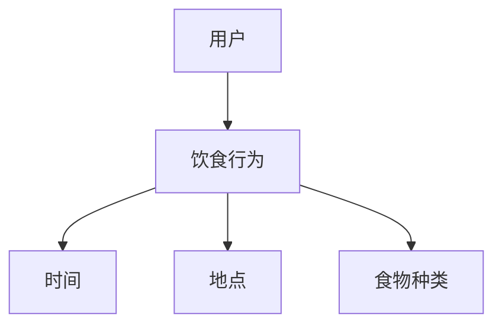
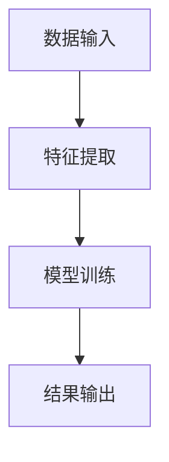
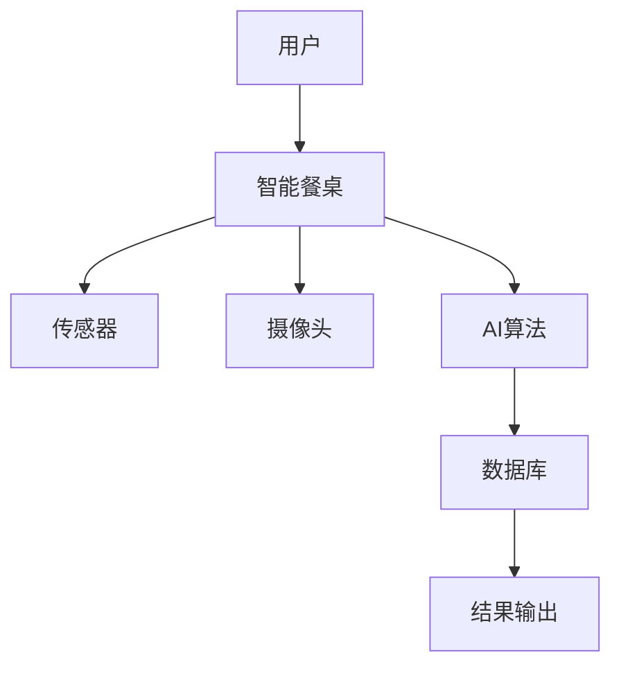
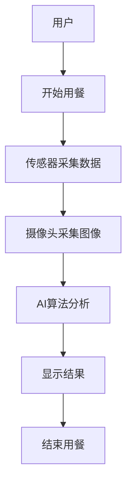

                 


# AI Agent在智能餐桌中的饮食行为分析

> **关键词**：AI Agent, 智能餐桌, 饮食行为分析, 机器学习, 数据分析  
> **摘要**：本文详细探讨了AI Agent在智能餐桌中的饮食行为分析，从核心概念、算法原理、系统架构到项目实战，全面解析AI Agent如何通过数据分析优化用户的饮食体验。

---

## 第1章: AI Agent与智能餐桌概述

### 1.1 AI Agent的基本概念
AI Agent（人工智能代理）是指能够感知环境、做出决策并执行动作的智能体。它通过传感器获取信息，利用算法进行处理，并通过执行器与环境交互。AI Agent的核心特征包括主动性、反应性、目标导向性和社会性。

### 1.2 智能餐桌的定义与特点
智能餐桌是一种集成AI技术的餐桌系统，能够通过传感器和摄像头实时感知用户的饮食行为，例如食物摄入量、用餐时间、饮食习惯等。其特点包括：
1. **智能化**：通过AI技术实现对饮食行为的实时分析。
2. **个性化**：根据用户需求提供定制化的饮食建议。
3. **便捷性**：通过自动化功能提升用户体验。

### 1.3 AI Agent在智能餐桌中的作用
AI Agent在智能餐桌中的作用主要体现在以下几个方面：
1. **数据采集**：通过传感器和摄像头采集用户的饮食数据。
2. **行为分析**：利用机器学习算法分析用户的饮食习惯。
3. **行为优化**：根据分析结果提供个性化的饮食建议。

---

## 第2章: 饮食行为分析的核心概念与背景

### 2.1 饮食行为分析的定义
饮食行为分析是指通过对用户饮食行为的数据进行采集、处理和分析，挖掘用户的饮食习惯、偏好和潜在健康问题。

### 2.2 饮食行为分析的背景与问题描述
随着人们对健康饮食的关注度不断提高，饮食行为分析成为一种重要的健康管理工具。然而，传统的人工分析方法效率低、成本高，难以满足大规模用户的个性化需求。

### 2.3 饮食行为分析的核心要素
饮食行为分析的核心要素包括：
1. **数据采集**：通过传感器、摄像头等设备采集用户的饮食数据。
2. **数据处理**：对采集到的数据进行清洗、归一化处理。
3. **数据分析与建模**：利用机器学习算法对数据进行建模和分析。

---

## 第3章: AI Agent在饮食行为分析中的核心概念与联系

### 3.1 AI Agent的核心原理
AI Agent的核心原理包括感知、决策和执行三个阶段：
1. **感知**：通过传感器获取环境信息。
2. **决策**：利用算法对信息进行处理，生成决策。
3. **执行**：通过执行器将决策转化为具体动作。

### 3.2 AI Agent与饮食行为分析的联系
AI Agent与饮食行为分析的联系主要体现在数据采集、行为建模和行为优化三个方面：
1. **数据采集**：AI Agent通过传感器采集用户的饮食数据。
2. **行为建模**：利用AI技术对用户饮食行为进行建模。
3. **行为优化**：根据建模结果优化用户的饮食行为。

### 3.3 核心概念对比分析
以下是AI Agent与传统算法的对比：

| 对比维度 | AI Agent | 传统算法 |
|----------|-----------|----------|
| 智能性   | 高        | 中       |
| 自适应性 | 强        | 弱       |
| 可扩展性 | 高        | 中       |

### 3.4 ER实体关系图
以下是饮食行为分析的ER实体关系图：



---

## 第4章: 饮食行为分析的数学模型与算法原理

### 4.1 数据采集与预处理
数据采集是饮食行为分析的第一步，主要包括以下步骤：
1. **数据采集**：通过传感器和摄像头采集用户的饮食数据。
2. **数据清洗**：去除噪声数据，确保数据质量。
3. **特征提取**：从原始数据中提取有用的特征，例如食物种类、用餐时间等。

### 4.2 饮食行为分析的算法原理
以下是几种常用的算法及其原理：

#### 4.2.1 监督学习模型
**线性回归**：
$$y = \beta_0 + \beta_1x_1 + \beta_2x_2 + \dots + \beta_nx_n$$

**决策树**：
通过构建树状结构，对数据进行分类或回归。

#### 4.2.2 无监督学习模型
**聚类分析**：
通过K-means算法将用户分为不同的群体。

#### 4.2.3 强化学习模型
**Q-Learning**：
通过状态、动作和奖励的反馈，优化决策策略。

### 4.3 算法流程图
以下是饮食行为分析的算法流程图：



---

## 第5章: 系统分析与架构设计方案

### 5.1 系统功能设计
智能餐桌的系统功能设计包括以下几个方面：
1. **数据采集**：通过传感器和摄像头采集用户的饮食数据。
2. **数据分析**：利用机器学习算法对数据进行分析。
3. **结果输出**：将分析结果反馈给用户。

### 5.2 系统架构设计
以下是系统的架构图：



### 5.3 系统交互设计
以下是系统的交互流程图：



---

## 第6章: 项目实战

### 6.1 环境安装
以下是项目所需的环境配置：
- Python 3.8及以上版本
- NumPy、Pandas、Scikit-learn等库

### 6.2 核心代码实现
以下是饮食行为分析的核心代码：

```python
import numpy as np
from sklearn.tree import DecisionTreeClassifier

# 数据预处理
data = np.array([[1, 2, 3], [4, 5, 6]])
labels = np.array([0, 1])

# 模型训练
model = DecisionTreeClassifier()
model.fit(data, labels)

# 预测
new_data = np.array([[2, 3, 4]])
prediction = model.predict(new_data)
print(prediction)
```

### 6.3 案例分析
以下是饮食行为分析的实际案例：

1. **数据采集**：通过传感器采集用户的饮食数据。
2. **数据处理**：对数据进行清洗和特征提取。
3. **模型训练**：利用决策树算法对数据进行建模。
4. **结果输出**：将分析结果反馈给用户。

---

## 第7章: 总结与展望

### 7.1 本章小结
本文详细探讨了AI Agent在智能餐桌中的饮食行为分析，从核心概念、算法原理到系统架构，全面解析了AI Agent如何优化用户的饮食体验。

### 7.2 未来展望
随着AI技术的不断发展，AI Agent在智能餐桌中的应用将更加广泛。未来的研究方向包括：
1. **提高算法的准确性**：通过优化算法提升分析结果的准确性。
2. **增强系统的实时性**：通过实时分析提升用户体验。
3. **拓展应用场景**：将AI Agent技术应用于更多领域。

---

## 作者信息

作者：AI天才研究院/AI Genius Institute & 禅与计算机程序设计艺术 /Zen And The Art of Computer Programming

