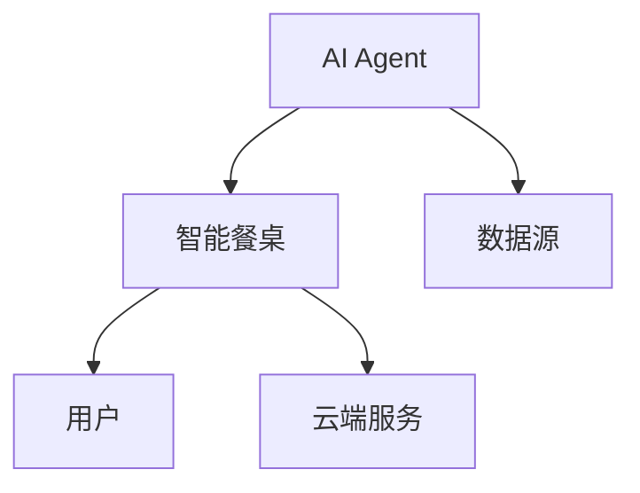
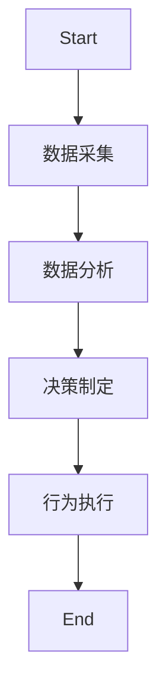
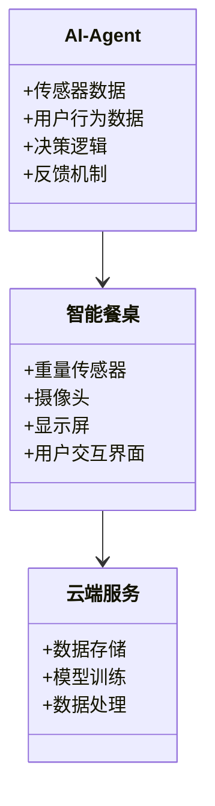
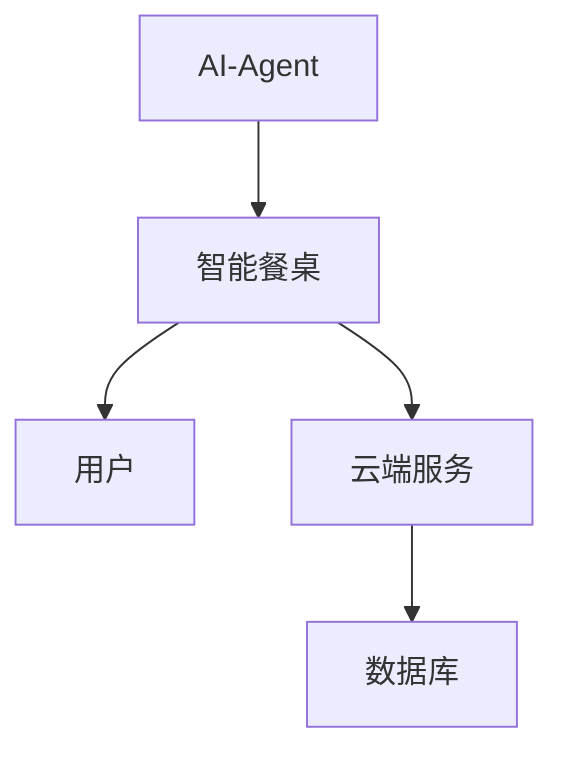

                 


# AI Agent在智能餐桌中的饮食行为矫正

**关键词**：AI Agent，智能餐桌，饮食行为矫正，机器学习，健康管理系统

**摘要**：  
本文探讨了AI Agent在智能餐桌中的应用，重点分析了如何通过AI技术矫正用户的饮食行为。文章从背景介绍、核心概念、算法原理、系统架构到项目实战，全面解析了AI Agent在智能餐桌中的实现过程。通过详细的技术分析和实际案例，展示了AI技术在饮食健康领域的巨大潜力。

---

# 第1章: AI Agent与智能餐桌的背景介绍

## 1.1 问题背景与问题描述
### 1.1.1 饮食行为矫正的必要性  
现代人由于生活方式的变化，饮食不规律、营养失衡等问题日益严重，导致肥胖、糖尿病等健康问题。饮食行为的矫正成为健康管理的重要环节。  
### 1.1.2 当前饮食行为矫正的痛点  
传统的饮食矫正方法依赖于人工记录和专家指导，存在效率低、难以持续的问题。  
### 1.1.3 AI Agent在饮食行为矫正中的作用  
AI Agent可以通过实时数据分析、个性化推荐和行为反馈，帮助用户实现饮食行为的自动化矫正。

## 1.2 AI Agent与智能餐桌的结合  
### 1.2.1 AI Agent的基本概念  
AI Agent是一种能够感知环境、自主决策并执行任务的智能体。  
### 1.2.2 智能餐桌的功能与特点  
智能餐桌通过传感器和AI算法，能够识别食物种类、监测饮食量，并提供个性化的饮食建议。  
### 1.2.3 AI Agent在智能餐桌中的应用场景  
AI Agent可以实时监测用户的饮食行为，提供健康建议，并通过反馈机制帮助用户养成良好的饮食习惯。

## 1.3 问题解决与边界定义  
### 1.3.1 饮食行为矫正的核心问题  
如何通过技术手段实现饮食行为的实时监测和有效矫正。  
### 1.3.2 AI Agent在矫正中的边界与限制  
AI Agent的矫正能力受限于数据采集的精度和算法的准确性。  
### 1.3.3 智能餐桌的使用场景与用户群体  
智能餐桌适用于家庭和个人用户，特别适合需要饮食管理的人群，如肥胖者和糖尿病患者。

## 1.4 核心概念结构与要素  
### 1.4.1 AI Agent的组成要素  
包括感知模块、决策模块和执行模块。  
### 1.4.2 智能餐桌的系统架构  
由硬件部分（传感器、显示屏）和软件部分（AI算法、用户界面）组成。  
### 1.4.3 饮食行为矫正的实现路径  
通过数据采集、行为分析和反馈干预实现矫正。

---

# 第2章: AI Agent与智能餐桌的核心概念与联系

## 2.1 AI Agent的核心原理  
### 2.1.1 机器学习与深度学习在AI Agent中的应用  
AI Agent通过机器学习模型分析用户的饮食数据，提供个性化建议。  
### 2.1.2 自然语言处理在饮食行为矫正中的作用  
AI Agent可以通过自然语言理解用户的需求，并提供相应的建议。  
### 2.1.3 视觉识别技术在智能餐桌中的应用  
通过图像识别技术，智能餐桌可以识别食物种类和数量。

## 2.2 智能餐桌的系统构成  
### 2.2.1 硬件部分：传感器与执行机构  
智能餐桌配备了重量传感器、摄像头等硬件设备。  
### 2.2.2 软件部分：AI算法与用户界面  
AI算法负责分析数据，用户界面提供交互功能。  
### 2.2.3 网络部分：数据传输与云端处理  
数据通过网络传输到云端进行处理和分析。

## 2.3 AI Agent与智能餐桌的实体关系  


---

# 第3章: AI Agent的算法原理

## 3.1 算法工作流程  


## 3.2 算法实现代码  
```python
def data_collection():
    # 通过传感器采集数据
    pass

def data_analysis(data):
    # 使用机器学习模型分析数据
    return analysis_result

def decision-making(analysis_result):
    # 判断是否需要干预
    if intervention_needed:
        return action
    else:
        return None

def action_execution(action):
    # 执行矫正行为
    pass

def main():
    data = data_collection()
    result = data_analysis(data)
    action = decision-making(result)
    if action:
        action_execution(action)
    return

if __name__ == "__main__":
    main()
```

## 3.3 数学模型与公式  
AI Agent的决策模型基于回归分析：  
$$ y = \beta_0 + \beta_1x_1 + \beta_2x_2 + \dots + \beta_nx_n $$  
其中，$y$ 是预测值，$x_i$ 是输入特征，$\beta_i$ 是模型参数。

---

# 第4章: 系统分析与架构设计方案

## 4.1 系统功能设计  


## 4.2 系统架构设计  


## 4.3 系统接口设计  
- 用户与智能餐桌的交互接口：  
  - 输入：用户的饮食行为数据  
  - 输出：个性化的饮食建议  
- AI Agent与云端服务的交互接口：  
  - 输入：实时数据  
  - 输出：决策指令  

---

# 第5章: 项目实战

## 5.1 环境安装  
- 安装Python和相关库（如TensorFlow、OpenCV）  
- 安装智能餐桌硬件设备  

## 5.2 核心代码实现  
```python
import tensorflow as tf
import cv2

def classify_food(image):
    # 使用预训练模型进行图像分类
    model = tf.keras.models.load_model("food_model.h5")
    prediction = model.predict(image)
    return prediction

def main():
    camera = cv2.VideoCapture(0)
    while True:
        ret, frame = camera.read()
        if ret:
            food = classify_food(frame)
            print(food)
        else:
            break

if __name__ == "__main__":
    main()
```

## 5.3 实际案例分析  
- 案例1：用户A通过智能餐桌记录每日饮食，AI Agent提供热量分析和建议。  
- 案例2：用户B通过智能餐桌监测食物种类，AI Agent纠正其偏食行为。

---

# 第6章: 总结与展望

## 6.1 最佳实践 tips  
- 定期更新AI模型，确保矫正的准确性。  
- 提供多样化的矫正方案，满足不同用户需求。  

## 6.2 项目总结  
通过AI Agent与智能餐桌的结合，饮食行为矫正变得更加高效和个性化。  

## 6.3 注意事项  
- 数据隐私保护是关键。  
- 系统的稳定性和安全性需要高度重视。  

## 6.4 拓展阅读  
- 《机器学习在健康领域的应用》  
- 《智能设备与用户行为分析》  

---

**作者：AI天才研究院/AI Genius Institute & 禅与计算机程序设计艺术/Zen And The Art of Computer Programming**

