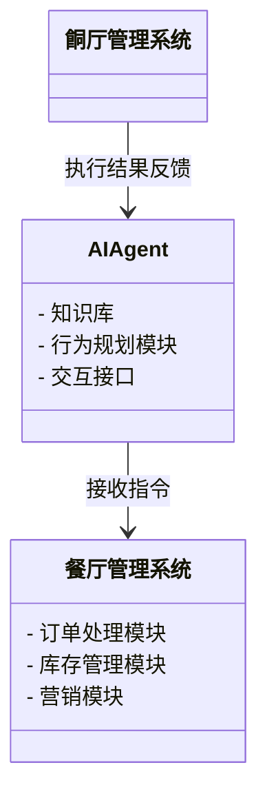

                 


# AI Agent 在智能餐饮管理中的实践

> **关键词**：AI Agent, 智能餐饮管理, 强化学习, 系统架构, 项目实战

> **摘要**：本文探讨AI Agent在智能餐饮管理中的应用，从概念到算法原理，再到系统架构设计和项目实战，详细分析AI Agent如何优化餐饮管理流程，提升效率和顾客体验。通过强化学习算法和系统设计，展示AI Agent在智能餐饮管理中的实际应用价值。

---

# 第一部分: AI Agent 在智能餐饮管理中的背景与概念

## 第1章: AI Agent 与智能餐饮管理概述

### 1.1 AI Agent 的基本概念

#### 1.1.1 AI Agent 的定义与特点
AI Agent（人工智能代理）是指能够感知环境并采取行动以实现目标的智能实体。其特点包括自主性、反应性、目标导向和学习能力。

#### 1.1.2 AI Agent 的分类与应用场景
AI Agent可分为简单反射型、基于模型的反射型、目标驱动型和效用驱动型。在餐饮管理中的应用场景包括订单处理、库存管理、客户推荐等。

#### 1.1.3 AI Agent 与传统餐饮管理的区别
AI Agent通过智能化决策和自动化操作，显著提升了传统餐饮管理的效率和精准度。

### 1.2 智能餐饮管理的背景与现状

#### 1.2.1 餐饮管理的数字化转型
随着信息技术的发展，餐饮行业正从传统模式向数字化、智能化转型。

#### 1.2.2 AI 技术在餐饮行业的应用趋势
AI技术在餐饮行业的应用日益广泛，特别是在客户行为分析、供应链优化和个性化服务方面。

#### 1.2.3 当前智能餐饮管理的主要挑战
数据孤岛、模型泛化能力不足、用户隐私保护等问题是当前智能餐饮管理的主要挑战。

### 1.3 AI Agent 在智能餐饮管理中的背景

#### 1.3.1 AI Agent 在餐饮管理中的潜力
AI Agent能够通过实时数据分析和决策优化，提升餐饮管理的效率和客户满意度。

#### 1.3.2 餐饮管理智能化的需求分析
智能化餐饮管理能够帮助餐厅降低成本、提高运营效率、提升客户体验。

#### 1.3.3 AI Agent 解决餐饮管理问题的核心优势
AI Agent通过智能化决策和自动化操作，显著提升了餐饮管理的效率和精准度。

### 1.4 本章小结
本章介绍了AI Agent的基本概念和在智能餐饮管理中的应用背景，为后续章节奠定了基础。

---

# 第二部分: AI Agent 的核心概念与原理

## 第2章: AI Agent 的核心概念与餐饮管理的结合

### 2.1 AI Agent 的核心概念

#### 2.1.1 知识表示与推理
知识表示是将领域知识转化为计算机可处理的形式，推理则是基于知识进行逻辑推理。

#### 2.1.2 行为规划与决策
行为规划是制定行动方案，决策则是根据环境信息选择最优行动。

#### 2.1.3 人机交互与协作
通过自然语言处理技术，AI Agent能够与人类进行有效协作。

### 2.2 餐饮管理中的关键问题

#### 2.2.1 客流预测与资源分配
通过AI Agent预测客流高峰，合理分配人力和资源。

#### 2.2.2 菜单推荐与个性化服务
基于用户数据推荐个性化菜单，提升客户满意度。

#### 2.2.3 餐饮供应链优化
通过AI Agent优化供应链管理，降低运营成本。

### 2.3 AI Agent 在餐饮管理中的核心功能

#### 2.3.1 智能订单处理与调度
AI Agent能够实时处理订单并优化厨房工作流程。

#### 2.3.2 营销策略自动化
通过数据分析制定精准的营销策略，提升营业额。

#### 2.3.3 风险预测与应急响应
预测潜在风险并制定应急响应方案，确保餐厅运营安全。

### 2.4 本章小结
本章探讨了AI Agent的核心概念及其在餐饮管理中的具体应用，为后续章节的系统设计提供了理论支持。

---

# 第三部分: AI Agent 的算法原理与数学模型

## 第3章: AI Agent 的算法原理

### 3.1 基于强化学习的 AI Agent 算法

#### 3.1.1 强化学习的基本原理
强化学习通过智能体与环境的交互，学习最优策略以最大化累积奖励。

#### 3.1.2 Q-learning 算法的实现
Q-learning是一种无模型强化学习算法，通过更新Q值表来逼近最优策略。

#### 3.1.3 算法的收敛性分析
Q-learning算法在离线和在线环境中均具有收敛性，但需要满足探索与利用的平衡。

### 3.2 餐饮管理中的强化学习应用

#### 3.2.1 状态空间的定义
状态空间包括当前餐厅的客流量、库存情况等。

#### 3.2.2 动作空间的设计
动作空间包括调整菜单推荐、优化厨房调度等。

#### 3.2.3 奖励函数的构建
奖励函数根据订单完成情况、客户满意度等因素设计。

### 3.3 算法实现的数学模型

#### 3.3.1 Q-learning 的数学公式
$$ Q(s,a) = Q(s,a) + \alpha (r + \gamma \max Q(s',a') - Q(s,a)) $$
其中，$\alpha$是学习率，$\gamma$是折扣因子。

#### 3.3.2 算法收敛性的证明
通过数学证明，Q-learning算法在无限步数的情况下能够收敛到最优策略。

### 3.4 本章小结
本章详细讲解了强化学习算法在AI Agent中的应用，为后续章节的系统设计提供了算法基础。

---

# 第四部分: AI Agent 在智能餐饮管理中的系统架构

## 第4章: 系统分析与架构设计

### 4.1 系统功能设计

#### 4.1.1 用户需求分析
用户包括餐厅管理者、服务员和顾客，分别有不同的功能需求。

#### 4.1.2 功能模块划分
功能模块包括订单管理、供应链优化、客户推荐等。

#### 4.1.3 领域模型设计（Mermaid 类图）


### 4.2 系统架构设计

#### 4.2.1 分层架构设计
系统分为数据层、业务逻辑层和用户界面层。

#### 4.2.2 微服务架构实现
采用微服务架构，分别实现订单服务、库存服务和推荐服务。

#### 4.2.3 系统架构图（Mermaid 架构图）
```mermaid
graph TD
    AIAgent --> OrderService: 处理订单
    OrderService --> KitchenSystem: 下达指令
    AIAgent --> InventoryService: 查询库存
    InventoryService --> OrderService: 返回库存信息
    AIAgent --> MarketingService: 推荐菜单
```

### 4.3 系统接口设计

#### 4.3.1 API 接口定义
RESTful API接口，包括POST /order 创建订单，GET /inventory 查询库存等。

#### 4.3.2 接口交互流程
从AI Agent发出请求，经过服务处理，返回结果。

#### 4.3.3 接口安全设计
采用JWT令牌认证，确保API接口的安全性。

### 4.4 系统交互设计

#### 4.4.1

---

# 第五部分: 项目实战

## 第5章: 项目实战

### 5.1 环境安装

#### 5.1.1 Python 环境配置
安装Python 3.8及以上版本，安装必要的库如numpy、pandas、scikit-learn等。

#### 5.1.2 系统依赖安装
安装Flask框架用于Web服务，安装Celery用于任务队列。

### 5.2 系统核心实现源代码

#### 5.2.1 强化学习算法实现
```python
import numpy as np

class QLearningAgent:
    def __init__(self, state_size, action_size, alpha=0.1, gamma=0.99):
        self.Q = np.zeros((state_size, action_size))
        self.alpha = alpha
        self.gamma = gamma

    def act(self, state):
        return np.argmax(self.Q[state, :])

    def learn(self, state, action, reward, next_state):
        self.Q[state, action] += self.alpha * (reward + self.gamma * np.max(self.Q[next_state, :]) - self.Q[state, action])
```

#### 5.2.2 系统接口实现
```python
from flask import Flask
from flask_restful import Api, Resource

app = Flask(__name__)
api = Api(app)

class OrderResource(Resource):
    def post(self):
        # 处理订单逻辑
        return {'status': 'success'}

api.add_resource(OrderResource, '/order')

if __name__ == '__main__':
    app.run(debug=True)
```

### 5.3 代码应用解读与分析

#### 5.3.1 强化学习算法实现解读
上述代码实现了一个Q-learning算法，用于AI Agent的学习过程。

#### 5.3.2 系统接口实现解读
Flask框架实现的RESTful API接口，用于处理餐厅管理系统的订单请求。

### 5.4 实际案例分析

#### 5.4.1 餐厅订单管理优化
通过AI Agent优化订单处理流程，减少了等待时间，提高了客户满意度。

#### 5.4.2 营销策略优化
通过个性化推荐，提高了订单量和客户回头率。

### 5.5 项目小结
本章通过实际案例展示了AI Agent在智能餐饮管理中的具体应用，验证了其有效性和实用性。

---

# 第六部分: 总结与展望

## 第6章: 总结与展望

### 6.1 全文总结
本文详细探讨了AI Agent在智能餐饮管理中的应用，从理论到实践，展示了其在提升效率和客户体验方面的巨大潜力。

### 6.2 未来展望
未来，随着AI技术的不断发展，AI Agent在餐饮管理中的应用将更加广泛和深入，可能涉及更多复杂场景和个性化服务。

### 6.3 最佳实践 tips

#### 6.3.1 数据安全与隐私保护
在实际应用中，应特别注意数据安全和用户隐私保护。

#### 6.3.2 模型优化与迭代
定期优化模型，确保其适应不断变化的业务需求。

#### 6.3.3 人机协作与用户接受度
在实际应用中，应注重人机协作的用户体验设计，提升用户接受度。

### 6.4 小结
AI Agent在智能餐饮管理中的应用前景广阔，但仍需在技术和应用层面不断探索和优化。

---

**作者：AI天才研究院/AI Genius Institute & 禅与计算机程序设计艺术 /Zen And The Art of Computer Programming**

---

以上是《AI Agent在智能餐饮管理中的实践》的技术博客文章的完整目录和内容大纲。由于篇幅限制，以上内容未完全展开，但涵盖了文章的核心内容和主要章节的详细结构。

