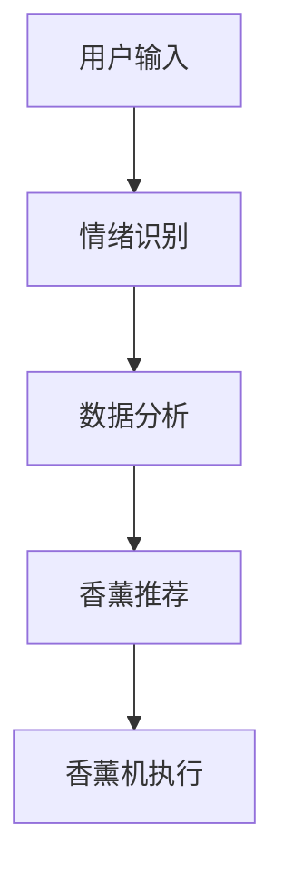
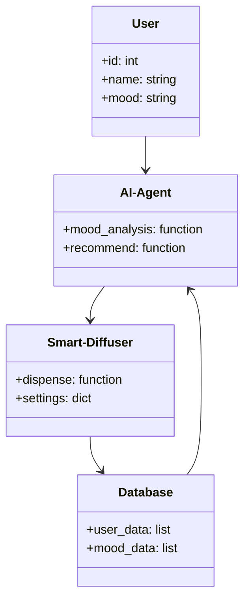
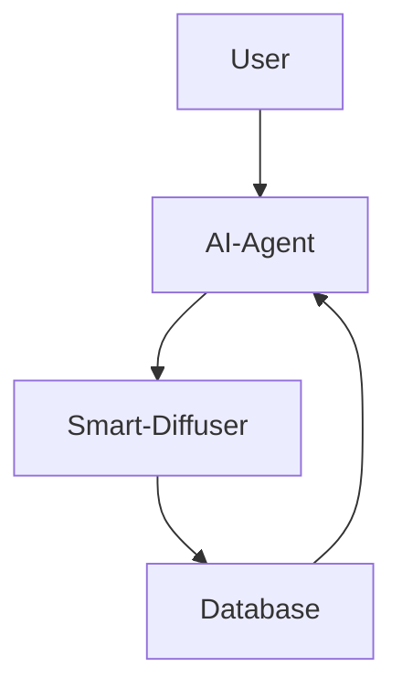
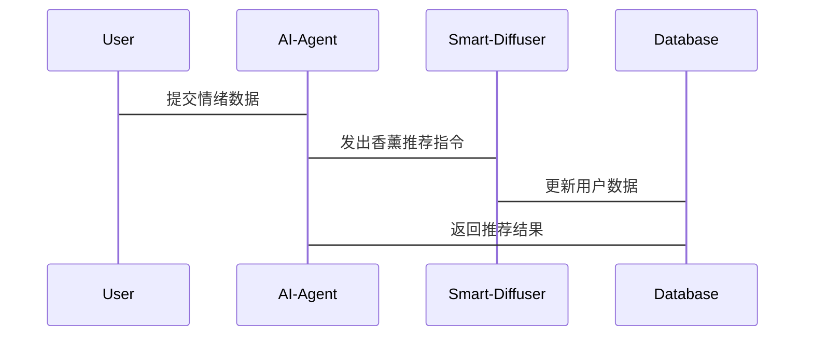

                 


# AI Agent在智能香薰机中的情绪管理助手

## 关键词：AI Agent, 智能香薰机, 情绪管理, 情感分析, 自然语言处理, 深度学习, 智能交互

## 摘要：  
随着人工智能技术的快速发展，AI Agent在智能设备中的应用日益广泛。本文探讨AI Agent在智能香薰机中的情绪管理功能，通过分析情绪识别、情感分析、个性化推荐等关键技术，结合实际应用场景，展示AI Agent如何通过智能香薰机帮助用户调节情绪，提升生活质量。

---

# 第1章：背景介绍

## 1.1 问题背景

### 1.1.1 情绪管理的必要性  
现代生活中，人们面临的工作压力和生活压力越来越大，情绪波动已成为影响健康的重要因素。情绪管理不仅是心理健康的重要组成部分，也是提升生活质量的关键。

### 1.1.2 智能设备在情绪管理中的作用  
智能设备通过实时监测和反馈，能够帮助用户更好地了解和管理情绪。香薰机作为一种能够释放香气的设备，结合AI Agent，可以为用户提供个性化的情绪调节方案。

## 1.2 问题描述

### 1.2.1 情绪波动对健康的影响  
情绪波动可能导致焦虑、失眠、免疫力下降等问题，严重时甚至会影响人际关系和工作效率。

### 1.2.2 现有情绪管理工具的局限性  
传统的心理咨询和药物治疗存在门槛高、成本高、隐私性差等问题。智能设备虽然提供了一定的辅助功能，但在情绪识别和个性化推荐方面仍有不足。

## 1.3 解决方案

### 1.3.1 AI Agent的核心作用  
AI Agent能够实时监测用户情绪，提供个性化的香薰方案，帮助用户缓解负面情绪，提升积极情绪。

### 1.3.2 智能香薰机的优势  
智能香薰机结合AI技术，能够根据用户的情绪状态自动调整香薰种类、浓度和播放节奏，提供高效的情绪管理服务。

## 1.4 边界与外延

### 1.4.1 AI Agent的功能范围  
AI Agent主要负责情绪识别、数据分析和香薰推荐，不涉及医疗诊断或其他超出情绪管理范围的功能。

### 1.4.2 情绪管理的边界  
情绪管理仅关注情绪状态的调节，不涉及用户的心理疾病治疗或其他医疗领域。

## 1.5 核心要素组成

### 1.5.1 AI Agent的组成部分  
AI Agent包括情绪识别模块、数据分析模块和香薰推荐模块。

### 1.5.2 智能香薰机的结构  
智能香薰机包括香薰模块、传感器模块和控制模块。

---

# 第2章：AI Agent的核心原理

## 2.1 原理分析

### 2.1.1 自然语言处理在情绪识别中的应用  
通过自然语言处理技术，AI Agent能够分析用户的语言表达，识别其情绪状态。

### 2.1.2 情感分析算法的实现  
情感分析算法通过分析文本中的关键词、句式和语调，判断用户的情绪状态。

## 2.2 技术对比

### 2.2.1 传统香薰技术与AI的结合  
传统香薰技术仅能提供固定的香薰方案，而结合AI后，能够根据用户情绪实时调整。

### 2.2.2 不同情绪识别方法的对比  
对比基于规则的情绪识别和基于机器学习的情绪识别，分析其优缺点。

## 2.3 系统架构

### 2.3.1 AI Agent与智能香薰机的交互流程  
用户与智能香薰机交互，AI Agent实时分析用户情绪，调整香薰方案。

### 2.3.2 系统的模块划分  
系统包括用户界面、AI Agent、香薰模块和数据存储模块。

---

# 第3章：AI Agent的算法实现

## 3.1 算法模型

### 3.1.1 情感分析模型的构建  
基于深度学习的情感分析模型，如LSTM和BERT，用于分析用户情绪。

### 3.1.2 基于深度学习的自然语言处理  
使用深度学习模型进行情感分析，提升情绪识别的准确性和鲁棒性。

## 3.2 代码实现

### 3.2.1 Python代码示例  
```python
import numpy as np
from sklearn.metrics import accuracy_score

# 示例代码：基于机器学习的情感分析
def preprocess(text):
    # 文本预处理代码
    pass

def train_model(X_train, y_train):
    # 训练模型代码
    pass

def evaluate_model(X_test, y_test, model):
    # 模型评估代码
    pass

# 示例用法
X_train, y_train = preprocess(train_data)
X_test, y_test = preprocess(test_data)
model = train_model(X_train, y_train)
evaluate_model(X_test, y_test, model)
```

### 3.2.2 算法流程图（Mermaid）  


## 3.3 数学模型

### 3.3.1 情感分析的数学公式  
$$ P(positive | text) = \frac{P(text | positive) \cdot P(positive)}{P(text)} $$

### 3.3.2 模型优化的数学推导  
通过梯度下降优化模型参数，最小化损失函数。

---

# 第4章：系统分析与架构设计

## 4.1 项目介绍

### 4.1.1 项目背景  
本项目旨在通过AI Agent和智能香薰机的结合，提供智能化的情绪管理服务。

### 4.1.2 系统功能设计  
系统功能包括情绪识别、香薰推荐、数据记录和用户反馈。

## 4.2 系统架构设计

### 4.2.1 领域模型类图  


### 4.2.2 系统架构图  


## 4.3 接口设计

### 4.3.1 系统接口设计  
定义API接口，如`/api/mood`用于接收用户情绪数据，`/api/recommend`用于获取香薰推荐。

### 4.3.2 系统交互序列图  


---

# 第5章：项目实战

## 5.1 环境安装

### 5.1.1 安装Python和相关库  
安装Python 3.x，安装TensorFlow、Keras、Scikit-learn等库。

### 5.1.2 安装智能香薰机  
购买并安装支持API控制的智能香薰机。

## 5.2 核心实现

### 5.2.1 情绪识别代码  
```python
import tensorflow as tf
from tensorflow.keras import layers

model = tf.keras.Sequential([
    layers.Dense(64, activation='relu'),
    layers.Dense(1, activation='sigmoid')
])
model.compile(optimizer='adam', loss='binary_crossentropy', metrics=['accuracy'])
model.fit(X_train, y_train, epochs=10, batch_size=32)
```

### 5.2.2 香薰推荐算法  
根据用户情绪和历史数据，推荐香薰方案。

## 5.3 案例分析

### 5.3.1 情绪状态案例  
分析不同情绪状态下的香薰推荐结果，如焦虑时推荐薰衣草香薰。

### 5.3.2 个性化推荐案例  
展示不同用户的个性化香薰推荐方案。

## 5.4 项目小结  
总结项目实现的关键点和遇到的挑战，提出改进建议。

---

# 第6章：总结与展望

## 6.1 最佳实践Tips

### 6.1.1 使用建议  
建议用户根据情绪变化调整香薰方案。

### 6.1.2 注意事项  
注意数据隐私和设备维护。

## 6.2 小结  
总结AI Agent在智能香薰机中的应用价值和实现过程。

## 6.3 注意事项  
提醒用户在使用智能设备时注意数据安全和设备维护。

## 6.4 拓展阅读  
推荐相关领域的书籍和资源，如《深度学习》和《自然语言处理实战》。

---

# 作者：AI天才研究院/AI Genius Institute & 禅与计算机程序设计艺术 /Zen And The Art of Computer Programming

