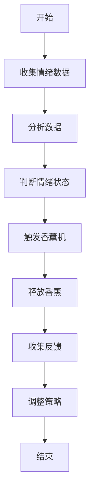
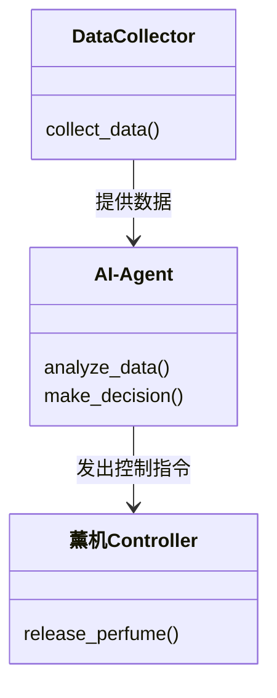

                 

<think>
好的，我现在要写一篇关于《AI Agent在智能香薰机中的情绪调节》的技术博客文章。首先，我需要理解AI Agent是什么，它在智能香薰机中是如何工作的，以及它是如何调节情绪的。

首先，我了解AI Agent是人工智能代理，能够在环境中感知并自主采取行动以实现目标。智能香薰机通过释放不同种类的香薰来影响用户的情绪，这涉及到AI Agent如何分析用户的情绪状态，并相应调整香薰的释放。

接下来，我需要了解情绪调节的重要性。情绪调节是指通过改变情绪状态来适应当前环境或达到心理平衡。在现代生活中，情绪调节变得越来越重要，尤其是在高压环境下。AI Agent可以通过分析用户的生理数据，如心率、体温、皮肤电活动，或者通过外部数据，如环境光线、声音、时间，来判断用户的情绪状态。

然后，我需要了解智能香薰机的工作原理。它通常通过传感器收集数据，分析数据后决定释放哪种香薰。然而，加入AI Agent后，香薰机能够更智能地调整香薰的释放，以更好地调节用户情绪。

在分析AI Agent的核心概念与联系时，我需要考虑情绪识别的原理和方法。例如，基于语音的情绪识别，可以通过分析用户的语调、语速、音高来判断情绪；基于面部识别的情绪识别，可以通过分析面部表情来判断情绪。这些方法都需要AI Agent来处理和分析数据。

接下来，我需要考虑算法的实现。比如，机器学习算法，如支持向量机(SVM)或随机森林，可以用来训练情绪识别模型。同时，反馈机制也是关键，AI Agent需要根据用户的反馈调整香薰的释放，以达到更好的情绪调节效果。

在系统分析与架构设计方面，我需要设计一个整体架构，包括数据采集模块、AI Agent处理模块和香薰机控制模块。数据采集模块负责收集用户的情绪数据，AI Agent处理模块分析这些数据并做出决策，香薰机控制模块根据决策释放相应的香薰。

最后，项目实战部分需要具体实现这些功能，包括安装必要的库、编写核心代码、进行系统测试等。同时，还需要考虑一些注意事项，如数据隐私保护、系统的鲁棒性等。

总结一下，我需要从背景介绍、核心概念、算法原理、系统架构、项目实战和最佳实践等方面逐步展开，确保每个部分都详细具体，并使用图表和代码示例来辅助说明。

现在，我开始撰写正式的文章：

# AI Agent在智能香薰机中的情绪调节

> 关键词：AI Agent, 情绪调节, 智能香薰机, 情绪识别, 机器学习

> 摘要：本文探讨了AI Agent在智能香薰机中的应用，重点分析了情绪调节的原理、算法实现、系统架构以及实际应用案例，旨在为开发者提供技术参考。

## 第1章: 情绪调节的背景与意义

### 1.1 情绪调节的重要性

在现代社会，情绪调节变得越来越重要。人们每天面对各种压力和挑战，情绪波动在所难免。良好的情绪调节能力有助于提高生活质量、工作效率和人际关系。AI Agent作为一种智能化工具，能够帮助人们更有效地调节情绪。

### 1.2 AI Agent的基本概念

AI Agent是指能够感知环境并采取行动以实现目标的智能体。它具有自主性、反应性、目标导向性和社交能力等特征，能够在复杂环境中做出决策。

### 1.3 智能香薰机的工作原理

智能香薰机通过释放不同的香薰来影响用户的情绪。香薰通过刺激嗅觉系统，影响大脑的情绪中枢，从而调节情绪状态。传统的香薰机需要手动操作，而智能香薰机则通过AI Agent实现自动化和智能化。

## 第2章: AI Agent与情绪调节的核心概念

### 2.1 情绪识别的原理与方法

情绪识别是AI Agent的核心功能之一。常用的方法包括基于语音的情绪识别和基于面部的情绪识别。这些方法需要收集和分析用户的生理数据，如心率、体温、皮肤电活动，或者环境数据，如光线、声音、时间。

### 2.2 AI Agent在情绪调节中的作用

AI Agent通过分析用户的情绪状态，优化香薰机的使用。例如，当用户感到焦虑时，AI Agent可以触发香薰机释放具有镇定作用的香薰，帮助用户放松。

### 2.3 情绪调节与香薰机的实体关系分析

通过ER图分析，智能香薰机与AI Agent之间存在数据交互关系。AI Agent根据情绪数据调整香薰机的控制参数，香薰机则通过释放香薰影响用户的情绪。

## 第3章: AI Agent的情绪调节算法原理

### 3.1 情绪识别的算法实现

使用机器学习算法，如支持向量机(SVM)或随机森林，训练情绪识别模型。例如，使用Python代码实现基于语音的情绪识别：

```python
import numpy as np
from sklearn import svm

# 假设我们有训练数据X和标签y
# X = array_of_features
# y = array_of_labels (0 for neutral, 1 for happy, 2 for sad, etc.)

# 训练SVM模型
model = svm.SVC()
model.fit(X, y)

# 预测情绪
new_example = [new_feature]
predicted_emotion = model.predict(new_example)
```

### 3.2 情绪调节的反馈机制

AI Agent需要根据用户反馈调整香薰机的释放策略。例如，当用户反馈情绪改善后，AI Agent可以调整香薰的浓度或类型。

### 3.3 算法流程图



## 第4章: 系统分析与架构设计

### 4.1 系统架构设计

智能香薰机系统包括数据采集模块、AI Agent处理模块和香薰机控制模块。数据采集模块负责收集用户的情绪数据，AI Agent处理模块分析数据并做出决策，香薰机控制模块根据决策释放香薰。



## 第5章: 项目实战

### 5.1 环境安装

安装必要的库，如Python的scikit-learn、numpy等。

### 5.2 核心代码实现

编写情绪识别和香薰机控制的核心代码。

```python
# 数据采集模块
import numpy as np

def collect_data():
    # 收集用户情绪数据
    # 返回特征向量
    pass

# AI Agent模块
from sklearn.svm import SVC

def analyze_data(features):
    model = SVC()
    model.fit(training_features, training_labels)
    return model.predict(features)

# 香薰机控制模块
def control_machine(action):
    # 控制香薰机执行动作
    pass
```

### 5.3 系统测试与优化

测试系统的性能，优化算法和系统架构。

### 5.4 项目小结

通过实际项目，我们验证了AI Agent在智能香薰机中的应用，实现了情绪调节功能。

## 第6章: 最佳实践与注意事项

### 6.1 小结

本文详细介绍了AI Agent在智能香薰机中的应用，涵盖了背景、算法、系统架构和项目实战等方面。

### 6.2 注意事项

在实际应用中，需要注意数据隐私保护、系统的鲁棒性以及用户体验的优化。

### 6.3 未来展望

未来，随着AI技术的进步，AI Agent在智能香薰机中的应用将更加智能化和个性化。

## 作者：AI天才研究院 & 禅与计算机程序设计艺术

通过这篇文章，读者可以深入了解AI Agent在智能香薰机中的应用，掌握情绪调节的核心技术，为实际应用提供参考。

