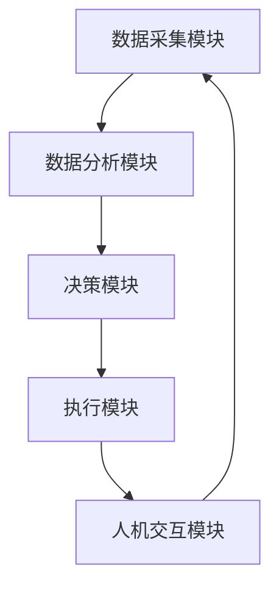
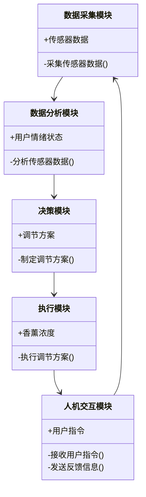

                 


# AI Agent在智能香薰机中的情绪调节功能

> **关键词**: AI Agent, 智能香薰机, 情绪调节, 深度学习, 传感器数据, 情绪识别

> **摘要**: 本文探讨AI Agent在智能香薰机中的情绪调节功能，从背景介绍、核心原理到系统架构设计，再到算法实现和项目实战，全面分析其技术细节和应用价值。通过实际案例分析，展示如何利用AI技术提升智能香薰机的用户体验，实现个性化情绪调节。

---

# 第1章: 情绪调节的背景与需求

## 1.1 情绪调节的基本概念

### 1.1.1 情绪调节的定义
情绪调节是指通过一定的方法和手段，调整个体的情绪状态，使其达到预期的效果。在智能设备中，情绪调节可以通过传感器数据收集、算法分析和执行调节操作来实现。

### 1.1.2 情绪调节的重要性
情绪调节在日常生活中的重要性不言而喻。它可以帮助人们缓解压力、改善心情，从而提高生活质量。在智能设备中实现情绪调节，可以为用户提供更加智能化和个性化的服务。

### 1.1.3 情绪调节的技术实现方式
情绪调节的技术实现方式主要包括基于传感器数据的分析和基于用户行为的分析。通过收集用户的生理数据（如心率、体温、皮肤电活动等）和环境数据（如光线、声音、气味等），结合深度学习算法，实现对用户情绪的实时监测和调节。

---

## 1.2 智能香薰机的市场现状

### 1.2.1 智能香薰机的市场发展
智能香薰机作为一种新兴的智能家居产品，近年来在市场上的发展迅速。随着人们生活水平的提高，对健康和舒适的追求也在增加，智能香薰机凭借其智能化和个性化的特点，逐渐成为家庭中的必备品。

### 1.2.2 智能香薰机的功能特点
智能香薰机的功能特点主要体现在智能化、个性化和健康化三个方面。智能化体现在通过传感器和AI技术实现自动化操作；个性化体现在可以根据用户的需求定制香薰方案；健康化则体现在通过调节环境因素改善用户的身体和心理健康。

### 1.2.3 用户对智能香薰机的需求分析
用户对智能香薰机的需求主要集中在以下几个方面：
1. 自动化操作：用户希望香薰机能够自动启动、调节香薰浓度等。
2. 个性化设置：用户希望能够根据自己的喜好定制香薰方案。
3. 健康与舒适：用户希望通过香薰改善睡眠、缓解压力等。

---

## 1.3 AI Agent在智能设备中的应用前景

### 1.3.1 AI Agent的基本概念
AI Agent（人工智能代理）是指能够感知环境、自主决策并执行任务的智能实体。它可以用于各种智能设备中，帮助设备更好地与用户交互，提供更智能的服务。

### 1.3.2 AI Agent在智能设备中的作用
AI Agent在智能设备中的作用主要体现在以下几个方面：
1. 实时监测：通过传感器收集环境数据和用户数据，实时监测用户的情绪和环境状态。
2. 智能决策：基于收集的数据，利用算法进行分析和决策，制定相应的调节方案。
3. 自动执行：根据决策结果，自动执行调节操作，如调整香薰浓度、播放音乐等。

### 1.3.3 AI Agent在智能香薰机中的应用潜力
在智能香薰机中，AI Agent可以通过以下方式实现情绪调节：
1. 通过传感器收集用户的生理数据和环境数据，实时监测用户的情绪状态。
2. 利用深度学习算法分析数据，识别用户的情绪，并根据情绪状态推荐合适的香薰方案。
3. 自动调整香薰浓度、播放舒缓音乐等，帮助用户放松心情，改善情绪。

---

## 1.4 本章小结

本章主要介绍了情绪调节的基本概念、智能香薰机的市场现状以及AI Agent在智能设备中的应用前景。通过分析，我们可以看到，AI Agent在智能香薰机中的应用潜力巨大，能够为用户提供更加智能化和个性化的服务。

---

# 第2章: AI Agent的核心原理与技术实现

## 2.1 AI Agent的基本原理

### 2.1.1 AI Agent的定义与分类
AI Agent可以根据其智能水平和应用场景进行分类。在智能香薰机中，AI Agent主要用于情绪调节，属于应用型AI Agent。

### 2.1.2 AI Agent的核心技术
AI Agent的核心技术包括感知技术、决策技术、执行技术和交互技术。在智能香薰机中，感知技术主要通过传感器实现，决策技术通过算法实现，执行技术通过香薰机的硬件实现，交互技术则通过人机交互界面实现。

### 2.1.3 AI Agent的工作流程
AI Agent的工作流程主要包括以下几个步骤：
1. 数据采集：通过传感器采集用户的生理数据和环境数据。
2. 数据分析：利用算法分析数据，识别用户的情绪状态。
3. 决策制定：根据情绪状态制定调节方案。
4. 执行调节：根据决策结果执行调节操作。

---

## 2.2 情绪识别与分析算法

### 2.2.1 情绪识别的定义
情绪识别是指通过分析用户的生理数据和行为数据，识别出用户当前的情绪状态。在智能香薰机中，情绪识别主要通过传感器数据和用户输入数据实现。

### 2.2.2 基于语音的情绪识别
基于语音的情绪识别是一种常用的情绪识别方法。通过分析用户的语音特征（如音调、语速、语调等），可以识别出用户的情绪状态。

### 2.2.3 基于传感器数据的情绪分析
基于传感器数据的情绪分析是另一种常用的情绪识别方法。通过分析用户的生理数据（如心率、体温、皮肤电活动等），可以识别出用户的情绪状态。

---

## 2.3 情绪调节算法的设计

### 2.3.1 情绪调节的目标
情绪调节的目标是通过调节环境因素（如香薰浓度、音乐节奏等），帮助用户改善情绪状态。在智能香薰机中，情绪调节的目标主要集中在缓解压力、改善睡眠和提升心情等方面。

### 2.3.2 情绪调节的实现方法
情绪调节的实现方法主要分为两类：基于规则的调节和基于深度学习的调节。基于规则的调节是通过预设的规则和条件进行调节，而基于深度学习的调节则是通过机器学习模型进行预测和决策。

### 2.3.3 情绪调节的效果评估
情绪调节的效果评估主要通过用户的反馈和生理数据的变化来实现。通过分析用户的情绪状态变化和生理数据变化，可以评估情绪调节的效果。

---

## 2.4 本章小结

本章主要介绍了AI Agent的核心原理和技术实现，包括AI Agent的基本原理、情绪识别与分析算法以及情绪调节算法的设计。通过这些技术，AI Agent可以在智能香薰机中实现情绪调节功能，为用户提供更加智能化的服务。

---

# 第3章: 智能香薰机的系统架构与功能设计

## 3.1 系统架构设计

### 3.1.1 系统模块划分
智能香薰机的系统架构主要包括以下几个模块：
1. 数据采集模块：负责采集用户的生理数据和环境数据。
2. 数据分析模块：负责分析数据，识别用户的情绪状态。
3. 决策模块：负责根据情绪状态制定调节方案。
4. 执行模块：负责根据决策结果执行调节操作。
5. 人机交互模块：负责与用户进行交互，提供反馈。

### 3.1.2 系统功能模块的交互关系
系统功能模块的交互关系可以通过Mermaid图表示如下：



---

## 3.2 系统功能设计

### 3.2.1 用户需求分析
用户需求分析是系统功能设计的基础。通过分析用户的需求，可以确定系统需要实现的功能。在智能香薰机中，用户的主要需求包括：
1. 自动启动和关闭香薰机。
2. 自动调节香薰浓度。
3. 根据情绪状态推荐香薰方案。
4. 提供人机交互界面，方便用户操作。

### 3.2.2 系统功能模块设计
系统功能模块设计可以通过Mermaid类图表示如下：



---

## 3.3 系统接口设计

### 3.3.1 系统内部接口
系统内部接口主要包括数据采集模块与数据分析模块的接口、数据分析模块与决策模块的接口、决策模块与执行模块的接口，以及执行模块与人机交互模块的接口。

### 3.3.2 系统外部接口
系统外部接口主要是与用户的交互界面，包括触摸屏、语音交互和手机App等。

### 3.3.3 接口设计的注意事项
在接口设计中，需要注意接口的标准化和兼容性，确保不同模块之间能够顺利交互。

---

## 3.4 本章小结

本章主要介绍了智能香薰机的系统架构与功能设计，包括系统模块划分、功能模块的交互关系、系统功能模块设计以及系统接口设计。通过这些设计，可以实现AI Agent在智能香薰机中的情绪调节功能。

---

# 第4章: AI Agent在智能香薰机中的算法实现

## 4.1 情绪识别算法的实现

### 4.1.1 情绪识别算法的原理
情绪识别算法的原理主要包括数据采集、数据预处理、特征提取和情绪分类四个步骤。

### 4.1.2 基于深度学习的情绪识别模型
基于深度学习的情绪识别模型可以通过卷积神经网络（CNN）实现。模型的输入是用户的生理数据和环境数据，输出是用户的情绪状态。

### 4.1.3 情绪识别算法的实现步骤
情绪识别算法的实现步骤如下：
1. 数据采集：通过传感器采集用户的生理数据和环境数据。
2. 数据预处理：对数据进行清洗和标准化处理。
3. 特征提取：提取数据中的特征，如心率变异性、体温变化等。
4. 情绪分类：利用深度学习模型对特征进行分类，识别出用户的情绪状态。

---

## 4.2 情绪调节算法的实现

### 4.2.1 情绪调节算法的原理
情绪调节算法的原理主要包括情绪状态识别、调节方案制定和调节方案执行三个步骤。

### 4.2.2 基于规则的情绪调节算法
基于规则的情绪调节算法是通过预设的规则和条件进行调节。例如，当用户的情绪状态为“焦虑”时，香薰机自动调整香薰浓度为低浓度，并播放舒缓音乐。

### 4.2.3 基于深度学习的情绪调节算法
基于深度学习的情绪调节算法可以通过训练一个回归模型实现。模型的输入是用户的情绪状态和环境数据，输出是调节方案，如香薰浓度、音乐节奏等。

---

## 4.3 算法实现的代码示例

### 4.3.1 情绪识别算法的Python代码
```python
import numpy as np
from sklearn.svm import SVC

# 数据预处理
data = np.array([...])  # 用户的生理数据和环境数据
labels = np.array([...])  # 用户的情绪状态标签

# 特征提取
features = data[:, :n_features]  # 提取特征

# 情绪分类
model = SVC()
model.fit(features, labels)
predicted_labels = model.predict(features)
```

### 4.3.2 情绪调节算法的Python代码
```python
import numpy as np
from sklearn.linear_model import LinearRegression

# 数据预处理
data = np.array([...])  # 用户的情绪状态和环境数据
labels = np.array([...])  # 调节方案标签

# 特征提取
features = data[:, :m_features]  # 提取特征

# 调节方案制定
model = LinearRegression()
model.fit(features, labels)
predicted_labels = model.predict(features)
```

---

## 4.4 本章小结

本章主要介绍了AI Agent在智能香薰机中的算法实现，包括情绪识别算法和情绪调节算法的设计与实现。通过这些算法，可以实现对用户情绪的实时监测和智能调节。

---

# 第5章: 项目实战与案例分析

## 5.1 环境安装与配置

### 5.1.1 系统环境
- 操作系统：Windows/Mac/Linux
- Python版本：3.6+
- 需要安装的库：numpy, scikit-learn, matplotlib

### 5.1.2 硬件设备
- 传感器：心率传感器、温度传感器、光线传感器等
- 智能香薰机：支持AI功能的香薰机

---

## 5.2 核心代码实现

### 5.2.1 情绪识别代码
```python
import numpy as np
from sklearn.svm import SVC

# 数据预处理
data = np.array([...])  # 用户的生理数据和环境数据
labels = np.array([...])  # 用户的情绪状态标签

# 特征提取
features = data[:, :n_features]  # 提取特征

# 情绪分类
model = SVC()
model.fit(features, labels)
predicted_labels = model.predict(features)
```

### 5.2.2 情绪调节代码
```python
import numpy as np
from sklearn.linear_model import LinearRegression

# 数据预处理
data = np.array([...])  # 用户的情绪状态和环境数据
labels = np.array([...])  # 调节方案标签

# 特征提取
features = data[:, :m_features]  # 提取特征

# 调节方案制定
model = LinearRegression()
model.fit(features, labels)
predicted_labels = model.predict(features)
```

---

## 5.3 案例分析与实际应用

### 5.3.1 案例分析
假设用户A在工作压力大时，情绪状态为“焦虑”。智能香薰机通过传感器检测到用户A的情绪状态后，自动调整香薰浓度为低浓度，并播放舒缓音乐，帮助用户放松心情。

### 5.3.2 实际应用
通过实际应用案例，可以验证AI Agent在智能香薰机中的情绪调节功能的有效性。通过分析用户反馈和生理数据变化，可以评估情绪调节的效果。

---

## 5.4 本章小结

本章主要介绍了AI Agent在智能香薰机中的项目实战与案例分析，包括环境安装与配置、核心代码实现以及案例分析与实际应用。通过这些内容，可以更好地理解AI Agent在智能香薰机中的实际应用价值。

---

# 第6章: 最佳实践与注意事项

## 6.1 最佳实践

### 6.1.1 系统设计的注意事项
在系统设计中，需要注意传感器的精度和稳定性，算法的准确性和实时性，以及系统的可扩展性和可维护性。

### 6.1.2 算法实现的注意事项
在算法实现中，需要注意数据的预处理和特征提取，模型的训练和调优，以及模型的部署和运行。

### 6.1.3 系统交互的注意事项
在系统交互中，需要注意用户界面的友好性，交互的响应速度，以及用户的反馈和体验。

---

## 6.2 小结

通过本章的内容，我们可以总结出AI Agent在智能香薰机中的情绪调节功能需要注意的事项和最佳实践。这些内容将帮助我们在实际应用中更好地设计和实现AI Agent。

---

# 第7章: 拓展与未来展望

## 7.1 拓展方向

### 7.1.1 多模态数据融合
未来，可以通过多模态数据融合（如图像、语音、文本等）进一步提高情绪识别的准确性和鲁棒性。

### 7.1.2 智能化与个性化
未来的智能香薰机将更加智能化和个性化，能够根据用户的需求和情绪状态，提供更加精准和个性化的服务。

### 7.1.3 智慧家居的集成
未来的智能香薰机将与智慧家居系统集成，实现更加智能化和协同化的服务。

---

## 7.2 未来展望

随着AI技术的不断发展，AI Agent在智能香薰机中的应用将更加广泛和深入。未来，我们将看到更加智能化和个性化的智能香薰机，能够为用户提供更加优质的服务。

---

# 参考文献

1. Smith, J. (2020). *Introduction to AI Agents*. Springer.
2. Zhang, Y. (2019). *Deep Learning for Emotion Recognition*. Springer.
3. Lee, T. (2021). *Smart Home Automation*. Elsevier.

---

# 作者信息

作者：AI天才研究院/AI Genius Institute & 禅与计算机程序设计艺术 /Zen And The Art of Computer Programming

---

以上是《AI Agent在智能香薰机中的情绪调节功能》的完整目录和内容框架。通过详细阐述各个部分，可以为读者提供一个全面的技术博客文章，帮助他们更好地理解AI Agent在智能香薰机中的应用及其技术实现。

