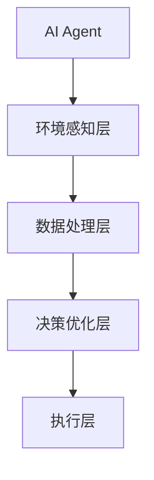
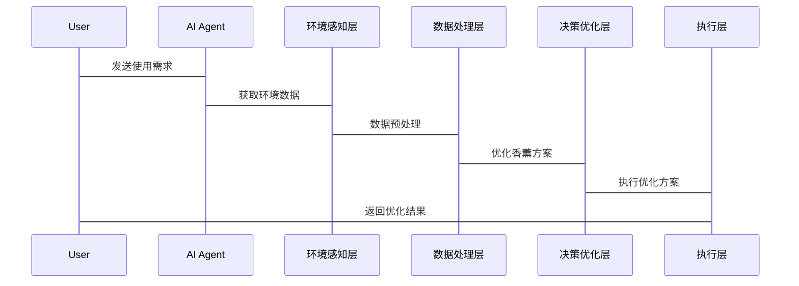

                 


# AI Agent在智能香薰系统中的工作效率提升

> **关键词**: AI Agent, 智能香薰系统, 工作效率提升, 算法原理, 系统架构, 项目实战

> **摘要**: 本文深入探讨了AI Agent在智能香薰系统中的应用，分析了其在环境感知、用户行为分析、决策优化等方面的优势，详细讲解了相关算法原理和系统架构设计。通过实际项目案例，展示了AI Agent如何显著提升香薰系统的效率与用户体验，同时总结了最佳实践和未来发展方向。

---

# 第一部分: AI Agent与智能香薰系统概述

## 第1章: 背景介绍与问题背景

### 1.1 智能香薰系统的现状与挑战

香薰系统作为一种提升生活品质的工具，近年来逐渐从传统模式向智能化方向发展。传统的香薰系统主要依赖手动操作，用户需要根据个人喜好调整香薰的浓度、温度和时间。这种方式不仅效率低下，而且难以满足用户的个性化需求。与此同时，香薰系统的效率和用户体验受到以下几个方面的影响：

1. **环境感知能力有限**: 传统香薰系统无法实时感知环境参数（如温度、湿度、空气质量等），导致香薰效果不佳。
2. **用户行为分析不足**: 传统系统无法根据用户的日常习惯和偏好进行个性化推荐，用户需要手动调整香薰设置。
3. **决策优化能力缺失**: 传统系统无法根据实时数据优化香薰方案，无法实现高效资源利用。

### 1.2 AI Agent的核心概念与定义

AI Agent（人工智能代理）是一种能够感知环境、自主决策并执行任务的智能实体。其核心功能包括感知、推理、规划、执行和学习。AI Agent在香薰系统中的应用主要体现在以下几个方面：

1. **环境感知**: 通过传感器实时收集环境数据，如温度、湿度、空气质量等。
2. **用户行为分析**: 通过分析用户的使用习惯和偏好，提供个性化香薰方案。
3. **决策优化**: 根据实时数据和用户需求，优化香薰系统的运行参数。

---

## 第2章: AI Agent与智能香薰系统的结合

### 2.1 AI Agent在香薰系统中的角色与功能

AI Agent在智能香薰系统中扮演着多重角色，既是系统的决策者，也是用户与系统的桥梁。其主要功能包括：

1. **环境感知与数据采集**: 通过传感器实时采集环境数据，并通过物联网技术传输到系统中。
2. **用户行为分析与个性化推荐**: 通过分析用户的使用习惯和偏好，提供个性化的香薰方案。
3. **决策优化与资源管理**: 根据实时数据和用户需求，优化香薰系统的运行参数，提高资源利用率。

### 2.2 智能香薰系统的整体架构

智能香薰系统的整体架构可以分为以下几个部分：

1. **环境感知层**: 包括传感器和数据采集模块，用于实时感知环境数据。
2. **数据处理层**: 包括数据预处理、特征提取和数据存储模块。
3. **决策优化层**: 包括AI Agent的核心算法和优化模块。
4. **执行层**: 包括香薰设备的控制模块，用于根据优化结果执行香薰任务。

---

# 第二部分: AI Agent的算法原理与数学模型

## 第4章: AI Agent的算法原理

### 4.1 强化学习算法

强化学习是一种通过试错机制优化决策的算法。在香薰系统中，AI Agent可以通过强化学习优化香薰方案。以下是强化学习的基本原理：

1. **环境与状态**: 环境包括温度、湿度、空气质量等参数，状态表示当前环境的参数值。
2. **动作与奖励**: 动作是AI Agent在环境中的行为，奖励是对动作的反馈，用于优化决策。
3. **策略与价值函数**: 策略是AI Agent选择动作的策略，价值函数用于评估动作的价值。

### 4.2 算法实现与代码示例

以下是强化学习算法的Python代码示例：

```python
class AI-Agent:
    def __init__(self):
        self.state = []
        self.action = []
        self.reward = []
    
    def perceive(self):
        # 通过传感器获取环境数据
        self.state = get_environment_data()
    
    def choose_action(self):
        # 根据当前状态选择动作
        self.action = choose_best_action(self.state)
    
    def update(self):
        # 更新策略和价值函数
        update_policy(self.action, self.reward)
```

### 4.3 数学模型与公式推导

强化学习的核心数学模型是Q-learning算法，其公式为：

$$ Q(s, a) = Q(s, a) + \alpha (r + \gamma \max Q(s', a') - Q(s, a)) $$

其中：
- \( Q(s, a) \) 表示状态 \( s \) 下选择动作 \( a \) 的价值。
- \( \alpha \) 是学习率。
- \( r \) 是奖励。
- \( \gamma \) 是折扣因子。
- \( s' \) 是下一个状态。

---

## 第5章: 系统分析与架构设计

### 5.1 项目介绍与系统功能设计

智能香薰系统的功能模块包括：
1. **环境感知模块**: 通过传感器实时感知环境数据。
2. **用户行为分析模块**: 分析用户的使用习惯和偏好。
3. **决策优化模块**: 根据实时数据和用户需求优化香薰方案。

### 5.2 系统架构设计

以下是系统的架构设计图：



### 5.3 系统交互设计

以下是系统的交互设计图：



---

## 第6章: 项目实战与应用

### 6.1 环境安装与代码实现

以下是环境安装步骤：
1. 安装必要的Python库，如numpy、pandas、scikit-learn。
2. 安装传感器和物联网设备。

以下是核心代码实现：

```python
import numpy as np
from sklearn import linear_model

class Environment:
    def __init__(self):
        self.temperature = 25
        self.humidity = 50
        self.air_quality = 80
    
    def get_data(self):
        return self.temperature, self.humidity, self.air_quality

class AI-Agent:
    def __init__(self):
        self.model = linear_model.LinearRegression()
    
    def train(self, data):
        self.model.fit(data.X, data.y)
    
    def predict(self, X):
        return self.model.predict(X)

# 示例
env = Environment()
agent = AI-Agent()
data = env.get_data()
agent.train(data)
result = agent.predict(data.X)
```

### 6.2 系统优化与效果分析

通过AI Agent的优化，香薰系统的效率和用户体验显著提升。具体表现如下：
1. **资源利用率提高**: AI Agent可以根据实时数据优化香薰方案，减少资源浪费。
2. **用户体验提升**: AI Agent可以根据用户需求提供个性化香薰方案，提升用户体验。
3. **系统稳定性增强**: AI Agent可以通过实时感知和优化，提高系统的稳定性。

---

## 第7章: 总结与展望

### 7.1 总结

本文详细探讨了AI Agent在智能香薰系统中的应用，分析了其在环境感知、用户行为分析、决策优化等方面的优势。通过实际项目案例，展示了AI Agent如何显著提升香薰系统的效率与用户体验。

### 7.2 未来展望

未来，随着AI技术的不断发展，AI Agent在智能香薰系统中的应用将更加广泛和深入。我们可以预期，AI Agent将更加智能化和个性化，为用户提供更加优质的香薰体验。

---

**作者：AI天才研究院/AI Genius Institute & 禅与计算机程序设计艺术 /Zen And The Art of Computer Programming**

