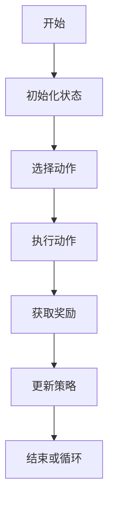
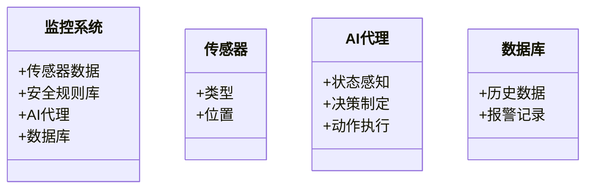
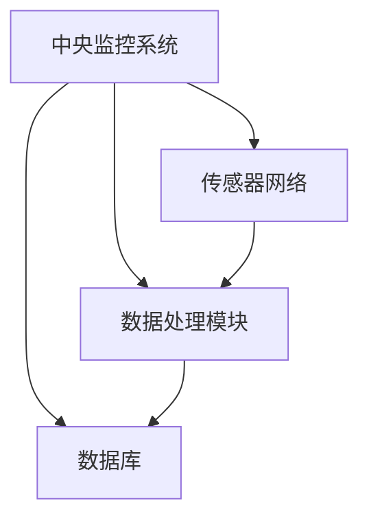

                 


# AI Agent在核电站安全监控中的应用

> 关键词：AI Agent，核电站安全监控，强化学习，系统架构，传感器网络

> 摘要：随着人工智能技术的快速发展，AI Agent在核电站安全监控中的应用越来越广泛。本文从AI Agent的基本概念出发，详细探讨其在核电站安全监控中的核心原理、算法实现、系统架构设计以及实际应用案例。通过分析AI Agent的优势与挑战，本文为核电站的安全监控提供了新的思路和解决方案。

---

# 第一部分: AI Agent在核电站安全监控中的应用概述

## 第1章: AI Agent与核电站安全监控的背景介绍

### 1.1 AI Agent的基本概念

#### 1.1.1 AI Agent的定义
AI Agent（人工智能代理）是一种能够感知环境、自主决策并采取行动的智能体。它通过传感器获取信息，利用算法进行分析和推理，并根据结果执行相应的动作。

#### 1.1.2 AI Agent的核心特征
- **自主性**：能够独立决策和行动。
- **反应性**：能够实时感知环境变化并做出反应。
- **学习能力**：能够通过经验改进性能。
- **协作性**：能够在多智能体环境中协同工作。

#### 1.1.3 AI Agent与传统监控系统的区别
传统监控系统依赖于固定规则和程序，而AI Agent能够动态调整策略，具有更强的适应性和灵活性。

### 1.2 核电站安全监控的重要性

#### 1.2.1 核电站安全监控的定义
核电站安全监控是指通过传感器、监控系统和数据分析技术，实时监测核电站的运行状态，确保其安全性和稳定性。

#### 1.2.2 核电站安全监控的关键指标
- **温度控制**：确保反应堆温度在安全范围内。
- **压力监测**：防止设备因压力过高或过低损坏。
- **辐射监测**：实时监测辐射水平，确保其在安全范围内。
- **设备状态**：监控设备运行状态，及时发现故障。

#### 1.2.3 核电站安全监控的挑战与难点
- **高安全性要求**：任何疏忽可能导致严重事故。
- **复杂环境**：高温、高压、辐射等极端条件对设备和算法提出更高要求。
- **实时性**：需要快速响应和决策。

### 1.3 AI Agent在核电站安全监控中的应用背景

#### 1.3.1 核电站安全监控的传统方法
传统方法依赖于固定规则和程序，难以应对复杂多变的环境。

#### 1.3.2 传统方法的局限性
- **适应性差**：难以应对突发情况。
- **效率低下**：依赖人工干预，反应速度慢。
- **可靠性不足**：固定规则可能无法覆盖所有情况。

#### 1.3.3 AI Agent的优势与应用前景
- **自主决策**：能够快速响应并采取行动。
- **动态适应**：能够根据环境变化调整策略。
- **高可靠性**：通过学习和优化，提高系统的稳定性和安全性。

### 1.4 本章小结
本章介绍了AI Agent的基本概念及其在核电站安全监控中的应用背景，分析了传统方法的局限性以及AI Agent的优势和应用前景。

---

## 第2章: AI Agent在核电站安全监控中的核心概念与联系

### 2.1 AI Agent的核心原理

#### 2.1.1 知识表示与推理
- **知识表示**：将核电站的相关知识表示为符号、规则或模型。
- **推理**：通过逻辑推理或概率推理，得出结论。

#### 2.1.2 行为决策与规划
- **决策**：基于当前状态和目标，选择最优行动。
- **规划**：制定实现目标的详细步骤。

#### 2.1.3 多智能体协作机制
- **协作**：多个AI Agent协同工作，共同完成任务。
- **通信**：通过通信协议共享信息和协调行动。

### 2.2 核电站安全监控系统的架构

#### 2.2.1 中央监控系统
- **功能**：接收并处理来自传感器的数据，进行分析和决策。
- **结构**：包括数据采集、数据处理、决策制定和执行模块。

#### 2.2.2 现场传感器网络
- **功能**：实时采集核电站的各项参数，如温度、压力、辐射等。
- **结构**：由多种传感器和数据传输设备组成。

#### 2.2.3 数据处理与分析模块
- **功能**：对传感器数据进行处理、分析和存储。
- **结构**：包括数据清洗、特征提取、模型训练和结果输出。

### 2.3 AI Agent与核电站监控系统的实体关系图

```mermaid
er
actor: 监控系统操作员
agent: AI监控代理
sensor: 传感器
database: 数据库
rules: 安全规则库
```

### 2.4 本章小结
本章详细讲解了AI Agent的核心原理及其在核电站安全监控系统中的应用架构，通过实体关系图展示了各组件之间的联系。

---

## 第3章: AI Agent的算法原理与数学模型

### 3.1 AI Agent的核心算法

#### 3.1.1 强化学习算法
- **定义**：通过试错和奖励机制，学习最优策略。
- **流程**：
  1. 状态感知。
  2. 动作选择。
  3. 奖励反馈。
  4. 策略更新。

#### 3.1.2 监督学习算法
- **定义**：通过标记数据进行训练，预测目标值。
- **流程**：
  1. 数据采集。
  2. 模型训练。
  3. 模型预测。

#### 3.1.3 无监督学习算法
- **定义**：通过数据内在结构进行学习，发现隐藏模式。
- **流程**：
  1. 数据采集。
  2. 模型训练。
  3. 数据聚类或降维。

### 3.2 基于强化学习的AI Agent算法流程



### 3.3 数学模型与公式

#### 3.3.1 强化学习中的Q-learning算法
状态-动作值函数：
$$ Q(s, a) = r + \gamma \max Q(s', a') $$
其中，$s$是当前状态，$a$是动作，$r$是奖励，$\gamma$是折扣因子，$s'$是下一个状态。

#### 3.3.2 监督学习中的线性回归模型
目标函数：
$$ \min \sum_{i=1}^{n} (y_i - \hat{y}_i)^2 $$
其中，$y_i$是真实值，$\hat{y}_i$是预测值。

### 3.4 本章小结
本章详细讲解了AI Agent的核心算法，包括强化学习、监督学习和无监督学习，并通过数学公式和流程图展示了算法的实现过程。

---

## 第4章: 核电站安全监控系统的架构设计与实现

### 4.1 问题场景介绍

#### 4.1.1 核电站安全监控的典型场景
- **温度异常**：反应堆温度突然升高。
- **压力异常**：设备压力超过安全范围。
- **辐射超标**：辐射水平超出设定值。

### 4.2 系统功能设计

#### 4.2.1 领域模型类图



#### 4.2.2 系统架构图



#### 4.2.3 系统接口设计
- **输入接口**：接收传感器数据和用户输入。
- **输出接口**：输出报警信息和控制指令。

#### 4.2.4 系统交互流程

```mermaid
sequenceDiagram
actor 监控系统操作员
agent AI代理
sensor 传感器
database 数据库
rules 安全规则库

监控系统操作员 -> AI代理: 发起监控请求
AI代理 -> sensor: 获取传感器数据
sensor --> AI代理: 返回数据
AI代理 -> rules: 查询安全规则
rules --> AI代理: 返回规则
AI代理 -> database: 查询历史数据
database --> AI代理: 返回数据
AI代理 -> 监控系统操作员: 提供分析结果和建议
```

### 4.3 本章小结
本章详细设计了核电站安全监控系统的架构，包括领域模型类图、系统架构图和交互流程图，展示了AI Agent在系统中的具体应用。

---

## 第5章: 项目实战与案例分析

### 5.1 项目环境安装

#### 5.1.1 系统需求
- **硬件**：高性能计算机、传感器设备。
- **软件**：Python、TensorFlow、Kafka、数据库（MySQL或MongoDB）。

#### 5.1.2 安装步骤
1. 安装Python和相关库：
   ```bash
   pip install numpy tensorflow keras scikit-learn
   ```
2. 安装数据库：
   ```bash
   sudo apt-get install mysql-server
   ```
3. 安装消息队列：
   ```bash
   pip install kafka-python
   ```

### 5.2 核心代码实现

#### 5.2.1 AI代理的实现
```python
class AI-Agent:
    def __init__(self):
        self.sensors = []
        self.rules = []
        self.database = None

    def perceive(self):
        # 获取传感器数据
        data = [sensor.read() for sensor in self.sensors]
        return data

    def decide(self, data):
        # 根据数据和规则进行决策
        for rule in self.rules:
            if rule.condition(data):
                return rule.action(data)
        return None

    def execute(self, action):
        # 执行动作
        pass
```

#### 5.2.2 数据处理模块的实现
```python
class DataProcessor:
    def __init__(self):
        self.models = []

    def process(self, data):
        # 数据预处理
        processed_data = [d/100 for d in data]
        return processed_data

    def predict(self, processed_data):
        # 使用模型进行预测
        for model in self.models:
            prediction = model.predict(processed_data)
            return prediction
        return None
```

### 5.3 实际案例分析

#### 5.3.1 案例背景
某核电站反应堆温度突然升高，传感器触发高温报警。

#### 5.3.2 数据分析
- 传感器数据：温度=130℃，压力=25bar，辐射=150μSv/h。
- 历史数据：正常温度范围为100-120℃，压力范围为20-30bar，辐射范围为100-180μSv/h。

#### 5.3.3 AI Agent的决策过程
1. **感知环境**：获取传感器数据。
2. **分析数据**：温度超出正常范围。
3. **触发规则**：高温报警规则匹配。
4. **执行动作**：启动冷却系统，降低温度。

### 5.4 本章小结
本章通过实际案例展示了AI Agent在核电站安全监控中的应用，详细讲解了项目环境的安装和核心代码的实现。

---

## 第6章: 最佳实践、小结与展望

### 6.1 最佳实践

#### 6.1.1 系统设计
- **模块化设计**：便于维护和扩展。
- **高可用性**：确保系统稳定运行。

#### 6.1.2 算法选择
- **根据场景选择算法**：强化学习适用于动态环境，监督学习适用于有标签数据的情况。

#### 6.1.3 数据管理
- **数据清洗**：确保数据质量和完整性。
- **数据安全**：保护敏感数据不被泄露。

### 6.2 小结
本文详细探讨了AI Agent在核电站安全监控中的应用，从核心概念到算法实现，再到系统设计和项目实战，全面展示了其在提高核电站安全性中的巨大潜力。

### 6.3 展望
未来，随着AI技术的不断发展，AI Agent在核电站安全监控中的应用将更加广泛和深入。通过不断优化算法和系统架构，可以进一步提升核电站的安全性和效率。

---

## 第7章: 注意事项与拓展阅读

### 7.1 注意事项

#### 7.1.1 系统安全性
- **权限管理**：严格控制系统的访问权限。
- **容灾备份**：确保系统在故障时能够快速恢复。

#### 7.1.2 数据隐私
- **数据加密**：保护敏感数据不被未经授权的访问。
- **合规性**：遵守相关法律法规，确保数据使用合法。

### 7.2 拓展阅读

#### 7.2.1 相关技术
- **边缘计算**：在靠近数据源的地方进行计算和分析。
- **物联网（IoT）**：通过物联网技术实现设备的智能化监控。

#### 7.2.2 前沿研究
- **自适应算法**：研究能够自适应环境变化的AI算法。
- **多智能体协作**：研究多个AI Agent协同工作的机制和优化方法。

### 7.3 本章小结
本章总结了AI Agent在核电站安全监控中的注意事项，并提供了拓展阅读的方向，帮助读者进一步深入了解相关技术。

---

## 第8章: 总结与致谢

### 8.1 总结
本文从AI Agent的基本概念出发，详细探讨了其在核电站安全监控中的应用，通过理论分析和实际案例展示了其在提高核电站安全性中的巨大潜力。

### 8.2 致谢
感谢所有参与本项目研究的团队成员，以及提供支持和帮助的机构和个人。

---

## 参考文献

（此处列出相关的技术文献和参考资料）

---

## 作者信息

作者：AI天才研究院/AI Genius Institute & 禅与计算机程序设计艺术 /Zen And The Art of Computer Programming

---

**以上是完整的文章目录大纲，您可以根据需要进行调整或补充。**

