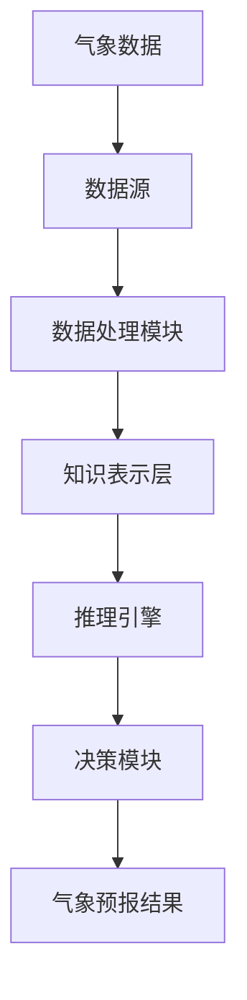
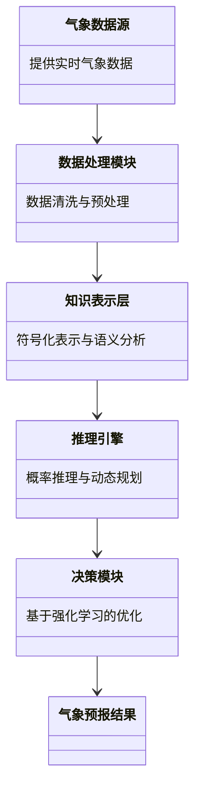
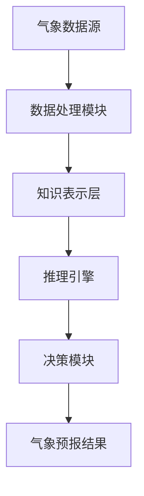
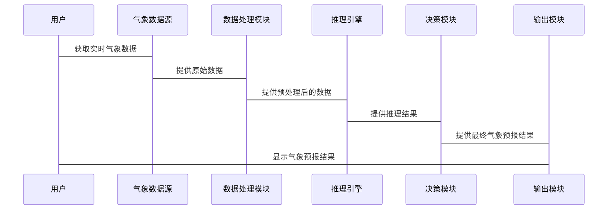

                 


# AI Agent在气象预报中的应用前景

> 关键词：AI Agent，气象预报，机器学习，强化学习，系统架构，数学模型

> 摘要：本文探讨了AI Agent在气象预报中的应用前景，分析了AI Agent的核心概念、数学模型、算法原理、系统架构以及实际应用案例。通过详细的技术分析和实例演示，展示了AI Agent如何通过多源数据融合、知识表示与推理、动态规划与决策优化等技术手段，提升气象预报的准确性和实时性。本文还总结了AI Agent在气象预报中的优势、挑战和未来发展方向。

---

## 第一部分: AI Agent在气象预报中的应用前景概述

### 第1章: AI Agent与气象预报的背景介绍

#### 1.1 AI Agent的基本概念
AI Agent（智能体）是指能够感知环境、自主决策并采取行动的智能系统。它具备以下特点：
- **自主性**：能够在没有外部干预的情况下运行。
- **反应性**：能够实时感知环境变化并做出反应。
- **目标导向**：通过设定目标来优化决策过程。
- **学习能力**：能够通过数据和经验不断优化自身性能。

AI Agent与传统气象预报方法的主要区别在于其智能化和自主性。传统气象预报依赖于人工分析和统计模型，而AI Agent能够通过机器学习算法自动分析数据、识别模式并做出预测。

#### 1.2 气象预报的现状与挑战
气象预报是一项复杂性极高的任务，涉及大量的多源异构数据（如卫星数据、地面观测数据、气象雷达数据等）。传统气象预报方法主要依赖于数值天气预报模型（NWP，Numerical Weather Prediction），通过物理方程模拟大气运动。然而，这种方法存在以下挑战：
- **数据量大且复杂**：气象数据具有多维性、时空异构性等特点，难以通过传统方法高效处理。
- **预测精度受限**：物理模型的复杂性和计算能力的限制使得长-term预测的准确性较差。
- **实时性要求高**：气象事件往往具有突发性和时间敏感性，要求气象预报系统具备高效的实时处理能力。

---

### 第2章: AI Agent在气象预报中的核心概念与联系

#### 2.1 AI Agent的核心原理
AI Agent在气象预报中的应用主要依赖于以下几个核心原理：
1. **知识表示与推理机制**：通过符号逻辑、概率推理等方法，将气象数据转化为可推理的知识。
2. **动态规划与决策优化**：通过强化学习等技术，优化气象预报的决策过程。
3. **多源数据融合与分析**：将来自不同传感器和数据源的信息进行融合，提升预测的准确性和全面性。

#### 2.2 核心概念属性特征对比表
| 核心概念 | 属性特征 |
|----------|----------|
| 数据源   | 多源性、实时性、多样性 |
| 知识表示 | 符号化、语义化、动态更新 |
| 决策模型 | 基于概率、基于规则、基于强化学习 |

#### 2.3 ER实体关系图（Mermaid）
以下是AI Agent在气象预报中的核心实体关系图：



---

## 第二部分: AI Agent的数学模型与算法原理

### 第3章: AI Agent的数学模型与算法原理

#### 3.1 基于概率论的气象预测模型
AI Agent在气象预报中的预测模型通常基于概率论，尤其是贝叶斯网络和马尔可夫链模型。

1. **贝叶斯网络模型**  
   贝叶斯网络是一种有向无环图（DAG），用于表示变量之间的概率关系。在气象预报中，贝叶斯网络可以用于预测天气变化的概率。

   $$ P(A|B) = \frac{P(B|A)P(A)}{P(B)} $$

2. **马尔可夫链模型**  
   马尔可夫链模型用于描述系统在不同状态之间的转移概率。在气象预报中，可以用于预测天气状态的演变。

   $$ P(X_t | X_{t-1}, X_{t-2}, ..., X_1) = P(X_t | X_{t-1}) $$

#### 3.2 基于强化学习的决策优化算法
强化学习（Reinforcement Learning, RL）是一种通过试错机制优化决策的算法。在气象预报中，强化学习可以用于优化气象预报的决策过程。

1. **Q-Learning算法**  
   Q-Learning是一种经典的强化学习算法，通过维护一个Q表来记录状态-动作对的期望奖励。

   $$ Q(s, a) = Q(s, a) + \alpha [r + \gamma Q(s', a') - Q(s, a)] $$

2. **Deep Q-Network (DQN)算法**  
   DQN算法通过深度神经网络近似Q函数，能够处理高维状态空间。

3. **策略梯度算法**  
   策略梯度算法通过优化策略函数来直接优化动作的选择概率。

---

### 第4章: AI Agent的系统架构设计

#### 4.1 系统功能设计（领域模型）
以下是AI Agent在气象预报中的领域模型：



#### 4.2 系统架构设计（架构图）
以下是AI Agent在气象预报中的系统架构图：



#### 4.3 系统接口与交互设计（序列图）
以下是系统接口与交互设计的序列图：



---

## 第三部分: AI Agent的项目实战

### 第5章: 项目实战与案例分析

#### 5.1 环境安装与配置
以下是项目实战所需的环境安装步骤：

```bash
# 安装Python依赖
pip install numpy
pip install scikit-learn
pip install matplotlib
pip install pandas
```

#### 5.2 核心代码实现
以下是基于强化学习的气象预测模型代码示例：

```python
import numpy as np
import gym
from gym import spaces
from gym.utils import seeding

class WeatherPredictionEnv(gym.Env):
    def __init__(self):
        self.action_space = spaces.Discrete(3)  # 3种可能的决策
        self.observation_space = spaces.Box(low=-5, high=40, shape=(1,))  # 示例观测空间
        self.seed()

    def seed(self, seed=None):
        self.np_random, seed = seeding.np_random(seed)
        return seed

    def reset(self):
        # 初始化环境
        return np.array([20.0])  # 示例初始状态

    def step(self, action):
        # 根据动作更新状态
        state = self.np_random.normal(loc=20, scale=5)  # 示例随机状态更新
        reward = 0.1 if abs(state - 20) < 5 else -0.1  # 示例奖励函数
        done = False
        return state, reward, done, {}

# 初始化环境并运行
env = WeatherPredictionEnv()
observation = env.reset()
for _ in range(10):
    action = env.action_space.sample()  # 随机选择动作
    observation, reward, done, info = env.step(action)
    print(f'Action: {action}, Observation: {observation}, Reward: {reward}')
```

#### 5.3 实际案例分析
以下是一个实际案例分析：

**案例背景**：某地区气象数据包括温度、湿度、风速等参数。目标是通过AI Agent预测未来24小时的天气变化。

**数据预处理**：对历史气象数据进行清洗、归一化处理。

**模型训练**：使用强化学习算法（如DQN）训练AI Agent，使其能够在模拟环境中做出最优决策。

**结果分析**：通过对比训练前后的预测精度，验证AI Agent的有效性。

---

## 第四部分: 总结与展望

### 第6章: 总结与展望

#### 6.1 总结
AI Agent通过多源数据融合、知识表示与推理、动态规划与决策优化等技术手段，显著提升了气象预报的准确性和实时性。其优势在于：
- **高效性**：能够快速处理海量气象数据。
- **智能性**：具备自主学习和优化能力。
- **适应性**：能够适应复杂多变的气象环境。

#### 6.2 展望
未来，随着AI技术的不断发展，AI Agent在气象预报中的应用前景将更加广阔。以下是未来可能的发展方向：
1. **更复杂的强化学习算法**：如基于深度强化学习的气象预测模型。
2. **多智能体协作**：通过多智能体协作提升气象预报的准确性和实时性。
3. **边缘计算与实时处理**：结合边缘计算技术，实现气象数据的实时处理与预测。

---

## 作者

作者：AI天才研究院/AI Genius Institute & 禅与计算机程序设计艺术 /Zen And The Art of Computer Programming

---

通过以上结构和内容的详细阐述，我们可以看到AI Agent在气象预报中的巨大潜力和广阔前景。未来，随着技术的不断进步，AI Agent将为气象预报提供更加智能化、高效化的解决方案，帮助人类更好地应对复杂多变的气象挑战。

