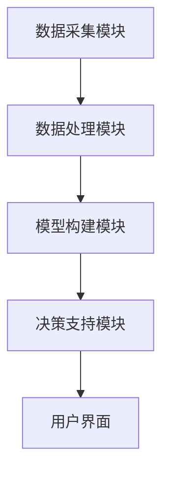

                 


# AI Agent在水资源管理中的优化决策

> 关键词：AI Agent，水资源管理，优化决策，强化学习，数学模型，系统架构

> 摘要：本文探讨了AI Agent在水资源管理中的应用，分析了其在优化决策中的核心原理、算法实现、数学模型构建及系统架构设计。通过具体案例，展示了AI Agent如何解决水资源分配中的复杂问题，并提出了实际应用中的注意事项和未来研究方向。

---

## 第1章：背景介绍

### 1.1 水资源管理的背景与挑战

#### 1.1.1 水资源的现状与问题
水资源是人类生存和发展的基础，但全球范围内水资源短缺、污染和分配不均的问题日益严重。传统水资源管理依赖人工决策，效率低下且难以应对复杂多变的环境。

#### 1.1.2 水资源管理中的传统方法
传统方法包括基于经验的决策、简单的线性规划模型等，这些方法在处理复杂系统时显得力不从心，难以应对动态变化和多目标优化的需求。

#### 1.1.3 传统方法的局限性与改进需求
传统方法存在以下问题：
- 数据处理能力有限，难以应对海量数据。
- 无法实时调整策略，应对突发情况。
- 缺乏灵活性，难以适应不同场景下的优化需求。

### 1.2 AI Agent的基本概念

#### 1.2.1 AI Agent的定义与特点
AI Agent是一种智能体，能够在复杂环境中感知、推理、规划和执行任务，具有自主性、反应性、社会性和学习性等特点。

#### 1.2.2 AI Agent在决策优化中的作用
AI Agent能够通过数据驱动和模型构建，优化决策过程，提高资源利用效率。

#### 1.2.3 AI Agent与传统决策支持系统的区别
AI Agent能够实时学习和自适应，而传统决策支持系统依赖静态模型，缺乏动态调整能力。

### 1.3 本章小结
本章介绍了水资源管理的背景与挑战，以及AI Agent的基本概念和特点，为后续内容奠定了基础。

---

## 第2章：AI Agent的核心概念与联系

### 2.1 AI Agent的基本原理

#### 2.1.1 知识表示与推理
通过知识图谱和逻辑推理，AI Agent能够理解和处理复杂信息。

#### 2.1.2 问题求解与规划
基于搜索和规划算法，AI Agent能够找到最优解决方案。

#### 2.1.3 学习与自适应
通过机器学习，AI Agent能够从数据中学习并自适应环境变化。

### 2.2 AI Agent的分类

#### 2.2.1 根据智能水平的分类
- 单一智能体：独立决策。
- 多智能体：协同工作。

#### 2.2.2 根据应用场景的分类
- 水资源分配：优化水量分配。
- 污染控制：减少污染排放。

#### 2.2.3 根据决策方式的分类
- 基于规则：遵循预定义规则。
- 基于模型：依赖数学模型。

### 2.3 AI Agent在水资源管理中的应用特点

#### 2.3.1 实时性与动态性
AI Agent能够实时处理数据，快速调整决策。

#### 2.3.2 多目标优化
AI Agent能够同时考虑经济效益、环境影响和社会效益。

#### 2.3.3 高效性与准确性
通过算法优化，AI Agent能够提高决策的准确性和效率。

### 2.4 本章小结
本章详细讲解了AI Agent的核心原理和分类，并分析了其在水资源管理中的应用特点。

---

## 第3章：AI Agent的算法原理

### 3.1 强化学习算法

#### 3.1.1 强化学习的基本概念
强化学习通过试错机制，学习最优策略。

#### 3.1.2 Q-learning算法
Q-learning算法通过更新Q值表，找到最优动作。

#### 3.1.3 Deep Q-Network (DQN)算法
DQN通过深度神经网络近似Q值函数，提高学习效率。

#### 3.1.4 强化学习在水资源管理中的应用
- 水资源分配：动态调整水量分配策略。
- 污染控制：优化污染处理方案。

#### 3.1.5 实例分析
使用DQN算法优化水库调度，减少干旱风险。

### 3.2 遗传算法

#### 3.2.1 遗传算法的基本原理
通过选择、交叉和变异操作，生成最优解。

#### 3.2.2 水资源优化中的应用
- 确定最优灌溉方案。
- 优化水资源分配。

#### 3.2.3 算法实现步骤
1. 初始化种群。
2. 计算适应度。
3. 进行选择、交叉和变异。
4. 重复迭代，直到收敛。

### 3.3 其他优化算法

#### 3.3.1 粒子群优化（PSO）
通过模拟鸟群觅食行为，寻找最优解。

#### 3.3.2 模拟退火（SA）
通过模拟热力学过程，避免局部最优。

#### 3.3.3 贪心算法
在每一步选择当前最优，构建整体最优。

### 3.4 本章小结
本章介绍了强化学习、遗传算法和其他优化算法的基本原理及其在水资源管理中的应用。

---

## 第4章：水资源优化的数学模型

### 4.1 水资源分配的线性规划模型

#### 4.1.1 目标函数
最大化水资源利用效率：$$\text{Maximize } \sum_{i=1}^{n} w_i x_i$$

#### 4.1.2 约束条件
- 水量限制：$$\sum_{i=1}^{n} x_i \leq W$$
- 需求满足：$$x_i \geq d_i$$

#### 4.1.3 模型求解方法
使用单纯形法求解线性规划模型。

### 4.2 动态水资源优化模型

#### 4.2.1 时间序列建模
考虑时间因素，构建动态优化模型。

#### 4.2.2 状态转移方程
$$s_{t+1} = f(s_t, a_t)$$

#### 4.2.3 模型的扩展性
考虑气候变化和人口增长等外部因素。

### 4.3 本章小结
本章介绍了线性规划和动态优化模型，为AI Agent的决策提供数学基础。

---

## 第5章：AI Agent在水资源管理中的系统架构

### 5.1 系统总体架构

#### 5.1.1 系统模块划分
- 数据采集模块：收集气象、水质等数据。
- 数据处理模块：清洗和预处理数据。
- 模型构建模块：建立优化模型。
- 决策支持模块：生成优化方案。

#### 5.1.2 模块之间的关系
数据采集→数据处理→模型构建→决策支持。

#### 5.1.3 系统的输入输出
- 输入：气象数据、水质数据。
- 输出：最优水资源分配方案。

### 5.2 系统功能设计

#### 5.2.1 数据采集与处理
- 数据来源：传感器、数据库。
- 数据清洗：处理缺失值、异常值。

#### 5.2.2 模型构建与优化
- 选择优化算法：强化学习、遗传算法。
- 实现优化模型：线性规划、动态优化。

#### 5.2.3 决策支持与反馈
- 提供决策建议。
- 实时反馈执行结果。

### 5.3 系统架构图


### 5.4 本章小结
本章设计了AI Agent在水资源管理中的系统架构，并展示了各模块之间的关系。

---

## 第6章：AI Agent在水资源管理中的项目实战

### 6.1 项目背景与目标

#### 6.1.1 项目背景
某城市面临水资源短缺问题，希望通过AI Agent优化供水系统。

#### 6.1.2 项目目标
- 实现水资源的智能分配。
- 提高供水系统的效率。

### 6.2 系统实现

#### 6.2.1 环境配置与安装
- 安装Python、TensorFlow、Scikit-learn等库。

#### 6.2.2 核心代码实现
```python
import numpy as np
from tensorflow.keras import layers

# 加载数据
data = np.loadtxt('water_data.csv', delimiter=',')

# 构建模型
model = layers.Sequential()
model.add(layers.Dense(64, activation='relu', input_dim=2))
model.add(layers.Dense(1, activation='linear'))
model.compile(optimizer='adam', loss='mse')

# 训练模型
model.fit(data[:, :2], data[:, 2], epochs=100, batch_size=32)
```

#### 6.2.3 算法实现
使用强化学习算法优化水资源分配。

### 6.3 实际案例分析

#### 6.3.1 案例描述
某城市供水系统，通过AI Agent优化水量分配，减少干旱风险。

#### 6.3.2 实施效果
- 提高了水资源利用效率。
- 降低了运营成本。

### 6.4 项目小结
本章通过具体案例展示了AI Agent在水资源管理中的实际应用，验证了其有效性。

---

## 第7章：总结与展望

### 7.1 总结
AI Agent在水资源管理中的应用前景广阔，能够有效解决传统方法的局限性。

### 7.2 注意事项
- 数据质量：确保数据准确性和完整性。
- 算法选择：根据不同场景选择合适的算法。
- 可解释性：提高决策的透明度。

### 7.3 未来研究方向
- 多智能体协同优化。
- 结合物联网技术，实现更高效的水资源管理。

### 7.4 本章小结
总结了AI Agent在水资源管理中的应用，并提出了未来的研究方向。

---

## 作者信息

作者：AI天才研究院/AI Genius Institute & 禅与计算机程序设计艺术 /Zen And The Art of Computer Programming

