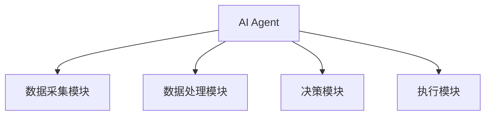
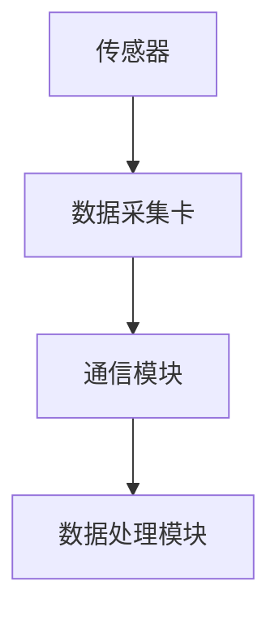
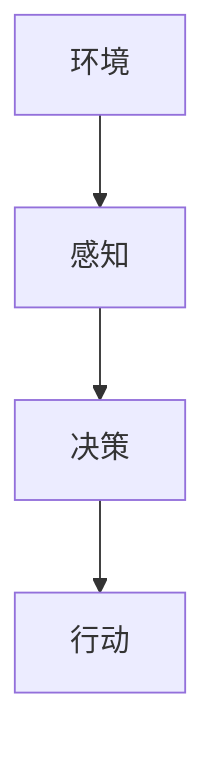
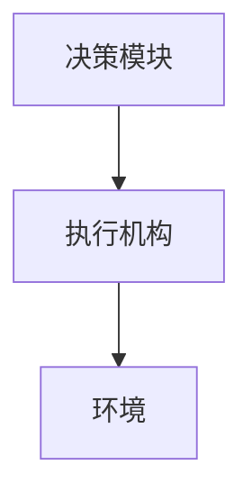

                 


# AI Agent在水资源管理中的应用：水质监测与分配

## 关键词：AI Agent，水资源管理，水质监测，水量分配，机器学习，强化学习

## 摘要：AI Agent作为一种智能代理，能够通过感知、决策和行动来优化水资源管理中的水质监测和水量分配。本文探讨了AI Agent在水质监测中的应用，包括实时数据采集、异常检测和预测分析，并详细分析了AI Agent在水量分配中的优化策略。通过结合机器学习和强化学习算法，AI Agent能够有效提升水资源管理的效率和准确性，为水资源的可持续管理提供新的解决方案。

---

# 第1章: AI Agent与水资源管理概述

## 1.1 水资源管理的背景与挑战

### 1.1.1 水资源管理的基本概念
水资源管理是指通过合理的规划和调控，确保水资源的可持续利用，满足人类生活、生产和生态的需求。随着全球人口增长和气候变化的加剧，水资源管理面临着前所未有的挑战。

### 1.1.2 当前水资源管理的主要挑战
- **水质污染**：工业化和农业活动导致水体污染，威胁人类健康和生态系统。
- **水资源短缺**：许多地区面临水资源短缺的问题，尤其是在干旱地区和人口密集区域。
- **管理效率低下**：传统的水资源管理依赖人工操作，效率低，难以应对复杂多变的环境条件。

### 1.1.3 AI Agent在水资源管理中的潜力
AI Agent（智能代理）是一种能够感知环境、自主决策并执行任务的智能系统。其在水资源管理中的应用潜力主要体现在以下几个方面：
- **实时监测**：通过传感器和物联网技术，实时采集水质和水量数据。
- **智能分析**：利用机器学习和数据挖掘技术，分析数据，预测水质变化和水量需求。
- **自动化控制**：根据分析结果，自动调整水处理设备和分配系统，优化水资源利用。

## 1.2 AI Agent的基本概念

### 1.2.1 什么是AI Agent
AI Agent是一种能够感知环境、自主决策并执行任务的智能系统。它具备以下核心特征：
- **感知能力**：通过传感器、摄像头等设备获取环境信息。
- **决策能力**：基于获取的信息，利用算法进行分析和决策。
- **行动能力**：根据决策结果，执行相应的动作，例如调整设备参数或触发警报。

### 1.2.2 AI Agent的核心特征
- **自主性**：能够在没有人类干预的情况下自主运行。
- **反应性**：能够实时感知环境变化并做出反应。
- **学习能力**：通过机器学习算法，不断优化自身的决策能力。

### 1.2.3 AI Agent与传统自动化系统的区别
AI Agent与传统自动化系统的区别主要体现在智能性和适应性上。传统自动化系统基于固定的程序和规则运行，而AI Agent能够通过学习和适应，不断优化自身的操作流程。

## 1.3 AI Agent在水资源管理中的应用前景

### 1.3.1 水质监测与AI Agent的结合
水质监测是水资源管理的重要组成部分。通过AI Agent，可以实现水质数据的实时采集、分析和预测，及时发现和处理水质异常情况。

### 1.3.2 水量分配与AI Agent的结合
水量分配是水资源管理的核心任务之一。AI Agent可以通过分析用水需求、天气变化等因素，优化水资源的分配策略，确保水资源的高效利用。

### 1.3.3 AI Agent在水资源管理中的优势
- **高效性**：AI Agent能够快速处理大量数据，提高管理效率。
- **准确性**：通过机器学习算法，AI Agent能够提高决策的准确性。
- **适应性**：AI Agent能够根据环境变化，动态调整管理策略。

## 1.4 本章小结
本章主要介绍了AI Agent的基本概念及其在水资源管理中的应用前景。通过分析AI Agent的核心特征和优势，我们可以看到，AI Agent在水质监测和水量分配中的应用潜力巨大，能够有效提升水资源管理的效率和准确性。

---

# 第2章: AI Agent的核心概念与原理

## 2.1 AI Agent的基本原理

### 2.1.1 AI Agent的感知与决策机制
AI Agent的感知机制通过传感器和数据采集设备获取环境信息。决策机制则基于感知到的信息，利用机器学习算法进行分析和决策。

### 2.1.2 AI Agent的行动与反馈循环
AI Agent在决策后，会执行相应的动作，并通过反馈机制不断优化自身的决策能力。这种反馈循环是AI Agent能够不断适应环境变化的关键。

### 2.1.3 AI Agent的自主性与适应性
AI Agent的自主性使其能够在没有人类干预的情况下自主运行，而其适应性则使其能够根据环境变化，动态调整自身的操作策略。

## 2.2 AI Agent在水质监测中的应用

### 2.2.1 水质监测的基本原理
水质监测是通过传感器和分析仪器，实时采集水体中的各种指标，如pH值、溶解氧、温度等。

### 2.2.2 AI Agent在水质数据采集中的作用
AI Agent可以通过物联网技术，协调多个传感器和数据采集设备，实现水质数据的实时采集和传输。

### 2.2.3 AI Agent在水质异常检测中的应用
AI Agent可以利用机器学习算法，分析水质数据，识别异常情况，并及时发出警报。例如，利用异常检测算法，AI Agent可以识别水质突变，预防水质污染。

## 2.3 AI Agent在水量分配中的应用

### 2.3.1 水量分配的基本原理
水量分配是根据用水需求和水资源的可用性，合理分配水资源的过程。传统的水量分配依赖于人工经验和固定的规则，效率较低。

### 2.3.2 AI Agent在水量分配优化中的作用
AI Agent可以通过分析历史用水数据、天气预报和水资源供需情况，优化水资源的分配策略，确保水资源的高效利用。

### 2.3.3 AI Agent在水量分配中的决策机制
AI Agent可以利用强化学习算法，动态调整水资源分配策略，根据实时需求和环境变化，优化水资源的分配。

## 2.4 本章小结
本章详细介绍了AI Agent在水质监测和水量分配中的应用原理。通过分析AI Agent的感知、决策和行动机制，我们可以看到，AI Agent在水资源管理中的应用不仅提高了管理效率，还能够通过智能化的决策，优化水资源的利用。

---

# 第3章: AI Agent的算法原理与数学模型

## 3.1 强化学习在AI Agent中的应用

### 3.1.1 强化学习的基本概念
强化学习是一种机器学习方法，通过智能体与环境的交互，学习最优策略。强化学习的核心是智能体通过试错，不断优化自身的决策策略。

### 3.1.2 强化学习的数学模型
强化学习的数学模型包括状态空间、动作空间、奖励函数等。智能体通过与环境交互，学习最优策略，以最大化累积奖励。

$$
\text{状态空间} = S, \quad \text{动作空间} = A, \quad \text{奖励函数} = R(s, a)
$$

### 3.1.3 强化学习在水质监测中的应用实例
例如，AI Agent可以通过强化学习算法，学习如何根据水质数据调整传感器的采样频率，以提高监测精度和效率。

## 3.2 机器学习在AI Agent中的应用

### 3.2.1 机器学习的基本概念
机器学习是一种通过数据训练模型，使其能够进行预测和分类的技术。机器学习的核心是模型通过数据训练，学习数据中的规律。

### 3.2.2 机器学习的数学模型
机器学习的数学模型包括输入特征、输出标签和模型参数。模型通过训练数据，优化参数，以提高预测准确率。

$$
y = f(x; \theta)
$$

其中，\( x \) 是输入特征，\( y \) 是输出标签，\( \theta \) 是模型参数。

### 3.2.3 机器学习在水量分配中的应用实例
例如，AI Agent可以通过机器学习算法，预测未来的用水需求，优化水资源的分配策略。

## 3.3 本章小结
本章主要介绍了强化学习和机器学习在AI Agent中的应用。通过分析强化学习和机器学习的数学模型和算法原理，我们可以看到，AI Agent通过学习和优化，能够实现更高效的水资源管理。

---

# 第4章: AI Agent的系统设计与实现

## 4.1 系统架构设计

### 4.1.1 系统功能模块
AI Agent系统主要包括数据采集模块、数据处理模块、决策模块和执行模块。

### 4.1.2 系统架构图
以下是AI Agent系统的架构图：



## 4.2 数据采集模块的设计

### 4.2.1 数据采集设备
数据采集模块主要包括传感器、数据采集卡和通信模块。传感器用于采集水质数据，数据采集卡将模拟信号转换为数字信号，通信模块将数据传输到数据处理模块。

### 4.2.2 数据采集流程
以下是数据采集流程的图示：



## 4.3 数据处理模块的设计

### 4.3.1 数据预处理
数据预处理包括数据清洗、数据标准化和数据特征提取。通过预处理，可以提高数据的质量和模型的性能。

### 4.3.2 数据存储
数据处理模块将预处理后的数据存储在数据库中，以便后续分析和决策。

## 4.4 决策模块的设计

### 4.4.1 决策算法
决策模块主要采用强化学习算法，通过与环境的交互，学习最优策略。

### 4.4.2 决策流程
以下是决策流程的图示：



## 4.5 执行模块的设计

### 4.5.1 执行机构
执行模块主要包括水泵、阀门和警报系统。根据决策模块的指令，执行机构调整水资源的分配和处理。

### 4.5.2 执行流程
以下是执行流程的图示：



## 4.6 本章小结
本章详细介绍了AI Agent系统的架构设计和实现过程。通过分析数据采集、数据处理、决策和执行模块的功能和设计，我们可以看到，AI Agent系统的实现需要多个模块的协同工作，才能实现高效的水资源管理。

---

# 第5章: AI Agent在水资源管理中的项目实战

## 5.1 项目背景与目标

### 5.1.1 项目背景
本项目旨在利用AI Agent技术，优化某城市的水资源管理，包括水质监测和水量分配。

### 5.1.2 项目目标
- 实现水质数据的实时采集和分析。
- 实现水资源的智能分配，确保水资源的高效利用。

## 5.2 系统实现

### 5.2.1 环境安装
项目需要安装以下软件和工具：
- Python 3.8+
- TensorFlow 2.0+
- Pandas 1.0+
- NumPy 1.20+

### 5.2.2 核心代码实现

#### 5.2.2.1 数据采集模块
以下是数据采集模块的代码：

```python
import serial
import time

ser = serial.Serial('COM3', 9600)

while True:
    data = ser.readline().decode()
    print('采集到的数据:', data)
    time.sleep(1)
```

#### 5.2.2.2 数据处理模块
以下是数据处理模块的代码：

```python
import pandas as pd
import numpy as np

# 采集数据
data = pd.read_csv('water_data.csv')

# 数据清洗
data.dropna(inplace=True)
data['date'] = pd.to_datetime(data['date'])

# 数据存储
data.to_sql('water_data', conn)
```

#### 5.2.2.3 决策模块
以下是决策模块的代码：

```python
import numpy as np

# 强化学习算法
class Agent:
    def __init__(self, state_space, action_space):
        self.state_space = state_space
        self.action_space = action_space
        self.theta = np.random.randn(state_space, action_space)

    def act(self, state):
        return np.argmax(self.theta[state])

# 环境
class Environment:
    def __init__(self):
        self.state = 0
        self.reward = 0

    def step(self, action):
        # 根据动作更新状态
        self.state = (self.state + action) % 10
        # 返回奖励
        self.reward = 1 - abs(self.state - 5)
        return self.state, self.reward

# 训练
agent = Agent(10, 5)
env = Environment()

for episode in range(100):
    state = env.state
    action = agent.act(state)
    next_state, reward = env.step(action)
    # 更新策略
    agent.theta[state] += reward * (next_state - state)
```

## 5.3 项目小结

通过本项目，我们可以看到，AI Agent技术在水资源管理中的应用前景广阔。通过实时采集数据、智能分析和优化决策，AI Agent能够显著提高水资源管理的效率和准确性。

---

# 第6章: 结论与展望

## 6.1 结论
本文详细探讨了AI Agent在水资源管理中的应用，包括水质监测和水量分配。通过分析AI Agent的核心概念、算法原理和系统设计，我们可以看到，AI Agent技术能够显著提高水资源管理的效率和准确性。

## 6.2 展望
未来，随着AI技术的不断发展，AI Agent在水资源管理中的应用将更加广泛和深入。例如，结合边缘计算和区块链技术，AI Agent可以实现更高效的水资源管理。同时，AI Agent还可以与其他智能系统协同工作，形成更加智能化的水资源管理系统。

---

# 作者：AI天才研究院/AI Genius Institute & 禅与计算机程序设计艺术 /Zen And The Art of Computer Programming

