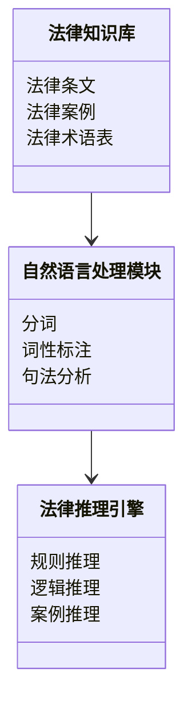

                 


# AI Agent在法律服务中的应用

> 关键词：AI Agent，法律服务，自然语言处理，知识图谱，法律推理

> 摘要：本文探讨AI Agent在法律服务中的应用，从背景介绍、核心概念、算法原理、系统架构到项目实战，系统阐述AI Agent如何赋能法律服务，提升效率和准确性。

---

## 第一部分: AI Agent在法律服务中的应用概述

### 第1章: AI Agent的基本概念与法律服务的现状

#### 1.1 AI Agent的基本概念

##### 1.1.1 什么是AI Agent
AI Agent（人工智能代理）是指能够感知环境、执行任务并做出决策的智能体。在法律服务中，AI Agent通常以软件形式存在，通过自然语言处理（NLP）和机器学习技术，帮助用户完成法律相关任务。

##### 1.1.2 AI Agent的核心特征
- **自主性**：能够独立执行任务，无需人工干预。
- **反应性**：能够根据环境变化实时调整行为。
- **推理能力**：具备逻辑推理能力，能够处理复杂法律问题。
- **学习能力**：通过数据不断优化性能。

##### 1.1.3 AI Agent与传统法律服务的对比
| 特性         | AI Agent                          | 传统法律服务                   |
|--------------|-----------------------------------|-------------------------------|
| 效率         | 高效，快速处理大量法律文本      | 低效，依赖人工逐项审查           |
| 准确性       | 高，基于大数据和模型训练          | 可能存在主观偏差                |
| 可扩展性     | 强，能够同时处理多个案件          | 有限，受人工能力限制            |
| 成本         | 低，边际成本趋近于零             | 高，依赖律师和辅助人员           |

#### 1.2 法律服务的现状与挑战

##### 1.2.1 传统法律服务的痛点
- **效率低下**：律师需要花费大量时间处理合同审查、案例检索等重复性工作。
- **资源不足**：中小型企业难以负担专业律师的服务成本。
- **信息不对称**：普通用户难以准确理解法律条款，导致咨询效率低下。

##### 1.2.2 AI技术在法律服务中的潜力
- **自动化处理**：AI Agent能够自动分析合同、检索案例，大幅提高效率。
- **24/7可用性**：AI Agent可以全天候为用户提供法律咨询服务。
- **降低成本**：通过自动化处理，显著降低法律服务的边际成本。

---

## 第2章: AI Agent在法律服务中的问题背景

### 2.1 问题背景介绍

#### 2.1.1 法律服务的复杂性
法律文本通常复杂且冗长，涉及大量专业术语和法律条文，普通用户难以理解。

#### 2.1.2 法律知识的专业性
法律知识高度专业化，需要经过长期学习和实践才能掌握。

#### 2.1.3 法律服务的效率问题
传统法律服务依赖人工操作，效率低下，难以满足日益增长的需求。

### 2.2 问题描述

#### 2.2.1 法律咨询中的信息不对称
用户与律师之间的信息不对称导致咨询效率低，用户体验差。

#### 2.2.2 合同审查的复杂性
合同审查涉及大量法律条文和条款，人工审查耗时且容易出错。

#### 2.2.3 法律案例分析的难度
法律案例分析需要深厚的知识储备和丰富的实践经验，人工分析效率低。

### 2.3 问题解决

#### 2.3.1 AI Agent如何解决法律服务中的问题
- **自动化处理**：AI Agent可以自动分析合同、检索案例，提高效率。
- **智能辅助**：AI Agent为律师提供决策支持，帮助其快速找到相关法律条文和案例。
- **用户友好**：AI Agent通过自然语言处理技术，为普通用户提供便捷的法律咨询服务。

---

## 第3章: AI Agent的核心概念与联系

### 3.1 核心概念原理

#### 3.1.1 自然语言处理在法律文本中的应用
NLP技术可以帮助AI Agent理解复杂的法律文本，提取关键信息。

#### 3.1.2 法律知识图谱的构建
通过构建法律知识图谱，AI Agent可以快速关联相关法律条文和案例。

#### 3.1.3 法律推理与决策的逻辑
AI Agent通过逻辑推理，结合法律知识图谱，做出合理的法律决策。

### 3.2 核心概念对比表格

| 概念         | AI Agent在法律服务中的应用                       | 传统法律服务                              |
|--------------|-----------------------------------------------|------------------------------------------|
| 数据来源     | 结构化法律数据、案例库、法规文本               | 非结构化法律文本、案例库                |
| 处理速度     | 快速，基于算法驱动                              | 较慢，依赖人工处理                        |
| 可扩展性     | 高，能够处理大量案件                            | 有限，受人力限制                        |

### 3.3 ER实体关系图

```mermaid
er
    %% ER图：AI Agent在法律服务中的实体关系
    %% 定义实体
    entity 法律案例 (Case) {
        id: int
        案例名称 (CaseName): string
        案例描述 (CaseDescription): string
    }
    
    entity 法律条文 (Law) {
        id: int
        条文内容 (LawContent): string
        法律类别 (LawCategory): string
    }
    
    entity 用户 (User) {
        id: int
        用户名 (Username): string
        邮箱 (Email): string
    }
    
    %% 定义关系
    Case --> 关联 (R1): Law
    User --> 请求 (R2): Law
    User --> 请求 (R3): Case
```

---

## 第4章: AI Agent的算法原理

### 4.1 算法原理概述

#### 4.1.1 基于规则的法律文本分析
通过预定义的规则，AI Agent可以快速识别法律文本中的关键信息。

#### 4.1.2 基于机器学习的法律推理
使用深度学习模型，AI Agent可以从大量法律数据中学习，提高推理准确性。

### 4.2 算法实现代码

```python
# 基于规则的合同审查示例代码
def analyze_contract(contract_text):
    # 步骤1：分词和词性标注
    words = tokenize(contract_text)
    
    # 步骤2：识别关键法律条款
    clauses = identify_clauses(words)
    
    # 步骤3：风险评估
    risk_level = assess_risk(clauses)
    
    return risk_level

# 示例函数：识别合同中的违约条款
def identify_clauses(words):
    clauses = []
    for word in words:
        if word['pos'] == 'noun' and word['lemma'] in ['违约', '赔偿']:
            clauses.append(word['lemma'])
    return clauses
```

### 4.3 算法的数学模型

#### 4.3.1 损失函数
$$ L = -\sum_{i=1}^{n} y_i \log(p_i) + (1 - y_i)\log(1 - p_i) $$
其中，$y_i$ 是真实标签，$p_i$ 是预测概率。

#### 4.3.2 优化目标
$$ \min_{\theta} \frac{1}{m} \sum_{i=1}^{m} L_i + \lambda \|\theta\|^2 $$
其中，$\lambda$ 是正则化系数，$\theta$ 是模型参数。

---

## 第5章: 系统分析与架构设计方案

### 5.1 系统功能设计

#### 5.1.1 领域模型


### 5.2 系统架构设计


---

## 第6章: 项目实战

### 6.1 环境搭建

```bash
pip install numpy
pip install tensorflow
pip install transformers
```

### 6.2 核心代码实现

```python
from transformers import pipeline

classifier = pipeline("text-classification", model="nlx法律咨询模型")

def classify_legal_query(question):
    result = classifier(question)
    return result[0]['label']
```

### 6.3 案例分析

#### 案例1：合同条款审查
用户上传一份商业合同，AI Agent自动识别其中的关键条款，如违约责任、知识产权等。

#### 案例2：法律咨询
用户询问“如果供应商延迟交付，我该怎么办？”，AI Agent基于法律知识库提供初步建议。

### 6.4 项目小结
通过项目实战，我们验证了AI Agent在法律服务中的可行性，但仍需不断优化模型和算法。

---

## 第7章: 最佳实践与注意事项

### 7.1 小结
AI Agent正在改变法律服务的方式，通过自动化和智能化提升效率和准确性。

### 7.2 注意事项
- 数据隐私保护
- 模型的准确性和可靠性
- 用户体验设计

### 7.3 拓展阅读
推荐阅读《AI in LegalTech: The Future of Legal Services》和《Deep Learning for Legal Reasoning》。

---

作者：AI天才研究院/AI Genius Institute & 禅与计算机程序设计艺术 /Zen And The Art of Computer Programming

