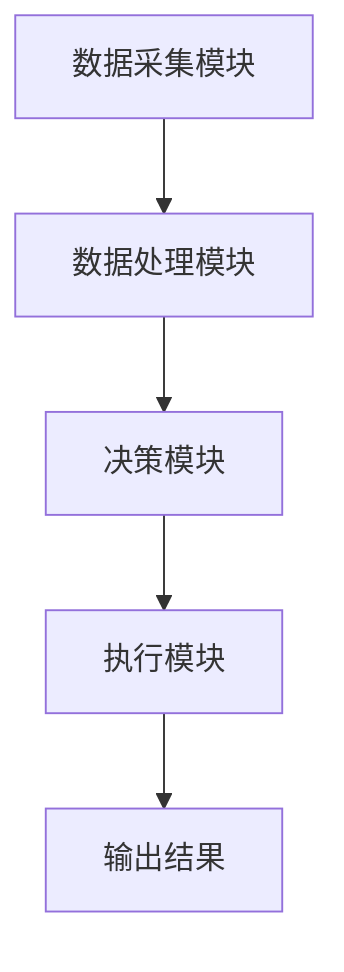

                 


# AI Agent在海洋资源勘探中的应用

---

## 关键词：
AI Agent，海洋资源勘探，人工智能，机器学习，海洋勘探技术，资源预测，风险管理

---

## 摘要：
本文详细探讨了AI Agent在海洋资源勘探中的应用，从基本概念到算法原理，再到实际应用，系统地分析了AI Agent如何助力海洋资源的高效、精准勘探。文章首先介绍了AI Agent和海洋资源勘探的基本概念，随后深入讲解了AI Agent的核心原理及其在海洋资源勘探中的具体应用。通过算法原理、系统架构设计和项目实战的详细阐述，本文为读者提供了从理论到实践的全面指导。最后，结合实际案例，总结了AI Agent在海洋资源勘探中的最佳实践和未来发展方向。

---

## 第一部分: AI Agent在海洋资源勘探中的应用基础

---

# 第1章: AI Agent与海洋资源勘探的背景介绍

## 1.1 AI Agent的基本概念

### 1.1.1 什么是AI Agent
AI Agent（人工智能代理）是指能够感知环境、自主决策并执行任务的智能体。它可以分为简单反射式Agent、基于模型的反射式Agent、目标驱动式Agent和效用驱动式Agent。

### 1.1.2 AI Agent的核心特征
- **自主性**：能够在没有外部干预的情况下自主运行。
- **反应性**：能够实时感知环境并做出反应。
- **目标导向**：具有明确的目标，并通过行为选择来优化目标的实现。

### 1.1.3 AI Agent与传统自动化的区别
AI Agent不仅能够执行预设的任务，还能够根据环境变化自主调整策略，这与传统自动化系统不同。

---

## 1.2 海洋资源勘探的基本概念

### 1.2.1 海洋资源的定义与分类
海洋资源包括矿产资源、石油和天然气、可再生能源（如潮汐能、风能）以及生物资源等。

### 1.2.2 海洋资源勘探的主要方法
- **地球物理勘探**：通过地震、重力、磁力等手段探测地下结构。
- **地球化学勘探**：通过分析海水、海底沉积物的化学成分来寻找资源。
- **生物勘探**：通过海洋生物的分布来推测资源的存在。

### 1.2.3 海洋资源勘探的挑战与机遇
- **挑战**：海洋环境复杂，资源分布不均匀，勘探成本高。
- **机遇**：AI技术的进步为海洋资源勘探提供了新的可能性。

---

## 1.3 AI Agent在海洋资源勘探中的结合背景

### 1.3.1 海洋资源勘探的传统方式及其局限性
传统海洋资源勘探依赖于人工分析和经验判断，效率低且成本高。

### 1.3.2 AI技术在海洋勘探中的优势
AI技术能够快速处理海量数据，提高勘探效率和准确性。

### 1.3.3 AI Agent在海洋资源勘探中的应用前景
通过AI Agent，海洋资源勘探可以实现自动化、智能化，显著降低成本并提高勘探效率。

---

## 1.4 本章小结
本章介绍了AI Agent和海洋资源勘探的基本概念，并分析了AI Agent在海洋资源勘探中的应用背景及其优势。

---

## 第2章: AI Agent的核心概念与原理

## 2.1 AI Agent的核心概念

### 2.1.1 AI Agent的定义与分类
AI Agent可以分为简单反射式Agent、基于模型的反射式Agent、目标驱动式Agent和效用驱动式Agent。

### 2.1.2 AI Agent的主要功能与特性
- **数据采集与处理**：AI Agent能够实时采集环境数据并进行处理。
- **自主决策**：基于数据和目标，AI Agent能够自主决策并执行任务。
- **学习与优化**：通过机器学习算法，AI Agent能够不断优化自身的决策策略。

### 2.1.3 AI Agent与智能体（Agent）的区别
AI Agent是智能体的一种，但具有更强的自主性和智能性。

---

## 2.2 AI Agent的工作原理

### 2.2.1 感知层：数据采集与处理
AI Agent通过传感器或其他数据源采集环境数据，并对其进行预处理和特征提取。

### 2.2.2 决策层：策略制定与优化
基于感知层的数据，AI Agent通过机器学习算法制定决策策略，并不断优化策略以提高效率。

### 2.2.3 执行层：动作执行与反馈
AI Agent根据决策层的指令执行具体动作，并通过反馈机制调整自身的行为。

---

## 2.3 AI Agent在海洋资源勘探中的核心功能

### 2.3.1 数据分析与处理
AI Agent能够快速处理海量海洋勘探数据，提取有价值的信息。

### 2.3.2 资源预测与定位
通过机器学习模型，AI Agent可以预测资源的分布并精确定位资源位置。

### 2.3.3 风险评估与决策支持
AI Agent能够评估勘探过程中的风险，并为决策者提供支持。

---

## 2.4 本章小结
本章详细介绍了AI Agent的核心概念和工作原理，并分析了其在海洋资源勘探中的核心功能。

---

## 第3章: AI Agent在海洋资源勘探中的算法原理

## 3.1 基础算法介绍

### 3.1.1 机器学习算法
- **线性回归**：用于预测连续型变量。
- **支持向量机（SVM）**：用于分类和回归任务。
- **随机森林**：用于分类和回归任务，具有较强的鲁棒性。

### 3.1.2 深度学习算法
- **卷积神经网络（CNN）**：用于图像识别任务。
- **循环神经网络（RNN）**：用于序列数据处理。
- **长短期记忆网络（LSTM）**：用于时间序列数据处理。

### 3.1.3 强化学习算法
- **Q-Learning**：通过状态-动作-奖励机制优化决策策略。
- **Deep Q-Networks（DQN）**：结合深度学习和Q-Learning，用于复杂环境中的决策任务。

---

## 3.2 AI Agent的核心算法

### 3.2.1 马尔可夫决策过程（MDP）
马尔可夫决策过程是一种描述决策过程的数学模型，适用于具有马尔可夫性质的环境。

$$
V(s) = \max_{a} [ r(s,a) + \gamma V(s') ]
$$

其中，\( V(s) \) 是状态 \( s \) 的价值函数，\( r(s,a) \) 是执行动作 \( a \) 在状态 \( s \) 下的即时奖励，\( \gamma \) 是折扣因子，\( V(s') \) 是下一状态 \( s' \) 的价值函数。

### 3.2.2 Q-Learning算法
Q-Learning是一种基于价值迭代的强化学习算法，适用于离散状态和动作空间。

$$
Q(s,a) = Q(s,a) + \alpha [ r(s,a) + \gamma \max Q(s',a') - Q(s,a) ]
$$

其中，\( \alpha \) 是学习率，\( \gamma \) 是折扣因子。

### 3.2.3 DQN算法
DQN算法通过深度神经网络近似Q值函数，适用于高维状态空间。

---

## 3.3 算法在海洋资源勘探中的应用

### 3.3.1 资源预测
通过训练深度学习模型，AI Agent可以预测海底资源的分布情况。

### 3.3.2 风险评估
通过强化学习算法，AI Agent可以评估勘探过程中的风险，并制定最优决策。

---

## 3.4 本章小结
本章介绍了AI Agent在海洋资源勘探中的核心算法，并通过实例分析了这些算法的应用场景。

---

## 第4章: 海洋资源勘探的系统架构设计

## 4.1 系统模块划分

### 4.1.1 数据采集模块
负责采集海洋环境数据，包括温度、盐度、地形等。

### 4.1.2 数据处理模块
对采集到的数据进行预处理和特征提取。

### 4.1.3 决策模块
基于处理后的数据，制定勘探决策。

### 4.1.4 执行模块
根据决策模块的指令执行具体动作，如调整探测设备的位置。

---

## 4.2 数据流设计

### 4.2.1 数据输入
包括传感器数据、历史勘探数据等。

### 4.2.2 数据处理
数据预处理、特征提取、数据清洗等。

### 4.2.3 数据输出
包括预测结果、决策指令等。

---

## 4.3 系统架构图


---

## 4.4 接口设计
系统需要与外部设备（如传感器、探测器）进行交互，接口设计需要考虑数据格式和通信协议。

---

## 4.5 本章小结
本章详细介绍了海洋资源勘探系统的架构设计，包括模块划分、数据流设计和系统接口设计。

---

## 第5章: AI Agent在海洋资源勘探中的项目实战

## 5.1 项目背景
本项目旨在通过AI Agent实现海底矿产资源的自动勘探。

---

## 5.2 系统核心实现

### 5.2.1 环境安装
安装Python、TensorFlow、Keras等依赖库。

```python
import tensorflow as tf
from tensorflow.keras import layers
```

### 5.2.2 数据预处理
对海洋勘探数据进行清洗和特征提取。

```python
import pandas as pd

data = pd.read_csv('ocean_data.csv')
data = data.dropna()
```

### 5.2.3 模型训练
训练深度学习模型，用于资源预测。

```python
model = tf.keras.Sequential([
    layers.Dense(64, activation='relu'),
    layers.Dense(1, activation='linear')
])
model.compile(optimizer='adam', loss='mse')
model.fit(data, labels, epochs=100, batch_size=32)
```

### 5.2.4 系统部署
将训练好的模型部署到海洋探测设备中，实现自动勘探。

---

## 5.3 实际案例分析
以某海域的矿产资源勘探为例，分析AI Agent的应用效果。

---

## 5.4 本章小结
本章通过实际项目展示了AI Agent在海洋资源勘探中的应用，包括环境安装、数据预处理、模型训练和系统部署。

---

## 第6章: 最佳实践与小结

## 6.1 最佳实践
- **数据质量**：确保数据的准确性和完整性。
- **模型选择**：根据具体任务选择合适的算法。
- **系统优化**：不断优化系统架构和算法模型。

## 6.2 小结
本文系统地介绍了AI Agent在海洋资源勘探中的应用，从理论到实践，为读者提供了全面的指导。

## 6.3 注意事项
- AI Agent的应用需要结合具体场景，避免过度依赖技术。
- 注意数据隐私和安全问题。

## 6.4 拓展阅读
建议读者进一步学习强化学习和深度学习的相关知识，以及海洋资源勘探的技术动态。

---

## 作者：AI天才研究院/AI Genius Institute & 禅与计算机程序设计艺术 /Zen And The Art of Computer Programming

---

# 结语
通过本文的详细介绍，读者可以全面了解AI Agent在海洋资源勘探中的应用，从理论基础到实际应用，为未来的相关研究和实践提供了宝贵的参考。

